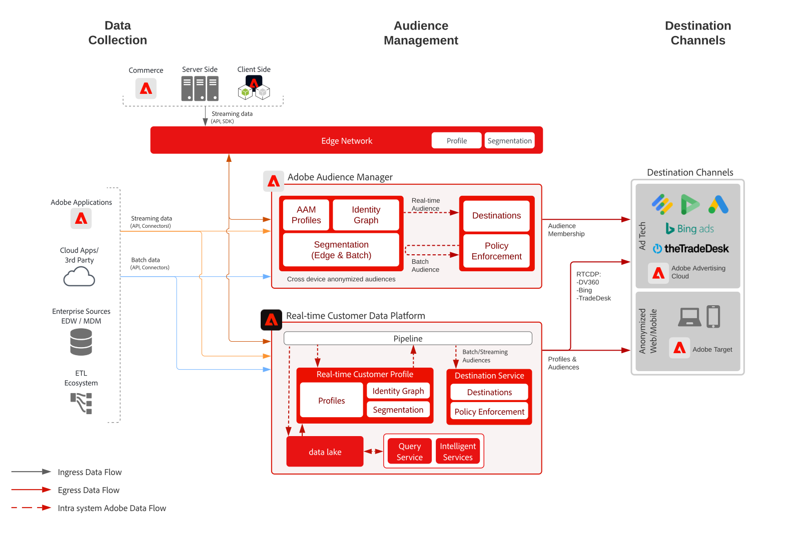

# Anonymt Audience Activation Blueprint

Ni kan inrikta er på målgrupper över webben och annonskanaler baserat på anonyma och beteendemässiga kunddata. Denna möjlighet möjliggör personaliserade och enhetliga kundupplevelser i realtid på olika enheter.

## Användningsexempel

* Anonym målgruppsanpassning och personalisering.
* Bygg målgrupper för målgruppsanpassning i annonsnätverk som stöds.

## Program

* Adobe Audience Manager

## Arkitektur

## Implementeringssteg

<!-- These steps should link to help. -->

1. [Implementera Audience Manager](https://experienceleague.adobe.com/docs/audience-manager/user-guide/implementation-integration-guides/implement-audience-manager.html?lang=en#implementation-integration-guides).
1. Samla in data i Audience Manager.
1. Konfigurera signaler och egenskaper för användning i segmentdefinitioner.
1. Skapa segment i Audience Manager.
1. Konfigurera destinationer i Audience Manager för att dela målgrupper.

## Relaterad dokumentation

* [Audience Manager](https://experienceleague.adobe.com/docs/audience-manager.html?lang=en)
* [Experience Cloud  [!UICONTROL målgrupper]](https://experienceleague.adobe.com/docs/core-services/interface/audiences/audience-library.html)
* [Integrera Audience Manager med Target](https://experienceleague.adobe.com/docs/audience-manager/user-guide/implementation-integration-guides/integration-other-solutions/aam-target-integration.html)
* [Adobe Analytics segmentdelning via Audience Manager](https://experienceleague.adobe.com/docs/analytics/components/segmentation/segmentation-workflow/seg-publish.html)
