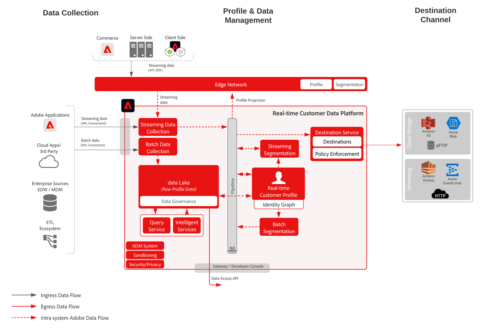

# Målgrupps- och profilaktivering av mål för fil- och företagsströmning - utkast

Dela profiler och målgruppsändringar och händelser i strömning eller batch från [!UICONTROL Kunddataplattform i realtid] till datalagring och applikationer för företag. Dessa profil- och målgruppshändelser kan användas för att initiera en sälj- eller supportåtgärd till kunden, som att följa upp en övergiven ansökningsprocess eller registrering av ett webbinarium eller för att uppdatera företagsapplikationer med de senaste kundattributen och intelligensen från [!UICONTROL Customer Data Platform] i realtid.

## Användningsexempel

* Profil- och målgruppsaktivering till molnlagringsdestinationer eller direktuppspelningsdestinationer för företagsspårning, lagring, analys och aktivering av kunddata och insikter.

## Program

* Adobe Experience Platform Activation

## Arkitektur

## Guardrails

[Se skyddsutkastet på sidan Översikt över målgrupps- och profilaktivering.](overview.md)

## Implementeringssteg

1. [Skapa ](https://experienceleague.adobe.com/?recommended=ExperiencePlatform-D-1-2021.1.xdm) scheman för data som ska importeras.
1. [Skapa ](https://experienceleague.adobe.com/docs/platform-learn/tutorials/data-ingestion/create-datasets-and-ingest-data.html) datauppsättningar för data som ska importeras.
1. [Konfigurera rätt identiteter och ](https://experienceleague.adobe.com/docs/platform-learn/tutorials/identities/label-ingest-and-verify-identity-data.html) identitetsnamnutrymmen i schemat för att säkerställa att inkapslade data kan sammanfogas till en enhetlig profil.
1. [Aktivera scheman och datauppsättningar för profilen](https://experienceleague.adobe.com/docs/platform-learn/tutorials/profiles/bring-data-into-the-real-time-customer-profile.html).
1. [Ingest ](https://experienceleague.adobe.com/?recommended=ExperiencePlatform-D-1-2020.1.dataingestion) data into Experience Platform.
1. [Tillhandahåll  [!UICONTROL realtidsdelning av kunddata ] Platformsegment ](https://www.adobe.com/go/audiences) mellan Experience Platform och Audience Manager för målgrupper som definieras i Experience Platform som ska delas med Audience Manager.
1. [Skapa ](https://experienceleague.adobe.com/docs/platform-learn/tutorials/segments/create-segments.html) segmentering i Experience Platform. Systemet avgör automatiskt om segmentet utvärderas som batch eller direktuppspelning.
1. [Konfigurera ](https://experienceleague.adobe.com/docs/platform-learn/tutorials/destinations/create-destinations-and-activate-data.html) mål för delning av profilattribut och målgruppsmedlemskap till önskade mål.

## Relaterad dokumentation

* [Destinationsdokumentation](https://experienceleague.adobe.com/docs/experience-platform/destinations/catalog/overview.html)
* [Översikt över destinationer för molnlagring](https://experienceleague.adobe.com/docs/experience-platform/destinations/catalog/cloud-storage/overview.html?lang=en#catalog)
* [HTTP-mål](https://experienceleague.adobe.com/docs/experience-platform/destinations/catalog/http-destination.html?lang=en#overview)
* [[!UICONTROL Beskrivning av kunddataplattform ] i realtid](https://helpx.adobe.com/legal/product-descriptions/real-time-customer-data-platform.html)
* [Riktlinjer för profil och segmentering](https://experienceleague.adobe.com/docs/experience-platform/profile/guardrails.html?lang=en)
* [Segmenteringsdokumentation](https://experienceleague.adobe.com/docs/experience-platform/segmentation/api/streaming-segmentation.html)

## Relaterade videor och Tutorials

* [[!UICONTROL Kunddata ] Platformoverview i realtid](https://experienceleague.adobe.com/docs/platform-learn/tutorials/application-services/rtcdp/understanding-the-real-time-customer-data-platform.html)
* [Demo av  [!UICONTROL kunddataplattform i realtid]](https://experienceleague.adobe.com/docs/platform-learn/tutorials/application-services/rtcdp/demo.html)
* [Skapa segment](https://experienceleague.adobe.com/docs/platform-learn/tutorials/segments/create-segments.html)
