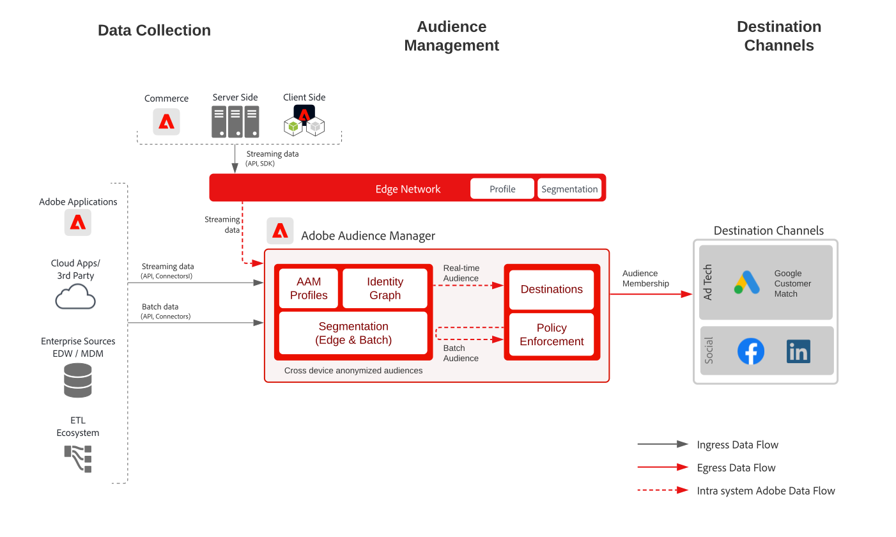

# Kundaktiveringsplan

Använd offlineattribut och händelser som offlineorder, transaktioner, CRM eller lojalitetsdata, tillsammans med onlinebeteende för målinriktning och personalisering.

Utökade identifierare med inbyggda styrningskontroller ger fler möjligheter att kommunicera med kända kunder. Aktivera målgrupper för kända profilbaserade destinationer som e-postleverantörer, sociala nätverk och reklamdestinationer.

Mer information finns i [Målgrupps- och profilaktivering med Experience Cloud-program, utkast](platform-and-applications.md), som är specifikt för integrering mellan program i Experience Platform och Experience Cloud.

## Användningsfall

* Målgruppsanpassning för kända målgrupper på sociala medier och reklamdestinationer.
* Anpassning online med online- och offlineattribut.
* Aktivera målgrupper för kända kanaler, som e-post och SMS.

## Tillämpningar

* [!UICONTROL Real-time Customer Data Platform]
* Destinationer baserade på Audience Manager kan också utnyttjas för personbaserad aktivering i Facebook, LinkedIn och Google Customer Match.

## Arkitektur

### Känd kundaktivering via Real-time Customer Data Platform

 

### Känd kundaktivering via Audience Manager personbaserade destinationer

 

## Skyddsräcken

[Se skyddsutkastet på sidan Översikt över målgrupps- och profilaktivering](https://experienceleague.adobe.com/docs/blueprints-learn/architecture/audience-activation/overview.html?lang=en#guardrails-for-audience-and-profile-activation-blueprints).

## Implementeringssteg för Real-time Customer Data Platform

1. [Skapa scheman](https://experienceleague.adobe.com/?recommended=ExperiencePlatform-D-1-2021.1.xdm) för data som ska importeras.
1. [Skapa datauppsättningar](https://experienceleague.adobe.com/docs/platform-learn/tutorials/data-ingestion/create-datasets-and-ingest-data.html) för data som ska importeras.
1. [Konfigurera rätt identiteter och identitetsnamnutrymmen](https://experienceleague.adobe.com/docs/platform-learn/tutorials/identities/label-ingest-and-verify-identity-data.html) i schemat för att säkerställa att inkapslade data kan sammanfogas till en enhetlig profil.
1. [Aktivera scheman och datauppsättningar för profilen ](https://experienceleague.adobe.com/docs/platform-learn/tutorials/profiles/bring-data-into-the-real-time-customer-profile.html).
1. [Infoga data](https://experienceleague.adobe.com/?recommended=ExperiencePlatform-D-1-2020.1.dataingestion) i Experience Platform.
1. [Tillhandahåller [!UICONTROL Real-time Customer Data Platform]-segmentdelning](https://www.adobe.com/go/audiences) mellan Experience Platform och Audience Manager för målgrupper som definieras i Experience Platform som ska delas med Audience Manager.
1. [Skapa segment](https://experienceleague.adobe.com/docs/platform-learn/tutorials/segments/create-segments.html) i Experience Platform. Systemet avgör automatiskt om segmentet utvärderas som batch eller direktuppspelning.
1. [Konfigurera mål](https://experienceleague.adobe.com/docs/platform-learn/tutorials/destinations/create-destinations-and-activate-data.html) för delning av profilattribut och målgruppsmedlemskap till önskade mål.

## Implementeringsöverväganden

* När du delar profildata till mål måste du inkludera det specifika identitetsvärde som används av målet i målnyttolasten. Alla identiteter som är nödvändiga för ett målmål måste hämtas till Platform och konfigureras som en identitet för [!UICONTROL kundprofilen i realtid].

* Mer information om hur du delar målgrupper från Real-time Customer Data Platform till Audience Manager, Analytics, Target, Campaign och Journey Optimizer finns i [Målgrupps- och profilaktivering med Experience Cloud-program ](platform-and-applications.md) .

## Implementeringssteg för personbaserade destinationer i Audience Manager

* Mer information om hur du implementerar Audience Manager finns i följande [dokumentation](https://experienceleague.adobe.com/docs/audience-manager/user-guide/implementation-integration-guides/implement-audience-manager.html).

* Mer information om hur du implementerar personbaserade mål i Audience Manager finns i följande [dokumentation](https://experienceleague.adobe.com/docs/audience-manager/user-guide/faqs/faq-people-based-destinations.html).

## Relaterad dokumentation

* [[!UICONTROL Real-time Customer Data Platform] Produktbeskrivning](https://helpx.adobe.com/legal/product-descriptions/real-time-customer-data-platform.html)
* [Riktlinjer för profil och segmentering](https://experienceleague.adobe.com/docs/experience-platform/profile/guardrails.html?lang=en)
* [Segmenteringsdokumentation](https://experienceleague.adobe.com/docs/experience-platform/segmentation/api/streaming-segmentation.html)
* [Destinationsdokumentation](https://experienceleague.adobe.com/docs/experience-platform/destinations/catalog/overview.html)

## Relaterade videor och självstudiekurser

* [[!UICONTROL Real-time Customer Data Platform] - översikt](https://experienceleague.adobe.com/docs/platform-learn/tutorials/application-services/rtcdp/understanding-the-real-time-customer-data-platform.html)
* [Demo av [!UICONTROL Real-time Customer Data Platform]](https://experienceleague.adobe.com/docs/platform-learn/tutorials/application-services/rtcdp/demo.html)
* [Skapa segment](https://experienceleague.adobe.com/docs/platform-learn/tutorials/segments/create-segments.html)
