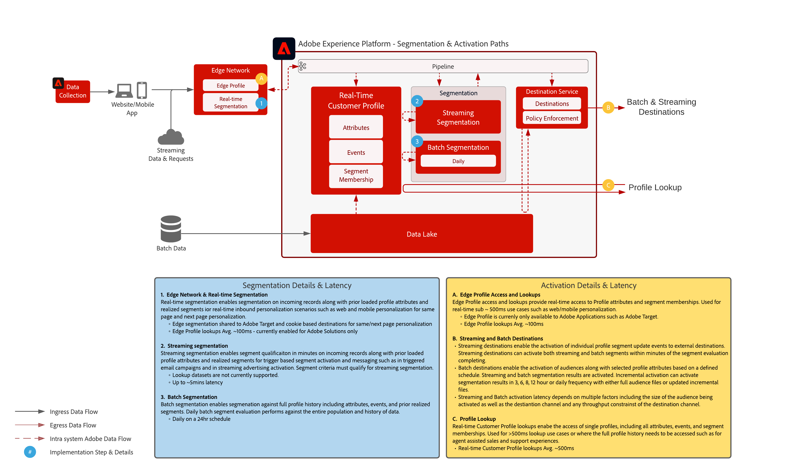

# Målgrupps- och profilaktivering

Målgrupps- och profilaktivering är nyckeln till framgång i en datadriven marknadsföringsvärld. Men många varumärken fokuserar fortfarande på aktivering av kanaler först, vilket ofta ger inkonsekvent räckvidd och personalisering.

Med ett kanalbaserat första tillvägagångssätt fungerar varje kanal som en silo där personaliseringssatsningarna endast riktar sig till kunder som interagerar med varumärket i den kanalen. Detta tillvägagångssätt återspeglar inte den verklighet som kunderna interagerar med varumärken över många olika kontaktytor. Med aktivering av målgrupper och profiler kan varumärken koppla samman kundinteraktioner över flera kanaler för att leverera en centraliserad profil och målgrupp som kan aktiveras i alla kanaler.

| Blueprint | Beskrivning | Experience Cloud-program |
|---|---|---|
| **[Anonym Audience Activation](anonymous.md)** | <ul><li>Rikta er till målgrupper över webben och annonskanaler för anonyma och beteendemässiga kunddata.</li><li>Integrera med externa målgruppsdata för ökad personalisering.</li></ul> | <ul><li>Adobe Audience Manager</li></ul> |
| **[Känd kundaktivering](known.md)** | <ul><li>Aktivera för kända profilbaserade destinationer, som e-postleverantörer, sociala nätverk och reklamdestinationer. </li><li>Använd offlineattribut och händelser som offlineorder, transaktioner, CRM eller lojalitetsdata tillsammans med onlinebeteende för målinriktning och personalisering.</li></ul> | <ul><li>Adobe Experience Platform</li><li> [!UICONTROL Real-time Customer Data Platform]</li><li>Adobe Audience Manager (valfritt)</li></ul> |
| **[Målgrupps- och profilaktivering med Experience Cloud-program](platform-and-applications.md)** | <ul><li>Hantera profiler och målgrupper i Experience Platform och dela dem med Experience Cloud-program</li><li>Bygg och dela avancerade kundsegment och insikter i Experience Platform och dela dem med Experience Cloud-tillämpningar</li></ul> | <ul><li>Adobe Experience Platform</li><li>[!UICONTROL Real-time Customer Data Platform]</li><li>Aktivering av Experience Platform</li><li>Experience Cloud-program</li></ul> |

## Kundprofilarkitektur i realtid

Bilden nedan visar huvudkomponenterna i Experience Platform:s kundprofil i realtid.

De första datakällorna hämtas in i Experience Platform. Om datakällan är konfigurerad för profilbearbetning matas den in i kundprofilen i realtid. Ett enda profilfragment eller dokument skapas för varje datakälla och varje primär ID-post som har konfigurerats för varje datakälla. När data hämtas till profilen bearbetas även dessa av identitetstjänsten. Alla poster från datakällor som har fler än en identitet markerad i schemat och med motsvarande värden ifyllda i posten kommer att behandlas som en identitetsrelation inom identitetstjänsten.

Observera att poster som bara har en identitet inte bearbetas av identitetstjänsten eftersom sådana poster inte har några identitetslänkar för att fylla i diagrammet ytterligare. Observera också att identitetstjänsten inte skiljer primära identiteter från sekundära identiteter. Det är helt enkelt att behandla identitetsrelationer över identiteter.

Sammanfogningen av profilfragment sker när identitetsdiagrammet innehåller relationerna mellan de olika källprofilfragmenten som har relaterats. Sammanslagningsprincipen avgör vilka källfragment och vilka identitetsdiagram som ska användas när fragmenten sammanfogas. Varje gång profilen används sker sammanslagningen av profilfragmenten för att säkerställa den mest aktuella kombinerade vyn av profilen. Styrnings- och policyreglerna säkerställer att endast de godkända segmenten och attributen kan aktiveras för de angivna destinationerna.

## Segmentering och målöversikt

Bilden nedan visar de olika segmenteringsmetoderna och de olika profilerna och målgruppsaktiveringsmönstren.

## GuarDRATIONS for Audience and Profile Activation Blueprints

* [Riktlinjer för profil och segmentering](https://experienceleague.adobe.com/docs/experience-platform/profile/guardrails.html?lang=en)

### Aktivera attribut och identiteter

* [!UICONTROL Real-time Customer Data Platform] kan aktivera målgruppsmedlemskap samt attribut- och identitetsändringar som sker för profiler som är medlemmar i segment som markerats för aktivering. Om målet är att aktivera attribut eller identiteter måste du definiera ett globalt segment som innehåller alla profiler som attribut- och identitetsuppdateringar skickas till. Då kan du markera segmentet och de attribut du vill aktivera som en del av målkonfigurationen.
* Observera att batchdestinationer inte stöder aktivering av endast attributändringar. Fullständigt eller inkrementellt medlemskap kan skickas tillsammans med de valda attributen för aktivering.

### Aktivera batchsegment för direktuppspelningsmål

* Aktivering av gruppsegment till direktuppspelningsmål stöds. När profiler kvalificerar sig för målgruppsmedlemskap från batchsegmentsjobb kan dessa implementeringar aktiveras genom direktuppspelningsaktivering.

### Aktivera direktuppspelningssegment för batchmål

* Direktuppspelning av segmentaktivering till batchmål stöds. Batchmålschemat exporterar profilsegmentsmedlemskap baserat på batchmålschemat. Detta inkluderar både segmentmedlemskap som bestäms via direktuppspelning och gruppmetoder.

### Aktivera upplevelsehändelser

* Aktivering av raw-upplevelsehändelser stöds inte. För att aktivera mot upplevelsehändelser måste ett segment skapas med nödvändiga regler som inkluderar eller exkluderar logiken för upplevelsehändelser. Detta skapar ett segment som definieras mot upplevelsehändelser och segmentmedlemskapet kan aktiveras som en proxy för aktivering av raw-upplevelsehändelser. Överväg också att använda [!UICONTROL Starta serversidan] för att aktivera obearbetade upplevelsehändelser som samlats in via SDK.

## Relaterade blogginlägg

* [[!DNL Blueprints for Audience Activation in Adobe Experience Platform]](https://medium.com/adobetech/a-blueprint-for-audience-activation-in-adobe-experience-platform-b2b30fae90fd)
* [[!DNL How Adobe Experience Platform Predictive Audiences improves Personalized Experiences]](https://medium.com/adobetech/how-adobe-experience-platform-predictive-audiences-improves-personalized-experiences-1f75a60cb7a3)
* [[!DNL Adobe Experience Platform Web SDK for Audience Management]](https://medium.com/adobetech/adobe-experience-platform-web-sdk-for-audience-management-751fa6d063bc)
