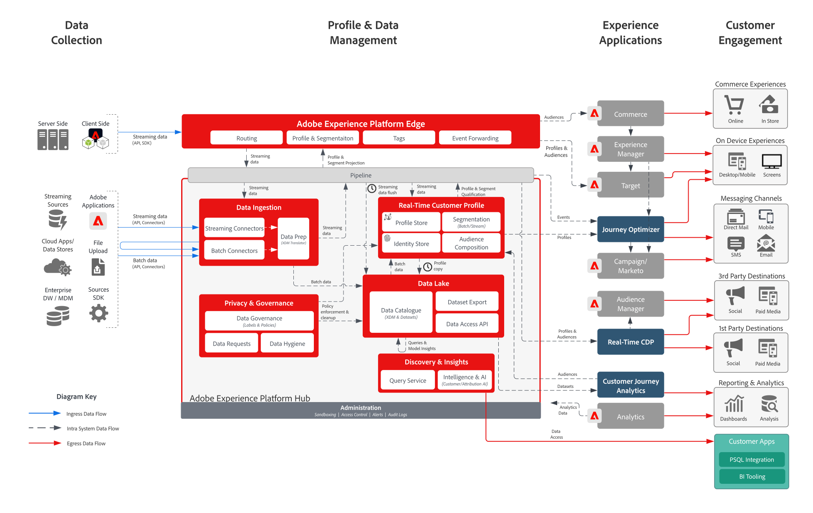

# Målgrupps- och profilaktivering med Experience Cloud Applications Blueprint

Hantera profiler och målgrupper i Experience Platform och dela dem med Experience Cloud-program. Bygg och dela avancerade kundsegment och insikter i Experience Platform och dela dem med Experience Cloud-applikationer.

Aktiveringen med Experience Cloud-program justeras mot [Kundaktiveringsutkast](known.md).

## Användningsexempel

* Anpassa och rikta er mot olika kundinteraktionskanaler som drivs av Experience Cloud.
* Dela målgrupps- och profildata mellan Experience Platform och Experience Cloud.
* Bygg multimediedata från flerkanalsdata, inklusive onlinebeteendedata och datavetenskapsmodeller, för att berika kundprofilen i realtid i Experience Platform som sedan kan delas med Experience Cloud-applikationer.

## Program

* Adobe Experience Platform
* [!UICONTROL Real-time Customer Data Platform]
* Aktivering av Experience Platform
* Experience Cloud-program
   * Adobe Audience Manager
   * Adobe Target
   * Adobe Campaign
   * Journey Optimizer
   * Marketo Engage
   * Adobe Commerce
   * Customer Journey Analytics

## Arkitektur

Se [Experience Platform and Applications Architecture Section](https://experienceleague.adobe.com/docs/blueprints-learn/architecture/architecture-overview/platform-applications.html) om du vill ha ytterligare arkitekturdiagram för integrering av Experience Platform med Experience Cloud-program.

### Målgrupps- och profilaktivering med Experience Cloud-program

 

## Guardrails

Se [skyddsutkast på sidan Översikt över målgrupps- och profilaktivering](overview.md) och [distributionsskyddsutkast](../experience-platform/deployment/guardrails.md) sida.

## Överväganden gällande implementering

* När du delar profildata till mål måste du inkludera det specifika identitetsvärde som används av målet i målnyttolasten. Alla identiteter som krävs för ett målmål måste hämtas till Platform och konfigureras som en identitet för [!UICONTROL Kundprofil i realtid].

### Målgruppsdelning från Real-time Customer Data Platform till Audience Manager

* Mer information finns i följande dokumentation. [Experience Platform segmentdelning med Audience Manager och andra Experience Cloud-lösningar](https://experienceleague.adobe.com/docs/audience-manager/user-guide/implementation-integration-guides/integration-experience-platform/aam-aep-audience-sharing.html).

* Målgruppsmedlemskap från RT-CDP delas med Audience Manager på ett strömmande sätt så snart segmentutvärderingen är klar och skriven i kundprofilen i realtid, oavsett om segmentutvärderingen gjordes i batch eller strömning.
* Om den kvalificerade profilen innehåller regional routningsinformation för relaterade profilenheter är målgruppsmedlemskapet från RTCDP kvalificerat för direktuppspelning på associerad Audience Manager Edge. Om den regionala routningsinformationen har använts på en profil med en tidsstämpel under de senaste 14 dagarna utvärderas den på Audience Manager Edge i direktuppspelning. Om profilerna från RTCDP inte innehåller någon regional routningsinformation eller om den regionala routningsinformationen är mer än 14 dagar gammal, skickas målgruppsmedlemskapen från RTCDP till Audience Manager navplatsen för batchbaserad utvärdering och aktivering.
* Med regional routningsinformation är dessa profiler berättigade till Edge-aktivering och aktiveras inom några minuter efter att de har godkänts av RTCDP, vilket innebär att profiler som inte är kvalificerade för Edge-aktivering kvalificeras i Audience Manager nav och kan ha en 12-24-timmars tidsram för bearbetning.
* Regional routningsinformation som Edge Audience Manager-profilen lagras på kan samlas in till Experience Platform från Audience Manager, Visitor ID-tjänsten, Analytics, Launch eller direkt från Web SDK som en separat profilpostklass med hjälp av XDM-fältgruppen&quot;data capture region information&quot;. Mer information finns i dokumentet Hämta regional information [Länk](https://experienceleague.adobe.com/docs/id-service/using/reference/regions.html?lang=en).
* För aktiveringsscenarier där målgrupper delas från Experience Platform till Audience Manager delas följande identiteter automatiskt: ECID, IDFA, GAID, hash-kodade e-postadresser (EMAIL_LC_SHA256), AdCloud ID. Anpassade namnutrymmen delas för närvarande inte.
* Målgrupper från Experience Platform kan delas via Audience Manager-destinationer när de nödvändiga destinationsidentiteterna ingår i [!UICONTROL Kundprofil i realtid]eller var i [!UICONTROL Kundprofil i realtid] kan kopplas till de önskade målidentiteter som är länkade i Audience Manager.

### Målgruppsdelning från Real-time Customer Data Platform till Target

* Se [Känd kundanpassning - mål- och RTCDP-utkast](https://experienceleague.adobe.com/docs/blueprints-learn/architecture/web-personalization/known-personalization.html) om du vill ha mer information om delning av profiler och målgrupper från Real-time Customer Data Platform till Target.

### Målgruppsdelning från Real-time Customer Data Platform till Campaign och Journey Optimizer

* Se [Customer Journeys Blueprints](https://experienceleague.adobe.com/docs/blueprints-learn/architecture/b2b-activation/b2bactivation.html?lang=en) om du vill ha mer information om delning av profiler och målgrupper från Real-time Customer Data Platform till Campaign och Journey Optimizer.

### Målgruppsdelning från Real-time Customer Data Platform till Marketo Engage

* Se [B2B-aktiveringsutkast](https://experienceleague.adobe.com/docs/blueprints-learn/architecture/b2b-activation/b2bactivation.html?lang=en) om du vill ha mer information om hur du delar profiler och målgrupper från Real-time Customer Data Platform till Marketo Engage.

### Målgruppsdelning från Real-time Customer Data Platform till Customer Journey Analytics

* Se [RTCDP-målgrupper som delas med Customer Journey Analytics](https://experienceleague.adobe.com/docs/analytics-platform/using/cja-usecases/ingest-aep-segments.html?lang=en) om du vill ha mer information om hur du delar Real-time Customer Data Platform-målgrupper med Customer Journey Analytics.

## Relaterad dokumentation

* [[!UICONTROL Real-time Customer Data Platform] Produktbeskrivning](https://helpx.adobe.com/legal/product-descriptions/real-time-customer-data-platform.html)
* [Riktlinjer för profil och segmentering](https://experienceleague.adobe.com/docs/experience-platform/profile/guardrails.html?lang=en)
* [Segmenteringsdokumentation](https://experienceleague.adobe.com/docs/experience-platform/segmentation/api/streaming-segmentation.html)
* [Destinationsdokumentation](https://experienceleague.adobe.com/docs/experience-platform/destinations/catalog/overview.html)

## Relaterade videor och Tutorials

* [[!UICONTROL Real-time Customer Data Platform] översikt](https://experienceleague.adobe.com/docs/platform-learn/tutorials/application-services/rtcdp/understanding-the-real-time-customer-data-platform.html)
* [Demo av [!UICONTROL Real-time Customer Data Platform]](https://experienceleague.adobe.com/docs/platform-learn/tutorials/application-services/rtcdp/demo.html)
* [Skapa segment](https://experienceleague.adobe.com/docs/platform-learn/tutorials/segments/create-segments.html)
