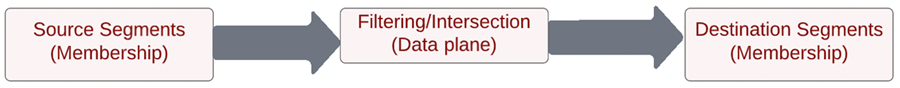
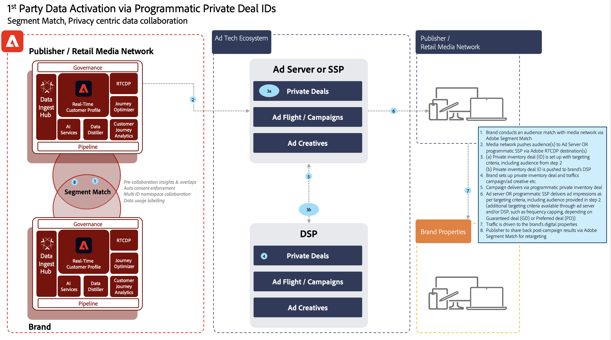

# Segmentmatchning - utkast

Segmentmatchning gör det möjligt för partnervarumärken att dela målgrupper över sina respektive Experience Platform-miljöer. Nyckeln för varumärken är att få kontakt med kunderna baserat på data som samlats in från deras direkta relationer med konsumenterna. Med bättre styrning, behörigheter och preferenshanteringssystem kan marknadsförarna ytterligare förbättra sina förstapartsautentiserade målgrupper med viktiga partners.

[!UICONTROL Segmentmatchning] är en tjänst för datasamarbete som tillåter Experience Platform (AEP) kunder (kallas _partners_) för att utbyta segmentdata baserat på vanliga branschidentifierare på ett säkert, styrt och sekretessvänligt sätt.

Med tjänsten kan kunderna på ett säkert sätt identifiera matchande ID:n på ett säkert, neutralt sätt utan att behöva lämna ut hela sin databas. Partners får endast angivna attribut (segmentnamn) för överlappande ID:n, vilket möjliggör snabbare och enklare delning på ett kontrollerbart, samtyckesstyrt sätt.

[!UICONTROL Segmentmatchning] använder AEP-ramverk för datastyrning och samtycke som ryggrad. Det finns för alla Real-time Customer Data Platform-kunder inom B2C och B2P. Viktiga funktioner i [!UICONTROL [!UICONTROL Segmentmatchning]] inkludera:

* Segmentdelning för överlappande kunder
* Överlappningsrapporter före delning för insikter om beräknad matchningsvolym
* Helt integrerad DULE-policy och behörighetskontroll
* Bakben i ramverket för godkännande av datadelning
* Dataflöden för att organisera segment och partners

## Program

Märk utgivaren:

&quot;Användningsexempel för förläggare&quot; påverkas mest av borttagningen av cookies från tredje part och data för mobil reklam. Det här användningsexemplet har stor inverkan på medie- och underhållningsbranschen som fokuserar på att sälja reklam som en affärsmodell. [!UICONTROL Segmentmatchning] är en väg för förlag med stora förstahandsmålgrupper som vill samarbeta direkt med sina annonsörer. Annonsörer kan arbeta direkt med utgivare för att annonsera mot matchande målgrupper om utgivarens egenskaper för detaljerad målinriktning eller prospekteringskampanjer.

### Varumärke

Konsumentresor är aldrig linjära. En kund kan till exempel vara lojal mot ett flygbolag och deras kreditkortsföretag. Genom att [!UICONTROL Segmentmatchning]kan flygbolaget och kreditkortsföretaget skapa ett datapartnerskap för att förstå överlappande målgrupper och sedan skräddarsy erbjudanden för att personalisera upplevelser för lojala konsumenter i vart och ett av företagen.

### BU till BU

Globala multinationella företag står inför utmaningar när det gäller datasamarbete mellan oberoende affärsenheter. Det är inte säkert att det går att kombinera data i en enda sandlåda på grund av olika sekretessregler, förvärv eller behörighetshantering i olika affärsenheter.

[!UICONTROL Segmentmatchning] hjälper olika marknadsföringsteam i stora organisationer att samarbeta effektivare, samtidigt som de fortsätter att arbeta oberoende av varandra

## Arkitektur

{zoomable=&quot;yes&quot;}

[!UICONTROL Segmentmatchning] är inte en datamarknadsplats där data kan köpas. Istället är det en AEP-funktion som fungerar med förstahandsdata hos utvalda partners och använder sekretess- och godkännandekontroller för att underlätta samarbetet. [!UICONTROL Segmentmatchning] hjälper till att fokusera på att förbättra kundrelationerna och utöka varumärket. Det är fördelaktigt när det finns varumärken eller partnerrelationer. [!UICONTROL Segmentmatchning] upplevelsen är enkel att hantera, skalbar och gör det möjligt för administratörer att dela segment på ett valfritt och kontrollerbart sätt.

[!UICONTROL Segmentmatchning] aktiverar:

* Segmentmedlemskapsdata som ska porteras säkert mellan organisationer med vanliga personnivåidentifierare, som hashad e-post eller telefonnummer
* En målgrupp som delar användargränssnitt och arbetsflöden med meddelanden
* Fördelade överlappningsuppskattningar
* Självbetjäning för partnerkonfiguration
* Överlappar på valda standardiserade namnutrymmen (hashade e-post, hashed-telefon, ECID, IDFA, GAID)
* Förmedling av datadelning
* Hantering av gemensamma målgruppslivscykler
* Tillämpning av DULE i arbetsflödet för delning
* Batchuppdateringar varje dag

[!UICONTROL Segmentmatchning] kan skapa sammankopplade kundupplevelser. De varaktiga identifierare som stöds är hash-kodade e-postmeddelanden, hashade telefonnummer och identifierare som ECID, IDFA och GAID. Kunderna kan bygga flöden som matchar och flyttar målgruppsdata mellan varumärkessandlådor, med stark styrning, transparens och återkalla funktioner för annonsering och marknadsföringsaktiviteter

## Krav

Kraven för [!UICONTROL Segmentmatchning] är:

* RT-CDP active licensed
* Standardhash-identifierare som stöds är SHA256-hash-kodad e-post, hashed-telefon, ECID, Apple IDFA och GAID
* Integritetsramverk och strategi för samtycke
* Avtal om datadelning mellan kunder

## Säkerhet

### RBAC

The [!UICONTROL Segmentmatchning] för att hantera partners säkras av RBAC. Endast personer med rätt tillstånd kan initiera, acceptera eller hantera partners. Detta kan du göra i avsnittet Dataintag i produktprofilen. Följande behörigheter krävs:

{zoomable=&quot;yes&quot;}

| Behörighet | Beskrivning |
|---|---|
| **Hantera anslutningar för målgruppsdelning** | Med den här behörigheten kan du slutföra partnerhandskakningsprocessen som ansluter två IMS-organisationer för att aktivera [!UICONTROL Segmentmatchning] flöden. |
| **Hantera målgruppsresurser** | Med denna behörighet kan du skapa, redigera och publicera feeds (det datapaket som används för [!UICONTROL Segmentmatchning]) med aktiva partners (partners som administratörsanvändaren har anslutit till **Målgruppsanslutningar** åtkomst). |

Se [officiell dokumentation](https://experienceleague.adobe.com/docs/experience-platform/segmentation/ui/segment-match/overview.html?lang=en#understanding-segment-match-permissions) om du vill veta mer om behörigheterna.

### Anslutnings-ID

Partneranslutningsprocessen hanteras av **[!UICONTROL Anslutnings-ID],** som är en slumpmässigt genererad identifierare som mappar till en specifik AEP-sandlåda. Detta Connect-ID krävs för att initiera och hantera partnersandlådor. Det går också att återskapa Connect ID för att vid behov konfigurera om en partneranslutning.

### Styrning

Alla datauppsättningar eller dataattribut med *C11* kontraktsetiketten är begränsad för [!UICONTROL Segmentmatchning] service. Segment som använder dessa attribut kan inte användas för [!UICONTROL Segmentmatchning]. Detta ger kontroll över vilka segment som kan eller inte kan användas för [!UICONTROL Segmentmatchning]. Dessutom tillämpas anpassade policyer och marknadsföringsåtgärder som skapas. Som standard är profiler inaktiverade och måste aktiveras för att användas. Begränsningar som e-postmarknadsföring och annonsering på plats som väljs när segment delas sprids också och delas med partnerna.

### Godkännande

Medgivandeinställningar för [!UICONTROL Segmentmatchning] kan hanteras på följande sätt:

* På organisationsnivå, under introduktionen, med inställningen för avanmälan eller anmälan för godkännandekontroll.

  Den här inställningen avgör om användardata kan delas eller inte. Standardinställningen är att avanmäla användarangivelse som anger att användardata kan delas med antagandet att AEP-kunden redan har det medgivande som krävs för datadelning. Du kan ändra den här inställningen till att anmäla dig genom att kontakta kontohanteraren för Adobe, vilket gör en extra kontroll för att tvinga AEP-kunder att explicit spåra samtycke.

* Ange resursattributet som specifikt för identiteter (idSpecific) med [Fältgruppen Innehåll och inställningar](https://experienceleague.adobe.com/docs/experience-platform/xdm/field-groups/profile/consents.html?lang=en).

  Den här fältgruppen innehåller ett enda fält av objekttyp, samtycke, för att hämta information om samtycke och inställningar. [!UICONTROL Segmentmatchning]som standard inkluderar alla identiteter som inte uttryckligen har valts ut, till exempel:

  ```
  "share": {
  `                `"val": "n"
  `     `}
  ```

  Den här inställningen kan ändras genom att du kontaktar kontohanteraren för Adobe, så att den bara omfattar identiteter med explicit deltagande, till exempel:

  ```
  "share": {
  `                `"val": "y"
  `     `}
  ```

### Varningar

Varningar genereras när en partneranslutning initieras eller när segmentflöden delas med partner.

## Konfigurera arbetsflöde

Arbetsflödet för att konfigurera partneranslutningen hanteras med RBAC enligt ovan. När rätt behörigheter finns på plats, kräver anslutningen till en partnersandlåda att Connect-ID:t för den sandlådan/instansen i partnerorganisationen delas.

När en anslutning begärs från den avsändande partnern måste den godkännas på den mottagande sidan för att säkerställa en säker och säker partnerkonfiguration. Partnerhandskakningen säkerställer att avtalet finns mellan de två organisationerna och gör det möjligt för Adobe att underlätta [!UICONTROL Segmentmatchning] för organisationens räkning. När anslutningen är godkänd och aktiv kan segmentdelningsprocessen initieras från båda sidor.

### Segmentdelning

Segmentdelning med partner sker bara när det finns en matchning för den valda identifieraren. Det kan finnas en en-till-många-relation, vilket innebär att segment kan delas med flera partner.

Om du vill initiera segmentdelning efter att partneranslutningen har konfigurerats, ska den avsändande partnern skapa en feed. Välj sedan de användningsfall eller åtgärder för marknadsföring som segmentdata ska uteslutas från tillsammans med de varaktiga identifierarna. Relevanta segment kan sedan läggas till i feeden för delning.

Som en del av det här segmentdelningsarbetsflödet kan den avsändande partnern identifiera potentiella värdefulla segment via beräknade överlappningar innan data flyttas.

Det övergripande processflödet är:

{zoomable=&quot;yes&quot;}

Dessa överlappande uppskattningar ger viktiga insikter, partnerupptäckt och data för att understödja datasamarbetsavtal. Inga kund- eller segmentdata flyttas över sandlådor för att få fram dessa uppskattningar av överlappning. De av kunden valda, förhash-kodade tillämpliga identiteterna i en given sandlåda läggs till i en sannolik datastruktur som gör att Adobe kan utföra union- och skärningsåtgärder mellan dem. De här åtgärderna hjälper dig [!UICONTROL Segmentmatchning] hämta den beräknade skärningspunkten för två datastrukturer som består av identiteter från två olika sandlådor utan att behöva jämföra de faktiska värdena

Identitetsöverlappningsprocessen beror på **daglig export av full profil** datauppsättning från både avsändar- och mottagarsandlådor för att identifiera gemensamma profiler som tillhör de delade segmenten. Det detaljerade processflödet för överlappningsprocessen visas nedan:

{zoomable=&quot;yes&quot;}

När segmentdelningen är klar från den avsändande partnern får mottagaren ett meddelande om den delade segmentfeeden. Denna segmentfeed måste vara aktiverad för profilen hos mottagaren för att det ska gå att initiera segmentmedlemskapets dataflöde. Det enda segmentmedlemskapet är inkapslat i den mottagande IMS-organisationens överlappande profilfragment och ingen ytterligare identitet överförs från avsändaren till mottagaren.

Det delade segmentet är tillgängligt under `AEPSegmentMatch` i **[!UICONTROL Målgrupper]** i **[!UICONTROL Segment Builder]** och kan användas för att inkludera eller undertrycka målgrupper när segment byggs i mottagarsandlådan.

Den dagliga överlappningsprocessen synkroniserar segmentmedlemskapet mellan avsändaren och mottagaren. Mottagaren kan inaktivera profilen för den segmentfeed som tagits emot för att pausa segmentdelningsprocessen.

#### Segmentslut/inträde

Som en del av den fullständiga profilexporten har statusen för de delade segment-ID:n i segmentmedlemskapet för profiler ett av motsvarande värden - _realiserad_, _avslutad_, eller _befintlig_ för att återspegla det aktuella läget.

Om motsvarande identitet finns i mottagarsandlådan under den dagliga identitetsöverlappningsprocessen, skickas dessa segmentmedlemskapsstatusar för delade segment till mottagaren för inmatning.

#### Återkallning av segment

Återkallning/borttagning av segment från avsändaren är en process på begäran där listan över alla profiler med återkallade segment-ID hämtas från mottagaren. Segment-ID:n tas bort från segmentmedlemskapet för dessa identiteter och hämtas till mottagaren. Den här åtgärden skriver över det befintliga segmentmedlemskapsfragmentet, vilket tar bort medlemskapet för det segmentet.

## Använd segmentmatchning i programmatiska erbjudanden

Med de allt fler begränsningarna kring cookies och enhetsidentifierare från tredje part letar programmatisk annonsering efter nya sätt att skapa och inrikta er på målgrupper. Ett växande antal &#39;universella ID&#39;-lösningar har föreslagits, men branschen är fortfarande i full gång utan något överenskommet, skalbart sätt att uppnå samma nivå av målinriktning samtidigt som man balanserar gällande integritetsfrågor.

Ni kan använda Adobe Experience Platform Segment Match i sekretesscentrerat målgruppssamarbete och förbättra programmatiska privata avtal mellan annonsörer och utgivare. Med segmentmatchning kan du:

* Dela **Annonshandel** och **Målgrupp** arbetsflöden.
* Tillåt partnervarumärken att dela målgruppsmetadata för ömsesidigt delade och samtycka till identiteter med hjälp av varaktiga identifierare som hashad e-post och hashad-telefonnummer i en process där medgivande krävs.

### Användningsexempel

* Inrikta er på förstahandsmålgrupper genom programmatiska privata avtal.
* Undertryck av förstahandsmålgrupper via programmatiska privata avtal.
* Inrikta er på lookalike-målgrupper från förstahandsmålgrupper via programmatiska privata avtal.

>[!BEGINSHADEBOX]

**Titta på följande exempelarbetsflöde mellan ett varumärke (Luma) och ett medienätverk (ACME):**

1. Ett varumärke (Luma) utför en målgruppsmatchning med ett medienätverk (ACME) via Segment Match.
2. ACME uppmanar målgruppen/målgrupperna att lägga till server eller programmatisk SSP via Adobe Real-Time CDP Destination(s).
3. ACME ställer in ett ID (Private Inventory Deal) med tillämpliga målinriktningskriterier, inklusive den målgrupp som fastställdes i föregående steg. Det privata inventerings-ID:t överförs sedan till Lumas DSP.
4. Luma skapar en Privat inventeringsaffär och trafikkampanj/annonsprojekt.
5. Kampanjen levererar sedan via programmatisk Private Inventory Deal.
6. Därefter levererar annonsservern eller SSP annonsvisningar som uppfyller de fastställda målinriktningsvillkoren. (Ytterligare målinriktningskriterier, t.ex. frekvensbegränsning, är tillgängliga via annonsserver och/eller DSP, beroende på om ett garantiavtal eller ett önskat avtal har upprättats i avtalet).
7. Trafiken drivs av Lumas varumärke.
8. ACME delar sedan med sig av insikter och målgrupper efter kampanjen via segmentmatchning för återanpassning.

>[!ENDSHADEBOX]



>[!IMPORTANT]
>
> Den lösning som beskrivs ovan är ett enkelt sätt att rikta in egna data via programmatiska privata avtal, men det kan finnas vissa överväganden innan körningen, inklusive, men inte begränsat till, följande exempel:
>
>* Samtycke: Användbar insamling av samtycke från varumärket, utgivaren eller medienätet för återförsäljning för att utnyttja data på detta sätt.
>
>* Policies och License agreements: Uppfyll alla tillämpliga policyer (inklusive integritetspolicyer, tredjepartsleverantörsavtal) som gäller för varumärket, utgivaren eller medienätet för återförsäljning, för att utnyttja och aktivera data på detta sätt.


## Mer information

* [Segmentmatchning](https://experienceleague.adobe.com/docs/experience-platform/segmentation/ui/segment-match/overview.html?lang=sv#)
* [Behörigheter](https://experienceleague.adobe.com/docs/experience-platform/access-control/home.html?lang=en)
* [Felsökning](https://experienceleague.adobe.com/docs/experience-platform/segmentation/ui/segment-match/troubleshooting.html?lang=en)
* [XID](https://experienceleague.adobe.com/docs/experience-platform/identity/api/list-native-id.html?lang=en)
