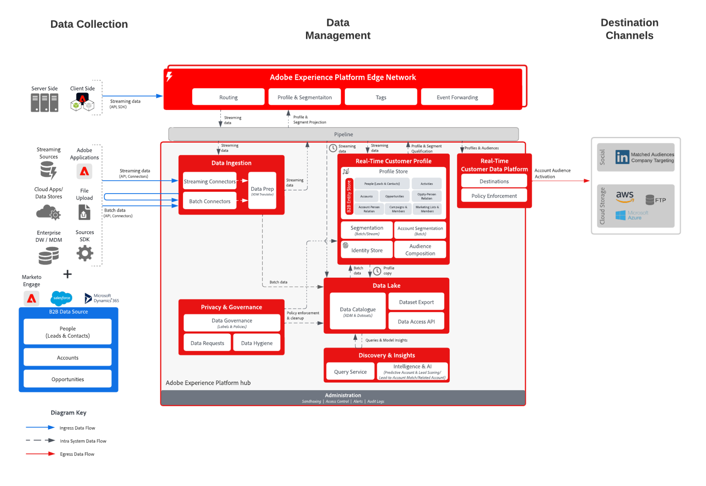

# Aktivering av B2B-konto till reklamdestinationer och fildestinationer

Med kontobaserad interaktion kan B2B-marknadsförare skapa målgrupper (dvs. listor över företag) och inrikta sig på dessa företag via mål som LinkedIn som accepterar listor över företag som indata eller export till molnlagringsdestinationer för målinriktning och försäljning.

## Användningsfall

Med kontobaserad interaktion kan marknadsförarna låsa upp tre viktiga användningsfall:

* **Ifyllningsluckor i inköpsgrupper:** En marknadsförare kan annonsera för konton där de ännu inte har några kontakter för marknads- eller CIO-rollerna. De kan först skapa en publik utan att ha någon kontakt med titeln &quot;CMO&quot; eller &quot;CIO&quot; och sedan aktivera målgruppen på LinkedIn. LinkedIn kan sedan lansera en kampanj som riktar sig till den målgruppen och specifika personer med jobbtitlarna &quot;CMO&quot; eller &quot;CIO&quot; för att nå de nya kontakterna och lyfta fram fördelarna med deras erbjudanden.
* **Merförsäljning eller korsförsäljning till andra avdelningar i ett företag som är en befintlig kund:** En marknadsförare kan skapa en kontopublik som köpte produkten X för mellan 3 och 9 månader sedan men som ännu inte äger produkten Y. De kan sedan aktivera och framhäva fördelarna med produkt Y för den målgruppen.
* **Målföretag som använder konkurrerande produkter:** En marknadsförare kan marknadsföra mot konton för att förskjuta en konkurrents produkter, även utan några kontakter på dessa konton. De kan skapa en publik med konton baserade på partnerdata som visar ägarskap eller användning av en konkurrents produkt och sedan aktivera via LinkedIn för att få kontakt på målkonton för expansion.

## Tillämpningar

* Real-time Customer Data Platform B2B Edition

## Integreringsmönster

* Datakällor från B2B (Marketo, Salesforce osv.) -> Real-time Customer Data Platform B2B Edition -> Destinationer.
* Olika B2B-datakällor kan användas för att mappa data för konton, leads, affärsmöjligheter och människor till B2B-utgåvan av Real-time Customer Data Platform.

## Arkitektur

## Målgrupper för konto

* (Företag) LinkedIn Matched Auditions
* Destinationer för molnlagring
   * Azure Data Lake
   * Datallandningszon
   * SFTP
   * Azure Blob
   * AWS S3

## Skyddsräcken

* Endast 50 kontosegment per sandlåda.
* Utvärdering av gruppsegmentering.
   * Utvärderas automatiskt var 24:e timme efter slutförandet av batchmålgruppens körning och profilexportjobb.
   * Inget stöd för edge, streaming eller ad hoc-utvärdering.
* Kontoattribut är tillgängliga för export.
* Händelser av människor.
   * Upp till 30 dagars händelseuppslag, ingen ordning på händelsepredikat.
   * AND / OR stöds (så du kan säga &quot;A och B måste hända&quot;,  men man kan inte säga &quot;A måste hända 3 dagar före B&quot;).
* För molnlagringsmål har exportschemat stöd för alternativet Efter segmentutvärdering.
* [Guardrutor för B2B-profil och segmentering](https://experienceleague.adobe.com/en/docs/experience-platform/rtcdp/intro/rtcdpb2b-intro/b2b-guardrails).

## Implementeringssteg för Real-time Customer Data Platform B2B Edition, framtagning av konto och aktivering

* För implementeringssteg av Real-time Customer Data Platform B2B Edition, se [Komma igång med Real-time Customer Data Platform B2B Edition](https://experienceleague.adobe.com/en/docs/experience-platform/rtcdp/intro/rtcdpb2b-intro/b2b-tutorial) -dokumentationen.
* Mer information om steg för att skapa en målgrupp för konto finns i dokumentationen för [målgrupper](https://experienceleague.adobe.com/en/docs/experience-platform/segmentation/ui/account-audiences) för kontot.
* Mer information om steg för Account Audience Activation finns i dokumentationen för [Aktivera kontomålgrupper](https://experienceleague.adobe.com/en/docs/experience-platform/destinations/ui/activate/activate-account-audiences).
   * Nödvändig mappning för [(Företag) LinkedIn Matched Audiences-mål](https://experienceleague.adobe.com/en/docs/experience-platform/destinations/ui/activate/activate-account-audiences#required-mappings).

## Implementeringsöverväganden

LinkedIn-matchade målgrupper har några krav, inklusive minimistorleken på 300 matchade medlemmar. Om den kontomålgrupp som aktiverats för företagets länkade målgruppsmål inte uppfyller kravet måste målgruppsdefinitionen ändras för att öka målgruppsstorleken för att starta en LinkedIn-kampanj.

## Relaterad dokumentation

* [B2B-utgåvan av Real-time Customer Data Platform](https://experienceleague.adobe.com/en/docs/experience-platform/rtcdp/intro/rtcdpb2b-intro/b2b-overview)
* [Skapa och aktivera självstudievideo om målgruppsinriktning för konto](https://experienceleague.adobe.com/sv/docs/platform-learn/tutorials/audiences/create-audiences-with-b2b-data)
* [Skapa målgrupper för konto](https://experienceleague.adobe.com/en/docs/experience-platform/segmentation/ui/account-audiences)
* [Aktivera målgrupper för konto](https://experienceleague.adobe.com/en/docs/experience-platform/destinations/ui/activate/activate-account-audiences)
* [Adobe Experience Platform - LinkedIn målanslutning](https://experienceleague.adobe.com/en/docs/experience-platform/destinations/catalog/social/linkedin)
