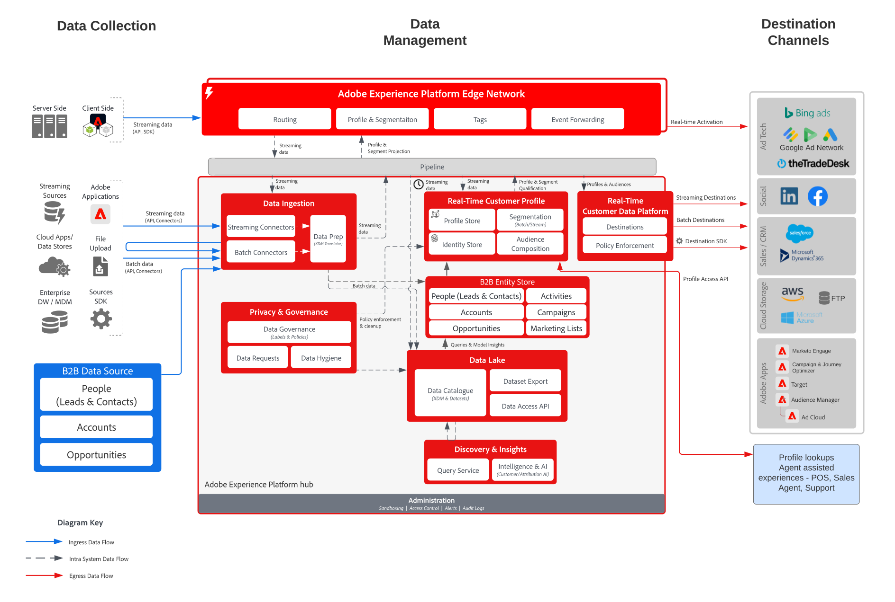

# B2B-målgrupps- och profilaktivering

Använd konto-, affärsmöjlighets- och lead-information som är knuten till en enskild kund för att skapa användbara b2b-profiler för förbättrad personalisering och målinriktning över alla kanaler.

## Användningsexempel

* Skapa målgrupper av människor för målinriktning och personalisering över alla kanaler mot B2B-data, inklusive konton, möjligheter och leads.
* Aktivera målgrupper för alla Experience Platform-destinationer för målinriktning och personalisering.

## Program

* Real-time Customer Data Platform B2B Edition

## Integrationsmönster

* Datakällor från B2B (Marketo, Salesforce osv.) -> Real-time Customer Data Platform B2B Edition -> Destinationer Olika B2B-datakällor kan användas för att mappa konton, leads, affärsmöjligheter och persondata till B2B Edition av Real-time Customer Data Platform.

## Arkitektur

 

## Guardrails

Observera att säkerhetsutkast och implementeringsåtgärder som rör Marketo Engage endast är relevanta när Marketo Engage används som källa och/eller mål.

### Stöd för flera instanser och IMS-organisation:

Följande visar vilka mönster som stöds för mappning av instanser av Experience Platform och Marketo Engage.

#### Marketo som datakälla för Experience Platform:

* Flera Marketo Engage-instanser till en Experience Platform-instans stöds.
* Flera Marketo Engage-instanser för många Experience Platform-instanser stöds inte.
* En Marketo Engage-instans till många Experience Platform-instanser stöds inte.
* En Marketo Engage-instans till en Experience Platform-instans och flera sandlådor stöds.

#### Marketo som destination till Experience Platform:

* Experience Platform till många Marketo Engage-instanser stöds
* Många Experience Platform-instanser till en Marketo Engage-instans stöds

#### Profil- och segmenteringsskydd för Experience Platform:

* Se profilerna och segmenteringsgarantierna för Experience Platform - [Riktlinjer för profil och segmentering](https://experienceleague.adobe.com/docs/experience-platform/profile/guardrails.html?lang=en)
* B2B-segment som inkluderar konton, leads, affärsmöjligheter använder relationer med flera enheter vilket gör att segmentutvärderingen blir en batch. Direktuppspelningssegmentering stöds för segment som är begränsade till personer och händelser.

#### Experience Platform - Källanslutning till Marketo Engage:

* Historisk backfill kan ta upp till 7 dagar att slutföra, beroende på datavolym.
* Pågående datauppdateringar och ändringar från Marketo skickas till Experience Platform via strömnings-API, som kan vara latent upp till ca 5 minuter till profilen och ca 15 minuter till datasjön beroende på volym.

#### Experience Platform - Marketo målanslutning:

* Det kan ta upp till fem minuter att strömma segmentdelning från Real-time Customer Data Platform till Marketo Engage.
* Gruppsegmentering delas en gång per dag baserat på segmenteringsschemat för Experience Platform. B2B-segment som inkluderar konton, leads, affärsmöjligheter använder relationer med flera enheter vilket gör att segmentet blir en batch.

#### Marketo Engage Guardrails:

* Kontakter och leads måste hämtas och definieras direkt i Marketo Engage för att Real-time Customer Data Platform ska matcha en kontakt och ett lead i Marketo Engage.

#### Målgarantins

* Mer information om destinationerna finns i måldokumentationen. [Riktlinjer för destinationen](https://experienceleague.adobe.com/docs/experience-platform/destinations/home.html?lang=en)

## Implementeringssteg

Mer information om hur du implementerar och konfigurerar B2B Edition av Real-time Customer Data Platform finns i B2B Edition av Real-time Customer Data Platform Documentation. [B2B Edition av Real-time Customer Data Platform](https://experienceleague.adobe.com/docs/experience-platform/rtcdp/b2b-overview.html?lang=en)

Det finns två möjliga implementeringsparter. Både möjligheten att importera B2B-data och profiler från Marketo Engage eller möjligheten att importera B2B-data från andra CRM-datakällor.

## Överväganden gällande implementering

Vägledning om viktiga överväganden och konfigurationer av ritningen.

* CRM-integrering med och utan Marketo: Om implementeringen kommer att använda Marketo Engage som källa och Marketo Engage är ansluten till CRM, använder du Marketo-källkopplingen i Experience Platform för att importera CRM-data till Experience Platform. Använd källkopplingen för Experience Platform om ytterligare tabeller behöver hämtas. Om implementeringen inte kommer att använda Marketo Engage som källa ansluter du CRM-källan direkt till AEP med CRM-källkopplingen Experience Platform.
* Vi rekommenderar inte att bara lansera och vårda leads från B2B Edition av Real-time Customer Data Platform. Vi rekommenderar att du använder ett ledande vårdsverktyg (t.ex. Marketo Engage) i detta fall.
* Målkopplingen för AEP i Marketo Engage, som överför målgrupper till Marketo Engage för aktivering, skickar bara e-postadresser och ECID. Det skapar inte ett nytt lead om kontakten inte redan finns. Det är därför nödvändigt att importera profilen och lead-data till Marketo Engage.

## Relaterad dokumentation

* [B2B Edition av Real-time Customer Data Platform](https://experienceleague.adobe.com/docs/experience-platform/rtcdp/b2b-overview.html?lang=en)
* [Adobe Experience Platform](https://experienceleague.adobe.com/docs/experience-platform.html?lang=en)
* [Marketo Engage](https://experienceleague.adobe.com/docs/marketo/using/home.html?lang=en)
* [Adobe Experience Platform - Marketo Source Connector](https://experienceleague.adobe.com/docs/experience-platform/sources/connectors/adobe-applications/marketo/marketo.html?lang=en)
* [Adobe Experience Platform - Marketo Destination Connector](https://experienceleague.adobe.com/docs/marketo/using/product-docs/core-marketo-concepts/smart-lists-and-static-lists/static-lists/push-an-adobe-experience-cloud-segment-to-a-marketo-static-list.html?lang=en)