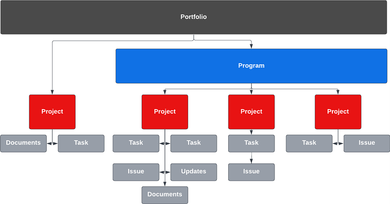

# Översikt över integreringsprogrammet Marketo Engage och Workfront {#overview}

## Få kortare time-to-market med Marketo Engage och Workfront {#achieve-faster-time-to-market-with-marketo-engage-and-workfront}

Marknadsföringens jobb fortsätter att växa med nya kanaler och fler sätt att personalisera kommunikation varje dag. Marknadsföringsteamen behöver sätt att fortsätta att automatisera och utveckla för att stödja förändrade marknadsföringskrav runt om i världen.

**&quot;Avkastningen har alltid varit det verkliga målet. Inkomsterna är enastående, men inte till något pris - särskilt idag.&quot; - CMO, Business Services Industry**

Organisationer som får högre avkastning samtidigt som de ökar sina intäkter gör det genom att effektivisera sin kampanjutvecklingsprocess, optimera hastigheten för kampanjgenomförandet och förbättra tillsynen över hela marknadsföringsfunktionen.

Om din organisation vill uppnå liknande mål som beskrivs nedan är det här dokumentet användbart för dig:

* Skala kampanjåtgärder för att stödja korsfunktionella marknadsföringsteam
* Snabbare time to market med smidig process för kampanjförfrågningar
* Upprätta ett registersystem för att öka synligheten bland kampanjintressenter
* Granska och godkänn kampanjresurser (bilder, e-postkopia)

Kampanjteamen behöver system som gör det möjligt för dem att effektivt planera och genomföra marknadsföringskampanjer. Vare sig det gäller e-post, webbinarium, event, betalda medier, näring eller innehållssyndikering behöver marknadsföringsteamen en central lösning för att organisera kampanjdeltagare, slutprodukter och genomförande.

Genom att integrera aktiveringssystemet för flerkanalsmarknadsföring (Marketo Engage) med marknadsföringsplaneringen och registersystemet (Workfront) kan ni öka kampanjhastigheten och ge intressenterna bättre synlighet.

Med Workfront Fusion kan marknadsföringsteamen i hög grad eliminera manuella och felbenägna steg som krävs för att översätta ett marknadsföringsmaterial till en kampanj. Workfront Fusion har ett integrerat lager mellan Workfront och Marketo Engage som gör det möjligt att utveckla arbetsflöden mellan olika system på ett flexibelt och effektivt sätt. Du kan lära dig mer om hur du konfigurerar integreringen och vilka åtgärder som kan vidtas för att automatisera arbetsflöden [här](https://experienceleague.adobe.com/docs/workfront/using/adobe-workfront-fusion/fusion-apps-and-modules/marketo-modules.html){target="_blank"}.

## Kampanjplanering till utförande - användningsfall för automatisering {#campaign-planning-to-execution-automation-use-cases}

* Stödja marknadsföringsteam genom att automatisera framtagningen av kampanjer i Marketo Engage via intag i Workfront
* Dela utkast av e-postmeddelanden och landningssidor som skapats i Marketo Engage till Workfront för att få slutlig granskning och godkännande från tvärfunktionella intressenter
* Dela kampanjresultat från Marketo Engage till Workfront för att demokratisera tillgången till kampanjstatistik

Här nedan visas ett arbetsflödesdiagram över kampanjutvecklingsprocessen om det är en e-postbegäran. Dessutom kan ni se hur Workfront Fusion kan spela en roll mellan Workfront och Marketo Engage för att driva arbetsflödes- och processautomatisering under kampanjutvecklingscykeln.

{zoomable=&quot;yes&quot;}

Observera de olika faserna i kampanjutvecklingsprocessen.

1. Intag och skapande: begäran om kampanj görs och kampanjresurserna samlas in programmatiskt.

1. Granska och godkänn: när kampanjen väl har satts ihop är det dags för intressenter att granska och godkänna kampanjresurser som e-post och landningssidor.

1. Rapportera och granska: Dela kampanjresultat till Workfront för att ge mer synlighet för tvärfunktionella intressenter.

>[!NOTE]
>
>I exemplet ovan hanterar och planerar Workfront arbetsinsatser under hela Marketo Engage-programmets livscykel. Workfront flexibilitet kan dock även omfatta hantering av alla marknadsföringsteamets satsningar. Detta omfattar kontobaserad marknadsföring, innehållsleveranskedjor för marknadsföring, myndighetshantering, hantering av digitala och sociala kampanjer samt säljaktiveringsprogram.

## Förstå hur marknadsföringssatsningar presenteras i Workfront {#understanding-how-marketing-initiatives-are-represented-in-workfront}

Med Adobe Workfront kan man hantera arbetet och få ett effektivare utförande. Inom Workfront finns det en hierarki med objekt som ger ett ramverk för planering, resurshantering och samarbete mellan olika team.

Att förstå hur du mappar din affärsprocess till dessa objekt är viktigt för att förstå relationen mellan Workfront och Marketo Engage.

{zoomable=&quot;yes&quot;}

### Portfolio-hierarki har definierats {#portfolio-hierarchy-defined}

<table> 
  <tr> 
   <td><b>Objekt</b></td>
   <td><b>Definition</b></td>
  </tr>
  <tr> 
   <td>Portfolio</td>
   <td>Du kan använda Portfolio och program i Workfront för att ordna projekt. Genom att organisera projekt kan du jämföra liknande projekt och avgöra var resurser ska användas bäst.  
   (t.ex. skapas A Portfolio för en affärsenhet inom ett företag som fokuserar på att sälja tjänster och/eller produkter.)</td>
  </tr>
  <tr>
   <td>Program</td>
   <td>Du kan använda Workfront-program för att ordna projekt. Genom att organisera projekt kan du jämföra liknande projekt och avgöra var resurser ska användas bäst.  
   (t.ex. en marknadsföringsstrategi med ett högnivåmål, som att öka medvetenheten och driva efterfrågan på en ny produktlansering.)</td>
  </tr>
  <tr>
   <td>Projekt</td>
   <td>Workfront Projects är en samling arbetsobjekt som måste slutföras för att ett specifikt mål, en slutprodukt, en produkt osv. ska kunna uppnås.  
   (t.ex. en marknadsföringstaktik som ett e-postutslag, en närliggande kampanj, ett webbinarium eller en personlig händelse. Ett enda projekt kan också vara mer komplext genom att omfatta flera taktiker, t.ex. ett e-postmeddelande, en displayannons, en landningssida och ett nedladdningsbart whitepaper som alla ska leda till samma resultat.)</td>
  </tr>
  <tr>
   <td>Uppgift</td>
   <td>Workfront-uppgifter är planerade arbetsuppgifter som kan vara en del av ett projekt eller ett projekt. Uppgifter tilldelas användare eller team som ska slutföras.  
   (En uppgift att bygga målgruppssegment eller skapa e-postutkast kan t.ex. vara en uppgift som är kopplad till ett projekt för att utveckla ett Marketo Engage-e-postprogram.)</td>
  </tr>
  <tr>
   <td>Problem</td>
   <td>Det finns oplanerade arbetsuppgifter i Workfront. De kan vara problem som uppstår under ett projekt eller förfrågningar som skickas via en begärandekö.  
   (t.ex. ett fel uppstår eftersom e-postbanderollbilden har fel dimensioner.)</td>
  </tr>
  <tr>
   <td>Dokument</td>
   <td>Dokument kan vara traditionella dokument som Word-dokument eller presentationer. De kan också vara bildfiler. Workfront möjliggör granskning av materialet genom kommentarer och anteckningar i dokument och bilder, vilket möjliggör samarbete mellan olika team.  
   (t.ex. en e-postrubrikbild som behöver granskas.)</td>
  </tr>
  <tr>
   <td>Uppdatera</td>
   <td>Innehåller kommentarer och granskningsloggar för att spåra arbetet och underlätta samarbetet i Workfront.  
   (t.ex. Granskningslogg över ny bildversion.)</td>
  </tr>
  </tbody>
</table>

## Exempel på hantering av marknadsföringsinitiativ {#marketing-initiative-work-management-example}

Låt oss titta på hur Workfront portföljhierarki ser ut i ett verkligt exempel.

Zeplin Company släpper en uppdaterad version av en av sina kompakta traktorbilagor, Z11, som överträffar den tidigare Z10-modellen genom att erbjuda större hållbarhet och anpassning. Med detta behöver de planera, utveckla och genomföra sin marknadsföringsstrategi för att öka efterfrågan och öka medvetenheten om att de har släppts från traktordivisionen i sin verksamhet. Den här marknadsföringsstrategin måste innehålla olika marknadsföringstaktik för att både öka kundmedvetenheten och öka den befintliga kundmedvetenheten hos Z10.

Hierarkin nedan visar hur strategi, taktik, uppgifter och resurser mappas till Workfront för denna marknadsföringskampanj.

{zoomable=&quot;yes&quot;}

## Mappa Workfront till Marketo {#mapping-workfront-to-marketo}

Med Workfront som det överordnade systemet för marknadsföringsplanering och projektorganisation är det viktigt att förstå hur information kan delas mellan Marketo Engage och Workfront.

För att dessa system ska fungera tillsammans när nya marknadsföringsinitiativ utvecklas är det viktigt att förstå hur de olika posttyperna i Workfront mappar till olika posttyper i Marketo Engage.

### Mappa Workfront-projekt till Marketo Engage-program {#mapping-workfront-projects-to-marketo-engage-programs}

Med Workfront Fusion som integreringslager kan du mappa dina projekt i Workfront till ett program i Marketo Engage. I det här fallet vill Zeplin till exempel öka medvetenheten om den nya Zeplin-modellen. Med detta skapar de ett nytt program i Workfront som innehåller en mängd marknadsföringstaktik som representeras av Projects. En taktik är ett informationsmejl som måste skickas ut till befintliga kunder i Z10-modellen så att de får veta om den nya Z11-modellen. I Workfront skulle ett projekt ha skapats för att representera den här e-postaktiviteten med en uppsättning uppgifter kopplade till den för att skapa målgruppen, hämta kreativitet för e-postbilderna och sammanställa e-postmeddelandet i Marketo Engage. Projektet i Workfront kan mappas till ett e-postprogram i Marketo Engage så att information kan synkroniseras mellan olika system.

Här nedan visas ett exempel på hur ett program kan innehålla flera projekt och hur dessa Workfront-projekt kan mappas till program i Marketo Engage.

{zoomable=&quot;yes&quot;}

Du kanske vill lansera ett stort marknadsföringsprojekt som kräver att flera Workfront-projekt ska ingå i ett Workfront-program, eller så kanske du har en enstaka förfrågan om ett webbinarium eller e-postmeddelande som bara behöver ett Workfront-projekt. Vad ni än behöver, med Workfront, Workfront Fusion och Marketo Engage, har ert team flexibiliteten att integrera er kampanjutvecklingsprocess sömlöst från planering till genomförande.

### Mappa Workfront-uppgifter till Marketo Engage-resurser {#mapping-workfront-tasks-to-marketo-engage-assets}

När ni börjar kartlägga er kampanjutvecklingsprocess i Workfront kan ni också tänka på vilka uppgifter som ska utföras i Marketo Engage och hur ni kan samla in information i Workfront, vilket ökar konsekvensen, effektiviteten och exaktheten i kampanjutvecklingskedjan.

Workfront Projects kan förenklas så att din process kan definieras tydligt varje gång du kör en viss marknadsföringstaktik. När du kör en e-postkampanj kommer det till exempel att finnas en standarduppsättning med uppgifter som måste utföras för din organisation. Dessa uppgifter kan innefatta ett snabbt möte med intressenter, få tillgång till kreativt material, godkänna kreativt material, bygga upp målgruppen, skapa e-postöversättning, godkänna e-postmeddelandet och dela resultaten av e-postkampanjer med intressenter.

Vissa av dessa uppgifter kan mappas direkt till arbete som ska utföras i Marketo Engage. Du kan till exempel anpassa e-postaktiviteten för att skapa i Workfront så att den innehåller fält som skickar information till Marketo Engage för att automatisera sammanställningen av e-postmeddelandet. Det kan vara ämnesraden, kopian och bilderna i e-postmeddelandet.

## Nästa steg {#next-steps}

Nu när ni har en grundläggande förståelse för hur Workfront och Marketo Engage kan öka effektiviteten i er leverantörskedja för kampanjutveckling kan ni läsa följande dokument och resurser om hur ni kan automatisera arbetsflöden och processer mellan Marketo Engage och Workfront med hjälp av Workfront Fusion.

### Komma igång med integrationen mellan Workfront Fusion, Workfront och Marketo Engage {#getting-started-with-workfront-fusion}

* [Infoga och skapa](/help/blueprints/b2b/marketo-engage-and-workfront-integration-blueprint/intake-and-create.md){target="_blank"} - Automatisering av kampanjutveckling med Marketo Engage och Workfront

* [Granska och godkänn](/help/blueprints/b2b/marketo-engage-and-workfront-integration-blueprint/review-and-approve-blueprint.md){target="_blank"}

### Hantera kampanjnamn för Marketo Engage och deras associerade URL:er {#managing-marketo-engage-campaign-names}

Att standardisera era namngivningskonventionerna för kampanjer och URL:er är en viktig grund för en korrekt programhantering i Marketo Engage och bidrar till en mer konsekvent process under kampanjens utvecklingslivscykel. Om du letar efter verktyg som kan hjälpa dig med detta rekommenderar vi att du checkar ut några kostnadsfria verktyg med öppen källkod från [Adobe Success Services](https://main--marketo-campaign-tools--dr-adobe.hlx.live/){target="_blank"} som gör att ni kan skapa ett konsekvent tillvägagångssätt för att skapa och hantera kampanjer i Marketo Engage och deras associerade URL:er.

### Resurs {#resources}

* [Workfront Fusion för Marketo Engage](https://experienceleague.adobe.com/docs/workfront/using/adobe-workfront-fusion/fusion-apps-and-modules/marketo-modules.html){target="_blank"}

* [Workfront Fusion for Workfront](https://experienceleague.adobe.com/docs/workfront/using/adobe-workfront-fusion/fusion-apps-and-modules/workfront-modules.html){target="_blank"}
