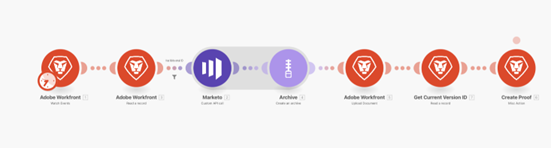

# Granska och godkänn en plan {#review-and-approve-blueprint}

Att se till att marknadsföringsresurser och kampanjer uppfyller förväntningarna och standarderna hos ett företag sträcker sig bortom att leverera rätt innehåll och budskap till rätt målgrupp. Organisationer ansvarar också för att upprätthålla interna policyer, branschregler och till och med rättsliga förutsättningar när de inleder nya marknadsföringsinitiativ. Genom att införliva steg för granskning och godkännande i kampanjutvecklingsprocessen kan marknadsföringsteamen se till att innehåll och meddelanden är korrekta och följer deras branschstandarder, särskilt för branscher som ekonomi, hälso- och sjukvård och läkemedel.

Med Workfront och Marketo Engage har marknadsföringsteamen möjlighet att ha ett nära kopplat system för marknadsföring, med meddelanden som är korrekta och i enlighet med gällande regler.

## Lås upp korrektur och avancerade godkännanden för Marketo Engage med Workfront {#unlock-proofing-and-advanced-approvals}

När vi tänker på att bygga marknadsföringskampanjer måste vi tänka på att flera system stöder de olika stegen som ingår, inklusive planering, byggnad, granskning, feedback, godkännande och utförande. Med Workfront och Marketo Engage har teamen alla verktyg som behövs för att ta dem genom hela planeringsprocessen och lansera en ny marknadsföringskampanj. Teamen kan dessutom effektivisera sina gransknings- och godkännandeprocesser ytterligare för att öka takten i kampanjutvecklingen samtidigt som man ser till att regelefterlevnaden håller högsta standard.

### Granska och godkänn användningsfall som har låsts upp med Marketo Engage och Workfront {#review-and-approve-use-cases-unlocked-with-marketo-engage-and-workfront}

* Eliminera behovet av olika feedback och öka samarbetet på en central plats genom att använda Workfront kommentarverktyg och kommentarfunktioner på Marketo Engage-material.

* Centralisera era godkännanden genom att aktivera dem i Marketo Engage från Workfront arbetsflöden för godkännande.

* Stödja och effektivisera komplexa arbetsflöden för godkännande av marknadsföringsmaterial genom att använda Workfront avancerade godkännandefunktioner med Marketo Engage-resurser.

* Demokratisera åtkomsten till marknadsföringsutkast genom att dra in Marketo-material i Workfront för granskning av olika intressenter.

* Spåra ändringar och skapa en pappershistorik genom att centralisera all granskning och korrektur av Marketo Engage i Workfront.

## Planera arbetsflödet för korrektur och godkännande {#planning-your-proof-and-approval-workflow}

Innan du konfigurerar korrektur- och godkännandeintegrationen mellan Marketo Engage och Workfront bör du tänka på följande aspekter:

* Vilka resurser behöver granskas och godkännas?
* Vem behöver vara godkännare?
* Kommer det att finnas flera godkännare innan en marknadsföringsresurs kan publiceras?
* Vid vilken tidpunkt i kampanjutvecklingsprocessen kommer marknadsföringsresurser att samlas ihop och vara klara att granskas?

Om du besvarar dessa frågor får du hjälp att hitta en baslinje för hur ditt godkännandeflöde kommer att se ut och hur du kan börja fundera på hur du konfigurerar din Workfront-instans.

## Bygga ett korrektur- och godkännandearbetsflöde mellan Marketo Engage och Workfront {#building-a-proof-and-approval-workflow}

För att effektivisera korrektur- och godkännandeprocessen mellan Workfront och Marketo Engage kan ni integrera de båda lösningarna med Workfront Fusion. Workfront Fusion har ett arbetsflödesgränssnitt för att utlösa åtgärder och skicka information mellan instanser i Workfront och Marketo Engage.

För att göra detta bör du överväga stegen nedan som en del av processen för en integrerad granskning och godkännande.

1. Konfigurera ditt Workfront-projekt med en uppgift som är klar för granskning.
1. Trigga ditt Marketo Engage-e-postmeddelande för att synkronisera med Workfront med en statusändring för aktiviteten.
1. Konvertera din e-postfil från Marketo Engage till granskningsbart korrektur i Workfront.
1. Använd Workfront korrektur för att samarbeta via kommentarer och anteckningar.
1. Godkänn Workfront Proof för att aktivera godkännande av resurser i Marketo Engage och markera sedan uppgiften som slutförd.

### Konfigurera ett Workfront-projekt med en uppgift som är klar för granskning {#configure-a-workfront-project-with-a-ready-for-review-task}

Använd [projektmallar](https://experienceleague.adobe.com/docs/workfront/using/manage-work/projects/create-and-manage-project-templates/project-template-overview.html?lang=sv-SE){target="_blank"} för att hämta de flesta repeterbara processer, information och inställningar som är associerade med projekten i organisationen. Du kan definiera uppgifter, köämnen, skapa anpassade formulär och bifoga dokument i mallen.

I projektmallen i Workfront kan du inkludera uppgifter för att granska resurser som ingår i marknadsföringskampanjen. Dessutom kan du lägga till en godkännandeprocess för att hantera enstaka godkännanden eller mer komplexa godkännanden på flera nivåer.

Om du vill starta en ny e-postkampanj bör du ha en projektmall som innehåller en uppgift att granska e-postmeddelandet samt en godkännandeprocess för att säkerställa att e-postmeddelandet godkänns av rätt intressent innan det kan skickas ut.

{zoomable="yes"}

### Utlös din e-post från Marketo Engage för att synkronisera med Workfront med statusändring för uppgifter {#trigger-your-marketo-engage-email-to-sync-to-workfront}

Som en del av granskningsprocessen vill du kunna synkronisera e-postmeddelanden till ditt Workfront-projekt när de är klara för granskning av marknadsföringsteamet. För att göra detta rekommenderar vi att du konfigurerar en aktivitet klar att granska med [aktivitetsstatus](https://experienceleague.adobe.com/docs/workfront/using/manage-work/projects/update-work-on-a-project/update-task-status.html?lang=sv-SE){target="_blank"} som anger när e-postmeddelandet är klart att granskas. I vårt exempel har vi lagt till en e-poststatus för Granska Marketo som kan väljas när e-postutkastet är klart att granskas av intressenter.

Med den här statusen på plats i ditt Workfront-projekt kan du konfigurera ditt Workfront Fusion-scenario så att det lyssnar efter aktiviteten Klar att granska för att uppdatera till&quot;Granska Marketo-e-post&quot;. När ditt scenario har uppdaterats kan du hämta Marketo Engage-e-postmeddelandet som en HTML-fil, zippa upp det och spara en kopia av det i Workfront projektdokument som ska granskas.

{zoomable="yes"}

### Konvertera din e-post från Marketo Engage till granskningsbart korrektur i Workfront {#convert-your-marketo-engage-email-to-reviewable-proof-in-workfront}

När aktiviteten Redo för granskning har flyttats till statusen&quot;Granska Marketo-e-post&quot; och Marketo Engage e-postmeddelandet har sparats i Workfront, kan du konfigurera ditt Workfront Fusion-scenario så att e-postmeddelandet konverteras till en Workfront Proof.

### Använd Workfront korrektur för att samarbeta via kommentarer och anteckningar {#use-workfront-proofing-to-collaborate}

[Med Workfront funktioner för korrektur](https://experienceleague.adobe.com/docs/workfront/using/review-and-approve-work/proofing/proofing-overview/proofing-basics.html?lang=sv-SE){target="_blank"} kan marknadsföringsteamet ta en ny resurs, till exempel en bild eller ett e-postmeddelande, och samarbeta via kommentarer och anteckningar. När ett bevis är klart att publiceras kan beslutsfattarna godkänna materialet från korrekturverktyget.

{zoomable="yes"}

### Godkänn Workfront Proof och aktivera godkännande av resurser i Marketo Engage, markera aktiviteten som slutförd {#approve-workfront-proof-and-trigger-asset-approval-in-marketo-engage}

Workfront Fusion kan identifiera när e-postmeddelandet har godkänts av intressenter och skicka en begäran till Marketo Engage om att godkänna e-postmeddelandet inuti Marketo.

Med e-postmeddelandet granskat/godkänt av rätt teammedlemmar är e-postmeddelandet redo att publiceras i Marketo Engage!

## Mallar för fusionsscenarier {#fusion-scenario-templates}

För att effektivisera utvecklingen av arbetsflöden för granskning och godkännande i din egen instans av Workfront och Marketo Engage har vi tagit fram Fusion Templates som hjälper dig att komma igång med integrationen. Du kan använda mallarna genom att söka i&quot;Marketo&quot; i delen Offentliga mallar i Fusion och hämta dem till din instans.

### Granska ett e-postkorrektur av ditt e-postutkast från Marketo Engage i Workfront {#review-an-email-proof-of-your-marketo-engage-email-draft-in-workfront}

Sammanställningsscenariot nedan tar dig igenom den första halvan av gransknings- och godkännandeflödet, där e-postutkastet kan hämtas från Marketo Engage och sparas i Workfront som ett korrektur. När det har sparats som ett korrektur i Workfront projektdokument kan det granskas av marknadsaktörer, kommenteras och kommenteras som en del av granskningsprocessen.

{zoomable="yes"}

### Godkänn ett e-postmeddelande i Workfront som utlöser godkännandet av resursen i Marketo Engage {#approve-an-email-in-workfront-that-triggers-approval}

Fusionsscenariot nedan kan användas för att identifiera när ett korrektur i Workfront har godkänts och skicka det till Marketo Engage för att uppdatera e-postutkastet så att det är klart att användas i ett Marketo Engage-program.

{zoomable="yes"}

Tillsammans kan dessa två scenarier användas för att skapa en tvåvägs väg för att dra marknadsföringsresurser från Marketo Engage till Workfront och få effektiva arbetsflöden för granskning och godkännande, och sedan skicka tillbaka godkännanden till Marketo Engage från Workfront.
