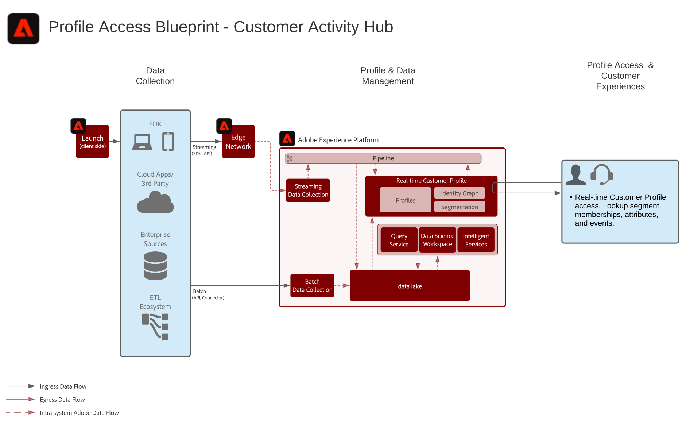

# Kundaktivitetshubbsknapp - översikt

Kundaktivitetshubben visar hur externa program kan komma åt Adobe Experience Platform [!UICONTROL kundprofil i realtid].

Externa program kan komma åt kundprofiler för R[!UICONTROL realtid] med en API-GET-begäran. Attribut, händelser, segmentmedlemskap och modelldrivna funktioner som lagras i profilen kan sedan användas i dessa externa program som inte kommer från Adobe.

Med den här funktionen kan ni skapa ett avancerat sammanhang när en kund ringer ert callcenter. Supportpersonalen kan få insyn i kundens livstidsvärde, benägenhet att ändra sig eller exponering för marknadsföringskampanjer, till exempel. Säljarna kan också dra nytta av mer kontext och få bättre insikt i sina kunder.

>[!NOTE]
>
>Den aktuella fördröjningen som stöds av API:t för profilsökning är ungefär 500 millisekunder, vilket gör det här tillvägagångssättet olämpligt för integrering av profilen med realtidsmotorer för beslutsfattande, som webben eller mobilpersonalisering på samma sida.

## Användningsexempel

* Ge kunderna ett djupare sammanhang för interaktioner som stöds av agenter, som support och säljupplevelser. Med profilsökningen i Experience Platform kan agenterna få mer kontext om konsumenten, t.ex. nya inköp, kampanjinteraktioner, egenskaper, målgruppsmedlemskap och andra attribut och insikter som lagras i kundprofilen i realtid.

## Arkitektur

## Guardrails

* [Guardrails for Real-time Customer Profile data](https://experienceleague.adobe.com/docs/experience-platform/profile/guardrails.html)

## Implementeringssteg

1. Konfigurera datauppsättningar och scheman.
1. Konfigurera [!UICONTROL Kundprofiler i realtid]: konfigurera schema och datauppsättning för [!UICONTROL Kundprofil för realtid] och konfigurera en sammanfogningsprincip och identiteter.
1. Importera data till Platform och bearbeta dem till [!UICONTROL Kundprofil i realtid].
1. Använd enhets-API:t för att söka efter ett profilattribut, antingen från postentiteten eller från upplevelsehändelseentiteten.

## Relaterad dokumentation

* [Adobe Experience Platform Activation product description](https://helpx.adobe.com/legal/product-descriptions/adobe-experience-platform0.html)
* [Kundprofildokumentation i realtid](https://experienceleague.adobe.com/docs/experience-platform/profile/home.html?lang=en)
* [Profilskydd](https://experienceleague.adobe.com/docs/experience-platform/profile/guardrails.html)
* [API för profilsökning](https://www.adobe.io/apis/experienceplatform/home/api-reference.html)
