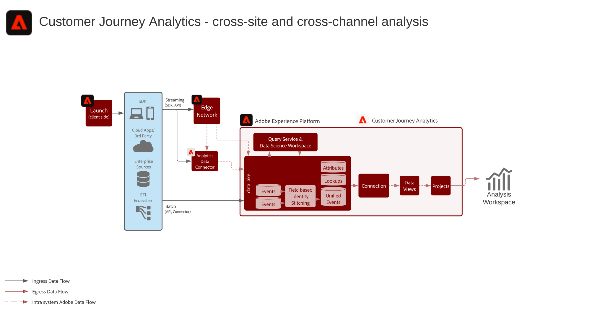

# B2B Customer Journey Analytics-ritning

Customer Journey Analytics B2B edition möjliggör kontobaserad rapportering och analys för B2B-organisationer. Till skillnad från personcentrerad B2C-analys placerar den här planen **kontot** i mitten av datamodellen så att du kan analysera komplexa B2B-inköpsresor över flera intressenter, inköpsgrupper och säljcykler. Använd [!DNL Customer Journey Analytics] för att kombinera beteendedata med B2B-dimensioner - konton, möjligheter, kampanjer och marknadsföringslistor - för att få kundbaserade insikter och skapa målgrupper.

## Tillämpningar

* Adobe [!DNL Customer Journey Analytics] (B2B edition)
* Adobe Experience Platform (för B2B- och händelsedata)

## Användningsfall

* **Optimera kontomarknadsföring** - Analysera marknadsföringens påverkan på kampanjer, kanaler och innehåll på inköpsgrupper inom konton, pipeline-progression och möjligheter till merförsäljning/korsförsäljning.
* **Utöka nyckelkonton** - Identifiera värdefulla kontaktytor mellan inköpsgrupper inom nyckelkonton för att informera marknadsförings- och försäljningsåtgärder och beräkna kundens livstidsvärde på kontonivån.
* **Bygg produktvärde** - Mät effekten av produktreleaser och användning på kundnöjdheten på konto- och användarnivå för att optimera funktioner och informera utvecklingen.
* **Personbaserad B2B-analys** - Kombinera konto- och säljprojektskontext med individuella användarbeteenden för poängsättning, engagemang och reseanalys.

## Förutsättningar

* [!DNL Customer Journey Analytics] B2B edition-berättigande.
* B2B-data och beteendedata i Adobe Experience Platform: B2B-datauppsättningar (konton, möjligheter, personer, kampanjer, marknadsföringslistor, B2B-aktiviteter) och händelsedata (webb, mobil eller andra kanaler) som är tillgängliga i en [CJA-anslutning](https://experienceleague.adobe.com/docs/analytics-platform/using/cja-connections/create-connection.html).
* [B2B-namngivning för CJA](https://experienceleague.adobe.com/docs/analytics-platform/using/cja-dataviews/b2b.html): B2B-specifika datavyinställningar (konto-ID, affärsmöjlighets-ID och relaterade dimensioner) har konfigurerats för anslutningen.

## Arkitektur

{zoomable="yes"}

Data flödar från Experience Platform (B2B och händelsedatamängder) till [!DNL Customer Journey Analytics] via en CJA-anslutning. B2B-dimensioner visas i datavyer så att analyser och målgrupper kan byggas på konto-, affärsmöjliggörs- och personnivå.

## Skyddsräcken

* Information om B2B edition produktbegränsningar och -berättiganden finns i [Customer Journey Analytics B2B produktbeskrivning](https://helpx.adobe.com/legal/product-descriptions/customer-journey-analytics-b2b.html).
* Information om begränsningar för Analytics-plattformen och CJA finns i [Garantier för Analytics-plattformen](https://experienceleague.adobe.com/en/docs/analytics-platform/using/technotes/guardrails).
* Information om CJA gräns för datainhämtning och anslutning finns i [Customer Journey Analytics-meddelanden om datafrågor](https://experienceleague.adobe.com/docs/experience-platform/sources/connectors/adobe-applications/analytics.html#what-is-the-expected-latency-for-analytics-data-on-platform%3F).
* Om du publicerar CJA-målgrupper på kunddataplattformen i realtid, se [Customer Journey Analytics målgruppsdelningsutkast](https://experienceleague.adobe.com/docs/analytics-platform/using/cja-components/audiences/publish.html#latency).
* Information om latenser från början till slut och om plattformsskydd finns i [distributionsskyddsdokumentet](../experience-platform/guardrails.md).

## Implementeringssteg

1. **Infoga B2B-data och händelsedata i Experience Platform** - Ta in data om konto, affärsmöjlighet, person, kampanj och aktivitet plus beteendehändelser med [källor](https://experienceleague.adobe.com/docs/experience-platform/sources/home.html) (t.ex. [!DNL Marketo Engage], CRM eller andra B2B-anslutningar).
2. **Skapa en CJA-anslutning** — [Lägg till relevanta Experience Platform-datauppsättningar](https://experienceleague.adobe.com/docs/analytics-platform/using/cja-connections/create-connection.html) (B2B och händelse) i en Customer Journey Analytics-anslutning.
3. **Konfigurera B2B i datavyn** - Aktivera [B2B-namngivning och nyckeldimensioner](https://experienceleague.adobe.com/docs/analytics-platform/using/cja-dataviews/b2b.html) (konto-ID, affärsmöjlighets-ID osv.) i anslutningens datavyer.
4. **Bygg kontobaserad analys och målgrupper** - Använd [CJA B2B-användningsfall och rapportering](https://experienceleague.adobe.com/docs/analytics-platform/using/cja-usecases/b2b.html) för att skapa rapporter, uppdelningar och målgrupper på konto- och affärsmöjlighetsnivå. [Publicera målgrupper till CDP](https://experienceleague.adobe.com/docs/analytics-platform/using/cja-components/audiences/publish.html) i realtid för aktivering.

## Relaterad dokumentation

### Customer Journey Analytics B2B edition

* [Customer Journey Analytics B2B edition](https://experienceleague.adobe.com/docs/analytics-platform/using/cja-overview/cja-b2b/cja-b2b-edition.html)
* [Användningsexempel](https://experienceleague.adobe.com/docs/analytics-platform/using/cja-usecases/b2b.html)
* [Översikt över användningsfall i B2B edition](https://experienceleague.adobe.com/docs/analytics-platform/using/cja-usecases/b2b/b2b-edition/use-cases-overview.html)
* [Ett exempel på ett personbaserat B2B-projekt](https://experienceleague.adobe.com/docs/analytics-platform/using/cja-usecases/b2b/example.html)

### Anslutningar och datavyer

* [Skapa en anslutning](https://experienceleague.adobe.com/docs/analytics-platform/using/cja-connections/create-connection.html)
* [Inställningar för B2B-datavy](https://experienceleague.adobe.com/docs/analytics-platform/using/cja-dataviews/b2b.html)

### Målgrupper och skyddsräcken

* [Publicera CJA-målgrupper till CDP i realtid](https://experienceleague.adobe.com/docs/analytics-platform/using/cja-components/audiences/publish.html)
* [Experience Platform och programvarurådor](../experience-platform/guardrails.md)
