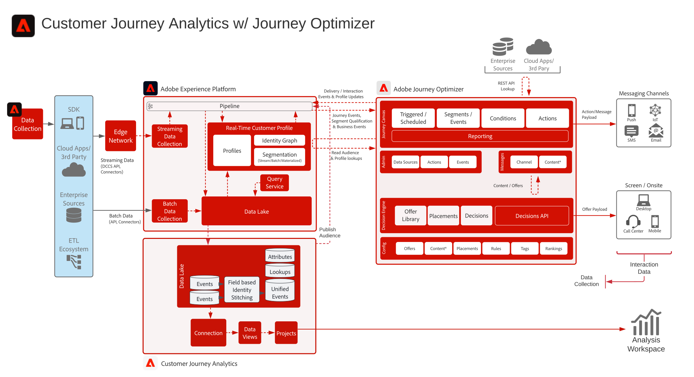

# Customer Journey Analytics med Journey Optimizer-utkast

Data från Journey Optimizer delas med Experience Platform data Lake och finns tillgängliga för förtäring, analys och rapportering inom Customer Journey Analytics. Resehantering, interaktion och effekt kan analyseras och rapporteras inom Customer Journey Analytics.

Dessutom kan målgrupper som skapats i Customer Journey Analytics publiceras i kundprofilen i realtid i Experience Platform och vara tillgängliga för kundresa i Journey Optimizer.

## Implementeringsguide

I följande dokumentation finns riktlinjer för implementering och konfigurering av Journey Optimizer-data i Customer Journey Analytics. [Dokumentation](https://experienceleague.adobe.com/docs/journey-optimizer/using/reporting/reports/sharing-overview.html)

## Arkitektur för Customer Journey Analytics med Journey Optimizer

{zoomable="yes"}
