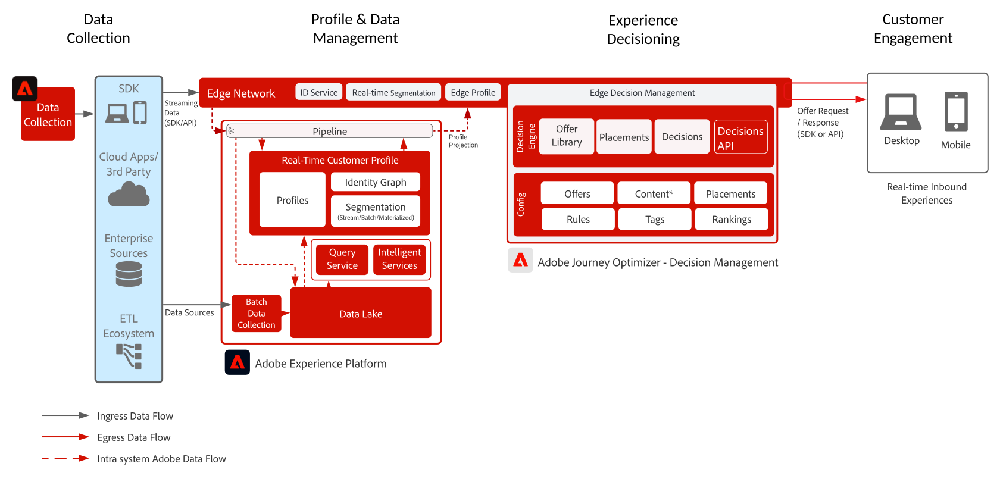

# Journey Optimizer - Offer decisioning i kanten

Mer information om beslutshantering finns i produktdokumentationen [HÄR](https://experienceleague.adobe.com/docs/journey-optimizer/using/offer-decisioniong/get-started-decision/starting-offer-decisioning.html) och Offera decisioningen [HÄR](https://experienceleague.adobe.com/docs/blueprints-learn/architecture/customer-journeys/journey-optimizer/offer-decisioning/offers-overview.html)

Adobe Decision Management är en tjänst som tillhandahålls som en del av Adobe Journey Optimizer. Denna plan beskriver användningsexempel och tekniska funktioner i programmet och ger en djupdykning i de olika arkitektoniska komponenterna och överväganden som utgör Offer decisioning.

Beslutshanteringen kan genomföras på ett av två sätt. Det första är via Adobe Experience Platform Hub, som är en enda datacenterarkitektur. I navet-metoden utförs, personaliseras och levereras med andra fördröjning. Hub-arkitekturen är därför bäst lämpad för kundupplevelser som inte kräver en sekundär fördröjning. Exempel på sådana är erbjudandebeslut som ges för kioskdatorer eller agentassisterade upplevelser som callcenters eller personliga interaktioner.

Den andra metoden är via Experience Edge-nätverket, som är en globalt spridd, geografiskt belägen infrastruktur som kan leverera snabba subsekundsupplevelser och millisekundsupplevelser. Den slutanvändarupplevelse som utförs av den gränsinfrastruktur som är närmast konsumenternas geografiska plats för att minimera latensen. Beslutshantering i realtid är avsedd att serva kundupplevelser i realtid. Det gäller upplevelser som webb eller mobilförfrågningar om inkommande personalisering.

Denna plan kommer att omfatta detaljerna i beslutsfattandet på utsidan.

Om du vill veta mer om beslutshantering för navet kan du läsa [Beslutshantering på navet](https://experienceleague.adobe.com/docs/blueprints-learn/architecture/customer-journeys/journey-optimizer/offer-decisioning/offers-hub.html) utkast.

## Använd fall för beslutshantering i utkanten

* Onlinepersonalisering via webb eller mobilupplevelser.
* Flerkanalsmarknadsföring - ger enhetlighet över webben, mobilen, e-post och andra interaktionskanaler via Adobe Journey Optimizer.

 

## Arkitektur

 

## Integrationsmönster

| Integrering | Beskrivning |
| :-- | :--- |
| [offer decisioning med Adobe Target](https://experienceleague.adobe.com/docs/target/using/integrate/ajo/offer-decision.html) | offer decisioning kan integreras med Adobe Target så att erbjudandena kan testas och levereras som Target-upplevelser. |

## Förutsättningar

Adobe Experience Platform

* Scheman och datauppsättningar måste konfigureras i systemet innan du kan konfigurera Journey Optimizer-datakällor
* För Experience Event-klassbaserade scheman lägger du till fältgruppen &#39;Orchestration eventID&#39; när du vill att en händelse som inte är en regelbaserad händelse ska aktiveras
* För enskilda profilklassbaserade scheman lägger du till fältgruppen Profiltestinformation för att kunna läsa in testprofiler som ska användas med Journey Optimizer

 

## Guardrails

* För Journey Optimizer skyddsräcken, se följande [Journey Optimizer Guardrails](https://experienceleague.adobe.com/docs/journey-optimizer/using/get-started/limitations.html).
* För skyddsräcken för Offera decisioningar, se följande [Produktbeskrivning för offer decisioning](https://helpx.adobe.com/legal/product-descriptions/offer-decisioning-app-service.html).

### Dataöverföringsskydd

 

### Aktiveringsskydd

 

## Implementeringsmönster

* Använd webb- eller Mobile SDK för distribution på webbplatser och mobilappar för att implementera Offer decisioning där SDK distribuerades.
   * [Web/Mobile SDK-utkast](https://experienceleague.adobe.com/docs/blueprints-learn/architecture/data-ingestion/websdk.html)
   * [WebSDK](https://experienceleague.adobe.com/docs/experience-platform/edge/personalization/offer-decisioning/offer-decisioning-overview.html)
   * [MobileSDK](https://aep-sdks.gitbook.io/docs/)

eller

* För en API-server-till-server-baserad implementering använder du Edge Network Service API för direkt server-till-server-implementering av Offer decisioning.
   * [API för Edge Network Server](https://experienceleague.adobe.com/docs/journey-optimizer/using/offer-decisioniong/api-reference/offer-delivery/deliver-offers.html)

 

## Implementeringssteg

### Adobe Experience Platform

#### Schema/datauppsättningar

1. [Konfigurera enskilda profiler, upplevelsehändelser och scheman för flera enheter](https://experienceleague.adobe.com/?recommended=ExperiencePlatform-D-1-2021.1.xdm) i Experience Platform, baserat på kunddata.
1. [Skapa datauppsättningar](https://experienceleague.adobe.com/docs/platform-learn/tutorials/data-ingestion/create-datasets-and-ingest-data.html) i Experience Platform för data som ska importeras.
1. [Lägg till etiketter för dataanvändning](https://experienceleague.adobe.com/docs/platform-learn/tutorials/data-governance/classify-data-using-governance-labels.html) i Experience Platform till datauppsättningen för styrning.
1. [Skapa profiler](https://experienceleague.adobe.com/docs/platform-learn/tutorials/data-governance/create-data-usage-policies.html) som tillämpar styrning av destinationer.

#### Profil/identitet

1. [Skapa alla kundspecifika namnutrymmen](https://experienceleague.adobe.com/docs/platform-learn/tutorials/identities/label-ingest-and-verify-identity-data.html).
1. [Lägga till identiteter i scheman](https://experienceleague.adobe.com/docs/platform-learn/tutorials/identities/label-ingest-and-verify-identity-data.html).
1. [Aktivera scheman och datauppsättningar för profilen](https://experienceleague.adobe.com/docs/platform-learn/tutorials/profiles/bring-data-into-the-real-time-customer-profile.html).
1. [Ställ in sammanfogningsprinciper](https://experienceleague.adobe.com/docs/platform-learn/tutorials/profiles/create-merge-policies.html) för olika vyer av [!UICONTROL Kundprofil i realtid] (valfritt).
1. Skapa segment för reseanvändning.

#### Källor/mål

1. [Infoga data i Experience Platform](https://experienceleague.adobe.com/?recommended=ExperiencePlatform-D-1-2020.1.dataingestion) med direktuppspelnings-API:er och källanslutningar.

## Relaterad dokumentation

* [Adobe Experience Platform](https://experienceleague.adobe.com/docs/experience-platform.html)
* [Adobe Journey Optimizer](https://experienceleague.adobe.com/docs/journey-optimizer.html)
* [Adobe Journey Optimizer Beslutshantering](https://experienceleague.adobe.com/docs/journey-optimizer/using/offer-decisioniong/get-started-decision/starting-offer-decisioning.html)
* [Adobe Journey Optimizer produktbeskrivning](https://helpx.adobe.com/legal/product-descriptions/adobe-journey-optimizer.html)
* [Produktbeskrivning för Adobe Offer decisioning](https://helpx.adobe.com/legal/product-descriptions/offer-decisioning-app-service.html)
