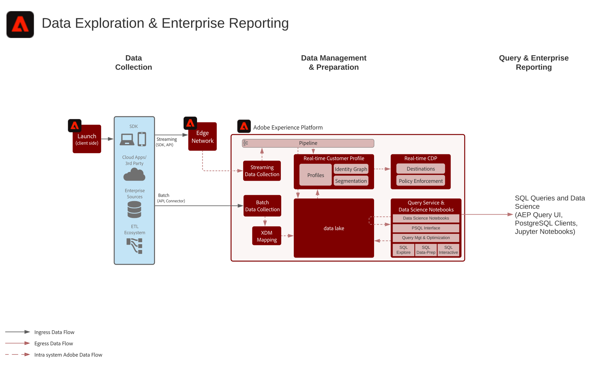

# Enterprise Data Exploration and Reporting Blueprint

Enterprise Data Exploration and Reporting omfattar möjligheten inom Adobe Experience Platform att utföra experimentella frågor och analyser av data som finns i datasjön.

Experience Platform Query Service tillåter att SQL-frågor utförs på data. Med arbetsytan Data Science kan man experimentera med data, datavetenskap och maskininlärning.

Dessutom tillåter Experience Platform anslutningar med SQL-klienter, gränssnitt och Business Intelligence-verktyg (BI) från tredje part att ansluta direkt till, komma åt och fråga data i Experience Platform med hjälp av protokollet PostgreSQL.

Vissa skyddsutkast gäller för frågetidsgränsen och för den datamängd som ingår i frågeresultatet, vilket beskrivs i scenarioinformationen.

## Användningsexempel

* Interaktiv fråga och sammanställning av data
* Rad- och kolumnåtkomst till inmatade data för utforskning och validering
* Instrumentpaneler och visualisering av data via verktyg för Business Intelligence

## Program

* Adobe Experience Platform

## Scenarier

| Scenario | Beskrivning | Experience Cloud program/tjänster |
|---|---|---|
| **Datautforskning - råfråga** | <ul><li>Skriv och utför SQL-frågor i datasjön med det interaktiva frågeanvändargränssnittet eller en ansluten SQL-klient. Data Science Workspace kan också användas för att hämta information från rådata i Experience Platform.</li></ul> | <ul><li>Adobe Experience Platform</li></ul> |
| **Enterprise Dashboard** | <ul><li>Koppla samman Business Intelligence-verktyg med Experience Platform för att visualisera data för instrumentpaneler och rapportera användningsfall.</li></ul> | <ul><li>Adobe Experience Platform</li></ul> |

## Arkitektur

## Guardrails

* 10-minuters tidsgräns för interaktiva frågor
* Gränsen på 100 poster returnerades i användargränssnittet
* Gränsen på 50 000 poster returnerades via SQL-kopplingen

## Implementeringssteg

1. Konfigurera datauppsättningar och scheman för datainhämtning i datasjön.
1. Ingest data.
1. Bekräfta att data är tillgängliga för Query Service och Data Science Workspace för åtkomst och fråga.
1. Koppla ihop Business Intelligence-verktyg och SQL-klienter med Query Service för visualisering, datafrågor och sökning.

## Relaterad dokumentation

* [Adobe Experience Platform Intelligence - produktbeskrivning](https://helpx.adobe.com/legal/product-descriptions/adobe-experience-platform-intelligence---product-description.html)
* [Dokumentation för frågetjänsten](https://experienceleague.adobe.com/docs/experience-platform/query/home.html?lang=en)
