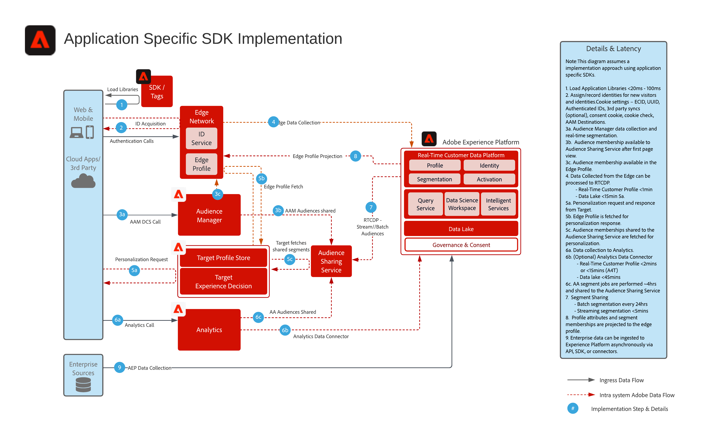

# Programspecifik SDK-distribution

I arkitekturdiagrammet nedan visas integrationssökvägarna och datainsamlingen med hjälp av programspecifika SDK:er för implementering.

## Referensdokumentation

* [Experience Platform Web/Mobile SDK - översikt](https://experienceleague.adobe.com/docs/experience-platform/edge/home.html?lang=en)
* [Implementera Adobe Experience Cloud med Web SDK, genomgång](https://experienceleague.adobe.com/docs/platform-learn/implement-web-sdk/overview.html)
* [Implementera Adobe Experience Cloud i mobilappar, genomgång](https://experienceleague.adobe.com/docs/platform-learn/implement-mobile-sdk/overview.html)