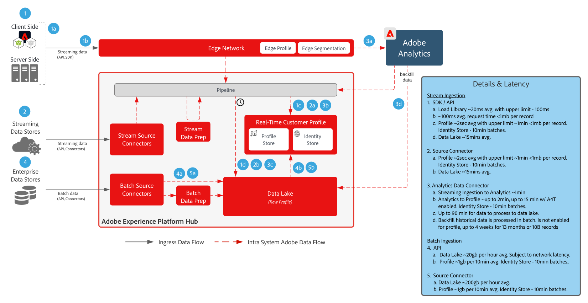

# Dataförberedelse och intag

Dataförberedelse och matningsutkast omfattar alla metoder som kan användas för att förbereda och importera data till Adobe Experience Platform.

Datakompilering innefattar mappning av källdata till XDM-schema (Experience Data Model). Det omfattar även att utföra dataomvandlingar, inklusive datumformatering, fältdelning/sammanfogning/konverteringar samt att sammanfoga/skriva in poster på nytt. Med hjälp av dataförberedelser kan kunddata sammanställas för att ge en sammanställd/filtrerad analys, inklusive rapportering eller förberedelse av data för sammansättning av kundprofiler/datavetenskap/aktivering.

## Arkitektur

## Skyddsförslag för dataöverföring

Bilden nedan visar de genomsnittliga prestandagarantierna och latensen för dataöverföring till Adobe Experience Platform.

## Metoder för dataöverföring

<table cellspacing="0" class="Table" style="border-collapse:collapse; width:1123px">
<tbody>
<tr>
<td colspan="4" style="background-color:#308fff; border-bottom:4px solid white; border-left:1px solid white; border-right:1px solid white; border-top:1px solid white; height:31px; vertical-align:top; width:1123px">

<strong>Direktuppspelningskällor</strong>

</td>
</tr>
<tr>
<td style="background-color:#969696; border-bottom:1px solid white; border-left:1px solid white; border-right:1px solid white; border-top:none; height:20px; vertical-align:top; width:222px">

Metod

</td>
<td style="background-color:#969696; border-bottom:1px solid white; border-left:none; border-right:1px solid white; border-top:none; height:20px; vertical-align:top; width:401px">

Vanliga användningsfall

</td>
<td style="background-color:#969696; border-bottom:1px solid white; border-left:none; border-right:1px solid white; border-top:none; height:20px; vertical-align:top; width:218px">

Protokoll

</td>
<td style="background-color:#969696; border-bottom:1px solid white; border-left:none; border-right:1px solid white; border-top:none; height:20px; vertical-align:top; width:282px">

Överväganden

</td>
</tr>
<tr>
<td style="background-color:#e8eeff; border-bottom:1px solid white; border-left:1px solid white; border-right:1px solid white; border-top:none; height:39px; vertical-align:top; width:222px">

<a href="https://experienceleague.adobe.com/docs/experience-platform/edge/home.html?lang=en" style="color:#0563c1; text-decoration:underline">Adobe Web/Mobile SDK</a>

</td>
<td style="background-color:#e8eeff; border-bottom:1px solid white; border-left:none; border-right:1px solid white; border-top:none; height:39px; vertical-align:top; width:401px">
<ul style="list-style-type:square">
<li>Datainsamling från webbplatser och mobilappar.</li>
<li>Önskad metod för klientsidsamling.</li>
</ul>
</td>
<td style="background-color:#e8eeff; border-bottom:1px solid white; border-left:none; border-right:1px solid white; border-top:none; height:39px; vertical-align:top; width:218px">

Push, HTTP, JSON

</td>
<td style="background-color:#e8eeff; border-bottom:1px solid white; border-left:none; border-right:1px solid white; border-top:none; height:39px; vertical-align:top; width:282px">
<ul>
<li>Implementera flera Adobe-program med hjälp av en enda SDK.</li>
</ul>
</td>
</tr>
<tr>
<td style="background-color:#cddbff; border-bottom:1px solid white; border-left:1px solid white; border-right:1px solid white; border-top:none; height:39px; vertical-align:top; width:222px">

<a href="https://experienceleague.adobe.com/docs/experience-platform/sources/ui-tutorials/create/streaming/http.html?lang=en" style="color:#0563c1; text-decoration:underline">HTTP API Connector</a>

</td>
<td style="background-color:#cddbff; border-bottom:1px solid white; border-left:none; border-right:1px solid white; border-top:none; height:39px; vertical-align:top; width:401px">
<ul style="list-style-type:square">
<li>Samling från strömningskällor, transaktioner, relevanta kundhändelser och signaler</li>
</ul>
</td>
<td style="background-color:#cddbff; border-bottom:1px solid white; border-left:none; border-right:1px solid white; border-top:none; height:39px; vertical-align:top; width:218px">

Push, REST API, JSON

</td>
<td style="background-color:#cddbff; border-bottom:1px solid white; border-left:none; border-right:1px solid white; border-top:none; height:39px; vertical-align:top; width:282px">
<ul>
<li>Data strömmas direkt till navet så att ingen edge-segmentering eller händelsevidarebefordran sker i realtid.</li>
</ul>
</td>
</tr>
<tr>
<td style="background-color:#e8eeff; border-bottom:1px solid white; border-left:1px solid white; border-right:1px solid white; border-top:none; height:39px; vertical-align:top; width:222px">

<a href="https://experienceleague.adobe.com/docs/experience-platform/edge-network-server-api/data-collection/interactive-data-collection.html?lang=en" style="color:#0563c1; text-decoration:underline">Edge Network API</a>

</td>
<td style="background-color:#e8eeff; border-bottom:1px solid white; border-left:none; border-right:1px solid white; border-top:none; height:39px; vertical-align:top; width:401px">
<ul style="list-style-type:square">
<li>Samling från strömningskällor, transaktioner, relevanta kundhändelser och signaler från det globalt distribuerade Edge-nätverket</li>
</ul>
</td>
<td style="background-color:#e8eeff; border-bottom:1px solid white; border-left:none; border-right:1px solid white; border-top:none; height:39px; vertical-align:top; width:218px">

Push, REST API, JSON

</td>
<td style="background-color:#e8eeff; border-bottom:1px solid white; border-left:none; border-right:1px solid white; border-top:none; height:39px; vertical-align:top; width:282px">
<ul>
<li>Data strömmas via Edge Network. Stöd för segmentering i realtid på Edge. </li>
</ul>
</td>
</tr>
<tr>
<td style="background-color:#cddbff; border-bottom:1px solid white; border-left:1px solid white; border-right:1px solid white; border-top:none; height:39px; vertical-align:top; width:222px">

<a href="https://experienceleague.adobe.com/docs/experience-platform/sources/connectors/adobe-applications/analytics.html?lang=en" style="color:#0563c1; text-decoration:underline">Adobe-program</a>

</td>
<td style="background-color:#cddbff; border-bottom:1px solid white; border-left:none; border-right:1px solid white; border-top:none; height:39px; vertical-align:top; width:401px">
<ul style="list-style-type:square">
<li>Tidigare implementering av Adobe Analytics, Marketo, Campaign, Target, AAM</li>
</ul>
</td>
<td style="background-color:#cddbff; border-bottom:1px solid white; border-left:none; border-right:1px solid white; border-top:none; height:39px; vertical-align:top; width:218px">

Push, Source Connectors och API

</td>
<td style="background-color:#cddbff; border-bottom:1px solid white; border-left:none; border-right:1px solid white; border-top:none; height:39px; vertical-align:top; width:282px">
<ul>
<li>Rekommenderad metod är migrering till webb-/mobilSDK över traditionella SDK:er för program.</li>
</ul>
</td>
</tr>
<tr>
<td style="background-color:#e8eeff; border-bottom:1px solid white; border-left:1px solid white; border-right:1px solid white; border-top:none; height:39px; vertical-align:top; width:222px">

<a href="https://experienceleague.adobe.com/docs/experience-platform/ingestion/streaming/overview.html?lang=en" style="color:#0563c1; text-decoration:underline">Strömmande källanslutningar</a>

</td>
<td style="background-color:#e8eeff; border-bottom:1px solid white; border-left:none; border-right:1px solid white; border-top:none; height:39px; vertical-align:top; width:401px">
<ul style="list-style-type:square">
<li>Inmatning av en Enterprise-händelseström, som vanligtvis används för att dela företagsdata med flera nedströmsapplikationer. </li>
</ul>
</td>
<td style="background-color:#e8eeff; border-bottom:1px solid white; border-left:none; border-right:1px solid white; border-top:none; height:39px; vertical-align:top; width:218px">

Push, REST API, JSON

</td>
<td style="background-color:#e8eeff; border-bottom:1px solid white; border-left:none; border-right:1px solid white; border-top:none; height:39px; vertical-align:top; width:282px">
<ul>
<li>Måste direktuppspelas i XDM-format.</li>
</ul>
</td>
</tr>
<tr>
<td style="background-color:#cddbff; border-bottom:1px solid white; border-left:1px solid white; border-right:1px solid white; border-top:none; height:39px; vertical-align:top; width:222px">

SDK för strömningskällor

</td>
<td style="background-color:#cddbff; border-bottom:1px solid white; border-left:none; border-right:1px solid white; border-top:none; height:39px; vertical-align:top; width:401px">
<ul style="list-style-type:square">
<li>Precis som HTTP API Connector tillåter självbetjäningskonfigurationskort för en extern dataström.</li>
</ul>
</td>
<td style="background-color:#cddbff; border-bottom:1px solid white; border-left:none; border-right:1px solid white; border-top:none; height:39px; vertical-align:top; width:218px">

Push, HTTP API, JSON

</td>
<td style="background-color:#cddbff; border-bottom:1px solid white; border-left:none; border-right:1px solid white; border-top:none; height:39px; vertical-align:top; width:282px">
<ul>
<li>Edge Network</li>
</ul>
</td>
</tr>
</tbody>
</table>

<table cellspacing="0" class="Table" style="border-collapse:collapse; width:1105px">
<tbody>
<tr>
<td colspan="4" style="background-color:#308fff; border-bottom:4px solid white; border-left:1px solid white; border-right:1px solid white; border-top:1px solid white; height:37px; vertical-align:top; width:1105px">

<strong>Batchkällor</strong>

</td>
</tr>
<tr>
<td style="background-color:#969696; border-bottom:1px solid white; border-left:1px solid white; border-right:1px solid white; border-top:none; height:34px; vertical-align:top; width:217px">

Metod

</td>
<td style="background-color:#969696; border-bottom:1px solid white; border-left:none; border-right:1px solid white; border-top:none; height:34px; vertical-align:top; width:397px">

Vanliga användningsfall

</td>
<td style="background-color:#969696; border-bottom:1px solid white; border-left:none; border-right:1px solid white; border-top:none; height:34px; vertical-align:top; width:215px">

Protokoll

</td>
<td style="background-color:#969696; border-bottom:1px solid white; border-left:none; border-right:1px solid white; border-top:none; height:34px; vertical-align:top; width:277px">

Överväganden

</td>
</tr>
<tr>
<td style="background-color:#e8eeff; border-bottom:1px solid white; border-left:1px solid white; border-right:1px solid white; border-top:none; height:62px; vertical-align:top; width:217px">

<a href="https://experienceleague.adobe.com/docs/experience-platform/ingestion/batch/getting-started.html?lang=en" style="color:#0563c1; text-decoration:underline">API för gruppinmatning</a>

</td>
<td style="background-color:#e8eeff; border-bottom:1px solid white; border-left:none; border-right:1px solid white; border-top:none; height:62px; vertical-align:top; width:397px">
<ul style="list-style-type:square">
<li>Inmatning från en företagsstyrd serviceteknik. Rensning och omvandling av data före intag.</li>
</ul>
</td>
<td style="background-color:#e8eeff; border-bottom:1px solid white; border-left:none; border-right:1px solid white; border-top:none; height:62px; vertical-align:top; width:215px">

Push, JSON eller Parquet

</td>
<td style="background-color:#e8eeff; border-bottom:1px solid white; border-left:none; border-right:1px solid white; border-top:none; height:62px; vertical-align:top; width:277px">
<ul>
<li>Måste hantera grupper och filer för inmatning</li>
</ul>
</td>
</tr>
<tr>
<td style="background-color:#cddbff; border-bottom:1px solid white; border-left:1px solid white; border-right:1px solid white; border-top:none; height:62px; vertical-align:top; width:217px">

<a href="https://experienceleague.adobe.com/docs/experience-platform/sources/connectors/cloud-storage/blob-s3.html?lang=en" style="color:#0563c1; text-decoration:underline">Kopplingar till batchkälla</a>

</td>
<td style="background-color:#cddbff; border-bottom:1px solid white; border-left:none; border-right:1px solid white; border-top:none; height:62px; vertical-align:top; width:397px">
<ul style="list-style-type:square">
<li>Vanlig metod för att importera filer från molnlagringsplatser.</li>
<li>Kopplingar till vanliga CRM- och marknadsföringsprogram.</li>
<li>Perfekt för konsumtion av stora mängder historiska data.</li>
</ul>
</td>
<td style="background-color:#cddbff; border-bottom:1px solid white; border-left:none; border-right:1px solid white; border-top:none; height:62px; vertical-align:top; width:215px">

Pull, CSV, JSON, Parquet

</td>
<td style="background-color:#cddbff; border-bottom:1px solid white; border-left:none; border-right:1px solid white; border-top:none; height:62px; vertical-align:top; width:277px">
<ul>
<li>Inte alltid, omedelbart intag. </li>
<li>Återkommande frekvenskontroller för att importera delta-filer minst var 15:e minut.</li>
</ul>
</td>
</tr>
<tr>
<td style="background-color:#e8eeff; border-bottom:1px solid white; border-left:1px solid white; border-right:1px solid white; border-top:none; height:62px; vertical-align:top; width:217px">

<a href="https://experienceleague.adobe.com/docs/experience-platform/sources/connectors/cloud-storage/data-landing-zone.html?lang=en" style="color:#0563c1; text-decoration:underline">Datallandningszon</a>

</td>
<td style="background-color:#e8eeff; border-bottom:1px solid white; border-left:none; border-right:1px solid white; border-top:none; height:62px; vertical-align:top; width:397px">
<ul style="list-style-type:square">
<li>Fillagringsplats som Adobe har etablerat för att överföra filer till för inhämtning.</li>
</ul>
</td>
<td style="background-color:#e8eeff; border-bottom:1px solid white; border-left:none; border-right:1px solid white; border-top:none; height:62px; vertical-align:top; width:215px">

Push, CSV, JSON, Parquet

</td>
<td style="background-color:#e8eeff; border-bottom:1px solid white; border-left:none; border-right:1px solid white; border-top:none; height:62px; vertical-align:top; width:277px">

- Filerna tillhandahålls en 7-dagars TTL

</td>
</tr>
<tr>
<td style="background-color:#cddbff; border-bottom:1px solid white; border-left:1px solid white; border-right:1px solid white; border-top:none; height:62px; vertical-align:top; width:217px">

<a href="https://experienceleague.adobe.com/docs/experience-platform/sources/sdk/overview.html?lang=en" style="color:#0563c1; text-decoration:underline">SDK för batchkällor</a>

</td>
<td style="background-color:#cddbff; border-bottom:1px solid white; border-left:none; border-right:1px solid white; border-top:none; height:62px; vertical-align:top; width:397px">
<ul style="list-style-type:square">
<li>Tillåter självbetjäningskonfigurationskort för en extern datakälla.</li>
<li>Perfekt för partneranslutningar eller för en skräddarsydd arbetsflödesupplevelse för att skapa en företagskontakt.</li>
</ul>
</td>
<td style="background-color:#cddbff; border-bottom:1px solid white; border-left:none; border-right:1px solid white; border-top:none; height:62px; vertical-align:top; width:215px">

Pull-, REST API-, CSV- eller JSON-filer

</td>
<td style="background-color:#cddbff; border-bottom:1px solid white; border-left:none; border-right:1px solid white; border-top:none; height:62px; vertical-align:top; width:277px">
<ul>
<li>Minsta frekvens på 15 min</li>
<li>Exempel: MailChimp, One Trust, Zendesk</li>
</ul>

 

</td>
</tr>
</tbody>
</table>

| Inmatningsmetoder | Beskrivning |
|------------------------------|-----------------------------------------------------------------------------------------------------------------------------------------------------------------------------------------------------------------------------------------------------------------------------------------------------------------------------------------------------------------------------------------------------------------------------------------|
| Webb/mobil SDK | Svarstid:<ul><li>Realtid - samma sidsamling till Edge Network</li><li>Direktuppspelning till profil ~1 minut</li><li>Direktuppspelat intag till datasjön (mikrobatteri ~15 minuter)</ul>Dokumentation: <ul><li>[Web SDK](https://experienceleague.adobe.com/docs/web-sdk.html)</li><li>[Självstudiekurs om att implementera Adobe Experience Cloud med webb-SDK](https://experienceleague.adobe.com/docs/platform-learn/implement-web-sdk/overview.html)</li><li>[Mobile SDK](https://experienceleague.adobe.com/docs/mobile.html?lang=en)</li><li>[Implementera Adobe Experience Cloud i mobilappar, genomgång](https://experienceleague.adobe.com/docs/platform-learn/implement-mobile-sdk/overview.html)</li></ul> |
| Direktuppspelningskällor | [Direktuppspelningskällor](https://experienceleague.adobe.com/docs/experience-platform/sources/home.html?lang=en#connectors) Svarstid:<ul><li>Realtid - samma sidsamling till Edge Network</li><li>Direktuppspelning till profil ~1 minut</li><li>Direktuppspelat intag till datasjön (mikrobatteri ~15 minuter)</li></ul> |
| API för direktuppspelning | [Edge Network Server API (rekommenderas)](https://experienceleague.adobe.com/docs/experience-platform/edge-network-server-api/data-collection/interactive-data-collection.html) - har stöd för Edge Services inklusive Edge Segmentation och  [Huvudtjänst-API för datainsamling](https://experienceleague.adobe.com/docs/experience-platform/sources/connectors/streaming/http.html) - saknar stöd för Edge Services, dirigeringar direkt till navet. Svarstid:<ul><li>Realtid - samma sidsamling till Edge Network</li><li>Direktuppspelning till profil ~1 minut</li><li>Direktuppspelat intag till datasjön (mikrobatteri ~15 minuter)</li><li>7 GB/timme</li></ul>[Dokumentation](https://experienceleague.adobe.com/docs/experience-platform/ingestion/streaming/overview.html?lang=en#what-can-you-do-with-streaming-ingestion%3F) |
| ETL-verktyg | Använd ETL-verktygen för att modifiera och omvandla företagsdata innan de förs in i Experience Platform.  Svarstid:<ul><li>Tidsinställningen beror på den externa ETL-verktygets schemaläggning, och då tillämpas standardrutorna för intag baserat på den metod som används för intaget.</li></ul> |
| Batchkällor | Schemalagd hämtning från källor Latens: ~ 200 GB/timme  [Dokumentation](https://experienceleague.adobe.com/docs/experience-platform/sources/home.html?lang=en#connectors) [Video Tutorials](https://experienceleague.adobe.com/docs/platform-learn/tutorials/sources/overview.html) |
| Batch-API | Svarstid:<ul><li>Batchintag till profil beroende på storlek och trafikbelastning ~45 minuter</li><li>Tillförsel av data till sjön i batch beroende på storlek och trafikbelastning</li></ul>[Dokumentation](https://experienceleague.adobe.com/docs/experience-platform/ingestion/batch/overview.html?lang=en#batch) |
| Adobe Application Connectors | Automatiskt importera data som hämtas från Adobe Experience Cloud-program<ul><li>Adobe Analytics: [Dokumentation](https://experienceleague.adobe.com/docs/experience-platform/sources/connectors/adobe-applications/analytics.html?lang=en#connectors) och [Videosjälvstudie](https://experienceleague.adobe.com/docs/platform-learn/tutorials/sources/ingest-data-from-adobe-analytics.html)</li><li>Audience Manager: [Dokumentation](https://experienceleague.adobe.com/docs/experience-platform/sources/connectors/adobe-applications/audience-manager.html?lang=en#connectors) och [Videosjälvstudie](https://experienceleague.adobe.com/docs/platform-learn/tutorials/sources/ingest-data-from-aam.html)</li></ul> |

## Metoder för dataförberedelse

| Metoder för dataförberedelse | Beskrivning |
|------------------------------------------------------------|------------------------------------------------------------------------------------------------------------------------------------------------------------------------------------------------------------------------------------------------------------------------------------------------|
| Externt ETL-verktyg ([!DNL Snaplogic], [!DNL Mulesoft], [!DNL Informatica], osv.) | Utför komplexa omvandlingar med ETL-verktyg och använd Experience Platform som standard [!UICONTROL Flödestjänst] API:er eller källanslutningar för import av resulterande data. |
| [!UICONTROL Frågetjänst] - Dataprep | Sammanfogar, delar, sammanfogar, omformar, frågar och filtrerar data till en ny datauppsättning. Använda Skapa tabell som markerad (CTAS)  [Dokumentation](https://experienceleague.adobe.com/docs/experience-platform/query/home.html?lang=en#sql) |
| Funktionerna XDM-mappning och dataförberedelse (direktuppspelning och batch) | Mappa källattribut i CSV- eller JSON-format till XDM-attribut vid förtäring av Experience Platform. Beräkna funktioner för data när de importeras, d.v.s. dataformatering, delning, sammanfogning osv. [Dokumentation](https://experienceleague.adobe.com/docs/experience-platform/data-prep/home.html?lang=en) |

## Relaterade blogginlägg

* [[!DNL Leveraging External Data Platforms in Adobe Experience Platform Journey Orchestration]](https://medium.com/adobetech/leveraging-external-data-platforms-in-adobe-experience-platform-journey-orchestration-54fc6134fe17?source=your_stories_page-------------------------------------)
* [[!DNL High Throughput Ingestion with Iceberg]](https://medium.com/adobetech/high-throughput-ingestion-with-iceberg-ccf7877a413f?source=your_stories_page-------------------------------------)
* [[!DNL Query Service Tricks in Adobe Experience Platform (Writing Queries and Storing Derived Datasets)]](https://medium.com/adobetech/query-service-tricks-in-adobe-experience-platform-writing-queries-and-storing-derived-datasets-eaee0d6d683e?source=your_stories_page-------------------------------------)
* [[!DNL Digging into Adobe Experience Platform's Experience Data Model to More Fully Understand the Power of Real-time Customer Profile]](https://medium.com/adobetech/digging-into-adobe-experience-platforms-experience-data-model-to-more-fully-understand-the-power-3e109271e04f?source=your_stories_page-------------------------------------)
* [[!DNL An Introductory Look at Exploratory Data Analysis on Adobe Experience Platform]](https://medium.com/adobetech/an-introductory-look-at-exploratory-data-analysis-on-adobe-experience-platform-1bfce7501d9a?source=your_stories_page-------------------------------------)
* [[!DNL Modeling XDM Data for Data Science at Scale on Adobe Experience Platform]](https://medium.com/adobetech/modeling-xdm-data-for-data-science-at-scale-on-adobe-experience-platform-222bb2a6dbf7?source=your_stories_page-------------------------------------)
