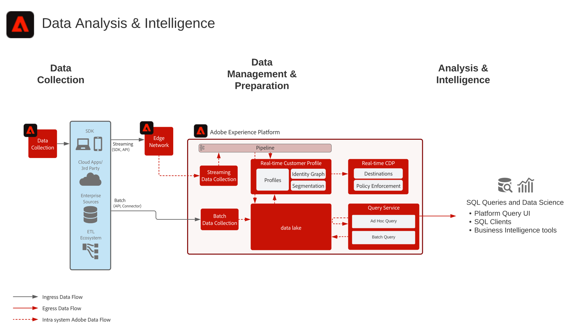

# Dataanalys och informationsutkast

Dataanalys och intelligens omfattar möjligheten inom Adobe Experience Platform att utföra experimentella frågor och analyser av data som finns i sjön.

Experience Platform [!UICONTROL Frågetjänst] gör att SQL-frågor kan utföras på data.

Experience Platform tillåter anslutningar med SQL-klienter, gränssnitt och Business Intelligence-verktyg (BI) från tredje part för att direkt ansluta till, få åtkomst till och fråga data i Experience Platform med [!DNL PostgreSQL] -protokoll.

## Användningsexempel

* Interaktiv fråga och sammanställning av data
* Rad- och kolumnåtkomst till inmatade data för utforskning och validering
* Instrumentpaneler och visualisering av data via verktyg för Business Intelligence

Fler vanliga användningsexempel för frågetjänsten beskrivs här [Användningsexempel för frågetjänst](https://experienceleague.adobe.com/docs/experience-platform/query/use-cases/abandoned-browse.html)

## Program

* Adobe Experience Platform

## Arkitektur

## Guardrails

Läs produktdokumentationen för frågetjänsten för mer information om bästa praxis och skyddsanvisningar.
[Vägledning för frågetjänst](https://experienceleague.adobe.com/docs/experience-platform/query/guardrails.html)

## Implementeringssteg

1. [Skapa scheman](https://experienceleague.adobe.com/?recommended=ExperiencePlatform-D-1-2021.1.xdm) för data som ska importeras.
1. [Skapa datauppsättningar](https://experienceleague.adobe.com/docs/platform-learn/tutorials/data-ingestion/create-datasets-and-ingest-data.html) för data som ska importeras.
1. [Ingrediera data](https://experienceleague.adobe.com/?recommended=ExperiencePlatform-D-1-2020.1.dataingestion) till Experience Platform.
1. Bekräfta att data är tillgängliga för [[!UICONTROL Frågetjänst]](https://experienceleague.adobe.com/docs/platform-learn/tutorials/queries/explore-data.html?lang=en).
1. [Koppla samman Business Intelligence och SQL-klienter med [!UICONTROL Frågetjänst]](https://experienceleague.adobe.com/docs/experience-platform/query/clients/overview.html) för visualisering, datafrågor och utforskning.

## Relaterad dokumentation

* [Adobe Experience Platform Intelligence - produktbeskrivning](https://helpx.adobe.com/legal/product-descriptions/adobe-experience-platform-intelligence---product-description.html)
* [[!UICONTROL Frågetjänst] dokumentation](https://experienceleague.adobe.com/docs/experience-platform/query/home.html?lang=en)
