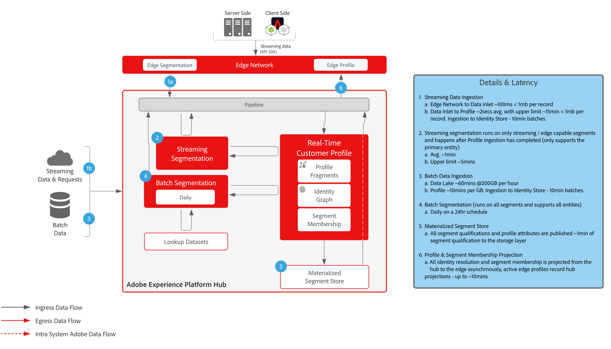
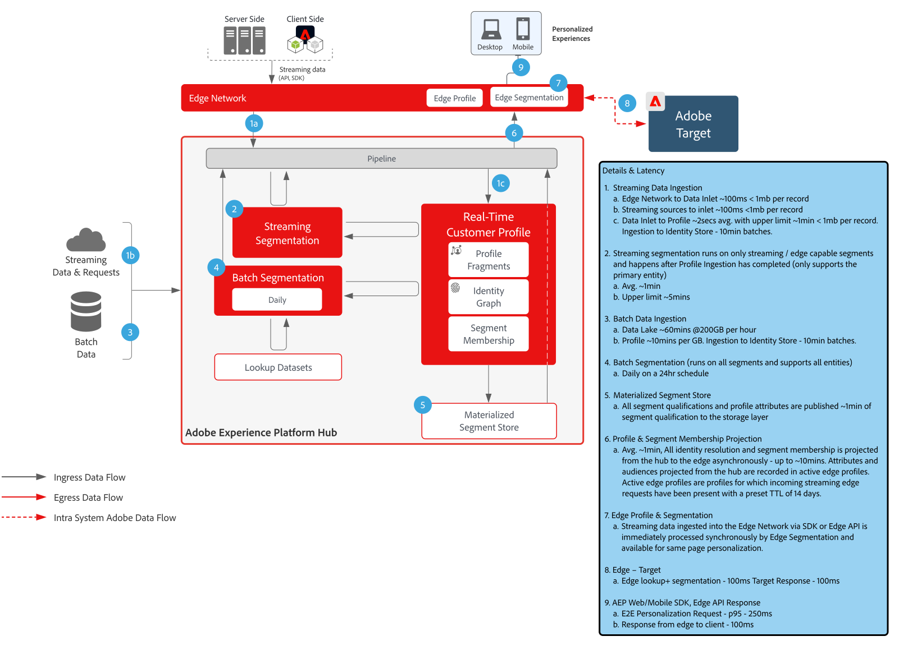
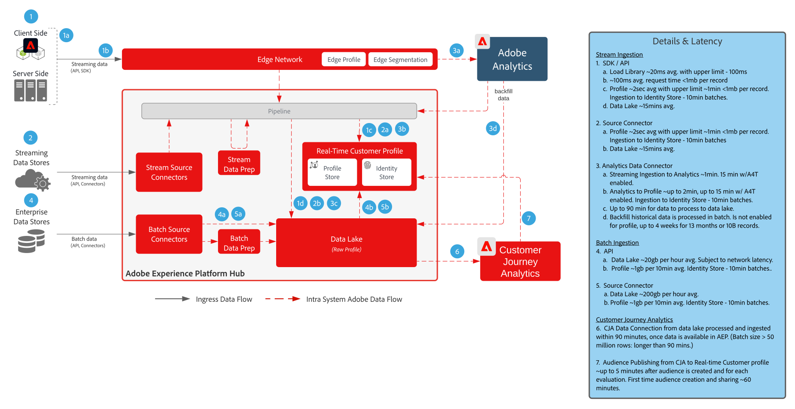
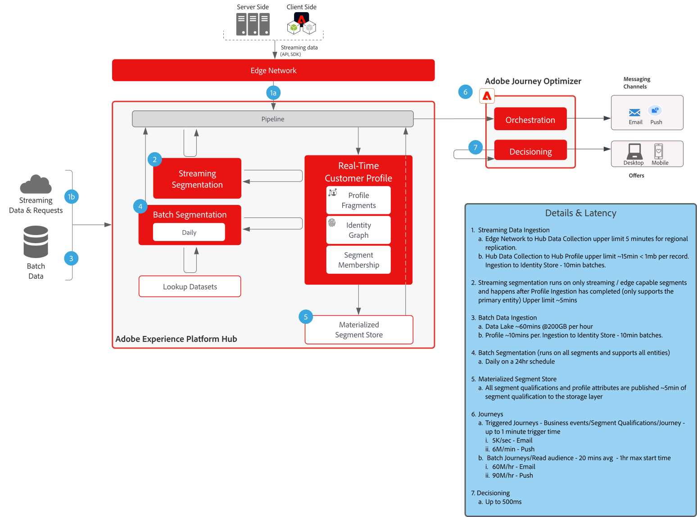

# Guardrails

Vi rekommenderar att du anger tröskelvärden som ger vägledning för data- och systemanvändning i Adobe Experience Platform och program. Garantierna speglar systembegränsningar och prestandaförväntningar för att optimera kundens arkitektur och använda fallissemang samt hjälper till att undvika fel och oväntade resultat. Garantier är inte avsedda att vara servicenivåavtal.

Information om specifika servicenivåavtal för program och funktioner finns i&quot;Program- och funktionsbeskrivningar&quot; längst ned på den här sidan.

## Referensdokumentation för säkerhetsutkast för Adobe Experience Platform och program

Följande sidor innehåller information om säkerhetsutkast för Adobe Experience Platform funktioner, tjänster och program:

[Skyddsförslag för dataöverföring](https://experienceleague.adobe.com/docs/experience-platform/ingestion/guardrails.html?lang=en)

[Guardrutor för Edge Network API](https://experienceleague.adobe.com/docs/experience-platform/edge-network-server-api/guardrails.html?lang=en)

[Guardrails för kundprofil i realtid](https://experienceleague.adobe.com/docs/experience-platform/profile/guardrails.html?lang=en)

[Identitetsgarantins](https://experienceleague.adobe.com/docs/experience-platform/identity/guardrails.html?lang=en)

[Customer Journey Analytics målgruppsdelningsgardiner](https://experienceleague.adobe.com/docs/analytics-platform/using/cja-components/audiences/publish.html?lang=en#latency)

[Customer Journey Analytics Data Ingtion Guardradrals](https://experienceleague.adobe.com/docs/experience-platform/sources/connectors/adobe-applications/analytics.html?lang=en#what-is-the-expected-latency-for-analytics-data-on-platform%3F)

[Frågetjänstens säkerhetsbeskrivningar](https://experienceleague.adobe.com/docs/experience-platform/query/guardrails.html?lang=en)

[Målaktiveringsskydd](https://experienceleague.adobe.com/docs/experience-platform/destinations/guardrails.html)

[Journey Optimizer Guardrails](https://experienceleague.adobe.com/docs/journey-optimizer/using/get-started/guardrails.html?lang=en)

 

## Latensdiagram från början till slut

### Intag av data

 

### Segmentering

 

### REAL-TIME CUSTOMER DATA PLATFORM &amp; ADOBE TARGET

 

### Customer Journey Analytics

 

### Journey Optimizer

 

## Program- och funktionsbeskrivningar

Mer information om funktionsspecifika servicenivåavtal finns i beskrivningarna nedan:

[Experience Platform Collection Enterprise](https://helpx.adobe.com/legal/product-descriptions/adobe-experience-platform-collection-enterprise.html)

[Real-time Customer Data Platform](https://helpx.adobe.com/legal/product-descriptions/real-time-customer-data-platform.html)

[B2B Customer Data Platform](https://helpx.adobe.com/legal/product-descriptions/adobe-experience-platform-b2b.html)

[Aktivering av Experience Platform](https://helpx.adobe.com/legal/product-descriptions/adobe-experience-platform0.html)

[Experience Platform Intelligence](https://helpx.adobe.com/legal/product-descriptions/adobe-experience-platform-intelligence---product-description.html)

[Intelligenta tjänster](https://helpx.adobe.com/legal/product-descriptions/intelligent-services.html)

[Data Distiller](https://helpx.adobe.com/legal/product-descriptions/data-distiller.html)

[Customer Journey Analytics](https://helpx.adobe.com/legal/product-descriptions/customer-journey-analytics.html)

[Journey Optimizer](https://helpx.adobe.com/legal/product-descriptions/adobe-journey-optimizer.html)

[Journey Orchestration](https://helpx.adobe.com/legal/product-descriptions/journey-orchestration.html)

[Offer decisioning](https://helpx.adobe.com/legal/product-descriptions/offer-decisioning-app-service.html)
