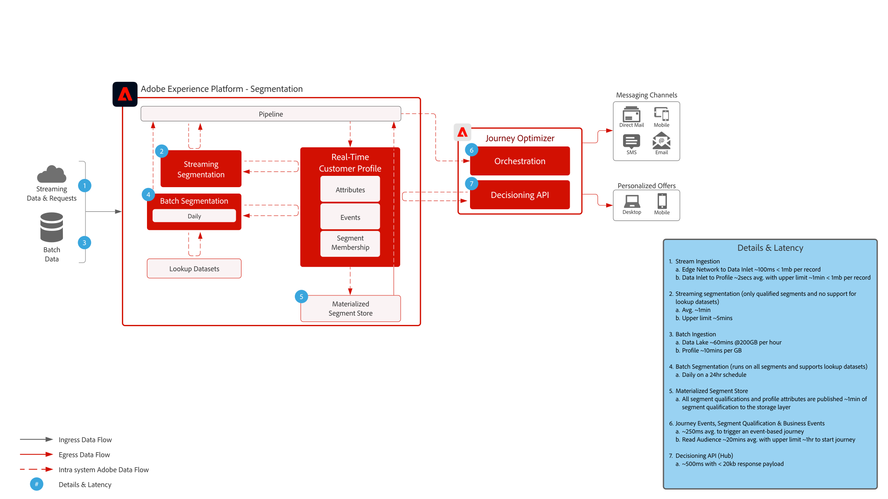

# Guardrails

Vi rekommenderar tröskelvärden som ger vägledning för data- och systemanvändning, optimering av prestanda och undvikande av fel eller oväntade resultat i Adobe Experience Platform och program. Garantier är avsedda att återspegla systembegränsningar och prestandaförväntningar för att underlätta kundens arkitektur och optimera fallprestanda. Garantier är inte avsedda att vara servicenivåavtal. Information om produktspecifika servicenivåavtal finns i produktbeskrivningsdokumentationen som är länkad nedan.

## Garardsutkast för Adobe Experience Platform och program

[Dataöverföringsskydd](https://experienceleague.adobe.com/docs/experience-platform/ingestion/guardrails.html?lang=en)

[Guardrutor för Edge Network API](https://experienceleague.adobe.com/docs/experience-platform/edge-network-server-api/guardrails.html?lang=en)

[Guardrails för kundprofil i realtid](https://experienceleague.adobe.com/docs/experience-platform/profile/guardrails.html?lang=en)

[Identitetsskydd](https://experienceleague.adobe.com/docs/experience-platform/identity/guardrails.html?lang=en)

[Frågetjänstmeddelanden](https://experienceleague.adobe.com/docs/experience-platform/query/guardrails.html?lang=en)

[Målaktiveringsskydd](https://experienceleague.adobe.com/docs/experience-platform/destinations/guardrails.html)

[Journey Optimizer Guardrails](https://experienceleague.adobe.com/docs/journey-optimizer/using/get-started/guardrails.html?lang=en)

 

## Slut till slut-svarstid

### Dataintag

Bilden nedan visar de genomsnittliga prestandagarantierna och latensen för dataöverföring till Adobe Experience Platform.

 

### Journey Optimizer

 

## Produktbeskrivningar

[Experience Platform Collection Enterprise](https://helpx.adobe.com/legal/product-descriptions/adobe-experience-platform-collection-enterprise.html)

[Real-time Customer Data Platform](https://helpx.adobe.com/legal/product-descriptions/real-time-customer-data-platform.html)

[B2B Customer Data Platform](https://helpx.adobe.com/legal/product-descriptions/adobe-experience-platform-b2b.html)

[Aktivering av Experience Platform](https://helpx.adobe.com/legal/product-descriptions/adobe-experience-platform0.html)

[Experience Platform Intelligence](https://helpx.adobe.com/legal/product-descriptions/adobe-experience-platform-intelligence---product-description.html)

[Intelligenta tjänster](https://helpx.adobe.com/legal/product-descriptions/intelligent-services.html)

[Customer Journey Analytics](https://helpx.adobe.com/legal/product-descriptions/customer-journey-analytics.html)

[Journey Optimizer](https://helpx.adobe.com/legal/product-descriptions/adobe-journey-optimizer.html)

[Journey Orchestration](https://helpx.adobe.com/legal/product-descriptions/journey-orchestration.html)

[offer decisioning](https://helpx.adobe.com/legal/product-descriptions/offer-decisioning-app-service.html)
