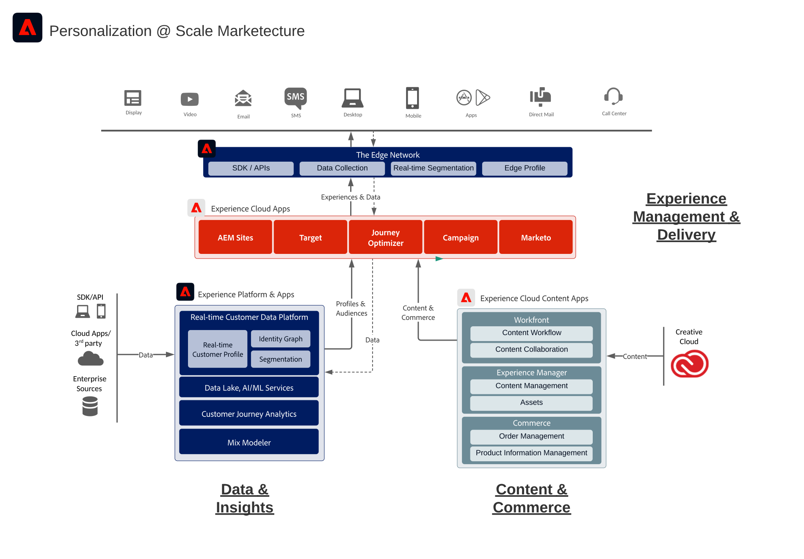

# Adobe Experience Cloud arkitekturdiagram

Diagrammen visar hur Experience Cloud program, applikationstjänster och Experience Platform passar in i företagets marknadsföringsarkitektur.

## Adobe Experience Cloud marketecture

Följande diagram visar de olika komponenterna i Adobe Experience Cloud för datainsikter och målgrupper, innehåll och Commerce, kundresor, arbetsflöde för marknadsföring, som är byggt och integrerat på grund av Adobe Experience Platform.

## Integreringsarkitektur för data och insikter, innehåll och handel samt leverans av upplevelser

Arkitekturdiagrammet nedan visar hur de olika komponenterna i Adobe Experience Cloud kan kopplas samman och integreras för att uppnå en personalisering i stor skala över data, innehåll och upplevelseleverans.

## Adobe Experience Cloud i företagslandskapet

Arkitekturen nedan visar hur Adobe Experience Cloud-program och Adobe Experience Platform passar in i en arkitektur för kundupplevelser i ett företag inom de fyra kategorierna Data, Insights, Orchestration och Engagement.

