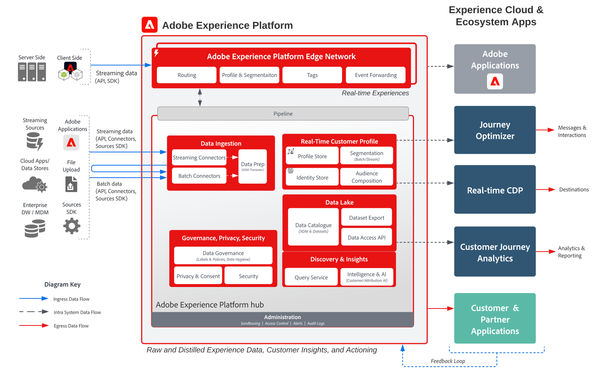

# Adobe Experience Platform och programarkitekturdiagram

Dessa arkitekturdiagram visar hur Experience Platform (AEP) relaterar till andra Experience Cloud-program och -programtjänster.

>[!MORELIKETHIS]
>
>[Integrationskonfigurationer för Experience Cloud-programintegreringar](https://experienceleague.adobe.com/docs/integrations-learn/experience-cloud/overview.html?lang=sv-SE).

## Arkitektur

Arkitekturen visar hur Adobe Experience Platform relaterar till Adobe Experience Cloud program och programtjänster.

## Översiktsdiagram

## Detaljerat arkitekturdiagram

>[!VIDEO](https://video.tv.adobe.com/v/3432346/?quality=12&learn=on&captions=swe)

## Programintegreringar med AEP och Experience Cloud

| Program | Experience Platform till program | Program till Experience Platform |
|------------------------------|-----------------------------------|-----------------------------------|
| **Ad Cloud** | - Målgrupper som definieras i kunddataplattformen i realtid kan delas med Ad Cloud för målgruppsanpassning via Audience Manager. | - Ingen aktuell integrering |
| **Analyser** | - Data som samlas in via SDK för webben/mobiler kan vidarebefordras till Adobe Analytics. | - Data som samlas in av Analytics kan skickas till Experience Platform datasjön och profilbutik. [Dataanslutning för analys](https://experienceleague.adobe.com/docs/experience-platform/sources/connectors/adobe-applications/analytics.html?lang=sv-SE) |
| **Audience Manager** | - Målgrupper som definieras i kunddataplattformen i realtid kan delas med Audience Manager för aktivering till cookie-destinationer från tredje part. | - Data som samlas in och utvärderas tillsammans med målgruppsmedlemskap från Audience Manager kan delas med Experience Platform datasjöer och fillager. [Audience Manager Source Connector](https://experienceleague.adobe.com/docs/experience-platform/sources/connectors/adobe-applications/audience-manager.html?lang=sv-SE) |
| **Adobe Campaign** | - Målgrupper som definieras i kunddataplattformen i realtid kan delas med Campaign Classic för att initiera kampanjer. | - Interaktions- och kampanjdata som samlas in av Campaign kan hämtas till Experience Platform för ytterligare användning i målgruppsbyggnad, Customer Journey Analytics och Query Service. |
| **Campaign Standard** | - Målgrupper som definieras i kunddataplattformen i realtid kan delas med Campaign Standard för att initiera kampanjer. | - Interaktions- och kampanjdata som samlas in av Campaign kan importeras till Experience Platform för vidare användning. |
| **Customer Journey Analytics** | - Data som samlas in och importeras till Experience Platform datasjön kan bearbetas i Customer Journey Analytics.   - Profil- och målgruppsdata från kunddataplattformen i realtid kan hämtas till CJA. [Integrering mellan RTCDP och CJA](https://experienceleague.adobe.com/docs/analytics-platform/using/cja-usecases/ingest-aep-segments.html?lang=sv-SE) | - Bygg målgrupper i CJA och dela målgruppsresultat med kunddataplattformen i realtid. [CJA Audience Publishing](https://experienceleague.adobe.com/docs/analytics-platform/using/cja-components/audiences/publish.html?lang=sv-SE) |
| **Experience Manager** | - Experience Platform-profilen kan användas på serversidan för personaliserade upplevelser i Experience Manager. | - Ingen aktuell integrering, interaktioner som utförs på Experience Manager webbplatser samlas in via Experience Platform Web och Mobile SDK. |
| **Journey Optimizer** | - Datahändelser och profiler som hämtas in till Experience Platform görs tillgängliga för Journey Optimizer. | - Interaktions- och kampanjdata från Journey Optimizer samlas in i Experience Platform för vidare användning. |
| **Adobe Commerce** | - Profiler och målgrupper som är inbyggda i kunddataplattformen i realtid kan användas för personalisering i Adobe Commerce. | - Data som är inbyggda i Adobe Commerce kan skickas till Experience Platform via en Adobe Commerce-källanslutning. |
| **Marketo** | - Målgrupper som definieras i kunddataplattformen i realtid kan delas med Marketo för att initiera kampanjer och uppdatera objekt. | - Marketo konton, kontakter och kampanjdata hämtas till Experience Platform för ytterligare analys. [Marketo Engage Connector](https://experienceleague.adobe.com/docs/experience-platform/sources/connectors/adobe-applications/marketo/marketo.html?lang=sv-SE) |
| **Real-Time CDP** | - Data som hämtas in till Experience Platform är källan för kundprofiler i realtid som driver kunddataplattformen i realtid. | - Mått på målgrupp och profil skickas till Experience Platform datasjön för insikter. |
| **Mål** | - Målgrupper och profilattribut från kunddataplattformen i realtid kan delas med Target för personalisering. | - Data som samlas in för Target-upplevelser kan skickas till Experience Platform för målgruppsutveckling och -analys. |
