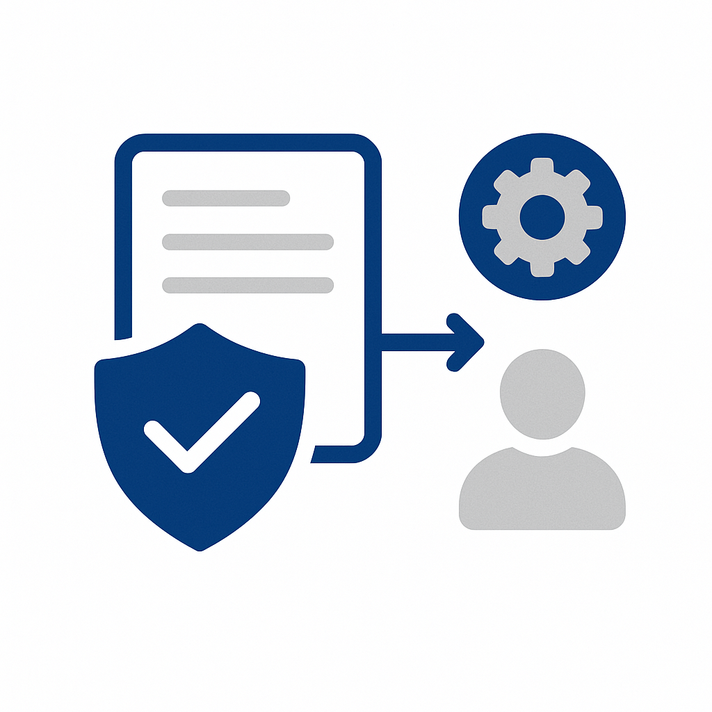
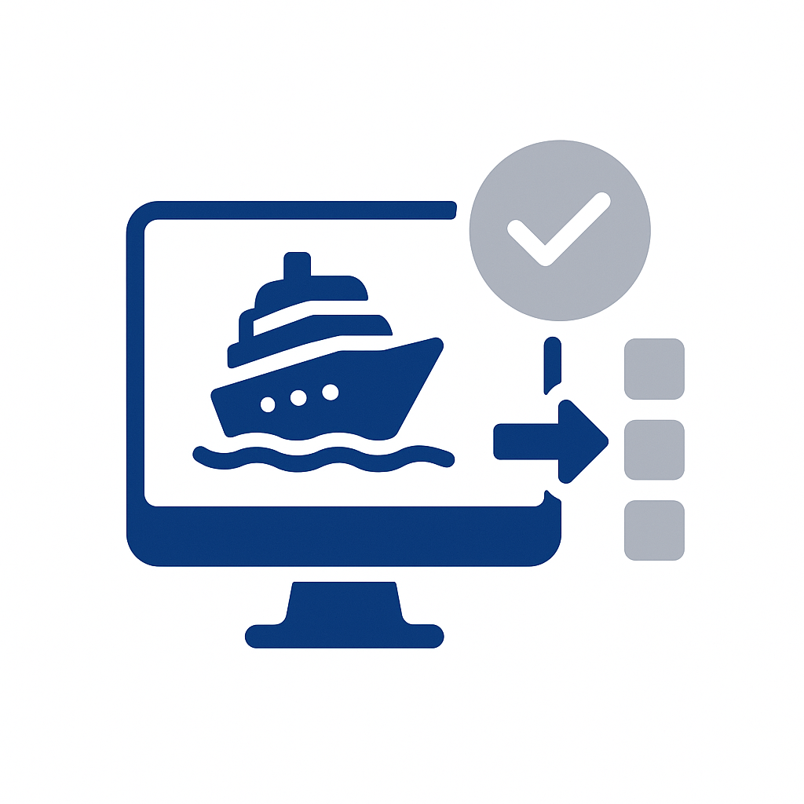
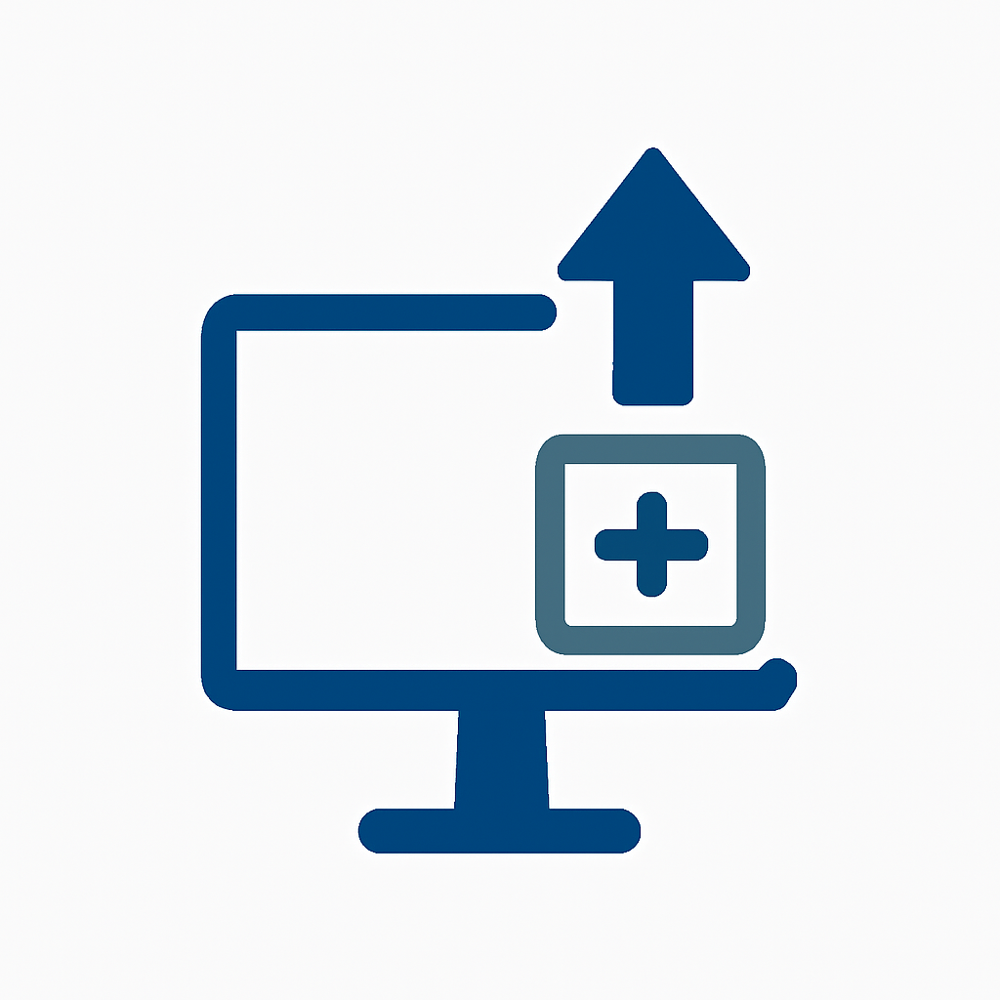

# Använd fallkatalog

Utforska beprövade användningsexempel i olika branscher för att snabba upp implementeringen av [!DNL Adobe Experience Platform]. Bläddra efter bransch-vertikalt för att hitta användningsfall som är relevanta för din verksamhet, efter mognadsnivå för att matcha organisationens beredskap eller efter implementeringsmönster för att förstå den tekniska metoden.

## Bläddra efter bransch

>[!BEGINTABS]

>[!TAB Detaljhandel]

| | Användningsfall | Beskrivning | Löptid | Mönster |
| --- | --- | --- | --- | --- |
|  | [Återställning av övergiven e-post för kundvagn](retail/retail-overview.md#abandoned-cart-email-recovery) | Skicka personliga påminnelser för övergivna kundvagnar | [!BADGE Foundational]{type=Neutral} | [Meddelanden som utlösts av händelser](/help/blueprints/use-case-patterns/campaign-management-orchestration/event-triggered-messaging.md) |
|  | [Lagerbaserade nödkampanjer](retail/retail-overview.md#inventory-based-urgency-campaigns) | Utlös varningar i realtid när produktlagret är lågt | [!BADGE Foundational]{type=Neutral} | [Meddelanden som utlösts av händelser](/help/blueprints/use-case-patterns/campaign-management-orchestration/event-triggered-messaging.md) |
|  | [Varningar om prisfall](retail/retail-overview.md#price-drop-alerts) | Meddela kunderna när önskelistan eller visade objekt sjunker till priset | [!BADGE Foundational]{type=Neutral} | [Meddelanden som utlösts av händelser](/help/blueprints/use-case-patterns/campaign-management-orchestration/event-triggered-messaging.md) |
| | [Aviseringar som inte finns i lager](retail/retail-overview.md#out-of-stock-notifications) | Meddela kunderna när färdiga produkter blir tillgängliga | [!BADGE Foundational]{type=Neutral} | [Meddelanden som utlösts av händelser](/help/blueprints/use-case-patterns/campaign-management-orchestration/event-triggered-messaging.md) |
|  | [Personaliserade produktrekommendationer](retail/retail-overview.md#personalized-product-recommendations) | Visa personaliserade produkter baserat på bläddring och inköpshistorik | [!BADGE Nya]{type=Informative} | [Beteenderekommendation](/help/blueprints/use-case-patterns/personalization/behavioral-recommendation.md) |
|  | [Anpassade kategorisidor](retail/retail-overview.md#personalized-category-pages) | Ändra ordning på kategorisidor dynamiskt baserat på kundönskemål | [!BADGE Nya]{type=Informative} | [Beteenderekommendation](/help/blueprints/use-case-patterns/personalization/behavioral-recommendation.md) |
|  | [Nya välkomstserier för kunder](retail/retail-overview.md#new-customer-welcome-series) | Automatisera välkomstserier med flera e-postmeddelanden med personaliserade rekommendationer | [!BADGE Nya]{type=Informative} | [Samlad resa i flera steg](/help/blueprints/use-case-patterns/campaign-management-orchestration/multi-step-orchestrated-journey.md) |
|  | [Påfyllnadspåminnelser](retail/retail-overview.md#replenishment-reminders) | Skicka automatiska påminnelser för konsumtionsartiklar som köpts regelbundet | [!BADGE Nya]{type=Informative} | [Samlad resa i flera steg](/help/blueprints/use-case-patterns/campaign-management-orchestration/multi-step-orchestrated-journey.md) |
|  | [Uppföljningskampanjer efter köp](retail/retail-overview.md#post-purchase-follow-up-campaigns) | Skicka tips, förfrågningar och relaterade produktförslag | [!BADGE Nya]{type=Informative} | [Samlad resa i flera steg](/help/blueprints/use-case-patterns/campaign-management-orchestration/multi-step-orchestrated-journey.md) |
| | [Socialt korrektur av Personalization](retail/retail-overview.md#social-proof-personalization) | Visa anpassade recensioner och omdömen baserat på kundprofil | [!BADGE Nya]{type=Informative} | [Known-Visitor Web/App Personalization](/help/blueprints/use-case-patterns/personalization/known-visitor-web-app-personalization.md) |
|  | [Korsförsäljning och merförsäljning - rekommendationer](retail/retail-overview.md#cross-sell-and-upsell-recommendations) | Visa relevanta korsförsäljnings- och merförsäljningsprodukter i kassan och via e-post | [!BADGE Avancerat]{type=Caution} | [Offer Decisioning](/help/blueprints/use-case-patterns/personalization/offer-decisioning.md) |
| | [Exklusiva erbjudanden för VIP-kunder](retail/retail-overview.md#vip-customer-exclusive-offers) | Ge exklusiva erbjudanden och tidig åtkomst till värdefulla kunder | [!BADGE Avancerat]{type=Caution} | [Flerkanalsresor med beslut](/help/blueprints/use-case-patterns/campaign-management-orchestration/cross-channel-journey-with-decisioning.md) |

>[!TAB Automatisering]

| | Användningsfall | Beskrivning | Löptid | Mönster |
| --- | --- | --- | --- | --- |
|  | [Påminnelser om tjänstavtalad tid](automotive/automotive-overview.md#service-appointment-reminders) | Skicka personliga påminnelser om tjänster baserat på fordonets milkostnad och servicehistorik | [!BADGE Foundational]{type=Neutral} | [Meddelanden som utlösts av händelser](/help/blueprints/use-case-patterns/campaign-management-orchestration/event-triggered-messaging.md) |
|  | [Meddelanden om fordonsåterkallande](automotive/automotive-overview.md#vehicle-recall-notifications) | Skicka personaliserade meddelanden om återkallande med alternativ för tjänstplanering | [!BADGE Foundational]{type=Neutral} | [Meddelanden som utlösts av händelser](/help/blueprints/use-case-patterns/campaign-management-orchestration/event-triggered-messaging.md) |
|  | [Schemaläggning av testenhet](automotive/automotive-overview.md#test-drive-scheduling) | Aktivera anpassad schemaläggning av testkörning med återförsäljarrekommendationer | [!BADGE Foundational]{type=Neutral} | [Meddelanden som utlösts av händelser](/help/blueprints/use-case-patterns/campaign-management-orchestration/event-triggered-messaging.md) |
|  | [Nya startkampanjer för modeller](automotive/automotive-overview.md#new-model-launch-campaigns) | Rikta er till kunder som är intresserade av nya modeller baserade på nuvarande fordon och preferenser | [!BADGE Foundational]{type=Neutral} | [Aktivera utgående batchmeddelande](/help/blueprints/use-case-patterns/campaign-management-orchestration/batch-outbound-message-activation.md) |
|  | [Värdekampanjer för handel](automotive/automotive-overview.md#trade-in-value-campaigns) | Erbjud proaktivt värdebedömningar till kunder som är redo att uppgradera | [!BADGE Nya]{type=Informative} | [Samlad resa i flera steg](/help/blueprints/use-case-patterns/campaign-management-orchestration/multi-step-orchestrated-journey.md) |
|  | [Rekommendationer för delar och tillbehör](automotive/automotive-overview.md#parts-and-accessories-recommendations) | Rekommendera delar och tillbehör baserat på fordonsmodell och ägarskapstid | [!BADGE Nya]{type=Informative} | [Beteenderekommendation](/help/blueprints/use-case-patterns/personalization/behavioral-recommendation.md) |
|  | [Garantier och utökade serviceplaner](automotive/automotive-overview.md#warranty-and-extended-service-plans) | Rekommendera garanti- och serviceplaner vid optimala tidpunkter baserat på fordonets ålder | [!BADGE Nya]{type=Informative} | [Samlad resa i flera steg](/help/blueprints/use-case-patterns/campaign-management-orchestration/multi-step-orchestrated-journey.md) |
|  | [Aktivering av kopplad bilfunktion](automotive/automotive-overview.md#connected-car-feature-activation) | Rekommendationer för att anpassa anslutna bilar baserat på fordonets kapacitet | [!BADGE Nya]{type=Informative} | [Samlad resa i flera steg](/help/blueprints/use-case-patterns/campaign-management-orchestration/multi-step-orchestrated-journey.md) |
|  | [Nätverkssamordning för återförsäljare](automotive/automotive-overview.md#dealer-network-coordination) | Aktivera anpassade återförsäljarrekommendationer baserat på plats och inställningar | [!BADGE Nya]{type=Informative} | [Known-Visitor Web/App Personalization](/help/blueprints/use-case-patterns/personalization/known-visitor-web-app-personalization.md) |
|  | [Purchase Journey Personalization](automotive/automotive-overview.md#vehicle-purchase-journey-personalization) | Personalisera fordonets inköpsresa från forskning till inköp | [!BADGE Avancerat]{type=Caution} | [Flerkanalsresor med beslut](/help/blueprints/use-case-patterns/campaign-management-orchestration/cross-channel-journey-with-decisioning.md) |
|  | [Erbjudanden om finansiering och försäkring](automotive/automotive-overview.md#financing-and-insurance-offers) | Presentera personliga finansierings- och försäkringserbjudanden baserat på kreditprofil | [!BADGE Avancerat]{type=Caution} | [Offer Decisioning](/help/blueprints/use-case-patterns/personalization/offer-decisioning.md) |
|  | [Lojalitetsprogram för ägare](automotive/automotive-overview.md#owner-loyalty-programs) | Anpassa kundlojalitetskommunikation, belöningar och exklusiva erbjudanden utifrån ägarskapshistorik | [!BADGE Avancerat]{type=Caution} | [Flerkanalsresor med beslut](/help/blueprints/use-case-patterns/campaign-management-orchestration/cross-channel-journey-with-decisioning.md) |

>[!TAB Finansiella tjänster]

| | Användningsfall | Beskrivning | Löptid | Mönster |
| --- | --- | --- | --- | --- |
| | [Transaktionsbaserade aviseringar och rekommendationer](financial-services/financial-services-overview.md#transaction-based-alerts-and-recommendations) | Skicka aviseringar i realtid om transaktioner och personaliserade rekommendationer | [!BADGE Foundational]{type=Neutral} | [Meddelanden som utlösts av händelser](/help/blueprints/use-case-patterns/campaign-management-orchestration/event-triggered-messaging.md) |
| | [Återvinning av kreditkortsansökningar](financial-services/financial-services-overview.md#credit-card-application-abandonment-recovery) | Återengagera kunder som startade men inte slutförde kreditkortsansökningar | [!BADGE Foundational]{type=Neutral} | [Meddelanden som utlösts av händelser](/help/blueprints/use-case-patterns/campaign-management-orchestration/event-triggered-messaging.md) |
| | [Bedrägerivarning Personalization](financial-services/financial-services-overview.md#fraud-alert-personalization) | Personalisera bedrägerivarningar och säkerhetskommunikation efter kundens önskemål | [!BADGE Foundational]{type=Neutral} | [Meddelanden som utlösts av händelser](/help/blueprints/use-case-patterns/campaign-management-orchestration/event-triggered-messaging.md) |
|  | [Ledarutbildning med högt värde](financial-services/financial-services-overview.md#high-value-lead-nurturing) | Identifiera värdefulla presumtiva kunder och vårda med personaliserat innehåll och erbjudanden | [!BADGE Nya]{type=Informative} | [Samlad resa i flera steg](/help/blueprints/use-case-patterns/campaign-management-orchestration/multi-step-orchestrated-journey.md) |
|  | [Kontrollpanel för anpassat konto](financial-services/financial-services-overview.md#personalized-account-dashboard) | Anpassa instrumentpanelen för onlinebanktjänster baserat på kontoaktivitet och ekonomiska mål | [!BADGE Nya]{type=Informative} | [Known-Visitor Web/App Personalization](/help/blueprints/use-case-patterns/personalization/known-visitor-web-app-personalization.md) |
| | [Investera Portfolio-rekommendationer](financial-services/financial-services-overview.md#investment-portfolio-recommendations) | Tillhandahålla personaliserade investeringsrekommendationer baserade på riskprofil och mål | [!BADGE Nya]{type=Informative} | [Beteenderekommendation](/help/blueprints/use-case-patterns/personalization/behavioral-recommendation.md) |
| | [Förauktoriseringskampanjer för lån](financial-services/financial-services-overview.md#mortgage-pre-approval-campaigns) | Målgrupper för kunder som på marknaden kan tänkas få en inteckning baserad på profil och livsfas | [!BADGE Nya]{type=Informative} | [Samlad resa i flera steg](/help/blueprints/use-case-patterns/campaign-management-orchestration/multi-step-orchestrated-journey.md) |
|  | [Produktrekommendation för befintliga kunder](financial-services/financial-services-overview.md#product-recommendation-for-existing-customers) | Rekommendera relevanta finansiella produkter baserat på profil, transaktioner och livscykelstadium | [!BADGE Avancerat]{type=Caution} | [Offer Decisioning](/help/blueprints/use-case-patterns/personalization/offer-decisioning.md) |
|  | [Kampanjer för att förebygga skador](financial-services/financial-services-overview.md#churn-prevention-campaigns) | Identifiera riskkunder med AI-baserad förutsägelse och engagera med lojalitetserbjudanden | [!BADGE Avancerat]{type=Caution} | [Flerkanalsresor med beslut](/help/blueprints/use-case-patterns/campaign-management-orchestration/cross-channel-journey-with-decisioning.md) |
|  | [Produkterbjudanden baserade på livscykelstadium](financial-services/financial-services-overview.md#life-stage-based-product-offers) | Identifiera kunder i nya livsstadier och erbjud relevanta finansiella produkter | [!BADGE Avancerat]{type=Caution} | [Flerkanalsresor med beslut](/help/blueprints/use-case-patterns/campaign-management-orchestration/cross-channel-journey-with-decisioning.md) |
| | [Lojalitetsprogramengagemang](financial-services/financial-services-overview.md#loyalty-program-engagement) | Personalisera kundlojalitetskommunikation, belöningar och erbjudanden per nivå och historik | [!BADGE Avancerat]{type=Caution} | [Flerkanalsresor med beslut](/help/blueprints/use-case-patterns/campaign-management-orchestration/cross-channel-journey-with-decisioning.md) |
| | [Personaliserat innehåll för ekonomisk utbildning](financial-services/financial-services-overview.md#personalized-financial-education-content) | Leverera skräddarsydd finansiell utbildning baserat på kundprofil och intressen | [!BADGE Avancerat]{type=Caution} | [Flerkanalsresor med beslut](/help/blueprints/use-case-patterns/campaign-management-orchestration/cross-channel-journey-with-decisioning.md) |

>[!TAB Hälsovård]

| | Användningsfall | Beskrivning | Löptid | Mönster |
| --- | --- | --- | --- | --- |
|  | [Påminnelse om avtalad tid, automatisering](healthcare/healthcare-overview.md#appointment-reminder-automation) | Skicka personliga påminnelser om möten via de kommunikationskanaler du föredrar | [!BADGE Foundational]{type=Neutral} | [Meddelanden som utlösts av händelser](/help/blueprints/use-case-patterns/campaign-management-orchestration/event-triggered-messaging.md) |
|  | [Efterbesök Uppföljningskampanjer](healthcare/healthcare-overview.md#post-visit-follow-up-campaigns) | Skicka enkäter efter besök, omvårdnadsinstruktioner och påminnelser om uppföljningar av möten | [!BADGE Foundational]{type=Neutral} | [Meddelanden som utlösts av händelser](/help/blueprints/use-case-patterns/campaign-management-orchestration/event-triggered-messaging.md) |
| | [Meddelande om Lab-resultat](healthcare/healthcare-overview.md#lab-results-notification) | Meddela patienterna när labbresultaten finns tillgängliga via den kanal de föredrar | [!BADGE Foundational]{type=Neutral} | [Meddelanden som utlösts av händelser](/help/blueprints/use-case-patterns/campaign-management-orchestration/event-triggered-messaging.md) |
| | [Verifiering av försäkringsskydd](healthcare/healthcare-overview.md#insurance-coverage-verification) | Kontrollera och informera om försäkringsskydd före tillsättningen | [!BADGE Foundational]{type=Neutral} | [Meddelanden som utlösts av händelser](/help/blueprints/use-case-patterns/campaign-management-orchestration/event-triggered-messaging.md) |
| | [Påminnelser om telefonhälsoavtalad tid](healthcare/healthcare-overview.md#telehealth-appointment-reminders) | Skicka personliga påminnelser för telefonmöten med anslutningsinstruktioner | [!BADGE Foundational]{type=Neutral} | [Meddelanden som utlösts av händelser](/help/blueprints/use-case-patterns/campaign-management-orchestration/event-triggered-messaging.md) |
|  | [Påminnelser om förebyggande vård](healthcare/healthcare-overview.md#preventive-care-reminders) | Påminn patienter om rekommenderad förebyggande vård baserad på ålder och anamnes | [!BADGE Foundational]{type=Neutral} | [Aktivera utgående batchmeddelande](/help/blueprints/use-case-patterns/campaign-management-orchestration/batch-outbound-message-activation.md) |
|  | [Kampanjer för läkemedelsöverensstämmelse](healthcare/healthcare-overview.md#medication-adherence-campaigns) | Skicka personliga påminnelser för att hjälpa patienterna att hålla sig à jour med mediciner | [!BADGE Nya]{type=Informative} | [Samlad resa i flera steg](/help/blueprints/use-case-patterns/campaign-management-orchestration/multi-step-orchestrated-journey.md) |
| | [Program för hantering av kroniska sjukdomar](healthcare/healthcare-overview.md#chronic-disease-management-programs) | Anpassa kommunikationen om hantering av kroniska sjukdomar och övervaka påminnelser | [!BADGE Nya]{type=Informative} | [Samlad resa i flera steg](/help/blueprints/use-case-patterns/campaign-management-orchestration/multi-step-orchestrated-journey.md) |
| | [Ny introduktionsresa för patienter](healthcare/healthcare-overview.md#new-patient-onboarding-journey) | Automatisera introduktion i flera steg med välkomstinformation, portalåtkomst och schemaläggning | [!BADGE Nya]{type=Informative} | [Samlad resa i flera steg](/help/blueprints/use-case-patterns/campaign-management-orchestration/multi-step-orchestrated-journey.md) |
| | [Wellness Program Engagement](healthcare/healthcare-overview.md#wellness-program-engagement) | Anpassa kommunikationen, utmaningarna och belöningarna för välkända program | [!BADGE Nya]{type=Informative} | [Samlad resa i flera steg](/help/blueprints/use-case-patterns/campaign-management-orchestration/multi-step-orchestrated-journey.md) |
| | [Samordning av vårdteam](healthcare/healthcare-overview.md#care-team-coordination) | Möjliggör personaliserad kommunikation mellan patienter och deras vårdteam | [!BADGE Nya]{type=Informative} | [Samlad resa i flera steg](/help/blueprints/use-case-patterns/campaign-management-orchestration/multi-step-orchestrated-journey.md) |
| | [Personaliserat hälsoinnehåll](healthcare/healthcare-overview.md#personalized-health-content-delivery) | Leverera skräddarsytt hälsoutbildningsmaterial | [!BADGE Avancerat]{type=Caution} | [Flerkanalsresor med beslut](/help/blueprints/use-case-patterns/campaign-management-orchestration/cross-channel-journey-with-decisioning.md) |

>[!TAB Försäkring]

| | Användningsfall | Beskrivning | Löptid | Mönster |
| --- | --- | --- | --- | --- |
|  | [Kampanjer för policyförnyelse](insurance/insurance-overview.md#policy-renewal-campaigns) | Skicka påminnelser och erbjudanden om personaliserad förnyelse | [!BADGE Foundational]{type=Neutral} | [Meddelanden som utlösts av händelser](/help/blueprints/use-case-patterns/campaign-management-orchestration/event-triggered-messaging.md) |
| | [Meddelanden om principändringar](insurance/insurance-overview.md#policy-change-notifications) | Skicka personaliserade meddelanden om policyändringar och disponeringsuppdateringar | [!BADGE Foundational]{type=Neutral} | [Meddelanden som utlösts av händelser](/help/blueprints/use-case-patterns/campaign-management-orchestration/event-triggered-messaging.md) |
| | [Återställning av offertavhopp](insurance/insurance-overview.md#quote-abandonment-recovery) | Återengagera kunder som startade men inte slutförde en försäkringsoffert | [!BADGE Foundational]{type=Neutral} | [Meddelanden som utlösts av händelser](/help/blueprints/use-case-patterns/campaign-management-orchestration/event-triggered-messaging.md) |
| | [Förebyggande av anspråksbedrägerier](insurance/insurance-overview.md#claims-fraud-prevention) | Använd intelligent bedrägeriidentifiering för att identifiera misstänkta anspråksmönster | [!BADGE Foundational]{type=Neutral} | [Meddelanden som utlösts av händelser](/help/blueprints/use-case-patterns/campaign-management-orchestration/event-triggered-messaging.md) |
| | [Katastrofisk händelse, svar](insurance/insurance-overview.md#catastrophic-event-response) | Proaktivt kommunicera med kunder i drabbade områden under naturkatastrofer | [!BADGE Foundational]{type=Neutral} | [Meddelanden som utlösts av händelser](/help/blueprints/use-case-patterns/campaign-management-orchestration/event-triggered-messaging.md) |
| | [Samordning för agent och mäklare](insurance/insurance-overview.md#agent-and-broker-coordination) | Möjliggör personlig kommunikation mellan kunder och tilldelade agenter | [!BADGE Foundational]{type=Neutral} | [Aktivera utgående batchmeddelande](/help/blueprints/use-case-patterns/campaign-management-orchestration/batch-outbound-message-activation.md) |
|  | [Anspråksprocessen Personalization](insurance/insurance-overview.md#claims-process-personalization) | Anpassa kundförfrågningar, statusuppdateringar och supportresurser | [!BADGE Nya]{type=Informative} | [Samlad resa i flera steg](/help/blueprints/use-case-patterns/campaign-management-orchestration/multi-step-orchestrated-journey.md) |
| | [Riskbedömning och förebyggande](insurance/insurance-overview.md#risk-assessment-and-prevention) | Tillhandahålla personaliserad riskbedömningsinformation och förebyggande tips | [!BADGE Nya]{type=Informative} | [Samlad resa i flera steg](/help/blueprints/use-case-patterns/campaign-management-orchestration/multi-step-orchestrated-journey.md) |
| | [Program för välbefinnande och förebyggande](insurance/insurance-overview.md#wellness-and-prevention-programs) | Anpassa kommunikationen och belöningen för välgörenhetsprogram för försäkringskunder | [!BADGE Nya]{type=Informative} | [Samlad resa i flera steg](/help/blueprints/use-case-patterns/campaign-management-orchestration/multi-step-orchestrated-journey.md) |
|  | [Produktrekommendationer för korsförsäljning](insurance/insurance-overview.md#cross-sell-product-recommendations) | Rekommendera ytterligare försäkringsprodukter baserade på befintliga försäkringsavtal och livscykelstadiet | [!BADGE Avancerat]{type=Caution} | [Offer Decisioning](/help/blueprints/use-case-patterns/personalization/offer-decisioning.md) |
| | [Produkterbjudanden baserade på livscykelstadium](insurance/insurance-overview.md#life-stage-based-product-offers) | Identifiera kunder som kommer in i nya livsstadier och erbjuda relevanta försäkringsprodukter | [!BADGE Avancerat]{type=Caution} | [Flerkanalsresor med beslut](/help/blueprints/use-case-patterns/campaign-management-orchestration/cross-channel-journey-with-decisioning.md) |
| | [Rabatt och besparingar](insurance/insurance-overview.md#discount-and-savings-opportunities) | Identifiera och informera om anpassade rabattmöjligheter | [!BADGE Avancerat]{type=Caution} | [Offer Decisioning](/help/blueprints/use-case-patterns/personalization/offer-decisioning.md) |

>[!TAB Media och underhållning]

| | Användningsfall | Beskrivning | Löptid | Mönster |
| --- | --- | --- | --- | --- |
|  | [Meddelanden om nya innehållsreleaser](media-entertainment/media-entertainment-overview.md#new-content-release-notifications) | Meddela prenumeranterna om nytt innehåll som matchar deras inställningar | [!BADGE Foundational]{type=Neutral} | [Meddelanden som utlösts av händelser](/help/blueprints/use-case-patterns/campaign-management-orchestration/event-triggered-messaging.md) |
| | [Påminnelser om bevakningslista och favoriter](media-entertainment/media-entertainment-overview.md#watchlist-and-favorites-reminders) | Skicka påminnelser om obevakat innehåll i bevakade listor | [!BADGE Foundational]{type=Neutral} | [Meddelanden som utlösts av händelser](/help/blueprints/use-case-patterns/campaign-management-orchestration/event-triggered-messaging.md) |
| | [Visa påminnelser om Live-händelser](media-entertainment/media-entertainment-overview.md#live-event-viewing-reminders) | Meddela användare om kommande live-event som matchar deras intressen | [!BADGE Foundational]{type=Neutral} | [Meddelanden som utlösts av händelser](/help/blueprints/use-case-patterns/campaign-management-orchestration/event-triggered-messaging.md) |
| | [Kampanjer för innehållsslutförande](media-entertainment/media-entertainment-overview.md#content-completion-campaigns) | Påminn användarna om att slutföra det innehåll de startat men inte slutfört | [!BADGE Foundational]{type=Neutral} | [Meddelanden som utlösts av händelser](/help/blueprints/use-case-patterns/campaign-management-orchestration/event-triggered-messaging.md) |
|  | [Innehållsrekommendationsmotor](media-entertainment/media-entertainment-overview.md#content-recommendation-engine) | Tillhandahåll personaliserade innehållsrekommendationer baserade på visningshistorik | [!BADGE Nya]{type=Informative} | [Beteenderekommendation](/help/blueprints/use-case-patterns/personalization/behavioral-recommendation.md) |
| | [Personlig hemsidesupplevelse](media-entertainment/media-entertainment-overview.md#personalized-homepage-experience) | Anpassa hemsidan dynamiskt för att visa det mest relevanta innehållet först | [!BADGE Nya]{type=Informative} | [Beteenderekommendation](/help/blueprints/use-case-patterns/personalization/behavioral-recommendation.md) |
| | [Skapa anpassade spellistor](media-entertainment/media-entertainment-overview.md#personalized-playlist-generation) | Generera spellistor automatiskt baserat på avlyssningshistorik och inställningar | [!BADGE Nya]{type=Informative} | [Beteenderekommendation](/help/blueprints/use-case-patterns/personalization/behavioral-recommendation.md) |
| | [Kostnadsfria testkonverteringskampanjer](media-entertainment/media-entertainment-overview.md#free-trial-conversion-campaigns) | Engagera användare av kostnadsfria testversioner med personaliserat innehåll och uppmuntra konvertering | [!BADGE Nya]{type=Informative} | [Samlad resa i flera steg](/help/blueprints/use-case-patterns/campaign-management-orchestration/multi-step-orchestrated-journey.md) |
| | [Synkronisering av innehåll på flera plattformar](media-entertainment/media-entertainment-overview.md#cross-platform-content-sync) | Skapa en smidig innehållsupplevelse på olika enheter med synkroniserade inställningar | [!BADGE Nya]{type=Informative} | [Known-Visitor Web/App Personalization](/help/blueprints/use-case-patterns/personalization/known-visitor-web-app-personalization.md) |
| | [Delning via sociala medier i Personalization](media-entertainment/media-entertainment-overview.md#social-sharing-personalization) | Anpassa uppmaningar om delning via sociala medier baserat på innehållsinställningar | [!BADGE Nya]{type=Informative} | [Known-Visitor Web/App Personalization](/help/blueprints/use-case-patterns/personalization/known-visitor-web-app-personalization.md) |
|  | [Förhindra prenumerationskanal](media-entertainment/media-entertainment-overview.md#subscription-churn-prevention) | Identifiera riskabonnenter och engagera med lojalitetserbjudanden | [!BADGE Avancerat]{type=Caution} | [Flerkanalsresor med beslut](/help/blueprints/use-case-patterns/campaign-management-orchestration/cross-channel-journey-with-decisioning.md) |
| | [Premium Feature Upsell](media-entertainment/media-entertainment-overview.md#premium-feature-upsell) | Identifiera användare som skulle kunna dra nytta av premiumfunktioner med personaliserade erbjudanden | [!BADGE Avancerat]{type=Caution} | [Offer Decisioning](/help/blueprints/use-case-patterns/personalization/offer-decisioning.md) |

>[!TAB Telekommunikation]

| | Användningsfall | Beskrivning | Löptid | Mönster |
| --- | --- | --- | --- | --- |
| | [Varningar och rekommendationer för dataanvändning](telecommunications/telecommunications-overview.md#data-usage-alerts-and-recommendations) | Skicka personaliserade aviseringar när kunderna närmar sig datagränserna | [!BADGE Foundational]{type=Neutral} | [Meddelanden som utlösts av händelser](/help/blueprints/use-case-patterns/campaign-management-orchestration/event-triggered-messaging.md) |
| | [Meddelanden om serviceutfall](telecommunications/telecommunications-overview.md#service-outage-notifications) | Meddela kunderna i förväg om avbrott i tjänsten | [!BADGE Foundational]{type=Neutral} | [Meddelanden som utlösts av händelser](/help/blueprints/use-case-patterns/campaign-management-orchestration/event-triggered-messaging.md) |
| | [Betalningspåminnelser](telecommunications/telecommunications-overview.md#bill-payment-reminders) | Skicka personliga betalningspåminnelser med betalningsalternativ | [!BADGE Foundational]{type=Neutral} | [Meddelanden som utlösts av händelser](/help/blueprints/use-case-patterns/campaign-management-orchestration/event-triggered-messaging.md) |
| | [5G uppgraderingskampanjer](telecommunications/telecommunications-overview.md#5g-upgrade-campaigns) | Målgrupper för kunder som är berättigade till 5G-uppgraderingar med personaliserade erbjudanden | [!BADGE Foundational]{type=Neutral} | [Aktivera utgående batchmeddelande](/help/blueprints/use-case-patterns/campaign-management-orchestration/batch-outbound-message-activation.md) |
|  | [Planoptimeringskampanjer](telecommunications/telecommunications-overview.md#plan-optimization-campaigns) | Analysera användningsmönster och rekommendera optimala planändringar | [!BADGE Nya]{type=Informative} | [Samlad resa i flera steg](/help/blueprints/use-case-patterns/campaign-management-orchestration/multi-step-orchestrated-journey.md) |
| | [Ny kundintroduktionsresa](telecommunications/telecommunications-overview.md#new-customer-onboarding-journey) | Automatisera personaliserad introduktion med självstudiekurser om välkomstinformation och funktioner | [!BADGE Nya]{type=Informative} | [Samlad resa i flera steg](/help/blueprints/use-case-patterns/campaign-management-orchestration/multi-step-orchestrated-journey.md) |
| | [Nätverksprestanda Personalization](telecommunications/telecommunications-overview.md#network-performance-personalization) | Anpassa information om nätverksprestanda baserat på plats och enhet | [!BADGE Nya]{type=Informative} | [Known-Visitor Web/App Personalization](/help/blueprints/use-case-patterns/personalization/known-visitor-web-app-personalization.md) |
|  | [Rekommendationer för enhetsuppgradering](telecommunications/telecommunications-overview.md#device-upgrade-recommendations) | Identifiera berättigade kunder och presentera personaliserade enhetsrekommendationer | [!BADGE Avancerat]{type=Caution} | [Flerkanalsresor med beslut](/help/blueprints/use-case-patterns/campaign-management-orchestration/cross-channel-journey-with-decisioning.md) |
|  | [Kurnskydd för värdefulla kunder](telecommunications/telecommunications-overview.md#churn-prevention-for-high-value-customers) | Identifiera värdefulla riskkunder och engagera med lojalitetserbjudanden | [!BADGE Avancerat]{type=Caution} | [Flerkanalsresor med beslut](/help/blueprints/use-case-patterns/campaign-management-orchestration/cross-channel-journey-with-decisioning.md) |
| | [Hantering av familjeplan](telecommunications/telecommunications-overview.md#family-plan-management) | Anpassa kommunikationen för administratörer av familjeplaner efter familjeanvändning | [!BADGE Avancerat]{type=Caution} | [Flerkanalsresor med beslut](/help/blueprints/use-case-patterns/campaign-management-orchestration/cross-channel-journey-with-decisioning.md) |
| | [Rekommendationer för tilläggstjänst](telecommunications/telecommunications-overview.md#add-on-service-recommendations) | Rekommendera relevanta tilläggstjänster baserade på plan, användning och inställningar | [!BADGE Avancerat]{type=Caution} | [Offer Decisioning](/help/blueprints/use-case-patterns/personalization/offer-decisioning.md) |
| | [Lojalitetsprogramengagemang](telecommunications/telecommunications-overview.md#loyalty-program-engagement) | Personalisera kundlojalitetskommunikation, belöningar och erbjudanden per nivå och historik | [!BADGE Avancerat]{type=Caution} | [Flerkanalsresor med beslut](/help/blueprints/use-case-patterns/campaign-management-orchestration/cross-channel-journey-with-decisioning.md) |

>[!TAB Resor och turism]

| | Användningsfall | Beskrivning | Löptid | Mönster |
| --- | --- | --- | --- | --- |
|  | [Återställningsresa för kundvagn](travel-hospitality/travel-hospitality-overview.md#cart-abandonment-recovery-journey) | Identifiera övergivna bokningskartor och utlösa personaliserade e-postresor | [!BADGE Foundational]{type=Neutral} | [Meddelanden som utlösts av händelser](/help/blueprints/use-case-patterns/campaign-management-orchestration/event-triggered-messaging.md) |
|  | [Påminnelser om flerkanalsbokning](travel-hospitality/travel-hospitality-overview.md#multi-channel-booking-reminders) | Skicka personliga bokningspåminnelser via mejl, text och push | [!BADGE Foundational]{type=Neutral} | [Meddelanden som utlösts av händelser](/help/blueprints/use-case-patterns/campaign-management-orchestration/event-triggered-messaging.md) |
|  | [Säsongskampanj för Personalization](travel-hospitality/travel-hospitality-overview.md#seasonal-campaign-personalization) | Anpassa kampanjer baserat på säsongsönskemål och tidigare bokningar | [!BADGE Foundational]{type=Neutral} | [Aktivera utgående batchmeddelande](/help/blueprints/use-case-patterns/campaign-management-orchestration/batch-outbound-message-activation.md) |
|  | [Personlig hemsida för nya besökare](travel-hospitality/travel-hospitality-overview.md#personalized-homepage-for-new-visitors) | Visa personliga rekommendationer baserat på plats och webbläsarbeteende | [!BADGE Nya]{type=Informative} | [Anonym besökare på Personalization](/help/blueprints/use-case-patterns/personalization/anonymous-visitor-web-personalization.md) |
|  | [Avancerad målgruppsanpassning för besökare](travel-hospitality/travel-hospitality-overview.md#high-intent-visitor-targeting) | Identifiera besökare med hög återgivning med AI-poäng och målinrikta med personaliserade erbjudanden | [!BADGE Nya]{type=Informative} | [Known-Visitor Web/App Personalization](/help/blueprints/use-case-patterns/personalization/known-visitor-web-app-personalization.md) |
|  | [Bokför merförsäljningskampanjer](travel-hospitality/travel-hospitality-overview.md#post-booking-upsell-campaigns) | Trigga merförsäljningskampanjer för uppgraderingar, utslag och paket efter bokning | [!BADGE Nya]{type=Informative} | [Samlad resa i flera steg](/help/blueprints/use-case-patterns/campaign-management-orchestration/multi-step-orchestrated-journey.md) |
|  | [Win-Back Campaigns for Lapsed Customers](travel-hospitality/travel-hospitality-overview.md#win-back-campaigns-for-lapsed-customers) | Engagera kunder med skräddarsydda återvinnande erbjudanden | [!BADGE Nya]{type=Informative} | [Samlad resa i flera steg](/help/blueprints/use-case-patterns/campaign-management-orchestration/multi-step-orchestrated-journey.md) |
|  | [Dynamiska rekommendationer](travel-hospitality/travel-hospitality-overview.md#dynamic-itinerary-recommendations) | Visa anpassade resvägar baserat på tidigare bokningar och inställningar | [!BADGE Nya]{type=Informative} | [Known-Visitor Web/App Personalization](/help/blueprints/use-case-patterns/personalization/known-visitor-web-app-personalization.md) |
|  | [Produkter som nyligen har bläddrats på hemsidan](travel-hospitality/travel-hospitality-overview.md#recently-browsed-products-on-homepage) | Visa nyligen visade destinationer för att uppmuntra återbesök | [!BADGE Nya]{type=Informative} | [Known-Visitor Web/App Personalization](/help/blueprints/use-case-patterns/personalization/known-visitor-web-app-personalization.md) |
|  | [Gruppbokningsrekommendationer](travel-hospitality/travel-hospitality-overview.md#group-booking-recommendations) | Rekommendera grupppaket och familjevänliga alternativ till vanliga gruppbokare | [!BADGE Nya]{type=Informative} | [Beteenderekommendation](/help/blueprints/use-case-patterns/personalization/behavioral-recommendation.md) |
|  | [Avsluta återgivningsmodulen med riktade erbjudanden](travel-hospitality/travel-hospitality-overview.md#exit-intent-modal-with-targeted-offers) | Visa personaliserade modala erbjudanden när besökaren visar avslutningsavsikt | [!BADGE Avancerat]{type=Caution} | [Offer Decisioning](/help/blueprints/use-case-patterns/personalization/offer-decisioning.md) |
|  | [Lojalitetsprogram Personalization](travel-hospitality/travel-hospitality-overview.md#loyalty-program-personalization) | Personalisera webbplatser, erbjudanden och kommunikation utifrån lojalitetsnivå och poängbalans | [!BADGE Avancerat]{type=Caution} | [Flerkanalsresor med beslut](/help/blueprints/use-case-patterns/campaign-management-orchestration/cross-channel-journey-with-decisioning.md) |

>[!TAB B2B]

| | Användningsfall | Beskrivning | Löptid | Mönster |
| --- | --- | --- | --- | --- |
|  | [Schemaläggning av webbinarium och demo](b2b/b2b-overview.md#webinar-and-demo-scheduling) | Anpassa webbinarier och schemaläggning av demo baserat på potentiella kunders intressen | [!BADGE Foundational]{type=Neutral} | [Meddelanden som utlösts av händelser](/help/blueprints/use-case-patterns/campaign-management-orchestration/event-triggered-messaging.md) |
|  | [Account-Based Marketing Personalization](b2b/b2b-overview.md#account-based-marketing-personalization) | Anpassa marknadsföringskommunikation för målkonton baserat på inköpssignaler | [!BADGE Nya]{type=Informative} | [B2B Audience Activation](/help/blueprints/use-case-patterns/audience-building-activation/b2b-audience-activation.md) |
|  | [Leadpoäng och undervisning](b2b/b2b-overview.md#lead-scoring-and-nurturing) | Automatisk poängsättning av leads och dirigering av högpoängterande leads till försäljning med närliggande kampanjer | [!BADGE Nya]{type=Informative} | [Samlad resa i flera steg](/help/blueprints/use-case-patterns/campaign-management-orchestration/multi-step-orchestrated-journey.md) |
|  | [Innehåll i Personalization för potentiella kunder](b2b/b2b-overview.md#content-personalization-for-prospects) | Anpassa webbplatsinnehåll och resurser baserat på bransch, roll och engagemang för potentiella kunder | [!BADGE Nya]{type=Informative} | [Known-Visitor Web/App Personalization](/help/blueprints/use-case-patterns/personalization/known-visitor-web-app-personalization.md) |
|  | [Händelseregistrering och uppföljning](b2b/b2b-overview.md#event-registration-and-follow-up) | Automatisera personaliserade bekräftelser, påminnelser och uppföljning av eventregistreringen | [!BADGE Nya]{type=Informative} | [Samlad resa i flera steg](/help/blueprints/use-case-patterns/campaign-management-orchestration/multi-step-orchestrated-journey.md) |
|  | [Konverteringskampanjer för testversioner av produkter](b2b/b2b-overview.md#product-trial-conversion-campaigns) | Engagera testanvändare med personaliserade rekommendationer för att uppmuntra konvertering | [!BADGE Nya]{type=Informative} | [Samlad resa i flera steg](/help/blueprints/use-case-patterns/campaign-management-orchestration/multi-step-orchestrated-journey.md) |
|  | [Nöjda kunder och nyanställda](b2b/b2b-overview.md#customer-success-and-onboarding) | Personalisera introduktionsresor med relevanta utbildningsresurser | [!BADGE Nya]{type=Informative} | [Samlad resa i flera steg](/help/blueprints/use-case-patterns/campaign-management-orchestration/multi-step-orchestrated-journey.md) |
|  | [Konkurrenskraftiga ersättningskampanjer](b2b/b2b-overview.md#competitive-replacement-campaigns) | Rikta presumtiva kunder med konkurrentprodukter med personaliserade migreringserbjudanden | [!BADGE Nya]{type=Informative} | [Samlad resa i flera steg](/help/blueprints/use-case-patterns/campaign-management-orchestration/multi-step-orchestrated-journey.md) |
|  | [Fallstudie och avkastning på investering i Personalization](b2b/b2b-overview.md#case-study-and-roi-personalization) | Leverera skräddarsydda fallstudier och avkastningskalkylatorer baserade på den potentiella kundens bransch | [!BADGE Nya]{type=Informative} | [Known-Visitor Web/App Personalization](/help/blueprints/use-case-patterns/personalization/known-visitor-web-app-personalization.md) |
| | [Program för kundlobbying](b2b/b2b-overview.md#customer-advocacy-programs) | Identifiera och engagera nöjda kunder för referenser och utlåtanden | [!BADGE Nya]{type=Informative} | [Samlad resa i flera steg](/help/blueprints/use-case-patterns/campaign-management-orchestration/multi-step-orchestrated-journey.md) |
|  | [Kampanjer för avtalsförnyelse](b2b/b2b-overview.md#contract-renewal-campaigns) | Engagera kunder som närmar sig förnyelse med personaliserade erbjudanden | [!BADGE Avancerat]{type=Caution} | [Flerkanalsresor med beslut](/help/blueprints/use-case-patterns/campaign-management-orchestration/cross-channel-journey-with-decisioning.md) |
|  | [Merförsäljning och utbyggnadsmöjligheter](b2b/b2b-overview.md#upsell-and-expansion-opportunities) | Identifiera kunder som är redo för uppgraderingar baserat på användningsmönster och tillväxtindikatorer | [!BADGE Avancerat]{type=Caution} | [Flerkanalsresor med beslut](/help/blueprints/use-case-patterns/campaign-management-orchestration/cross-channel-journey-with-decisioning.md) |

>[!ENDTABS]

## Bläddra efter mognadsnivå

>[!BEGINTABS]

>[!TAB Foundational]

| | Användningsfall | Bransch | Affärspåverkan | Mönster |
| --- | --- | --- | --- | --- |
|  | [Återställning av övergiven e-post för kundvagn](retail/retail-overview.md#abandoned-cart-email-recovery) | Detaljhandel | 25-35 % kundvagnens återvinningsgrad | [Meddelanden som utlösts av händelser](/help/blueprints/use-case-patterns/campaign-management-orchestration/event-triggered-messaging.md) |
|  | [Lagerbaserade nödkampanjer](retail/retail-overview.md#inventory-based-urgency-campaigns) | Detaljhandel | 30-40 % ökning av konverteringen | [Meddelanden som utlösts av händelser](/help/blueprints/use-case-patterns/campaign-management-orchestration/event-triggered-messaging.md) |
|  | [Varningar om prisfall](retail/retail-overview.md#price-drop-alerts) | Detaljhandel | 20-30 % konverteringsgrad | [Meddelanden som utlösts av händelser](/help/blueprints/use-case-patterns/campaign-management-orchestration/event-triggered-messaging.md) |
| | [Aviseringar som inte finns i lager](retail/retail-overview.md#out-of-stock-notifications) | Detaljhandel | 40-50 % konverteringsgrad | [Meddelanden som utlösts av händelser](/help/blueprints/use-case-patterns/campaign-management-orchestration/event-triggered-messaging.md) |
|  | [Påminnelser om tjänstavtalad tid](automotive/automotive-overview.md#service-appointment-reminders) | Bilar | 40-50 % ökning av antalet visningar | [Meddelanden som utlösts av händelser](/help/blueprints/use-case-patterns/campaign-management-orchestration/event-triggered-messaging.md) |
|  | [Meddelanden om fordonsåterkallande](automotive/automotive-overview.md#vehicle-recall-notifications) | Bilar | 60-70% ökning av svarsfrekvensen för återkallande | [Meddelanden som utlösts av händelser](/help/blueprints/use-case-patterns/campaign-management-orchestration/event-triggered-messaging.md) |
|  | [Schemaläggning av testenhet](automotive/automotive-overview.md#test-drive-scheduling) | Bilar | 50-60 % ökning av testkörningens slutförande | [Meddelanden som utlösts av händelser](/help/blueprints/use-case-patterns/campaign-management-orchestration/event-triggered-messaging.md) |
|  | [Nya startkampanjer för modeller](automotive/automotive-overview.md#new-model-launch-campaigns) | Bilar | 35-45 % ökning av engagemanget för lanseringskampanjer | [Aktivera utgående batchmeddelande](/help/blueprints/use-case-patterns/campaign-management-orchestration/batch-outbound-message-activation.md) |
| | [Transaktionsbaserade aviseringar och rekommendationer](financial-services/financial-services-overview.md#transaction-based-alerts-and-recommendations) | Finansiella tjänster | 50-60 % engagemangsgrad | [Meddelanden som utlösts av händelser](/help/blueprints/use-case-patterns/campaign-management-orchestration/event-triggered-messaging.md) |
| | [Återvinning av kreditkortsansökningar](financial-services/financial-services-overview.md#credit-card-application-abandonment-recovery) | Finansiella tjänster | 20-30 % förbättring av applikationsslutförande | [Meddelanden som utlösts av händelser](/help/blueprints/use-case-patterns/campaign-management-orchestration/event-triggered-messaging.md) |
| | [Bedrägerivarning Personalization](financial-services/financial-services-overview.md#fraud-alert-personalization) | Finansiella tjänster | 40-50 procents förbättring av varningsfrekvenser | [Meddelanden som utlösts av händelser](/help/blueprints/use-case-patterns/campaign-management-orchestration/event-triggered-messaging.md) |
|  | [Påminnelse om avtalad tid, automatisering](healthcare/healthcare-overview.md#appointment-reminder-automation) | Hälso- och sjukvård | 30-40 % bättre visningsfrekvens | [Meddelanden som utlösts av händelser](/help/blueprints/use-case-patterns/campaign-management-orchestration/event-triggered-messaging.md) |
|  | [Efterbesök Uppföljningskampanjer](healthcare/healthcare-overview.md#post-visit-follow-up-campaigns) | Hälso- och sjukvård | 40-50 % förbättring av enkätsvar | [Meddelanden som utlösts av händelser](/help/blueprints/use-case-patterns/campaign-management-orchestration/event-triggered-messaging.md) |
| | [Meddelande om Lab-resultat](healthcare/healthcare-overview.md#lab-results-notification) | Hälso- och sjukvård | 60-70 % ökning av tittarsiffrorna | [Meddelanden som utlösts av händelser](/help/blueprints/use-case-patterns/campaign-management-orchestration/event-triggered-messaging.md) |
| | [Verifiering av försäkringsskydd](healthcare/healthcare-overview.md#insurance-coverage-verification) | Hälso- och sjukvård | 25-35% förbättring av täckningsbekräftelse före besök | [Meddelanden som utlösts av händelser](/help/blueprints/use-case-patterns/campaign-management-orchestration/event-triggered-messaging.md) |
| | [Påminnelser om telefonhälsoavtalad tid](healthcare/healthcare-overview.md#telehealth-appointment-reminders) | Hälso- och sjukvård | 40-50 % förbättring av antalet virtuella besök | [Meddelanden som utlösts av händelser](/help/blueprints/use-case-patterns/campaign-management-orchestration/event-triggered-messaging.md) |
|  | [Påminnelser om förebyggande vård](healthcare/healthcare-overview.md#preventive-care-reminders) | Hälso- och sjukvård | 25-35 procent ökning av slutförande av förebyggande vård | [Aktivera utgående batchmeddelande](/help/blueprints/use-case-patterns/campaign-management-orchestration/batch-outbound-message-activation.md) |
|  | [Kampanjer för policyförnyelse](insurance/insurance-overview.md#policy-renewal-campaigns) | Försäkring | 25-35% förbättring av förnyelsefrekvensen | [Meddelanden som utlösts av händelser](/help/blueprints/use-case-patterns/campaign-management-orchestration/event-triggered-messaging.md) |
| | [Meddelanden om principändringar](insurance/insurance-overview.md#policy-change-notifications) | Försäkring | 50-60 % förbättring av aviseringsbekräftelsen | [Meddelanden som utlösts av händelser](/help/blueprints/use-case-patterns/campaign-management-orchestration/event-triggered-messaging.md) |
| | [Återställning av offertavhopp](insurance/insurance-overview.md#quote-abandonment-recovery) | Försäkring | 20-30 % bättre offertslutförande | [Meddelanden som utlösts av händelser](/help/blueprints/use-case-patterns/campaign-management-orchestration/event-triggered-messaging.md) |
| | [Förebyggande av anspråksbedrägerier](insurance/insurance-overview.md#claims-fraud-prevention) | Försäkring | 15-25 % bättre upptäckt av bedrägerier | [Meddelanden som utlösts av händelser](/help/blueprints/use-case-patterns/campaign-management-orchestration/event-triggered-messaging.md) |
| | [Katastrofisk händelse, svar](insurance/insurance-overview.md#catastrophic-event-response) | Försäkring | 60-70 % förbättring av kommunikationsfrekvensen | [Meddelanden som utlösts av händelser](/help/blueprints/use-case-patterns/campaign-management-orchestration/event-triggered-messaging.md) |
| | [Samordning för agent och mäklare](insurance/insurance-overview.md#agent-and-broker-coordination) | Försäkring | 35-45 % bättre personalengagemang | [Aktivera utgående batchmeddelande](/help/blueprints/use-case-patterns/campaign-management-orchestration/batch-outbound-message-activation.md) |
|  | [Meddelanden om nya innehållsreleaser](media-entertainment/media-entertainment-overview.md#new-content-release-notifications) | Media och underhållning | 40-50 % ökning av engagemanget för nytt innehåll inom den första veckan | [Meddelanden som utlösts av händelser](/help/blueprints/use-case-patterns/campaign-management-orchestration/event-triggered-messaging.md) |
| | [Påminnelser om bevakningslista och favoriter](media-entertainment/media-entertainment-overview.md#watchlist-and-favorites-reminders) | Media och underhållning | 30-40 % ökning av slutförande av bevakningslista | [Meddelanden som utlösts av händelser](/help/blueprints/use-case-patterns/campaign-management-orchestration/event-triggered-messaging.md) |
| | [Visa påminnelser om Live-händelser](media-entertainment/media-entertainment-overview.md#live-event-viewing-reminders) | Media och underhållning | Ökning med 50-60 % i livesändning | [Meddelanden som utlösts av händelser](/help/blueprints/use-case-patterns/campaign-management-orchestration/event-triggered-messaging.md) |
| | [Kampanjer för innehållsslutförande](media-entertainment/media-entertainment-overview.md#content-completion-campaigns) | Media och underhållning | 35-45 % förbättring av innehållsslutförande | [Meddelanden som utlösts av händelser](/help/blueprints/use-case-patterns/campaign-management-orchestration/event-triggered-messaging.md) |
| | [Varningar och rekommendationer för dataanvändning](telecommunications/telecommunications-overview.md#data-usage-alerts-and-recommendations) | Telekommunikation | 40-50 % ökning av inköp av tillägg av data | [Meddelanden som utlösts av händelser](/help/blueprints/use-case-patterns/campaign-management-orchestration/event-triggered-messaging.md) |
| | [Meddelanden om serviceutfall](telecommunications/telecommunications-overview.md#service-outage-notifications) | Telekommunikation | 60-70 % bekräftelsefrekvens för meddelanden | [Meddelanden som utlösts av händelser](/help/blueprints/use-case-patterns/campaign-management-orchestration/event-triggered-messaging.md) |
| | [Betalningspåminnelser](telecommunications/telecommunications-overview.md#bill-payment-reminders) | Telekommunikation | 20-30 % bättre betalning i tid | [Meddelanden som utlösts av händelser](/help/blueprints/use-case-patterns/campaign-management-orchestration/event-triggered-messaging.md) |
| | [5G uppgraderingskampanjer](telecommunications/telecommunications-overview.md#5g-upgrade-campaigns) | Telekommunikation | En ökning på 25-35 % i 5G-användning | [Aktivera utgående batchmeddelande](/help/blueprints/use-case-patterns/campaign-management-orchestration/batch-outbound-message-activation.md) |
|  | [Återställningsresa för kundvagn](travel-hospitality/travel-hospitality-overview.md#cart-abandonment-recovery-journey) | Resor och turism | 25-35 % kundvagnens återvinningsgrad | [Meddelanden som utlösts av händelser](/help/blueprints/use-case-patterns/campaign-management-orchestration/event-triggered-messaging.md) |
|  | [Påminnelser om flerkanalsbokning](travel-hospitality/travel-hospitality-overview.md#multi-channel-booking-reminders) | Resor och turism | 20-30 % bättre bokning | [Meddelanden som utlösts av händelser](/help/blueprints/use-case-patterns/campaign-management-orchestration/event-triggered-messaging.md) |
|  | [Säsongskampanj för Personalization](travel-hospitality/travel-hospitality-overview.md#seasonal-campaign-personalization) | Resor och turism | 15-25 % ökning av säsongsbokningskonverteringen | [Aktivera utgående batchmeddelande](/help/blueprints/use-case-patterns/campaign-management-orchestration/batch-outbound-message-activation.md) |
|  | [Schemaläggning av webbinarium och demo](b2b/b2b-overview.md#webinar-and-demo-scheduling) | B2B | 35-45 % ökning i närvaro av webbinarium | [Meddelanden som utlösts av händelser](/help/blueprints/use-case-patterns/campaign-management-orchestration/event-triggered-messaging.md) |

>[!TAB Nya]

| | Användningsfall | Bransch | Affärspåverkan | Mönster |
| --- | --- | --- | --- | --- |
|  | [Personaliserade produktrekommendationer](retail/retail-overview.md#personalized-product-recommendations) | Detaljhandel | 20-30 % ökning av CTR, 15-25 % konverteringshöjning | [Beteenderekommendation](/help/blueprints/use-case-patterns/personalization/behavioral-recommendation.md) |
|  | [Anpassade kategorisidor](retail/retail-overview.md#personalized-category-pages) | Detaljhandel | 25-35 % ökning av engagemanget | [Beteenderekommendation](/help/blueprints/use-case-patterns/personalization/behavioral-recommendation.md) |
|  | [Nya välkomstserier för kunder](retail/retail-overview.md#new-customer-welcome-series) | Detaljhandel | 40-50 % engagemangsgrad | [Samlad resa i flera steg](/help/blueprints/use-case-patterns/campaign-management-orchestration/multi-step-orchestrated-journey.md) |
|  | [Påfyllnadspåminnelser](retail/retail-overview.md#replenishment-reminders) | Detaljhandel | 30-40 % återkommande inköpspris | [Samlad resa i flera steg](/help/blueprints/use-case-patterns/campaign-management-orchestration/multi-step-orchestrated-journey.md) |
|  | [Uppföljningskampanjer efter köp](retail/retail-overview.md#post-purchase-follow-up-campaigns) | Detaljhandel | 15-20 % granskningsfrekvens, 10-15 % upprepat köp | [Samlad resa i flera steg](/help/blueprints/use-case-patterns/campaign-management-orchestration/multi-step-orchestrated-journey.md) |
| | [Socialt korrektur av Personalization](retail/retail-overview.md#social-proof-personalization) | Detaljhandel | 10-15 % ökning av konverteringsgraden | [Known-Visitor Web/App Personalization](/help/blueprints/use-case-patterns/personalization/known-visitor-web-app-personalization.md) |
|  | [Värdekampanjer för handel](automotive/automotive-overview.md#trade-in-value-campaigns) | Bilar | 25-35 % ökning av deltagande i handel | [Samlad resa i flera steg](/help/blueprints/use-case-patterns/campaign-management-orchestration/multi-step-orchestrated-journey.md) |
|  | [Rekommendationer för delar och tillbehör](automotive/automotive-overview.md#parts-and-accessories-recommendations) | Bilar | 30-40 % ökning av inköp av delar/tillbehör | [Beteenderekommendation](/help/blueprints/use-case-patterns/personalization/behavioral-recommendation.md) |
|  | [Garantier och utökade serviceplaner](automotive/automotive-overview.md#warranty-and-extended-service-plans) | Bilar | 20-30 % ökning av utökad garanti | [Samlad resa i flera steg](/help/blueprints/use-case-patterns/campaign-management-orchestration/multi-step-orchestrated-journey.md) |
|  | [Aktivering av kopplad bilfunktion](automotive/automotive-overview.md#connected-car-feature-activation) | Bilar | 35-45 % ökning av antalet aktiveringar | [Samlad resa i flera steg](/help/blueprints/use-case-patterns/campaign-management-orchestration/multi-step-orchestrated-journey.md) |
|  | [Nätverkssamordning för återförsäljare](automotive/automotive-overview.md#dealer-network-coordination) | Bilar | 30-40 % ökning av återförsäljarens engagemang | [Known-Visitor Web/App Personalization](/help/blueprints/use-case-patterns/personalization/known-visitor-web-app-personalization.md) |
|  | [Ledarutbildning med högt värde](financial-services/financial-services-overview.md#high-value-lead-nurturing) | Finansiella tjänster | 25-35 % ökning av konvertering från lead till kund | [Samlad resa i flera steg](/help/blueprints/use-case-patterns/campaign-management-orchestration/multi-step-orchestrated-journey.md) |
|  | [Kontrollpanel för anpassat konto](financial-services/financial-services-overview.md#personalized-account-dashboard) | Finansiella tjänster | 30-40 % ökning av engagemanget | [Known-Visitor Web/App Personalization](/help/blueprints/use-case-patterns/personalization/known-visitor-web-app-personalization.md) |
| | [Investera Portfolio-rekommendationer](financial-services/financial-services-overview.md#investment-portfolio-recommendations) | Finansiella tjänster | 25-35 % ökning av produktanvändning för investeringar | [Beteenderekommendation](/help/blueprints/use-case-patterns/personalization/behavioral-recommendation.md) |
| | [Förauktoriseringskampanjer för lån](financial-services/financial-services-overview.md#mortgage-pre-approval-campaigns) | Finansiella tjänster | Ökning med 20-30 % av ansökningsfrekvensen | [Samlad resa i flera steg](/help/blueprints/use-case-patterns/campaign-management-orchestration/multi-step-orchestrated-journey.md) |
|  | [Kampanjer för läkemedelsöverensstämmelse](healthcare/healthcare-overview.md#medication-adherence-campaigns) | Hälso- och sjukvård | 20-30% förbättring av följsamhetsgraden | [Samlad resa i flera steg](/help/blueprints/use-case-patterns/campaign-management-orchestration/multi-step-orchestrated-journey.md) |
| | [Program för hantering av kroniska sjukdomar](healthcare/healthcare-overview.md#chronic-disease-management-programs) | Hälso- och sjukvård | 30-40 % ökning av programmets engagemang | [Samlad resa i flera steg](/help/blueprints/use-case-patterns/campaign-management-orchestration/multi-step-orchestrated-journey.md) |
| | [Ny introduktionsresa för patienter](healthcare/healthcare-overview.md#new-patient-onboarding-journey) | Hälso- och sjukvård | 50-60 % bättre portalaktivering | [Samlad resa i flera steg](/help/blueprints/use-case-patterns/campaign-management-orchestration/multi-step-orchestrated-journey.md) |
| | [Wellness Program Engagement](healthcare/healthcare-overview.md#wellness-program-engagement) | Hälso- och sjukvård | Ökning med 30-40 % av programmets deltagande | [Samlad resa i flera steg](/help/blueprints/use-case-patterns/campaign-management-orchestration/multi-step-orchestrated-journey.md) |
| | [Samordning av vårdteam](healthcare/healthcare-overview.md#care-team-coordination) | Hälso- och sjukvård | 35-45 % bättre engagemang i vårdteam | [Samlad resa i flera steg](/help/blueprints/use-case-patterns/campaign-management-orchestration/multi-step-orchestrated-journey.md) |
|  | [Anspråksprocessen Personalization](insurance/insurance-overview.md#claims-process-personalization) | Försäkring | 40-50 % förbättring av kundnöjdhet | [Samlad resa i flera steg](/help/blueprints/use-case-patterns/campaign-management-orchestration/multi-step-orchestrated-journey.md) |
| | [Riskbedömning och förebyggande](insurance/insurance-overview.md#risk-assessment-and-prevention) | Försäkring | 30-40 % bättre förebyggande engagemang | [Samlad resa i flera steg](/help/blueprints/use-case-patterns/campaign-management-orchestration/multi-step-orchestrated-journey.md) |
| | [Program för välbefinnande och förebyggande](insurance/insurance-overview.md#wellness-and-prevention-programs) | Försäkring | 30-40 % bättre deltagande i program | [Samlad resa i flera steg](/help/blueprints/use-case-patterns/campaign-management-orchestration/multi-step-orchestrated-journey.md) |
|  | [Innehållsrekommendationsmotor](media-entertainment/media-entertainment-overview.md#content-recommendation-engine) | Media och underhållning | 30-40 % ökning av innehållsengagemanget | [Beteenderekommendation](/help/blueprints/use-case-patterns/personalization/behavioral-recommendation.md) |
| | [Personlig hemsidesupplevelse](media-entertainment/media-entertainment-overview.md#personalized-homepage-experience) | Media och underhållning | 25-35 % ökning av engagemang på hemsidan | [Beteenderekommendation](/help/blueprints/use-case-patterns/personalization/behavioral-recommendation.md) |
| | [Skapa anpassade spellistor](media-entertainment/media-entertainment-overview.md#personalized-playlist-generation) | Media och underhållning | 40-50 % ökning av engagemanget i spellistan | [Beteenderekommendation](/help/blueprints/use-case-patterns/personalization/behavioral-recommendation.md) |
| | [Kostnadsfria testkonverteringskampanjer](media-entertainment/media-entertainment-overview.md#free-trial-conversion-campaigns) | Media och underhållning | 25-35 % bättre konvertering från testversion till betald | [Samlad resa i flera steg](/help/blueprints/use-case-patterns/campaign-management-orchestration/multi-step-orchestrated-journey.md) |
| | [Synkronisering av innehåll på flera plattformar](media-entertainment/media-entertainment-overview.md#cross-platform-content-sync) | Media och underhållning | 30-40 % ökning av engagemang mellan olika enheter | [Known-Visitor Web/App Personalization](/help/blueprints/use-case-patterns/personalization/known-visitor-web-app-personalization.md) |
| | [Delning via sociala medier i Personalization](media-entertainment/media-entertainment-overview.md#social-sharing-personalization) | Media och underhållning | Ökning med 20-30 % av andelen social delning | [Known-Visitor Web/App Personalization](/help/blueprints/use-case-patterns/personalization/known-visitor-web-app-personalization.md) |
|  | [Planoptimeringskampanjer](telecommunications/telecommunications-overview.md#plan-optimization-campaigns) | Telekommunikation | Ökning med 25-35 % av planens förändringsfrekvens | [Samlad resa i flera steg](/help/blueprints/use-case-patterns/campaign-management-orchestration/multi-step-orchestrated-journey.md) |
| | [Ny kundintroduktionsresa](telecommunications/telecommunications-overview.md#new-customer-onboarding-journey) | Telekommunikation | 50-60 % ökning av funktionsaktivering | [Samlad resa i flera steg](/help/blueprints/use-case-patterns/campaign-management-orchestration/multi-step-orchestrated-journey.md) |
| | [Nätverksprestanda Personalization](telecommunications/telecommunications-overview.md#network-performance-personalization) | Telekommunikation | 35-45 % ökning av appengagemang | [Known-Visitor Web/App Personalization](/help/blueprints/use-case-patterns/personalization/known-visitor-web-app-personalization.md) |
|  | [Personlig hemsida för nya besökare](travel-hospitality/travel-hospitality-overview.md#personalized-homepage-for-new-visitors) | Resor och turism | 15-20 % ökning av konverteringsgraden | [Anonym besökare på Personalization](/help/blueprints/use-case-patterns/personalization/anonymous-visitor-web-personalization.md) |
|  | [Avancerad målgruppsanpassning för besökare](travel-hospitality/travel-hospitality-overview.md#high-intent-visitor-targeting) | Resor och turism | 30-40 % ökning av konverteringen | [Known-Visitor Web/App Personalization](/help/blueprints/use-case-patterns/personalization/known-visitor-web-app-personalization.md) |
|  | [Bokför merförsäljningskampanjer](travel-hospitality/travel-hospitality-overview.md#post-booking-upsell-campaigns) | Resor och turism | 15-25 % ökning av de extra intäkterna | [Samlad resa i flera steg](/help/blueprints/use-case-patterns/campaign-management-orchestration/multi-step-orchestrated-journey.md) |
|  | [Win-Back Campaigns for Lapsed Customers](travel-hospitality/travel-hospitality-overview.md#win-back-campaigns-for-lapsed-customers) | Resor och turism | 10-15 % reaktiveringsfrekvens | [Samlad resa i flera steg](/help/blueprints/use-case-patterns/campaign-management-orchestration/multi-step-orchestrated-journey.md) |
|  | [Dynamiska rekommendationer](travel-hospitality/travel-hospitality-overview.md#dynamic-itinerary-recommendations) | Resor och turism | 20-30 % ökning av interaktivt sidengagemang | [Known-Visitor Web/App Personalization](/help/blueprints/use-case-patterns/personalization/known-visitor-web-app-personalization.md) |
|  | [Produkter som nyligen har bläddrats på hemsidan](travel-hospitality/travel-hospitality-overview.md#recently-browsed-products-on-homepage) | Resor och turism | 15-20 % ökning av återsändande besöks engagemang | [Known-Visitor Web/App Personalization](/help/blueprints/use-case-patterns/personalization/known-visitor-web-app-personalization.md) |
|  | [Gruppbokningsrekommendationer](travel-hospitality/travel-hospitality-overview.md#group-booking-recommendations) | Resor och turism | Ökning med 1 000 dollar - 3 000 dollar i AOV | [Beteenderekommendation](/help/blueprints/use-case-patterns/personalization/behavioral-recommendation.md) |
|  | [Account-Based Marketing Personalization](b2b/b2b-overview.md#account-based-marketing-personalization) | B2B | 30-40 % ökning av kontoengagemang | [B2B Audience Activation](/help/blueprints/use-case-patterns/audience-building-activation/b2b-audience-activation.md) |
|  | [Leadpoäng och undervisning](b2b/b2b-overview.md#lead-scoring-and-nurturing) | B2B | 25-35 % ökning av konvertering från tips till tillfälle | [Samlad resa i flera steg](/help/blueprints/use-case-patterns/campaign-management-orchestration/multi-step-orchestrated-journey.md) |
|  | [Innehåll i Personalization för potentiella kunder](b2b/b2b-overview.md#content-personalization-for-prospects) | B2B | 20-30 % ökning av innehållsengagemanget | [Known-Visitor Web/App Personalization](/help/blueprints/use-case-patterns/personalization/known-visitor-web-app-personalization.md) |
|  | [Händelseregistrering och uppföljning](b2b/b2b-overview.md#event-registration-and-follow-up) | B2B | 40-50 % ökning av närvaro vid händelse | [Samlad resa i flera steg](/help/blueprints/use-case-patterns/campaign-management-orchestration/multi-step-orchestrated-journey.md) |
|  | [Konverteringskampanjer för testversioner av produkter](b2b/b2b-overview.md#product-trial-conversion-campaigns) | B2B | 25-35 % ökning av konvertering från testversion till betald | [Samlad resa i flera steg](/help/blueprints/use-case-patterns/campaign-management-orchestration/multi-step-orchestrated-journey.md) |
|  | [Nöjda kunder och nyanställda](b2b/b2b-overview.md#customer-success-and-onboarding) | B2B | En ökning på 50-60 % av användningen av funktioner inom 90 dagar | [Samlad resa i flera steg](/help/blueprints/use-case-patterns/campaign-management-orchestration/multi-step-orchestrated-journey.md) |
|  | [Konkurrenskraftiga ersättningskampanjer](b2b/b2b-overview.md#competitive-replacement-campaigns) | B2B | En ökning på 15-25 % av konkurrensfördelarna | [Samlad resa i flera steg](/help/blueprints/use-case-patterns/campaign-management-orchestration/multi-step-orchestrated-journey.md) |
|  | [Fallstudie och avkastning på investering i Personalization](b2b/b2b-overview.md#case-study-and-roi-personalization) | B2B | 25-35 % ökning av engagemanget i fallstudien | [Known-Visitor Web/App Personalization](/help/blueprints/use-case-patterns/personalization/known-visitor-web-app-personalization.md) |
| | [Program för kundlobbying](b2b/b2b-overview.md#customer-advocacy-programs) | B2B | 20-30 % ökning av deltagande i lobbying | [Samlad resa i flera steg](/help/blueprints/use-case-patterns/campaign-management-orchestration/multi-step-orchestrated-journey.md) |

>[!TAB Avancerat]

| | Användningsfall | Bransch | Affärspåverkan | Mönster |
| --- | --- | --- | --- | --- |
|  | [Korsförsäljning och merförsäljning - rekommendationer](retail/retail-overview.md#cross-sell-and-upsell-recommendations) | Detaljhandel | Ökning med 25-75 dollar i AOV, 10-15 % ökade intäkter | [Offer Decisioning](/help/blueprints/use-case-patterns/personalization/offer-decisioning.md) |
| | [Exklusiva erbjudanden för VIP-kunder](retail/retail-overview.md#vip-customer-exclusive-offers) | Detaljhandel | 50-70 % engagemang från VIP-medlemmar | [Flerkanalsresor med beslut](/help/blueprints/use-case-patterns/campaign-management-orchestration/cross-channel-journey-with-decisioning.md) |
|  | [Purchase Journey Personalization](automotive/automotive-overview.md#vehicle-purchase-journey-personalization) | Bilar | 20-30 % ökning av konvertering från lead till köp | [Flerkanalsresor med beslut](/help/blueprints/use-case-patterns/campaign-management-orchestration/cross-channel-journey-with-decisioning.md) |
|  | [Erbjudanden om finansiering och försäkring](automotive/automotive-overview.md#financing-and-insurance-offers) | Bilar | 25-35 % ökning av finansieringsacceptansnivån | [Offer Decisioning](/help/blueprints/use-case-patterns/personalization/offer-decisioning.md) |
|  | [Lojalitetsprogram för ägare](automotive/automotive-overview.md#owner-loyalty-programs) | Bilar | 40-50 % ökning av lojalitetsprogrammets engagemang | [Flerkanalsresor med beslut](/help/blueprints/use-case-patterns/campaign-management-orchestration/cross-channel-journey-with-decisioning.md) |
|  | [Produktrekommendation för befintliga kunder](financial-services/financial-services-overview.md#product-recommendation-for-existing-customers) | Finansiella tjänster | 20-30 % ökning av produktanvändningen | [Offer Decisioning](/help/blueprints/use-case-patterns/personalization/offer-decisioning.md) |
|  | [Kampanjer för att förebygga skador](financial-services/financial-services-overview.md#churn-prevention-campaigns) | Finansiella tjänster | 15-25 % minskning av kundattribuering | [Flerkanalsresor med beslut](/help/blueprints/use-case-patterns/campaign-management-orchestration/cross-channel-journey-with-decisioning.md) |
|  | [Produkterbjudanden baserade på livscykelstadium](financial-services/financial-services-overview.md#life-stage-based-product-offers) | Finansiella tjänster | 35-45 % av produktanvändningen | [Flerkanalsresor med beslut](/help/blueprints/use-case-patterns/campaign-management-orchestration/cross-channel-journey-with-decisioning.md) |
| | [Lojalitetsprogramengagemang](financial-services/financial-services-overview.md#loyalty-program-engagement) | Finansiella tjänster | Ökning med 30-40 % av programmets deltagande | [Flerkanalsresor med beslut](/help/blueprints/use-case-patterns/campaign-management-orchestration/cross-channel-journey-with-decisioning.md) |
| | [Personaliserat innehåll för ekonomisk utbildning](financial-services/financial-services-overview.md#personalized-financial-education-content) | Finansiella tjänster | 25-35 % ökning av innehållsengagemanget | [Flerkanalsresor med beslut](/help/blueprints/use-case-patterns/campaign-management-orchestration/cross-channel-journey-with-decisioning.md) |
| | [Personaliserat hälsoinnehåll](healthcare/healthcare-overview.md#personalized-health-content-delivery) | Hälso- och sjukvård | 35-45 % ökning av innehållsengagemanget | [Flerkanalsresor med beslut](/help/blueprints/use-case-patterns/campaign-management-orchestration/cross-channel-journey-with-decisioning.md) |
|  | [Produktrekommendationer för korsförsäljning](insurance/insurance-overview.md#cross-sell-product-recommendations) | Försäkring | 20-30 % bättre konvertering av korsförsäljning | [Offer Decisioning](/help/blueprints/use-case-patterns/personalization/offer-decisioning.md) |
| | [Produkterbjudanden baserade på livscykelstadium](insurance/insurance-overview.md#life-stage-based-product-offers) | Försäkring | 35-45 % bättre produktanvändning i livscykelstadiet | [Flerkanalsresor med beslut](/help/blueprints/use-case-patterns/campaign-management-orchestration/cross-channel-journey-with-decisioning.md) |
| | [Rabatt och besparingar](insurance/insurance-overview.md#discount-and-savings-opportunities) | Försäkring | 25-35 % bättre rabattutnyttjande | [Offer Decisioning](/help/blueprints/use-case-patterns/personalization/offer-decisioning.md) |
|  | [Förhindra prenumerationskanal](media-entertainment/media-entertainment-overview.md#subscription-churn-prevention) | Media och underhållning | 20-30 % minskning av prenumerantomsättning | [Flerkanalsresor med beslut](/help/blueprints/use-case-patterns/campaign-management-orchestration/cross-channel-journey-with-decisioning.md) |
| | [Premium Feature Upsell](media-entertainment/media-entertainment-overview.md#premium-feature-upsell) | Media och underhållning | En ökning på 15-25 % av premiumanvändningen | [Offer Decisioning](/help/blueprints/use-case-patterns/personalization/offer-decisioning.md) |
|  | [Rekommendationer för enhetsuppgradering](telecommunications/telecommunications-overview.md#device-upgrade-recommendations) | Telekommunikation | 30-40 % ökning av uppgraderingskonvertering | [Flerkanalsresor med beslut](/help/blueprints/use-case-patterns/campaign-management-orchestration/cross-channel-journey-with-decisioning.md) |
|  | [Kurnskydd för värdefulla kunder](telecommunications/telecommunications-overview.md#churn-prevention-for-high-value-customers) | Telekommunikation | 20-30 % minskning av bortfall | [Flerkanalsresor med beslut](/help/blueprints/use-case-patterns/campaign-management-orchestration/cross-channel-journey-with-decisioning.md) |
| | [Hantering av familjeplan](telecommunications/telecommunications-overview.md#family-plan-management) | Telekommunikation | 30-40 % ökning av familjens engagemang | [Flerkanalsresor med beslut](/help/blueprints/use-case-patterns/campaign-management-orchestration/cross-channel-journey-with-decisioning.md) |
| | [Rekommendationer för tilläggstjänst](telecommunications/telecommunications-overview.md#add-on-service-recommendations) | Telekommunikation | 15-25 % ökning av användningen av tillägg | [Offer Decisioning](/help/blueprints/use-case-patterns/personalization/offer-decisioning.md) |
| | [Lojalitetsprogramengagemang](telecommunications/telecommunications-overview.md#loyalty-program-engagement) | Telekommunikation | Ökning med 30-40 % av programmets deltagande | [Flerkanalsresor med beslut](/help/blueprints/use-case-patterns/campaign-management-orchestration/cross-channel-journey-with-decisioning.md) |
|  | [Avsluta återgivningsmodulen med riktade erbjudanden](travel-hospitality/travel-hospitality-overview.md#exit-intent-modal-with-targeted-offers) | Resor och turism | 5-10 % konverteringsgrad bland befintliga besökare | [Offer Decisioning](/help/blueprints/use-case-patterns/personalization/offer-decisioning.md) |
|  | [Lojalitetsprogram Personalization](travel-hospitality/travel-hospitality-overview.md#loyalty-program-personalization) | Resor och turism | 25-35 % ökning av lojalitetsmedlemmarnas engagemang | [Flerkanalsresor med beslut](/help/blueprints/use-case-patterns/campaign-management-orchestration/cross-channel-journey-with-decisioning.md) |
|  | [Kampanjer för avtalsförnyelse](b2b/b2b-overview.md#contract-renewal-campaigns) | B2B | 30-40 % ökning av förnyelsefrekvensen | [Flerkanalsresor med beslut](/help/blueprints/use-case-patterns/campaign-management-orchestration/cross-channel-journey-with-decisioning.md) |
|  | [Merförsäljning och utbyggnadsmöjligheter](b2b/b2b-overview.md#upsell-and-expansion-opportunities) | B2B | 20-30 % ökning av expansionsintäkter | [Flerkanalsresor med beslut](/help/blueprints/use-case-patterns/campaign-management-orchestration/cross-channel-journey-with-decisioning.md) |

>[!ENDTABS]

## Bläddra efter implementeringsmönster

>[!BEGINTABS]

>[!TAB Kampanjhantering och samordning]

### Händelseutlöst meddelanden

| | Användningsfall | Bransch | Löptid | Affärspåverkan |
| --- | --- | --- | --- | --- |
|  | [Återställning av övergiven e-post för kundvagn](retail/retail-overview.md#abandoned-cart-email-recovery) | Detaljhandel | [!BADGE Foundational]{type=Neutral} | 25-35 % kundvagnens återvinningsgrad |
|  | [Lagerbaserade nödkampanjer](retail/retail-overview.md#inventory-based-urgency-campaigns) | Detaljhandel | [!BADGE Foundational]{type=Neutral} | 30-40 % ökning av konverteringen |
|  | [Varningar om prisfall](retail/retail-overview.md#price-drop-alerts) | Detaljhandel | [!BADGE Foundational]{type=Neutral} | 20-30 % konverteringsgrad |
| | [Aviseringar som inte finns i lager](retail/retail-overview.md#out-of-stock-notifications) | Detaljhandel | [!BADGE Foundational]{type=Neutral} | 40-50 % konverteringsgrad |
|  | [Påminnelser om tjänstavtalad tid](automotive/automotive-overview.md#service-appointment-reminders) | Bilar | [!BADGE Foundational]{type=Neutral} | 40-50 % ökning av antalet visningar |
|  | [Meddelanden om fordonsåterkallande](automotive/automotive-overview.md#vehicle-recall-notifications) | Bilar | [!BADGE Foundational]{type=Neutral} | 60-70% ökning av svarsfrekvensen för återkallande |
|  | [Schemaläggning av testenhet](automotive/automotive-overview.md#test-drive-scheduling) | Bilar | [!BADGE Foundational]{type=Neutral} | 50-60 % ökning av testkörningens slutförande |
| | [Transaktionsbaserade aviseringar och rekommendationer](financial-services/financial-services-overview.md#transaction-based-alerts-and-recommendations) | Finansiella tjänster | [!BADGE Foundational]{type=Neutral} | 50-60 % engagemangsgrad |
| | [Återvinning av kreditkortsansökningar](financial-services/financial-services-overview.md#credit-card-application-abandonment-recovery) | Finansiella tjänster | [!BADGE Foundational]{type=Neutral} | 20-30 % förbättring av applikationsslutförande |
| | [Bedrägerivarning Personalization](financial-services/financial-services-overview.md#fraud-alert-personalization) | Finansiella tjänster | [!BADGE Foundational]{type=Neutral} | 40-50 procents förbättring av varningsfrekvenser |
|  | [Påminnelse om avtalad tid, automatisering](healthcare/healthcare-overview.md#appointment-reminder-automation) | Hälso- och sjukvård | [!BADGE Foundational]{type=Neutral} | 30-40 % bättre visningsfrekvens |
|  | [Efterbesök Uppföljningskampanjer](healthcare/healthcare-overview.md#post-visit-follow-up-campaigns) | Hälso- och sjukvård | [!BADGE Foundational]{type=Neutral} | 40-50 % förbättring av enkätsvar |
| | [Meddelande om Lab-resultat](healthcare/healthcare-overview.md#lab-results-notification) | Hälso- och sjukvård | [!BADGE Foundational]{type=Neutral} | 60-70 % ökning av tittarsiffrorna |
| | [Verifiering av försäkringsskydd](healthcare/healthcare-overview.md#insurance-coverage-verification) | Hälso- och sjukvård | [!BADGE Foundational]{type=Neutral} | 25-35% förbättring av täckningsbekräftelse före besök |
| | [Påminnelser om telefonhälsoavtalad tid](healthcare/healthcare-overview.md#telehealth-appointment-reminders) | Hälso- och sjukvård | [!BADGE Foundational]{type=Neutral} | 40-50 % förbättring av antalet virtuella besök |
|  | [Kampanjer för policyförnyelse](insurance/insurance-overview.md#policy-renewal-campaigns) | Försäkring | [!BADGE Foundational]{type=Neutral} | 25-35% förbättring av förnyelsefrekvensen |
| | [Meddelanden om principändringar](insurance/insurance-overview.md#policy-change-notifications) | Försäkring | [!BADGE Foundational]{type=Neutral} | 50-60 % förbättring av aviseringsbekräftelsen |
| | [Återställning av offertavhopp](insurance/insurance-overview.md#quote-abandonment-recovery) | Försäkring | [!BADGE Foundational]{type=Neutral} | 20-30 % bättre offertslutförande |
| | [Förebyggande av anspråksbedrägerier](insurance/insurance-overview.md#claims-fraud-prevention) | Försäkring | [!BADGE Foundational]{type=Neutral} | 15-25 % bättre upptäckt av bedrägerier |
| | [Katastrofisk händelse, svar](insurance/insurance-overview.md#catastrophic-event-response) | Försäkring | [!BADGE Foundational]{type=Neutral} | 60-70 % förbättring av kommunikationsfrekvensen |
|  | [Meddelanden om nya innehållsreleaser](media-entertainment/media-entertainment-overview.md#new-content-release-notifications) | Media och underhållning | [!BADGE Foundational]{type=Neutral} | 40-50 % ökning av engagemanget för nytt innehåll inom den första veckan |
| | [Påminnelser om bevakningslista och favoriter](media-entertainment/media-entertainment-overview.md#watchlist-and-favorites-reminders) | Media och underhållning | [!BADGE Foundational]{type=Neutral} | 30-40 % ökning av slutförande av bevakningslista |
| | [Visa påminnelser om Live-händelser](media-entertainment/media-entertainment-overview.md#live-event-viewing-reminders) | Media och underhållning | [!BADGE Foundational]{type=Neutral} | Ökning med 50-60 % i livesändning |
| | [Kampanjer för innehållsslutförande](media-entertainment/media-entertainment-overview.md#content-completion-campaigns) | Media och underhållning | [!BADGE Foundational]{type=Neutral} | 35-45 % förbättring av innehållsslutförande |
| | [Varningar och rekommendationer för dataanvändning](telecommunications/telecommunications-overview.md#data-usage-alerts-and-recommendations) | Telekommunikation | [!BADGE Foundational]{type=Neutral} | 40-50 % ökning av inköp av tillägg av data |
| | [Meddelanden om serviceutfall](telecommunications/telecommunications-overview.md#service-outage-notifications) | Telekommunikation | [!BADGE Foundational]{type=Neutral} | 60-70 % bekräftelsefrekvens för meddelanden |
| | [Betalningspåminnelser](telecommunications/telecommunications-overview.md#bill-payment-reminders) | Telekommunikation | [!BADGE Foundational]{type=Neutral} | 20-30 % bättre betalning i tid |
|  | [Återställningsresa för kundvagn](travel-hospitality/travel-hospitality-overview.md#cart-abandonment-recovery-journey) | Resor och turism | [!BADGE Foundational]{type=Neutral} | 25-35 % kundvagnens återvinningsgrad |
|  | [Påminnelser om flerkanalsbokning](travel-hospitality/travel-hospitality-overview.md#multi-channel-booking-reminders) | Resor och turism | [!BADGE Foundational]{type=Neutral} | 20-30 % bättre bokning |
|  | [Schemaläggning av webbinarium och demo](b2b/b2b-overview.md#webinar-and-demo-scheduling) | B2B | [!BADGE Foundational]{type=Neutral} | 35-45 % ökning i närvaro av webbinarium |

### Aktivering av utgående batchmeddelande

| | Användningsfall | Bransch | Löptid | Affärspåverkan |
| --- | --- | --- | --- | --- |
|  | [Nya startkampanjer för modeller](automotive/automotive-overview.md#new-model-launch-campaigns) | Bilar | [!BADGE Foundational]{type=Neutral} | 35-45 % ökning av engagemanget för lanseringskampanjer |
|  | [Påminnelser om förebyggande vård](healthcare/healthcare-overview.md#preventive-care-reminders) | Hälso- och sjukvård | [!BADGE Foundational]{type=Neutral} | 25-35 procent ökning av slutförande av förebyggande vård |
| | [Samordning för agent och mäklare](insurance/insurance-overview.md#agent-and-broker-coordination) | Försäkring | [!BADGE Foundational]{type=Neutral} | 35-45 % bättre personalengagemang |
| | [5G uppgraderingskampanjer](telecommunications/telecommunications-overview.md#5g-upgrade-campaigns) | Telekommunikation | [!BADGE Foundational]{type=Neutral} | En ökning på 25-35 % i 5G-användning |
|  | [Säsongskampanj för Personalization](travel-hospitality/travel-hospitality-overview.md#seasonal-campaign-personalization) | Resor och turism | [!BADGE Foundational]{type=Neutral} | 15-25 % ökning av säsongsbokningskonverteringen |

### Flerstegsdirigerad resa

| | Användningsfall | Bransch | Löptid | Affärspåverkan |
| --- | --- | --- | --- | --- |
|  | [Nya välkomstserier för kunder](retail/retail-overview.md#new-customer-welcome-series) | Detaljhandel | [!BADGE Nya]{type=Informative} | 40-50 % engagemangsgrad |
|  | [Påfyllnadspåminnelser](retail/retail-overview.md#replenishment-reminders) | Detaljhandel | [!BADGE Nya]{type=Informative} | 30-40 % återkommande inköpspris |
|  | [Uppföljningskampanjer efter köp](retail/retail-overview.md#post-purchase-follow-up-campaigns) | Detaljhandel | [!BADGE Nya]{type=Informative} | 15-20 % granskningsfrekvens, 10-15 % upprepat köp |
|  | [Värdekampanjer för handel](automotive/automotive-overview.md#trade-in-value-campaigns) | Bilar | [!BADGE Nya]{type=Informative} | 25-35 % ökning av deltagande i handel |
|  | [Garantier och utökade serviceplaner](automotive/automotive-overview.md#warranty-and-extended-service-plans) | Bilar | [!BADGE Nya]{type=Informative} | 20-30 % ökning av utökad garanti |
|  | [Aktivering av kopplad bilfunktion](automotive/automotive-overview.md#connected-car-feature-activation) | Bilar | [!BADGE Nya]{type=Informative} | 35-45 % ökning av antalet aktiveringar |
|  | [Ledarutbildning med högt värde](financial-services/financial-services-overview.md#high-value-lead-nurturing) | Finansiella tjänster | [!BADGE Nya]{type=Informative} | 25-35 % ökning av konvertering från lead till kund |
| | [Förauktoriseringskampanjer för lån](financial-services/financial-services-overview.md#mortgage-pre-approval-campaigns) | Finansiella tjänster | [!BADGE Nya]{type=Informative} | Ökning med 20-30 % av ansökningsfrekvensen |
|  | [Kampanjer för läkemedelsöverensstämmelse](healthcare/healthcare-overview.md#medication-adherence-campaigns) | Hälso- och sjukvård | [!BADGE Nya]{type=Informative} | 20-30% förbättring av följsamhetsgraden |
| | [Program för hantering av kroniska sjukdomar](healthcare/healthcare-overview.md#chronic-disease-management-programs) | Hälso- och sjukvård | [!BADGE Nya]{type=Informative} | 30-40 % ökning av programmets engagemang |
| | [Ny introduktionsresa för patienter](healthcare/healthcare-overview.md#new-patient-onboarding-journey) | Hälso- och sjukvård | [!BADGE Nya]{type=Informative} | 50-60 % bättre portalaktivering |
| | [Wellness Program Engagement](healthcare/healthcare-overview.md#wellness-program-engagement) | Hälso- och sjukvård | [!BADGE Nya]{type=Informative} | Ökning med 30-40 % av programmets deltagande |
| | [Samordning av vårdteam](healthcare/healthcare-overview.md#care-team-coordination) | Hälso- och sjukvård | [!BADGE Nya]{type=Informative} | 35-45 % bättre engagemang i vårdteam |
|  | [Anspråksprocessen Personalization](insurance/insurance-overview.md#claims-process-personalization) | Försäkring | [!BADGE Nya]{type=Informative} | 40-50 % förbättring av kundnöjdhet |
| | [Riskbedömning och förebyggande](insurance/insurance-overview.md#risk-assessment-and-prevention) | Försäkring | [!BADGE Nya]{type=Informative} | 30-40 % bättre förebyggande engagemang |
| | [Program för välbefinnande och förebyggande](insurance/insurance-overview.md#wellness-and-prevention-programs) | Försäkring | [!BADGE Nya]{type=Informative} | 30-40 % bättre deltagande i program |
| | [Kostnadsfria testkonverteringskampanjer](media-entertainment/media-entertainment-overview.md#free-trial-conversion-campaigns) | Media och underhållning | [!BADGE Nya]{type=Informative} | 25-35 % bättre konvertering från testversion till betald |
|  | [Planoptimeringskampanjer](telecommunications/telecommunications-overview.md#plan-optimization-campaigns) | Telekommunikation | [!BADGE Nya]{type=Informative} | Ökning med 25-35 % av planens förändringsfrekvens |
| | [Ny kundintroduktionsresa](telecommunications/telecommunications-overview.md#new-customer-onboarding-journey) | Telekommunikation | [!BADGE Nya]{type=Informative} | 50-60 % ökning av funktionsaktivering |
|  | [Bokför merförsäljningskampanjer](travel-hospitality/travel-hospitality-overview.md#post-booking-upsell-campaigns) | Resor och turism | [!BADGE Nya]{type=Informative} | 15-25 % ökning av de extra intäkterna |
|  | [Win-Back Campaigns for Lapsed Customers](travel-hospitality/travel-hospitality-overview.md#win-back-campaigns-for-lapsed-customers) | Resor och turism | [!BADGE Nya]{type=Informative} | 10-15 % reaktiveringsfrekvens |
|  | [Leadpoäng och undervisning](b2b/b2b-overview.md#lead-scoring-and-nurturing) | B2B | [!BADGE Nya]{type=Informative} | 25-35 % ökning av konvertering från tips till tillfälle |
|  | [Händelseregistrering och uppföljning](b2b/b2b-overview.md#event-registration-and-follow-up) | B2B | [!BADGE Nya]{type=Informative} | 40-50 % ökning av närvaro vid händelse |
|  | [Konverteringskampanjer för testversioner av produkter](b2b/b2b-overview.md#product-trial-conversion-campaigns) | B2B | [!BADGE Nya]{type=Informative} | 25-35 % ökning av konvertering från testversion till betald |
|  | [Nöjda kunder och nyanställda](b2b/b2b-overview.md#customer-success-and-onboarding) | B2B | [!BADGE Nya]{type=Informative} | En ökning på 50-60 % av användningen av funktioner inom 90 dagar |
|  | [Konkurrenskraftiga ersättningskampanjer](b2b/b2b-overview.md#competitive-replacement-campaigns) | B2B | [!BADGE Nya]{type=Informative} | En ökning på 15-25 % av konkurrensfördelarna |
| | [Program för kundlobbying](b2b/b2b-overview.md#customer-advocacy-programs) | B2B | [!BADGE Nya]{type=Informative} | 20-30 % ökning av deltagande i lobbying |

### Flerkanalsresor med beslut

| | Användningsfall | Bransch | Löptid | Affärspåverkan |
| --- | --- | --- | --- | --- |
| | [Exklusiva erbjudanden för VIP-kunder](retail/retail-overview.md#vip-customer-exclusive-offers) | Detaljhandel | [!BADGE Avancerat]{type=Caution} | 50-70 % engagemang från VIP-medlemmar |
|  | [Purchase Journey Personalization](automotive/automotive-overview.md#vehicle-purchase-journey-personalization) | Bilar | [!BADGE Avancerat]{type=Caution} | 20-30 % ökning av konvertering från lead till köp |
|  | [Lojalitetsprogram för ägare](automotive/automotive-overview.md#owner-loyalty-programs) | Bilar | [!BADGE Avancerat]{type=Caution} | 40-50 % ökning av lojalitetsprogrammets engagemang |
|  | [Kampanjer för att förebygga skador](financial-services/financial-services-overview.md#churn-prevention-campaigns) | Finansiella tjänster | [!BADGE Avancerat]{type=Caution} | 15-25 % minskning av kundattribuering |
|  | [Produkterbjudanden baserade på livscykelstadium](financial-services/financial-services-overview.md#life-stage-based-product-offers) | Finansiella tjänster | [!BADGE Avancerat]{type=Caution} | 35-45 % av produktanvändningen |
| | [Lojalitetsprogramengagemang](financial-services/financial-services-overview.md#loyalty-program-engagement) | Finansiella tjänster | [!BADGE Avancerat]{type=Caution} | Ökning med 30-40 % av programmets deltagande |
| | [Personaliserat innehåll för ekonomisk utbildning](financial-services/financial-services-overview.md#personalized-financial-education-content) | Finansiella tjänster | [!BADGE Avancerat]{type=Caution} | 25-35 % ökning av innehållsengagemanget |
| | [Personaliserat hälsoinnehåll](healthcare/healthcare-overview.md#personalized-health-content-delivery) | Hälso- och sjukvård | [!BADGE Avancerat]{type=Caution} | 35-45 % ökning av innehållsengagemanget |
| | [Produkterbjudanden baserade på livscykelstadium](insurance/insurance-overview.md#life-stage-based-product-offers) | Försäkring | [!BADGE Avancerat]{type=Caution} | 35-45 % bättre produktanvändning i livscykelstadiet |
|  | [Förhindra prenumerationskanal](media-entertainment/media-entertainment-overview.md#subscription-churn-prevention) | Media och underhållning | [!BADGE Avancerat]{type=Caution} | 20-30 % minskning av prenumerantomsättning |
|  | [Rekommendationer för enhetsuppgradering](telecommunications/telecommunications-overview.md#device-upgrade-recommendations) | Telekommunikation | [!BADGE Avancerat]{type=Caution} | 30-40 % ökning av uppgraderingskonvertering |
|  | [Kurnskydd för värdefulla kunder](telecommunications/telecommunications-overview.md#churn-prevention-for-high-value-customers) | Telekommunikation | [!BADGE Avancerat]{type=Caution} | 20-30 % minskning av bortfall |
| | [Hantering av familjeplan](telecommunications/telecommunications-overview.md#family-plan-management) | Telekommunikation | [!BADGE Avancerat]{type=Caution} | 30-40 % ökning av familjens engagemang |
| | [Lojalitetsprogramengagemang](telecommunications/telecommunications-overview.md#loyalty-program-engagement) | Telekommunikation | [!BADGE Avancerat]{type=Caution} | Ökning med 30-40 % av programmets deltagande |
|  | [Lojalitetsprogram Personalization](travel-hospitality/travel-hospitality-overview.md#loyalty-program-personalization) | Resor och turism | [!BADGE Avancerat]{type=Caution} | 25-35 % ökning av lojalitetsmedlemmarnas engagemang |
|  | [Kampanjer för avtalsförnyelse](b2b/b2b-overview.md#contract-renewal-campaigns) | B2B | [!BADGE Avancerat]{type=Caution} | 30-40 % ökning av förnyelsefrekvensen |
|  | [Merförsäljning och utbyggnadsmöjligheter](b2b/b2b-overview.md#upsell-and-expansion-opportunities) | B2B | [!BADGE Avancerat]{type=Caution} | 20-30 % ökning av expansionsintäkter |

>[!TAB Personalization]

### Beteenderekommendation

| | Användningsfall | Bransch | Löptid | Affärspåverkan |
| --- | --- | --- | --- | --- |
|  | [Personaliserade produktrekommendationer](retail/retail-overview.md#personalized-product-recommendations) | Detaljhandel | [!BADGE Nya]{type=Informative} | 20-30 % ökning av CTR, 15-25 % konverteringshöjning |
|  | [Anpassade kategorisidor](retail/retail-overview.md#personalized-category-pages) | Detaljhandel | [!BADGE Nya]{type=Informative} | 25-35 % ökning av engagemanget |
|  | [Rekommendationer för delar och tillbehör](automotive/automotive-overview.md#parts-and-accessories-recommendations) | Bilar | [!BADGE Nya]{type=Informative} | 30-40 % ökning av inköp av delar/tillbehör |
| | [Investera Portfolio-rekommendationer](financial-services/financial-services-overview.md#investment-portfolio-recommendations) | Finansiella tjänster | [!BADGE Nya]{type=Informative} | 25-35 % ökning av produktanvändning för investeringar |
|  | [Innehållsrekommendationsmotor](media-entertainment/media-entertainment-overview.md#content-recommendation-engine) | Media och underhållning | [!BADGE Nya]{type=Informative} | 30-40 % ökning av innehållsengagemanget |
| | [Personlig hemsidesupplevelse](media-entertainment/media-entertainment-overview.md#personalized-homepage-experience) | Media och underhållning | [!BADGE Nya]{type=Informative} | 25-35 % ökning av engagemang på hemsidan |
| | [Skapa anpassade spellistor](media-entertainment/media-entertainment-overview.md#personalized-playlist-generation) | Media och underhållning | [!BADGE Nya]{type=Informative} | 40-50 % ökning av engagemanget i spellistan |
|  | [Gruppbokningsrekommendationer](travel-hospitality/travel-hospitality-overview.md#group-booking-recommendations) | Resor och turism | [!BADGE Nya]{type=Informative} | Ökning med 1 000 dollar - 3 000 dollar i AOV |

### Offer Decisioning (erbjudandebeslut)

| | Användningsfall | Bransch | Löptid | Affärspåverkan |
| --- | --- | --- | --- | --- |
|  | [Korsförsäljning och merförsäljning - rekommendationer](retail/retail-overview.md#cross-sell-and-upsell-recommendations) | Detaljhandel | [!BADGE Avancerat]{type=Caution} | Ökning med 25-75 dollar i AOV, 10-15 % ökade intäkter |
|  | [Erbjudanden om finansiering och försäkring](automotive/automotive-overview.md#financing-and-insurance-offers) | Bilar | [!BADGE Avancerat]{type=Caution} | 25-35 % ökning av finansieringsacceptansnivån |
|  | [Produktrekommendation för befintliga kunder](financial-services/financial-services-overview.md#product-recommendation-for-existing-customers) | Finansiella tjänster | [!BADGE Avancerat]{type=Caution} | 20-30 % ökning av produktanvändningen |
|  | [Produktrekommendationer för korsförsäljning](insurance/insurance-overview.md#cross-sell-product-recommendations) | Försäkring | [!BADGE Avancerat]{type=Caution} | 20-30 % bättre konvertering av korsförsäljning |
| | [Rabatt och besparingar](insurance/insurance-overview.md#discount-and-savings-opportunities) | Försäkring | [!BADGE Avancerat]{type=Caution} | 25-35 % bättre rabattutnyttjande |
| | [Premium Feature Upsell](media-entertainment/media-entertainment-overview.md#premium-feature-upsell) | Media och underhållning | [!BADGE Avancerat]{type=Caution} | En ökning på 15-25 % av premiumanvändningen |
| | [Rekommendationer för tilläggstjänst](telecommunications/telecommunications-overview.md#add-on-service-recommendations) | Telekommunikation | [!BADGE Avancerat]{type=Caution} | 15-25 % ökning av användningen av tillägg |
|  | [Avsluta återgivningsmodulen med riktade erbjudanden](travel-hospitality/travel-hospitality-overview.md#exit-intent-modal-with-targeted-offers) | Resor och turism | [!BADGE Avancerat]{type=Caution} | 5-10 % konverteringsgrad bland befintliga besökare |

### Known-Visitor Web/App Personalization

| | Användningsfall | Bransch | Löptid | Affärspåverkan |
| --- | --- | --- | --- | --- |
| | [Socialt korrektur av Personalization](retail/retail-overview.md#social-proof-personalization) | Detaljhandel | [!BADGE Nya]{type=Informative} | 10-15 % ökning av konverteringsgraden |
|  | [Nätverkssamordning för återförsäljare](automotive/automotive-overview.md#dealer-network-coordination) | Bilar | [!BADGE Nya]{type=Informative} | 30-40 % ökning av återförsäljarens engagemang |
|  | [Kontrollpanel för anpassat konto](financial-services/financial-services-overview.md#personalized-account-dashboard) | Finansiella tjänster | [!BADGE Nya]{type=Informative} | 30-40 % ökning av engagemanget |
| | [Synkronisering av innehåll på flera plattformar](media-entertainment/media-entertainment-overview.md#cross-platform-content-sync) | Media och underhållning | [!BADGE Nya]{type=Informative} | 30-40 % ökning av engagemang mellan olika enheter |
| | [Delning via sociala medier i Personalization](media-entertainment/media-entertainment-overview.md#social-sharing-personalization) | Media och underhållning | [!BADGE Nya]{type=Informative} | Ökning med 20-30 % av andelen social delning |
| | [Nätverksprestanda Personalization](telecommunications/telecommunications-overview.md#network-performance-personalization) | Telekommunikation | [!BADGE Nya]{type=Informative} | 35-45 % ökning av appengagemang |
|  | [Avancerad målgruppsanpassning för besökare](travel-hospitality/travel-hospitality-overview.md#high-intent-visitor-targeting) | Resor och turism | [!BADGE Nya]{type=Informative} | 30-40 % ökning av konverteringen |
|  | [Dynamiska rekommendationer](travel-hospitality/travel-hospitality-overview.md#dynamic-itinerary-recommendations) | Resor och turism | [!BADGE Nya]{type=Informative} | 20-30 % ökning av interaktivt sidengagemang |
|  | [Produkter som nyligen har bläddrats på hemsidan](travel-hospitality/travel-hospitality-overview.md#recently-browsed-products-on-homepage) | Resor och turism | [!BADGE Nya]{type=Informative} | 15-20 % ökning av återsändande besöks engagemang |
|  | [Innehåll i Personalization för potentiella kunder](b2b/b2b-overview.md#content-personalization-for-prospects) | B2B | [!BADGE Nya]{type=Informative} | 20-30 % ökning av innehållsengagemanget |
|  | [Fallstudie och avkastning på investering i Personalization](b2b/b2b-overview.md#case-study-and-roi-personalization) | B2B | [!BADGE Nya]{type=Informative} | 25-35 % ökning av engagemanget i fallstudien |

### Anonym besökare på Personalization

| | Användningsfall | Bransch | Löptid | Affärspåverkan |
| --- | --- | --- | --- | --- |
|  | [Personlig hemsida för nya besökare](travel-hospitality/travel-hospitality-overview.md#personalized-homepage-for-new-visitors) | Resor och turism | [!BADGE Nya]{type=Informative} | 15-20 % ökning av konverteringsgraden |

>[!TAB Målgruppsbyggnad och -aktivering]

### B2B Audience Activation

| | Användningsfall | Bransch | Löptid | Affärspåverkan |
| --- | --- | --- | --- | --- |
|  | [Account-Based Marketing Personalization](b2b/b2b-overview.md#account-based-marketing-personalization) | B2B | [!BADGE Nya]{type=Informative} | 30-40 % ökning av kontoengagemang |

>[!ENDTABS]
