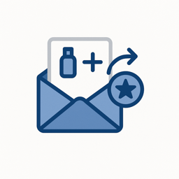
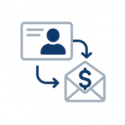
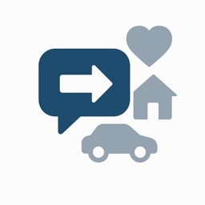
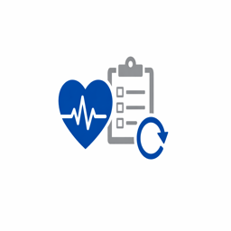
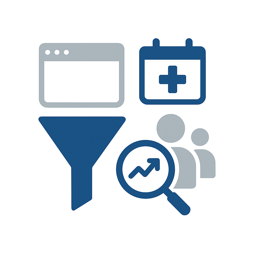
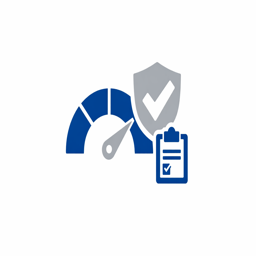
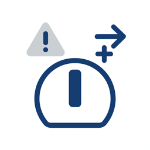
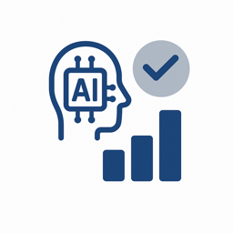
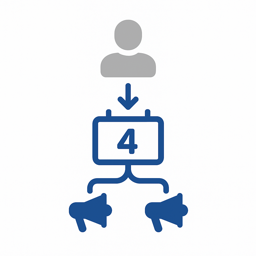

# Använd fallkatalog

Branschanvändningsexempel visar hur företag inom specifika vertikaler använder Adobe Experience Platform och tillämpningar för att uppnå mätbara affärsresultat. Varje användningsfall beskriver ett konkret affärsscenario, dess förväntade effekt och länkar till [användningsfallmönstret](/help/blueprints/use-case-patterns/overview.md) som ger detaljerad implementeringsvägledning.

Bläddra efter bransch för att hitta användningsexempel som är relevanta för din organisation och följ sedan mönsterlänkarna för implementeringsreferenser som beslutsvägledning, funktionskedjor och Experience League-dokumentation.

| Bransch | Viktiga teman |
| --- | --- |
| [Automatisering](automotive/automotive-overview.md) | Fordonsköpsresa, tjänstens livscykel, sammanhängande bilupplevelser, ägarlojalitet |
| [B2B](b2b/b2b-overview.md) | Kontobaserad marknadsföring, poängsättning av leads, acceleration i pipeline, kundexpansion |
| [Finansiella tjänster](financial-services/financial-services-overview.md) | Produktrekommendationer, förhindrande av bortfall, erbjudanden i vardagen, personalisering av bedrägeri |
| [Hälsovård](healthcare/healthcare-overview.md) | Hantering av tillsättningen, medicinering, patientregistrering, samordning av vården |
| [Försäkring](insurance/insurance-overview.md) | Förnyelse av avtal, anspråkserfarenhet, riskförebyggande, optimering av korsförsäljning |
| [Media och underhållning](media-entertainment/media-entertainment-overview.md) | Innehållsrekommendationer, kvarhållande av prenumerationer, konvertering av testversioner, engagemang över flera plattformar |
| [Detaljhandel](retail/retail-overview.md) | Produktpersonalisering, kundvagnsåterställning, korsförsäljningsoptimering, lojalitetsengagemang |
| [Telekommunikation](telecommunications/telecommunications-overview.md) | Uppgradering av enheter, förhindrande av bortfall, planoptimering, nätverksengagemang |
| [Resor och turism](travel-hospitality/travel-hospitality-overview.md) | Boka personalisering, återfinnande vid övergivna, lojalitetsprogram, säsongskampanjer |
| [Teknik](technology/technology-overview.md) | Händelseinsamling, datavidarebefordran i realtid, analysintegrering, edge-driftsättning |

## Hur användningsexempel kan kopplas till implementeringsvägledning

Varje användningsfall länkar till ett **användningsfallmönster** - en repeterbar implementeringsmetod som beskriver funktionskedjan, beslutspunkter och konfigurationssteg som behövs för att ge användningsfallet liv. Använd fallmönster i sin tur för att ansluta till [viktiga affärsmål](/help/blueprints/business-objectives/overview.md), vilket hjälper dig att anpassa implementeringsarbetet med strategiska resultat.

```
Industry Use Case → Use Case Pattern → Key Business Objective
```

## Bläddra efter bransch

>[!BEGINTABS]

>[!TAB Detaljhandel]

| | Användningsfall | Beskrivning | Löptid | Mönster |
| --- | --- | --- | --- | --- |
|  | [Återställning av övergiven e-post för kundvagn](retail/retail-overview.md#abandoned-cart-email-recovery) | Skicka automatiskt personliga e-postpåminnelser till kunder som övergett sin kundvagn, inklusive kundvagnsinnehåll och relevanta erbjudanden. | [!BADGE Foundational]{type=Neutral} | [Meddelanden som utlösts av händelser](/help/blueprints/use-case-patterns/campaign-management-orchestration/event-triggered-messaging.md) |
|  | [Lagerbaserade nödkampanjer](retail/retail-overview.md#inventory-based-urgency-campaigns) | Utlös varningar och kampanjer i realtid när produktlagret är lågt, vilket skapar ett akut behov och uppmuntrar till omedelbart köp. | [!BADGE Foundational]{type=Neutral} | [Meddelanden som utlösts av händelser](/help/blueprints/use-case-patterns/campaign-management-orchestration/event-triggered-messaging.md) |
|  | [Varningar om prisfall](retail/retail-overview.md#price-drop-alerts) | Meddela kunderna via e-post eller push när produkter i deras önskelista eller tidigare visade artiklar sjunker till priset. | [!BADGE Foundational]{type=Neutral} | [Meddelanden som utlösts av händelser](/help/blueprints/use-case-patterns/campaign-management-orchestration/event-triggered-messaging.md) |
|  | [Aviseringar som inte finns i lager](retail/retail-overview.md#out-of-stock-notifications) | Låt kunderna registrera sig för meddelanden när det finns produkter som inte finns i lager och meddela dem sedan automatiskt via e-post eller SMS. | [!BADGE Foundational]{type=Neutral} | [Meddelanden som utlösts av händelser](/help/blueprints/use-case-patterns/campaign-management-orchestration/event-triggered-messaging.md) |
|  | [Personaliserade produktrekommendationer](retail/retail-overview.md#personalized-product-recommendations) | Visa anpassade produktrekommendationer för hemsida, kategorisidor och produktinformationssidor baserat på webbläsarhistorik, inköpshistorik och liknande kundbeteende. | [!BADGE Nya]{type=Informative} | [Beteenderekommendation](/help/blueprints/use-case-patterns/personalization/behavioral-recommendation.md) |
|  | [Anpassade kategorisidor](retail/retail-overview.md#personalized-category-pages) | Anpassa kategorisidor dynamiskt för att visa de mest relevanta produkterna först baserat på kundernas preferenser, tidigare köp och webbläsarbeteende. | [!BADGE Nya]{type=Informative} | [Beteenderekommendation](/help/blueprints/use-case-patterns/personalization/behavioral-recommendation.md) |
|  | [Nya välkomstserier för kunder](retail/retail-overview.md#new-customer-welcome-series) | Automatisera en välkomstserie för flera e-postmeddelanden för nya kunder med personaliserade produktrekommendationer, varumärkesberättelser och specialerbjudanden. | [!BADGE Nya]{type=Informative} | [Samlad resa i flera steg](/help/blueprints/use-case-patterns/campaign-management-orchestration/multi-step-orchestrated-journey.md) |
|  | [Påfyllnadspåminnelser](retail/retail-overview.md#replenishment-reminders) | Skicka automatiska påminnelser till kunder om produkter de köper regelbundet (prenumerationer, förbrukningsartiklar) för att uppmuntra till upprepade inköp. | [!BADGE Nya]{type=Informative} | [Samlad resa i flera steg](/help/blueprints/use-case-patterns/campaign-management-orchestration/multi-step-orchestrated-journey.md) |
|  | [Uppföljningskampanjer efter köp](retail/retail-overview.md#post-purchase-follow-up-campaigns) | Skicka e-postmeddelanden efter köp med tips om produkter, relaterade produkter, granskningsförfrågningar och information om lojalitetsprogram. | [!BADGE Nya]{type=Informative} | [Samlad resa i flera steg](/help/blueprints/use-case-patterns/campaign-management-orchestration/multi-step-orchestrated-journey.md) |
|  | [Socialt korrektur av Personalization](retail/retail-overview.md#social-proof-personalization) | Visa personliga sociala bevis baserat på kundprofil och önskemål. | [!BADGE Nya]{type=Informative} | [Known-Visitor Web/App Personalization](/help/blueprints/use-case-patterns/personalization/known-visitor-web-app-personalization.md) |
|  | [Korsförsäljning och merförsäljning - rekommendationer](retail/retail-overview.md#cross-sell-and-upsell-recommendations) | Visa relevanta korsförsäljnings- och merförsäljningsprodukter i kassan, via e-post och på produktsidor baserat på inköpsmönster och produktrelationer. | [!BADGE Avancerat]{type=Caution} | [Offer Decisioning](/help/blueprints/use-case-patterns/personalization/offer-decisioning.md) |
|  | [Exklusiva erbjudanden för VIP-kunder](retail/retail-overview.md#vip-customer-exclusive-offers) | Identifiera värdefulla kunder och leverera exklusiva erbjudanden, tidig tillgång till försäljning och personaliserade shoppingupplevelser. | [!BADGE Avancerat]{type=Caution} | [Flerkanalsresor med beslut](/help/blueprints/use-case-patterns/campaign-management-orchestration/cross-channel-journey-with-decisioning.md) |
|  | [AI Product Advisor](retail/retail-overview.md#ai-product-advisor) | Använd en konversationsbaserad AI-rådgivare som vägleder kunderna genom produktupptäckt med hjälp av naturlig dialog, realtidslager och personaliserade profildata. | [!BADGE Avancerat]{type=Caution} | [Brand Concierge Conversational Experience](/help/blueprints/use-case-patterns/conversational-experience/brand-concierge-conversational-experience.md) |
|  | [Analys av flerkanalsattribut](retail/retail-overview.md#cross-channel-attribution-analysis) | Mät hur e-post, betalda och butikskontaktytor bidrar till köpkonverteringar med hjälp av multitouch-attribueringsmodeller. | [!BADGE Avancerat]{type=Caution} | [Kundanalys och insiktsgenerering](/help/blueprints/use-case-patterns/analysis/customer-analytics-insight-generation.md) |
|  | [Målgruppssegmentering och aktivering för betalmedia](retail/retail-overview.md#audience-segmentation--activation-for-paid-media) | Bygg värdefulla målgruppssegment från enhetliga kundprofiler och aktivera dem för betalmediematerial som Google Ads, Meta och The Trade Desk för förvärv och återannonsering av kampanjer. | [!BADGE Nya]{type=Informative} | [Audience Activation till mål](/help/blueprints/use-case-patterns/audience-building-activation/audience-activation-to-destinations.md) |
|  | [Inaktivering av kunder för anskaffningskampanjer](retail/retail-overview.md#customer-suppression-for-acquisition-campaigns) | Förhindra befintliga kunder och nya konverterare från att köpa in annonser genom att aktivera exkluderingsmålgrupper till betalda mediematerial, vilket minskar bortslösade utgifter. | [!BADGE Foundational]{type=Neutral} | [Audience Activation till mål](/help/blueprints/use-case-patterns/audience-building-activation/audience-activation-to-destinations.md) |
|  | [Personaliserade webbupplevelser för kända besökare](retail/retail-overview.md#personalized-web-experiences-for-known-visitors) | Leverera personaliserade hjältebanners, produktrekommendationer och marknadsföringsmaterial till autentiserade webbplatsbesökare baserat på deras realtidsprofil, segmentmedlemskap och beteendehistorik. | [!BADGE Avancerat]{type=Caution} | [Known-Visitor Web/App Personalization](/help/blueprints/use-case-patterns/personalization/known-visitor-web-app-personalization.md) |
|  | [Anonym besökare på Personalization](retail/retail-overview.md#anonymous-visitor-web-personalization) | Anpassa innehåll för oidentifierade webbplatsbesökare med hjälp av sessionsbeteendesignaler som visade sidor, bläddrade produktkategorier och hänvisningskälla. | [!BADGE Nya]{type=Informative} | [Anonym besökare på Personalization](/help/blueprints/use-case-patterns/personalization/anonymous-visitor-web-personalization.md) |
|  | [Välkomstseriens resa](retail/retail-overview.md#welcome-series-journey) | Samordna en välkomstresa i flera steg för nyregistrerade kunder och leverera introduktionsinnehåll, produktutbildning och ett första inköp i e-postkanaler och push-kanaler. | [!BADGE Nya]{type=Informative} | [Samlad resa i flera steg](/help/blueprints/use-case-patterns/campaign-management-orchestration/multi-step-orchestrated-journey.md) |
|  | [Återställning av kundvagnsavbrott](retail/retail-overview.md#cart-abandonment-recovery) | Trigga e-post i realtid och push-meddelanden när en kund överger sin kundvagn, med personaliserade produktpåminnelser och tidsbegränsade incitament för att slutföra köpet. | [!BADGE Nya]{type=Informative} | [Meddelanden som utlösts av händelser](/help/blueprints/use-case-patterns/campaign-management-orchestration/event-triggered-messaging.md) |
|  | [Deltagande efter köp](retail/retail-overview.md#post-purchase-engagement-journey) | Leverera postinköpsmeddelanden som orderbekräftelse, leveransuppdateringar, korsförsäljningsrekommendationer och granskningsbegäranden via en samordnad flerstegsresa. | [!BADGE Nya]{type=Informative} | [Samlad resa i flera steg](/help/blueprints/use-case-patterns/campaign-management-orchestration/multi-step-orchestrated-journey.md) |
|  | [Förmånsskiktsuppgraderingskampanj](retail/retail-overview.md#loyalty-tier-upgrade-campaign) | Identifiera kunder som närmar sig lojalitetströskeln och leverera målinriktade kampanjer som uppmuntrar dem att nå nästa nivå med personaliserade erbjudanden baserade på inköpshistorik och önskemål. | [!BADGE Avancerat]{type=Caution} | [Samlad resa i flera steg](/help/blueprints/use-case-patterns/campaign-management-orchestration/multi-step-orchestrated-journey.md) |
|  | [Samlad flerkanalsmarknadsföring](retail/retail-overview.md#cross-channel-campaign-orchestration) | Samordna samordnade marknadsföringskampanjer i e-post-, SMS-, push- och webbkanaler med förgreningar av resan, väntesteg och frekvensbegränsning för att maximera engagemanget utan trötthet. | [!BADGE Avancerat]{type=Caution} | [Flerkanalsresor med beslut](/help/blueprints/use-case-patterns/campaign-management-orchestration/cross-channel-journey-with-decisioning.md) |
|  | [Brand Concierge Conversational Experience](retail/retail-overview.md#brand-concierge-conversational-experience) | Driftsätt en AI-driven, varumärkessäker konverteringsagent för digitala resurser för att ge personlig produktvägledning, hjälp med webbplatsnavigering och smidig leverans till aktiva agenter. | [!BADGE Avancerat]{type=Caution} | [Brand Concierge Conversational Experience](/help/blueprints/use-case-patterns/conversational-experience/brand-concierge-conversational-experience.md) |
|  | [Påminnelse om incheckning med Appnedladdning CTA](retail/retail-overview.md#check-in-reminder-with-app-download-cta) | Påminn gästerna om att checka in och uppmuntra dem att hämta appen för att enkelt få tillgång till information. | [!BADGE Foundational]{type=Neutral} | [Meddelanden som utlösts av händelser](/help/blueprints/use-case-patterns/campaign-management-orchestration/event-triggered-messaging.md) |
|  | [Födelsedagskampanjer för fans](retail/retail-overview.md#birthday-campaigns-for-fans) | Rikta fansen på sin födelsedag med ett personligt födelsedagsmeddelande och ett exklusivt erbjudande. | [!BADGE Nya]{type=Informative} | [Meddelanden som utlösts av händelser](/help/blueprints/use-case-patterns/campaign-management-orchestration/event-triggered-messaging.md) |
|  | [Födelsedagskampanjer för köpare](retail/retail-overview.md#birthday-campaigns-for-shoppers) | Rikta kunderna på deras födelsedag med ett personligt födelsedagsmeddelande och ett exklusivt erbjudande. | [!BADGE Nya]{type=Informative} | [Meddelanden som utlösts av händelser](/help/blueprints/use-case-patterns/campaign-management-orchestration/event-triggered-messaging.md) |
|  | [Game Day Promotion Campaigns](retail/retail-overview.md#game-day-promotion-campaigns) | Rikta fansen mot att köpa biljetter till ett kommande spel med personaliserade kampanjer och erbjudanden. | [!BADGE Nya]{type=Informative} | [Aktivera utgående batchmeddelande](/help/blueprints/use-case-patterns/campaign-management-orchestration/batch-outbound-message-activation.md) |
|  | [Produktkampanjer](retail/retail-overview.md#product-promotion-campaigns) | Rikta kunderna till att köpa produkter under en pågående produktkampanj. | [!BADGE Nya]{type=Informative} | [Aktivera utgående batchmeddelande](/help/blueprints/use-case-patterns/campaign-management-orchestration/batch-outbound-message-activation.md) |
|  | [Avbruten kundvagn](retail/retail-overview.md#shopping-cart-abandon) | Engagera kunder som överger kundvagnen på nytt med personliga påminnelser och incitament för att slutföra köpet. | [!BADGE Nya]{type=Informative} | [Meddelanden som utlösts av händelser](/help/blueprints/use-case-patterns/campaign-management-orchestration/event-triggered-messaging.md) |

>[!TAB Automatisering]

| | Användningsfall | Beskrivning | Löptid | Mönster |
| --- | --- | --- | --- | --- |
|  | [Påminnelser om tjänstavtalad tid](automotive/automotive-overview.md#service-appointment-reminders) | Skicka personliga påminnelser om avtalade tider baserat på fordonsanvändning, servicehistorik och kundönskemål. | [!BADGE Foundational]{type=Neutral} | [Meddelanden som utlösts av händelser](/help/blueprints/use-case-patterns/campaign-management-orchestration/event-triggered-messaging.md) |
|  | [Meddelanden om fordonsåterkallande](automotive/automotive-overview.md#vehicle-recall-notifications) | Skicka personaliserade meddelanden om återkallande med alternativ för schemaläggning av service och säkerhetsinformation baserat på kundens fordon och plats. | [!BADGE Foundational]{type=Neutral} | [Meddelanden som utlösts av händelser](/help/blueprints/use-case-patterns/campaign-management-orchestration/event-triggered-messaging.md) |
|  | [Schemaläggning av testenhet](automotive/automotive-overview.md#test-drive-scheduling) | Möjliggör anpassad schemaläggning av testkörningar med återförsäljarrekommendationer och tillgänglighet baserat på kundens önskemål och plats. | [!BADGE Foundational]{type=Neutral} | [Meddelanden som utlösts av händelser](/help/blueprints/use-case-patterns/campaign-management-orchestration/event-triggered-messaging.md) |
|  | [Nya startkampanjer för modeller](automotive/automotive-overview.md#new-model-launch-campaigns) | Rikta in er på kunder som kan vara intresserade av att lansera nya modeller baserat på deras aktuella fordon, preferenser och inköpshistorik. | [!BADGE Foundational]{type=Neutral} | [Aktivera utgående batchmeddelande](/help/blueprints/use-case-patterns/campaign-management-orchestration/batch-outbound-message-activation.md) |
|  | [Värdekampanjer för handel](automotive/automotive-overview.md#trade-in-value-campaigns) | Erbjud proaktivt värdebedömningar och kampanjer till kunder som kan vara redo att uppgradera sitt fordon. | [!BADGE Nya]{type=Informative} | [Samlad resa i flera steg](/help/blueprints/use-case-patterns/campaign-management-orchestration/multi-step-orchestrated-journey.md) |
|  | [Rekommendationer för delar och tillbehör](automotive/automotive-overview.md#parts-and-accessories-recommendations) | Rekommendera relevanta delar, tillbehör och uppgraderingar baserat på fordonsmodell, ägartid och kundönskemål. | [!BADGE Nya]{type=Informative} | [Beteenderekommendation](/help/blueprints/use-case-patterns/personalization/behavioral-recommendation.md) |
|  | [Garantier och utökade serviceplaner](automotive/automotive-overview.md#warranty-and-extended-service-plans) | Rekommendera garantier och utökade serviceplaner vid optimala tidpunkter baserat på fordonets ålder, körsträcka och kundinköpsmönster. | [!BADGE Nya]{type=Informative} | [Samlad resa i flera steg](/help/blueprints/use-case-patterns/campaign-management-orchestration/multi-step-orchestrated-journey.md) |
|  | [Aktivering av kopplad bilfunktion](automotive/automotive-overview.md#connected-car-feature-activation) | Personalisera rekommendationer för anslutna bilar och aktiveringskampanjer baserade på fordonsfunktioner och kundens tekniska preferenser. | [!BADGE Nya]{type=Informative} | [Samlad resa i flera steg](/help/blueprints/use-case-patterns/campaign-management-orchestration/multi-step-orchestrated-journey.md) |
|  | [Nätverkssamordning för återförsäljare](automotive/automotive-overview.md#dealer-network-coordination) | Möjliggör anpassade rekommendationer och samordning från återförsäljare baserat på kundens plats, preferenser och återförsäljarlager. | [!BADGE Nya]{type=Informative} | [Known-Visitor Web/App Personalization](/help/blueprints/use-case-patterns/personalization/known-visitor-web-app-personalization.md) |
|  | [Purchase Journey Personalization](automotive/automotive-overview.md#vehicle-purchase-journey-personalization) | Personalisera fordonets inköpsresa från forskning till inköp med relevanta fordonsrekommendationer, finansieringsalternativ och information om återförsäljare. | [!BADGE Avancerat]{type=Caution} | [Flerkanalsresor med beslut](/help/blueprints/use-case-patterns/campaign-management-orchestration/cross-channel-journey-with-decisioning.md) |
|  | [Erbjudanden om finansiering och försäkring](automotive/automotive-overview.md#financing-and-insurance-offers) | Presentera skräddarsydda finansierings- och försäkringserbjudanden baserat på kundens kreditprofil, urval av fordon och tidslinje för inköp. | [!BADGE Avancerat]{type=Caution} | [Offer Decisioning](/help/blueprints/use-case-patterns/personalization/offer-decisioning.md) |
|  | [Lojalitetsprogram för ägare](automotive/automotive-overview.md#owner-loyalty-programs) | Anpassa kundlojalitetsprogram, kommunikation, belöningar och exklusiva erbjudanden baserat på ägarskapshistorik och lojalitetsnivå. | [!BADGE Avancerat]{type=Caution} | [Flerkanalsresor med beslut](/help/blueprints/use-case-patterns/campaign-management-orchestration/cross-channel-journey-with-decisioning.md) |

>[!TAB Finansiella tjänster]

| | Användningsfall | Beskrivning | Löptid | Mönster |
| --- | --- | --- | --- | --- |
|  | [Transaktionsbaserade aviseringar och rekommendationer](financial-services/financial-services-overview.md#transaction-based-alerts-and-recommendations) | Skicka aviseringar i realtid om transaktioner och skräddarsy rekommendationer baserat på utgiftsmönster och kontoaktivitet. | [!BADGE Foundational]{type=Neutral} | [Meddelanden som utlösts av händelser](/help/blueprints/use-case-patterns/campaign-management-orchestration/event-triggered-messaging.md) |
|  | [Återvinning av kreditkortsansökningar](financial-services/financial-services-overview.md#credit-card-application-abandonment-recovery) | Identifiera kunder som började men inte slutförde kreditkortsansökningar och engagera dem på nytt med personaliserade meddelanden och erbjudanden. | [!BADGE Foundational]{type=Neutral} | [Meddelanden som utlösts av händelser](/help/blueprints/use-case-patterns/campaign-management-orchestration/event-triggered-messaging.md) |
|  | [Bedrägerivarning Personalization](financial-services/financial-services-overview.md#fraud-alert-personalization) | Anpassa varningar om bedrägerier och säkerhetskommunikation baserat på önskemål om kundkommunikation och historik över tidigare interaktioner. | [!BADGE Foundational]{type=Neutral} | [Meddelanden som utlösts av händelser](/help/blueprints/use-case-patterns/campaign-management-orchestration/event-triggered-messaging.md) |
|  | [Ledarutbildning med högt värde](financial-services/financial-services-overview.md#high-value-lead-nurturing) | Identifiera värdefulla presumtiva kunder baserat på profildata och beteende och ge dem sedan personaliserat innehåll och erbjudanden via automatiserade resor. | [!BADGE Nya]{type=Informative} | [Samlad resa i flera steg](/help/blueprints/use-case-patterns/campaign-management-orchestration/multi-step-orchestrated-journey.md) |
|  | [Kontrollpanel för anpassat konto](financial-services/financial-services-overview.md#personalized-account-dashboard) | Anpassa onlinebankernas kontrollpanel och mobilappsupplevelser baserat på kundkontoaktivitet, preferenser och ekonomiska mål. | [!BADGE Nya]{type=Informative} | [Known-Visitor Web/App Personalization](/help/blueprints/use-case-patterns/personalization/known-visitor-web-app-personalization.md) |
|  | [Investera Portfolio-rekommendationer](financial-services/financial-services-overview.md#investment-portfolio-recommendations) | Tillhandahåll personaliserade investeringsrekommendationer baserade på kundriskprofil, investeringshistorik och finansiella mål. | [!BADGE Nya]{type=Informative} | [Beteenderekommendation](/help/blueprints/use-case-patterns/personalization/behavioral-recommendation.md) |
|  | [Förauktoriseringskampanjer för lån](financial-services/financial-services-overview.md#mortgage-pre-approval-campaigns) | Rikta er till kunder som sannolikt kommer att vara på marknaden för en inteckning baserat på profildata, beteenden och indikatorer för levnadsfaser. | [!BADGE Nya]{type=Informative} | [Samlad resa i flera steg](/help/blueprints/use-case-patterns/campaign-management-orchestration/multi-step-orchestrated-journey.md) |
|  | [Produktrekommendation för befintliga kunder](financial-services/financial-services-overview.md#product-recommendation-for-existing-customers) | Rekommendera relevanta finansiella produkter till befintliga kunder baserat på deras profil, transaktionshistorik och livscykelstadium. | [!BADGE Avancerat]{type=Caution} | [Offer Decisioning](/help/blueprints/use-case-patterns/personalization/offer-decisioning.md) |
|  | [Kampanjer för att förebygga skador](financial-services/financial-services-overview.md#churn-prevention-campaigns) | Identifiera kunder som riskerar att falla offer för reklamavbrott med hjälp av AI-baserade prognoser och engagera dem med lojalitetserbjudanden och personaliserad kommunikation. | [!BADGE Avancerat]{type=Caution} | [Flerkanalsresor med beslut](/help/blueprints/use-case-patterns/campaign-management-orchestration/cross-channel-journey-with-decisioning.md) |
|  | [Produkterbjudanden baserade på livscykelstadium](financial-services/financial-services-overview.md#life-stage-based-product-offers) | Identifiera kunder i nya livsstadier och erbjud proaktivt relevanta finansiella produkter och tjänster. | [!BADGE Avancerat]{type=Caution} | [Flerkanalsresor med beslut](/help/blueprints/use-case-patterns/campaign-management-orchestration/cross-channel-journey-with-decisioning.md) |
|  | [Lojalitetsprogramengagemang](financial-services/financial-services-overview.md#loyalty-program-engagement) | Anpassa kundlojalitetskommunikation, belöningar och erbjudanden baserat på kundnivå, poängbalans och inlösenhistorik. | [!BADGE Avancerat]{type=Caution} | [Flerkanalsresor med beslut](/help/blueprints/use-case-patterns/campaign-management-orchestration/cross-channel-journey-with-decisioning.md) |
|  | [Personaliserat innehåll för ekonomisk utbildning](financial-services/financial-services-overview.md#personalized-financial-education-content) | Leverera skräddarsytt utbildningsmaterial, tips och resurser baserat på kundens ekonomiska profil, mål och intressen. | [!BADGE Avancerat]{type=Caution} | [Flerkanalsresor med beslut](/help/blueprints/use-case-patterns/campaign-management-orchestration/cross-channel-journey-with-decisioning.md) |
|  | [AI Financial Product Guide](financial-services/financial-services-overview.md#ai-financial-product-guide) | Hjälp kunderna att förstå finansiella produkter och navigera bland kontoalternativen genom konversationsbaserad AI som bygger på regelefterlevnad och profildata i realtid. | [!BADGE Avancerat]{type=Caution} | [Brand Concierge Conversational Experience](/help/blueprints/use-case-patterns/conversational-experience/brand-concierge-conversational-experience.md) |
|  | [Analys av Funnel och Churn-drivrutiner för produktanvändning](financial-services/financial-services-overview.md#product-adoption-funnel-and-churn-driver-analysis) | Identifiera var kunderna faller ifrån när det gäller introduktionsflöden och vilka beteenden som förutser produktattribuering. | [!BADGE Avancerat]{type=Caution} | [Kundanalys och insiktsgenerering](/help/blueprints/use-case-patterns/analysis/customer-analytics-insight-generation.md) |
|  | [Nästa bästa Offer Decisioning](financial-services/financial-services-overview.md#next-best-offer-decisioning) | Använd centraliserad beslutslogik för att välja det mest relevanta erbjudandet för varje kund i alla kanaler, och kombinera regler för behörighet, affärsbegränsningar och AI-baserade rankningsstrategier. | [!BADGE Avancerat]{type=Caution} | [Offer Decisioning](/help/blueprints/use-case-patterns/personalization/offer-decisioning.md) |
|  | [Customer Journey Analytics Dashboard](financial-services/financial-services-overview.md#customer-journey-analytics-dashboard) | Bygg flerkanaliga analysarbetsytor där webb-, app-, e-post- och callcenterdata kombineras för att visualisera kundresor, identifiera bortfallspunkter och mäta kampanjattribuering. | [!BADGE Nya]{type=Informative} | [Kundanalys och insiktsgenerering](/help/blueprints/use-case-patterns/analysis/customer-analytics-insight-generation.md) |

>[!TAB Hälsovård]

| | Användningsfall | Beskrivning | Löptid | Mönster |
| --- | --- | --- | --- | --- |
|  | [Påminnelse om avtalad tid, automatisering](healthcare/healthcare-overview.md#appointment-reminder-automation) | Skicka personliga påminnelser om möten via e-post, SMS och push-meddelanden baserat på patientpreferenser och typ av avtalad tid. | [!BADGE Foundational]{type=Neutral} | [Meddelanden som utlösts av händelser](/help/blueprints/use-case-patterns/campaign-management-orchestration/event-triggered-messaging.md) |
|  | [Efterbesök Uppföljningskampanjer](healthcare/healthcare-overview.md#post-visit-follow-up-campaigns) | Skicka automatiskt enkäter, omvårdnadsinstruktioner och påminnelser efter besök baserat på besökstyp och patientbehov. | [!BADGE Foundational]{type=Neutral} | [Meddelanden som utlösts av händelser](/help/blueprints/use-case-patterns/campaign-management-orchestration/event-triggered-messaging.md) |
|  | [Meddelande om Lab-resultat](healthcare/healthcare-overview.md#lab-results-notification) | Meddela patienterna när labbresultaten är tillgängliga via den kommunikationskanal de föredrar med personaliserade meddelanden. | [!BADGE Foundational]{type=Neutral} | [Meddelanden som utlösts av händelser](/help/blueprints/use-case-patterns/campaign-management-orchestration/event-triggered-messaging.md) |
|  | [Verifiering av försäkringsskydd](healthcare/healthcare-overview.md#insurance-coverage-verification) | Verifiera och förmedla information om försäkringsskydd till patienter före besök för att minska faktureringsproblemen och förbättra patientupplevelsen. | [!BADGE Foundational]{type=Neutral} | [Meddelanden som utlösts av händelser](/help/blueprints/use-case-patterns/campaign-management-orchestration/event-triggered-messaging.md) |
|  | [Påminnelser om telefonhälsoavtalad tid](healthcare/healthcare-overview.md#telehealth-appointment-reminders) | Skicka personliga påminnelser för telefonmöten med anslutningsanvisningar, tips och teknisk supportinformation. | [!BADGE Foundational]{type=Neutral} | [Meddelanden som utlösts av händelser](/help/blueprints/use-case-patterns/campaign-management-orchestration/event-triggered-messaging.md) |
|  | [Påminnelser om förebyggande vård](healthcare/healthcare-overview.md#preventive-care-reminders) | Påminn proaktivt patienter om rekommenderad förebyggande vård baserat på ålder, anamnes och riskfaktorer. | [!BADGE Foundational]{type=Neutral} | [Aktivera utgående batchmeddelande](/help/blueprints/use-case-patterns/campaign-management-orchestration/batch-outbound-message-activation.md) |
|  | [Kampanjer för läkemedelsöverensstämmelse](healthcare/healthcare-overview.md#medication-adherence-campaigns) | Skicka personliga påminnelser och utbildningsmaterial för att hjälpa patienterna att följa medicinska scheman och behandlingsplaner. | [!BADGE Nya]{type=Informative} | [Samlad resa i flera steg](/help/blueprints/use-case-patterns/campaign-management-orchestration/multi-step-orchestrated-journey.md) |
|  | [Program för hantering av kroniska sjukdomar](healthcare/healthcare-overview.md#chronic-disease-management-programs) | Personalisera kommunikation om hantering av kroniska sjukdomar, utbildningsmaterial och övervaka påminnelser baserat på patientens tillstånd och behandlingsplan. | [!BADGE Nya]{type=Informative} | [Samlad resa i flera steg](/help/blueprints/use-case-patterns/campaign-management-orchestration/multi-step-orchestrated-journey.md) |
|  | [Ny introduktionsresa för patienter](healthcare/healthcare-overview.md#new-patient-onboarding-journey) | Automatisera en introduktionsresa i flera steg för nya patienter med välkomstinformation, portalåtkomstinstruktioner och vägledning om schemaläggning av möten. | [!BADGE Nya]{type=Informative} | [Samlad resa i flera steg](/help/blueprints/use-case-patterns/campaign-management-orchestration/multi-step-orchestrated-journey.md) |
|  | [Wellness Program Engagement](healthcare/healthcare-overview.md#wellness-program-engagement) | Anpassa kommunikationen, utmaningarna och belöningarna utifrån patienternas hälsomål, aktivitetsnivå och önskemål. | [!BADGE Nya]{type=Informative} | [Samlad resa i flera steg](/help/blueprints/use-case-patterns/campaign-management-orchestration/multi-step-orchestrated-journey.md) |
|  | [Samordning av vårdteam](healthcare/healthcare-overview.md#care-team-coordination) | Möjliggör anpassad kommunikation och samordning mellan patienter och deras vårdpersonal baserat på vårdplan och önskemål. | [!BADGE Nya]{type=Informative} | [Samlad resa i flera steg](/help/blueprints/use-case-patterns/campaign-management-orchestration/multi-step-orchestrated-journey.md) |
|  | [Personaliserat hälsoinnehåll](healthcare/healthcare-overview.md#personalized-health-content-delivery) | Leverera personaliserat innehåll, hälsotips och resurser för hälsoutbildning baserat på patientförhållanden, intressen och hälsomål. | [!BADGE Avancerat]{type=Caution} | [Flerkanalsresor med beslut](/help/blueprints/use-case-patterns/campaign-management-orchestration/cross-channel-journey-with-decisioning.md) |
|  | [Analys av patientresor Funnel och vårdmellanrum](healthcare/healthcare-overview.md#patient-journey-funnel-and-care-gap-analysis) | Identifiera var patienter frångår vårdvägarna och vilka befolkningsgrupper som har luckor i den rekommenderade vården. | [!BADGE Avancerat]{type=Caution} | [Kundanalys och insiktsgenerering](/help/blueprints/use-case-patterns/analysis/customer-analytics-insight-generation.md) |
|  | [Innehåll i patientportalen Personalization](healthcare/healthcare-overview.md#patient-portal-content-personalization) | Anpassa patientportalupplevelsen baserat på surfbeteende och engagemangshistorik | [!BADGE Avancerat]{type=Caution} | [Beteenderekommendation](/help/blueprints/use-case-patterns/personalization/behavioral-recommendation.md) |
|  | [Påminnelser om patientengagemang och avtalad tid](healthcare/healthcare-overview.md#patient-engagement--appointment-reminders) | Skicka personliga påminnelser om möten, hälsotips och uppföljningsmeddelanden via kompatibla, medgivandemedvetna flerkanalsresor. | [!BADGE Nya]{type=Informative} | [Meddelanden som utlösts av händelser](/help/blueprints/use-case-patterns/campaign-management-orchestration/event-triggered-messaging.md) |

>[!TAB Försäkring]

| | Användningsfall | Beskrivning | Löptid | Mönster |
| --- | --- | --- | --- | --- |
|  | [Kampanjer för policyförnyelse](insurance/insurance-overview.md#policy-renewal-campaigns) | Skicka påminnelser och erbjudanden om personaliserad förnyelse baserat på kundpolicyhistorik, anspråk och önskemål. | [!BADGE Foundational]{type=Neutral} | [Samlad resa i flera steg](/help/blueprints/use-case-patterns/campaign-management-orchestration/multi-step-orchestrated-journey.md) |
|  | [Meddelanden om principändringar](insurance/insurance-overview.md#policy-change-notifications) | Skicka personaliserade meddelanden om policyändringar, uppdateringar och nya alternativ för täckning baserat på kundens policy och önskemål. | [!BADGE Foundational]{type=Neutral} | [Meddelanden som utlösts av händelser](/help/blueprints/use-case-patterns/campaign-management-orchestration/event-triggered-messaging.md) |
|  | [Återställning av offertavhopp](insurance/insurance-overview.md#quote-abandonment-recovery) | Engagera kunder som började men inte slutförde försäkringsofferter med personaliserad uppföljning och erbjudanden igen. | [!BADGE Foundational]{type=Neutral} | [Meddelanden som utlösts av händelser](/help/blueprints/use-case-patterns/campaign-management-orchestration/event-triggered-messaging.md) |
|  | [Förebyggande av anspråksbedrägerier](insurance/insurance-overview.md#claims-fraud-prevention) | Använd AI-baserad upptäckt av bedrägeri för att identifiera misstänkta anspråk och personalisera kommunikationen med utredningar samtidigt som kundens förtroende upprätthålls. | [!BADGE Foundational]{type=Neutral} | [Meddelanden som utlösts av händelser](/help/blueprints/use-case-patterns/campaign-management-orchestration/event-triggered-messaging.md) |
|  | [Katastrofisk händelse, svar](insurance/insurance-overview.md#catastrophic-event-response) | Proaktivt kommunicera med kunder i drabbade områden under naturkatastrofer eller andra katastrofer med personaliserad support och skadeinformation. | [!BADGE Foundational]{type=Neutral} | [Meddelanden som utlösts av händelser](/help/blueprints/use-case-patterns/campaign-management-orchestration/event-triggered-messaging.md) |
|  | [Samordning för agent och mäklare](insurance/insurance-overview.md#agent-and-broker-coordination) | Möjliggör personaliserad kommunikation och samordning mellan kunder och deras agenter/mäklare utifrån politiska behov och önskemål. | [!BADGE Foundational]{type=Neutral} | [Aktivera utgående batchmeddelande](/help/blueprints/use-case-patterns/campaign-management-orchestration/batch-outbound-message-activation.md) |
|  | [Anspråksprocessen Personalization](insurance/insurance-overview.md#claims-process-personalization) | Anpassa kundprocesskommunikation, uppdateringar och support baserat på anspråkstyp, kundpreferenser och anspråkshistorik. | [!BADGE Nya]{type=Informative} | [Samlad resa i flera steg](/help/blueprints/use-case-patterns/campaign-management-orchestration/multi-step-orchestrated-journey.md) |
|  | [Riskbedömning och förebyggande](insurance/insurance-overview.md#risk-assessment-and-prevention) | Tillhandahåll personaliserad riskbedömningsinformation och tips för förebyggande åtgärder baserat på kundpolicytyp, plats och riskfaktorer. | [!BADGE Nya]{type=Informative} | [Samlad resa i flera steg](/help/blueprints/use-case-patterns/campaign-management-orchestration/multi-step-orchestrated-journey.md) |
|  | [Program för välbefinnande och förebyggande](insurance/insurance-overview.md#wellness-and-prevention-programs) | Anpassa kommunikationen och belöningen för hälso- och livförsäkringskunder utifrån deltagande och mål. | [!BADGE Nya]{type=Informative} | [Samlad resa i flera steg](/help/blueprints/use-case-patterns/campaign-management-orchestration/multi-step-orchestrated-journey.md) |
|  | [Produktrekommendationer för korsförsäljning](insurance/insurance-overview.md#cross-sell-product-recommendations) | Rekommendera ytterligare försäkringsprodukter baserat på befintliga kundpolicyer, livsfas och riskprofil. | [!BADGE Avancerat]{type=Caution} | [Offer Decisioning](/help/blueprints/use-case-patterns/personalization/offer-decisioning.md) |
|  | [Rabatt och besparingar](insurance/insurance-overview.md#discount-and-savings-opportunities) | Identifiera och förmedla anpassade rabattmöjligheter baserat på kundprofil och beteende. | [!BADGE Avancerat]{type=Caution} | [Offer Decisioning](/help/blueprints/use-case-patterns/personalization/offer-decisioning.md) |
|  | [Policyholder Portal Content Personalization](insurance/insurance-overview.md#policyholder-portal-content-personalization) | Anpassa den autentiserade portalen och appupplevelsen baserat på beteende och policyportfölj | [!BADGE Avancerat]{type=Caution} | [Beteenderekommendation](/help/blueprints/use-case-patterns/personalization/behavioral-recommendation.md) |

>[!TAB Media och underhållning]

| | Användningsfall | Beskrivning | Löptid | Mönster |
| --- | --- | --- | --- | --- |
|  | [Meddelanden om nya innehållsreleaser](media-entertainment/media-entertainment-overview.md#new-content-release-notifications) | Meddela prenumeranterna om nya innehållsreleaser som matchar deras preferenser och visningshistorik. | [!BADGE Foundational]{type=Neutral} | [Meddelanden som utlösts av händelser](/help/blueprints/use-case-patterns/campaign-management-orchestration/event-triggered-messaging.md) |
|  | [Påminnelser om bevakningslista och favoriter](media-entertainment/media-entertainment-overview.md#watchlist-and-favorites-reminders) | Skicka påminnelser till användare om innehåll i deras bevakningslista eller favoriter som de inte har tittat på än. | [!BADGE Foundational]{type=Neutral} | [Meddelanden som utlösts av händelser](/help/blueprints/use-case-patterns/campaign-management-orchestration/event-triggered-messaging.md) |
|  | [Visa påminnelser om Live-händelser](media-entertainment/media-entertainment-overview.md#live-event-viewing-reminders) | Informera användarna om kommande live-event, sportevenemang eller premiärer som matchar deras intressen och tittarhistorik. | [!BADGE Foundational]{type=Neutral} | [Meddelanden som utlösts av händelser](/help/blueprints/use-case-patterns/campaign-management-orchestration/event-triggered-messaging.md) |
|  | [Kampanjer för innehållsslutförande](media-entertainment/media-entertainment-overview.md#content-completion-campaigns) | Påminn användarna om att slutföra tittandet på eller lyssna på innehåll de startat men inte slutfört. | [!BADGE Foundational]{type=Neutral} | [Meddelanden som utlösts av händelser](/help/blueprints/use-case-patterns/campaign-management-orchestration/event-triggered-messaging.md) |
|  | [Innehållsrekommendationsmotor](media-entertainment/media-entertainment-overview.md#content-recommendation-engine) | Generera personaliserade rekommendationer för innehåll med hjälp av beteendesignaler och urvalsstrategier som levereras via webben, e-post och i appkanaler. | [!BADGE Nya]{type=Informative} | [Beteenderekommendation](/help/blueprints/use-case-patterns/personalization/behavioral-recommendation.md) |
|  | [Personlig hemsidesupplevelse](media-entertainment/media-entertainment-overview.md#personalized-homepage-experience) | Anpassa sidor för hemsida och innehållsidentifiering dynamiskt för att visa det mest relevanta innehållet först baserat på användarprofil och beteende. | [!BADGE Nya]{type=Informative} | [Beteenderekommendation](/help/blueprints/use-case-patterns/personalization/behavioral-recommendation.md) |
|  | [Skapa anpassade spellistor](media-entertainment/media-entertainment-overview.md#personalized-playlist-generation) | Generera och uppdatera automatiskt personaliserade spellistor baserat på användarhistorik, preferenser och humörindikatorer. | [!BADGE Nya]{type=Informative} | [Beteenderekommendation](/help/blueprints/use-case-patterns/personalization/behavioral-recommendation.md) |
|  | [Kostnadsfria testkonverteringskampanjer](media-entertainment/media-entertainment-overview.md#free-trial-conversion-campaigns) | Engagera användare av kostnadsfria testversioner med personliga rekommendationer och erbjudanden för att uppmuntra till konvertering av prenumerationer innan testperioden är slut. | [!BADGE Nya]{type=Informative} | [Samlad resa i flera steg](/help/blueprints/use-case-patterns/campaign-management-orchestration/multi-step-orchestrated-journey.md) |
|  | [Synkronisering av innehåll på flera plattformar](media-entertainment/media-entertainment-overview.md#cross-platform-content-sync) | Skapa en smidig innehållsupplevelse på olika enheter genom att synkronisera bevakningshistorik, inställningar och rekommendationer i realtid. | [!BADGE Nya]{type=Informative} | [Known-Visitor Web/App Personalization](/help/blueprints/use-case-patterns/personalization/known-visitor-web-app-personalization.md) |
|  | [Delning via sociala medier i Personalization](media-entertainment/media-entertainment-overview.md#social-sharing-personalization) | Anpassa uppmaningar och rekommendationer för social delning baserat på användares sociala anslutning och innehållsinställningar. | [!BADGE Nya]{type=Informative} | [Known-Visitor Web/App Personalization](/help/blueprints/use-case-patterns/personalization/known-visitor-web-app-personalization.md) |
|  | [Förhindra prenumerationskanal](media-entertainment/media-entertainment-overview.md#subscription-churn-prevention) | Identifiera abonnenter som riskerar att avbryta och engagera dem med personaliserade innehållsrekommendationer, erbjudanden och kundlojalitetskampanjer. | [!BADGE Avancerat]{type=Caution} | [Flerkanalsresor med beslut](/help/blueprints/use-case-patterns/campaign-management-orchestration/cross-channel-journey-with-decisioning.md) |
|  | [Premium Feature Upsell](media-entertainment/media-entertainment-overview.md#premium-feature-upsell) | Identifiera användare som skulle kunna dra nytta av premiumfunktioner och presentera personaliserade merförsäljningserbjudanden baserat på deras användningsmönster. | [!BADGE Avancerat]{type=Caution} | [Offer Decisioning](/help/blueprints/use-case-patterns/personalization/offer-decisioning.md) |
|  | [Analys av drivrutin för prenumerant och innehåll](media-entertainment/media-entertainment-overview.md#subscriber-churn-driver-and-content-engagement-analysis) | Identifiera mönster för innehållsengagemang som föregår abonnentannullering och mät kvarhållningens påverkan per innehållstyp och kohort. | [!BADGE Avancerat]{type=Caution} | [Kundanalys och insiktsgenerering](/help/blueprints/use-case-patterns/analysis/customer-analytics-insight-generation.md) |

>[!TAB Telekommunikation]

| | Användningsfall | Beskrivning | Löptid | Mönster |
| --- | --- | --- | --- | --- |
|  | [Varningar och rekommendationer för dataanvändning](telecommunications/telecommunications-overview.md#data-usage-alerts-and-recommendations) | Skicka personaliserade aviseringar när kunderna närmar sig datagränserna och rekommendera planuppgraderingar eller tillägg baserat på användningsmönster. | [!BADGE Foundational]{type=Neutral} | [Meddelanden som utlösts av händelser](/help/blueprints/use-case-patterns/campaign-management-orchestration/event-triggered-messaging.md) |
|  | [Meddelanden om serviceutfall](telecommunications/telecommunications-overview.md#service-outage-notifications) | Meddela kunderna i förväg om serviceavbrott i deras respektive områden med personaliserade uppdateringar och kompensationserbjudanden. | [!BADGE Foundational]{type=Neutral} | [Meddelanden som utlösts av händelser](/help/blueprints/use-case-patterns/campaign-management-orchestration/event-triggered-messaging.md) |
|  | [Betalningspåminnelser](telecommunications/telecommunications-overview.md#bill-payment-reminders) | Skicka personliga påminnelser om fakturabetalning via önskade kanaler med betalningsalternativ och kontosaldoinformation. | [!BADGE Foundational]{type=Neutral} | [Meddelanden som utlösts av händelser](/help/blueprints/use-case-patterns/campaign-management-orchestration/event-triggered-messaging.md) |
|  | [5G uppgraderingskampanjer](telecommunications/telecommunications-overview.md#5g-upgrade-campaigns) | Rikta er till kunder som är berättigade till 5G-nätverksuppgraderingar med personaliserade erbjudanden och fördelar baserat på deras plats och användningsmönster. | [!BADGE Foundational]{type=Neutral} | [Aktivera utgående batchmeddelande](/help/blueprints/use-case-patterns/campaign-management-orchestration/batch-outbound-message-activation.md) |
|  | [Planoptimeringskampanjer](telecommunications/telecommunications-overview.md#plan-optimization-campaigns) | Analysera kundanvändningsmönster och rekommendera optimala ändringar av planen för att spara pengar eller få bättre funktioner baserat på deras behov. | [!BADGE Nya]{type=Informative} | [Samlad resa i flera steg](/help/blueprints/use-case-patterns/campaign-management-orchestration/multi-step-orchestrated-journey.md) |
|  | [Ny kundintroduktionsresa](telecommunications/telecommunications-overview.md#new-customer-onboarding-journey) | Automatisera en personaliserad introduktionsresa för nya kunder med välkomstinformation, vägledning för kontokonfiguration och självstudiekurser. | [!BADGE Nya]{type=Informative} | [Samlad resa i flera steg](/help/blueprints/use-case-patterns/campaign-management-orchestration/multi-step-orchestrated-journey.md) |
|  | [Nätverksprestanda Personalization](telecommunications/telecommunications-overview.md#network-performance-personalization) | Anpassa information om nätverksprestanda och rekommendationer baserat på kundens plats, enhet och användningsmönster. | [!BADGE Nya]{type=Informative} | [Known-Visitor Web/App Personalization](/help/blueprints/use-case-patterns/personalization/known-visitor-web-app-personalization.md) |
|  | [Rekommendationer för enhetsuppgradering](telecommunications/telecommunications-overview.md#device-upgrade-recommendations) | Identifiera kunder som är berättigade till uppgraderingar och presentera personaliserade rekommendationer och uppgraderingserbjudanden för enheter. | [!BADGE Avancerat]{type=Caution} | [Flerkanalsresor med beslut](/help/blueprints/use-case-patterns/campaign-management-orchestration/cross-channel-journey-with-decisioning.md) |
|  | [Kurnskydd för värdefulla kunder](telecommunications/telecommunications-overview.md#churn-prevention-for-high-value-customers) | Identifiera värdefulla kunder som riskerar att bli stulna och engagera dem med personaliserade kundlojalitetserbjudanden och proaktiv kundtjänst. | [!BADGE Avancerat]{type=Caution} | [Flerkanalsresor med beslut](/help/blueprints/use-case-patterns/campaign-management-orchestration/cross-channel-journey-with-decisioning.md) |
|  | [Hantering av familjeplan](telecommunications/telecommunications-overview.md#family-plan-management) | Anpassa kommunikationen och erbjudandena för administratörer av familjeplaner baserat på användningsmönster och individuella medlemsbehov. | [!BADGE Avancerat]{type=Caution} | [Flerkanalsresor med beslut](/help/blueprints/use-case-patterns/campaign-management-orchestration/cross-channel-journey-with-decisioning.md) |
|  | [Rekommendationer för tilläggstjänst](telecommunications/telecommunications-overview.md#add-on-service-recommendations) | Rekommendera relevanta tilläggstjänster baserat på kundplan, användning och önskemål. | [!BADGE Avancerat]{type=Caution} | [Offer Decisioning](/help/blueprints/use-case-patterns/personalization/offer-decisioning.md) |
|  | [AI-plansrådgivare](telecommunications/telecommunications-overview.md#ai-plan-advisor) | Vägled prenumeranter genom att välja en anpassad plan med hjälp av konversations-AI som bygger på realtidsanvändningsdata, kontoprofil och hela planskatalogen. | [!BADGE Avancerat]{type=Caution} | [Brand Concierge Conversational Experience](/help/blueprints/use-case-patterns/conversational-experience/brand-concierge-conversational-experience.md) |
|  | [Churn Propensity och Network Experience Analytics](telecommunications/telecommunications-overview.md#churn-propensity-and-network-experience-analytics) | Korrelera händelser för nätverkskvalitet och servicekontakter med prenumeranturn för att identifiera vilka upplevelsefel som ger upphov till enhetsattribuering. | [!BADGE Avancerat]{type=Caution} | [Kundanalys och insiktsgenerering](/help/blueprints/use-case-patterns/analysis/customer-analytics-insight-generation.md) |
|  | [Kurn Prevention &amp; Win-back](telecommunications/telecommunications-overview.md#churn-prevention--win-back) | Använd prediktiva modeller och beteendesignaler för att identifiera riskkunder och utlösa personaliserade kundlojalitetskampanjer med skräddarsydda erbjudanden innan de faller bort. | [!BADGE Avancerat]{type=Caution} | [Flerkanalsresor med beslut](/help/blueprints/use-case-patterns/campaign-management-orchestration/cross-channel-journey-with-decisioning.md) |

>[!TAB Resor och turism]

| | Användningsfall | Beskrivning | Löptid | Mönster |
| --- | --- | --- | --- | --- |
|  | [Återställningsresa för kundvagn](travel-hospitality/travel-hospitality-overview.md#cart-abandonment-recovery-journey) | Identifiera automatiskt när en kund överger sin kundvagn och utlöser en e-postresa i flera steg med personaliserade erbjudanden som uppmuntrar till slutförande. | [!BADGE Foundational]{type=Neutral} | [Meddelanden som utlösts av händelser](/help/blueprints/use-case-patterns/campaign-management-orchestration/event-triggered-messaging.md) |
|  | [Påminnelser om flerkanalsbokning](travel-hospitality/travel-hospitality-overview.md#multi-channel-booking-reminders) | Skicka personliga bokningspåminnelser via e-post, SMS och push-meddelanden till kunder som har startat men inte slutfört bokningar. | [!BADGE Foundational]{type=Neutral} | [Meddelanden som utlösts av händelser](/help/blueprints/use-case-patterns/campaign-management-orchestration/event-triggered-messaging.md) |
|  | [Säsongskampanj för Personalization](travel-hospitality/travel-hospitality-overview.md#seasonal-campaign-personalization) | Anpassa kampanjer och erbjudanden baserat på säsongsinställningar, tidigare säsongsbokningar och aktuella säsongstrender. | [!BADGE Foundational]{type=Neutral} | [Aktivera utgående batchmeddelande](/help/blueprints/use-case-patterns/campaign-management-orchestration/batch-outbound-message-activation.md) |
|  | [Personlig hemsida för nya besökare](travel-hospitality/travel-hospitality-overview.md#personalized-homepage-for-new-visitors) | Visa anpassade rekommendationer för hemsidan baserat på besökarens geografiska plats, surfbeteende och segmentmedlemskap. | [!BADGE Nya]{type=Informative} | [Anonym besökare på Personalization](/help/blueprints/use-case-patterns/personalization/anonymous-visitor-web-personalization.md) |
|  | [Avancerad målgruppsanpassning för besökare](travel-hospitality/travel-hospitality-overview.md#high-intent-visitor-targeting) | Identifiera besökare med hög inköpsmetod med hjälp av AI-driven benägenhetsbedömning och rikta dem mot personaliserade erbjudanden och innehåll. | [!BADGE Nya]{type=Informative} | [Known-Visitor Web/App Personalization](/help/blueprints/use-case-patterns/personalization/known-visitor-web-app-personalization.md) |
|  | [Bokför merförsäljningskampanjer](travel-hospitality/travel-hospitality-overview.md#post-booking-upsell-campaigns) | När kunden är klar med en bokning utlöser han/hon automatiskt merförsäljningskampanjer för uppgraderingar, exursioner och andra tillhöriga. | [!BADGE Nya]{type=Informative} | [Samlad resa i flera steg](/help/blueprints/use-case-patterns/campaign-management-orchestration/multi-step-orchestrated-journey.md) |
|  | [Win-Back Campaigns for Lapsed Customers](travel-hospitality/travel-hospitality-overview.md#win-back-campaigns-for-lapsed-customers) | Identifiera bortgångna kunder och engagera dem med personaliserade återvinningserbjudanden och innehåll baserat på deras tidigare önskemål. | [!BADGE Nya]{type=Informative} | [Samlad resa i flera steg](/help/blueprints/use-case-patterns/campaign-management-orchestration/multi-step-orchestrated-journey.md) |
|  | [Dynamiska rekommendationer](travel-hospitality/travel-hospitality-overview.md#dynamic-itinerary-recommendations) | Visa anpassade resvägar och mål baserat på kundernas tidigare bokningar, webbhistorik och inställningar. | [!BADGE Nya]{type=Informative} | [Known-Visitor Web/App Personalization](/help/blueprints/use-case-patterns/personalization/known-visitor-web-app-personalization.md) |
|  | [Produkter som nyligen har bläddrats på hemsidan](travel-hospitality/travel-hospitality-overview.md#recently-browsed-products-on-homepage) | Visa nyligen visade destinationer på hemsidan för att påminna besökarna om deras intresse och uppmuntra återbesök. | [!BADGE Nya]{type=Informative} | [Known-Visitor Web/App Personalization](/help/blueprints/use-case-patterns/personalization/known-visitor-web-app-personalization.md) |
|  | [Gruppbokningsrekommendationer](travel-hospitality/travel-hospitality-overview.md#group-booking-recommendations) | Identifiera kunder som ofta bokar gruppresor och proaktivt rekommendera grupppaket och familjevänliga alternativ. | [!BADGE Nya]{type=Informative} | [Beteenderekommendation](/help/blueprints/use-case-patterns/personalization/behavioral-recommendation.md) |
|  | [Avsluta återgivningsmodulen med riktade erbjudanden](travel-hospitality/travel-hospitality-overview.md#exit-intent-modal-with-targeted-offers) | När en besökare visar sin avslutningsmetod, ska han/hon visa ett personaliserat modalt erbjudande med relevanta erbjudanden baserat på segment och webbläsarbeteende. | [!BADGE Avancerat]{type=Caution} | [Offer Decisioning](/help/blueprints/use-case-patterns/personalization/offer-decisioning.md) |
|  | [Lojalitetsprogram Personalization](travel-hospitality/travel-hospitality-overview.md#loyalty-program-personalization) | Anpassa webbplatsupplevelser, erbjudanden och kommunikation baserat på kundlojalitetsnivån. | [!BADGE Avancerat]{type=Caution} | [Flerkanalsresor med beslut](/help/blueprints/use-case-patterns/campaign-management-orchestration/cross-channel-journey-with-decisioning.md) |
|  | [AI-bokningskoncierge](travel-hospitality/travel-hospitality-overview.md#ai-booking-concierge) | Vägled gästerna genom planering av resor, rumsval och andra tillval med hjälp av konversationsbaserad AI, som bygger på tillgänglighetsdata i realtid och lojalitetsprofildata. | [!BADGE Avancerat]{type=Caution} | [Brand Concierge Conversational Experience](/help/blueprints/use-case-patterns/conversational-experience/brand-concierge-conversational-experience.md) |
|  | [Födelsedagskampanjer för gäster](travel-hospitality/travel-hospitality-overview.md#birthday-campaigns-for-guests) | Rikta gästerna på sin födelsedag med ett personligt födelsedagsmeddelande och ett exklusivt erbjudande. | [!BADGE Nya]{type=Informative} | [Meddelanden som utlösts av händelser](/help/blueprints/use-case-patterns/campaign-management-orchestration/event-triggered-messaging.md) |
|  | [Målkampanjer](travel-hospitality/travel-hospitality-overview.md#destination-promotion-campaigns) | Rikta gästerna för att boka en reservation under en pågående befordran av resmål. | [!BADGE Nya]{type=Informative} | [Aktivera utgående batchmeddelande](/help/blueprints/use-case-patterns/campaign-management-orchestration/batch-outbound-message-activation.md) |

>[!TAB B2B]

| | Användningsfall | Beskrivning | Löptid | Mönster |
| --- | --- | --- | --- | --- |
|  | [Schemaläggning av webbinarium och demo](b2b/b2b-overview.md#webinar-and-demo-scheduling) | Anpassa webbinarier och schemaläggning av demo baserat på potentiella kunders intressen, bransch- och engagemangshistorik. | [!BADGE Foundational]{type=Neutral} | [Meddelanden som utlösts av händelser](/help/blueprints/use-case-patterns/campaign-management-orchestration/event-triggered-messaging.md) |
|  | [Account-Based Marketing Personalization](b2b/b2b-overview.md#account-based-marketing-personalization) | Anpassa marknadsföringskommunikation för målkonton baserat på inköpssignaler | [!BADGE Avancerat]{type=Caution} | [B2B Audience Activation](/help/blueprints/use-case-patterns/audience-building-activation/b2b-audience-activation.md) |
|  | [Leadpoäng och undervisning](b2b/b2b-overview.md#lead-scoring-and-nurturing) | Automatisk poängsättning av leads baserat på profildata och beteende, och sedan dirigera högkvalitativa leads till försäljning med personaliserade vårdskampanjer för andra. | [!BADGE Nya]{type=Informative} | [Samlad resa i flera steg](/help/blueprints/use-case-patterns/campaign-management-orchestration/multi-step-orchestrated-journey.md) |
|  | [Innehåll i Personalization för potentiella kunder](b2b/b2b-overview.md#content-personalization-for-prospects) | Anpassa webbplatsinnehåll, resurser och erbjudanden baserat på bransch, roll, företagsstorlek och engagemangshistorik. | [!BADGE Nya]{type=Informative} | [Known-Visitor Web/App Personalization](/help/blueprints/use-case-patterns/personalization/known-visitor-web-app-personalization.md) |
|  | [Händelseregistrering och uppföljning](b2b/b2b-overview.md#event-registration-and-follow-up) | Automatisera personliga bekräftelser, påminnelser och uppföljning efter händelse baserat på händelsetyp och deltagarprofil. | [!BADGE Nya]{type=Informative} | [Samlad resa i flera steg](/help/blueprints/use-case-patterns/campaign-management-orchestration/multi-step-orchestrated-journey.md) |
|  | [Konverteringskampanjer för testversioner av produkter](b2b/b2b-overview.md#product-trial-conversion-campaigns) | Engagera testanvändare med personaliserade produktrekommendationer, utbildningsresurser och erbjudanden för att uppmuntra konvertering till betalda planer. | [!BADGE Nya]{type=Informative} | [Samlad resa i flera steg](/help/blueprints/use-case-patterns/campaign-management-orchestration/multi-step-orchestrated-journey.md) |
|  | [Nöjda kunder och nyanställda](b2b/b2b-overview.md#customer-success-and-onboarding) | Personalisera kundintroduktionsresor med relevant utbildning, resurser och support baserat på inköpta produkter och kundprofil. | [!BADGE Nya]{type=Informative} | [Samlad resa i flera steg](/help/blueprints/use-case-patterns/campaign-management-orchestration/multi-step-orchestrated-journey.md) |
|  | [Konkurrenskraftiga ersättningskampanjer](b2b/b2b-overview.md#competitive-replacement-campaigns) | Rikta er till potentiella kunder med hjälp av konkurrentprodukter med personaliserade meddelanden, migrationserbjudanden och konkurrensjämförelser. | [!BADGE Nya]{type=Informative} | [Samlad resa i flera steg](/help/blueprints/use-case-patterns/campaign-management-orchestration/multi-step-orchestrated-journey.md) |
|  | [Fallstudie och avkastning på investering i Personalization](b2b/b2b-overview.md#case-study-and-roi-personalization) | Leverera personaliserade fallstudier, avkastningskalkylatorer och framgångsrecept baserat på bransch, företagsstorlek och användningsexempel. | [!BADGE Nya]{type=Informative} | [Known-Visitor Web/App Personalization](/help/blueprints/use-case-patterns/personalization/known-visitor-web-app-personalization.md) |
|  | [Program för kundlobbying](b2b/b2b-overview.md#customer-advocacy-programs) | Identifiera och engagera nöjda kunder för att hitta fler förespråkare baserat på användnings- och nöjesdata. | [!BADGE Nya]{type=Informative} | [Samlad resa i flera steg](/help/blueprints/use-case-patterns/campaign-management-orchestration/multi-step-orchestrated-journey.md) |
|  | [Kampanjer för avtalsförnyelse](b2b/b2b-overview.md#contract-renewal-campaigns) | Engagera kunder som närmar sig avtalsförnyelse med personaliserade erbjudanden, användningsinsikter och förnyelseincitament. | [!BADGE Avancerat]{type=Caution} | [Flerkanalsresor med beslut](/help/blueprints/use-case-patterns/campaign-management-orchestration/cross-channel-journey-with-decisioning.md) |
|  | [Merförsäljning och utbyggnadsmöjligheter](b2b/b2b-overview.md#upsell-and-expansion-opportunities) | Identifiera kunder som är redo för produktuppgraderingar eller ytterligare licenser baserat på användningsmönster och tillväxtindikatorer. | [!BADGE Avancerat]{type=Caution} | [Flerkanalsresor med beslut](/help/blueprints/use-case-patterns/campaign-management-orchestration/cross-channel-journey-with-decisioning.md) |
|  | [B2B kontobaserad Audience Activation](b2b/b2b-overview.md#b2b-account-based-audience-activation) | Bygg målgrupper på kontonivå genom att kombinera data på kontonivå, köpa gruppsignaler och engagemang på personnivå och sedan aktivera dem för LinkedIn, DSP och CRM-destinationer. | [!BADGE Avancerat]{type=Caution} | [B2B Audience Activation](/help/blueprints/use-case-patterns/audience-building-activation/b2b-audience-activation.md) |
|  | [Buying Group Journey Orchestration](b2b/b2b-overview.md#buying-group-journey-orchestration) | Samordna resor på kontonivå som vårdar medlemmar i inköpsgrupper baserat på deras roller, poängställning och kontokvalificeringsstatus, med automatiserad leverans till försäljning. | [!BADGE Avancerat]{type=Caution} | [Köpa gruppbaserad marknadsföring](/help/blueprints/use-case-patterns/campaign-management-orchestration/buying-group-based-marketing.md) |
|  | [Account-Based Marketing (ABM) Personalization](b2b/b2b-overview.md#account-based-marketing-abm-personalization) | Anpassa marknadsföringskommunikation och innehåll för målkonton baserat på kontoprofil, engagemangshistorik och köpsignaler. | [!BADGE Avancerat]{type=Caution} | [B2B Audience Activation](/help/blueprints/use-case-patterns/audience-building-activation/b2b-audience-activation.md) |

>[!TAB Teknik]

| | Användningsfall | Beskrivning | Löptid | Mönster |
| --- | --- | --- | --- | --- |
|  | [Händelsevidarebefordran i realtid](technology/technology-overview.md#real-time-event-forwarding) | Vidarebefordra beteendehändelser i realtid som samlats in via Edge Network till tredjepartsanalyser, datalager och partnerplattformar för berikning och aktivering. | [!BADGE Foundational]{type=Neutral} | [Händelsevidarebefordran](/help/blueprints/use-case-patterns/audience-building-activation/event-forwarding.md) |

>[!ENDTABS]
