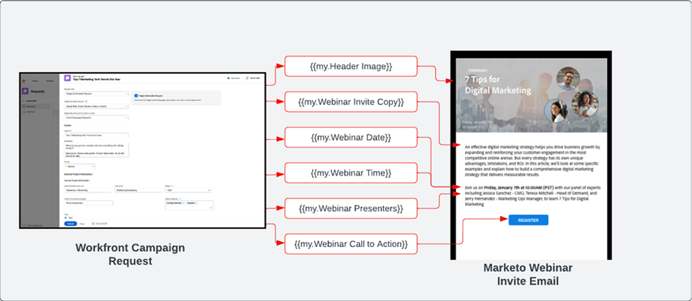

# Infoga och skapa {#intake-and-create}

Det antal marknadsföringsförfrågningar som kommer in i ett marknadsföringsteam för att lansera nya kampanjer kan göra ett högt fungerande team till en ständig dörr av återkommande uppgifter, vilket leder till att innovationer sprider sig ut och stagnerar.

Genom att skapa en process för att skicka in kampanjförfrågningar och automatisera skapandet av ofta efterfrågade marknadsföringskampanjer kan ni: öka tempot i era kampanjer, minska antalet fel, skicka förfrågningar till rätt medlem i era marknadsföringsaktiviteter, balansera och förbättra resursanvändningen och fokusera mer på era marknadsföringsåtgärder för mer strategiska uppgifter.

Med Workfront och Marketo Engage kan du ansluta system-till-system från en [Formulär för Workfront-begäran](https://experienceleague.adobe.com/docs/workfront/using/administration-and-setup/customize/custom-forms/create-or-edit-a-custom-form.html){target=&quot;_blank&quot;} för att skapa ett Marketo Engage-program och sedan fylla i nyckelvariabler som: ämnesrader, e-postkopia, bilder, datum, tid, händelseinformation med mera.

För att uppnå den här integreringen kommer du att använda Workfront Fusion, ett lager för automatisering av arbete som gör att du kan automatisera arbetsflöden mellan Workfront och andra system.

I arbetsflödet nedan visas en begäran om ett webbinarium som görs av en kampanjhanterare med hjälp av ett Workfront-formulär. Informationen som skickades i begäran utlöser sedan ett program och ett e-postmeddelande som ska skapas i Marketo Engage för webbinariet. Dessutom hämtas information från begärandeformuläret för att fylla i innehållet i e-postmeddelandet.

>[!TIP]
>
>Om du vill veta mer om olika typer av objekt i Workfront som används för att organisera arbetet med marknadsföringskampanjer och hur det mappas till ett program i Marketo Engage kan du titta på [Marketo och Workfront - översikt](/help/blueprints/optimize-campaign-supply-chain-with-marketo-and-workfront/overview.md){target=&quot;_blank&quot;}.

## Förbered er kampanjutvecklingsprocess för automatisering {#prepare-your-campaign-development-process-for-automation}

Bakom varje automatiserad arbetsflöde finns en definierad process som ser till att team och intressenter får ut det mesta av automatiseringen.

**Vilka typer av marknadsföringsförfrågningar kommer du att få?**

Tänk på vilka typer av marknadsföringstaktik du kommer att köra, som e-post, näring, webbinarier från första part och event. Kör du även webbinarier från tredje part eller visningsannonser? Var och en av dessa förfrågningar bör beaktas eftersom de kan behöva särskilda inmatningsfält i ansökningsformuläret och mappas till olika programmallar i Marketo Engage som ska klonas.

Ni måste också förstå om ni kör kampanjer i flera regioner. Om så är fallet vill du ta med ett projekt i Workfront för att skapa flera program i Marketo Engage, där varje program har olika språkstöd.

Det är viktigt att ni i förväg vet vilka typer av marknadsföringsförfrågningar ni förväntar er ska ta emot för att säkerställa att förfrågningar kan underlättas på ett automatiserat sätt.

**Vilken information ska samlas in i kampanjbegäran?**

Tänk på den viktigaste informationen som behöver hämtas i din ansökningsblankett för varje taktik du kör. Nedan finns några exempel på information som du kan hämta in i ett Workfront-formulär för att automatisera kampanjutvecklingen.

<table> 
  <tr> 
   <td><b>Marknadsföringstaktik</b></td>
   <td><b>Information att hämta</b></td>
  </tr>
  <tr> 
   <td>E-postutfall</td>
   <td>・ E-postämne 
・ Schemalagt datum 
・ E-postkopia 
・ Call to Action 
・ Bild(er) - AEM Assets URL:er kan refereras direkt för användning i Marketo 
・ Kriterier för målgruppskvalitet</td>
  </tr>
  <tr>
   <td>Webbseminarium/händelse</td>
   <td>・ Händelsenamn 
・ Händelsedatum 
・ Händelsetid 
・ Evenemangets ort 
・ Händelsebeskrivning 
・ Inspelningssida för webbinarium - PageURL OnDemand 
・ Föredragshållarnamn 
・ Föredragshållartexter 
・ Högtalarbilder 
・ E-postmeddelanden behövs (inbjudan, bekräftelse, påminnelse, uppföljning) 
・ Sidhuvudsbilder via e-post 
・ Kriterier för målgruppskvalitet</td>
  </tr>
  <tr>
   <td>Nätur</td>
   <td>・ Antal e-postmeddelanden 
・ E-postkopia 
・ E-postrubriker 
・ Call to Action 
・ Kriterier för målgruppskvalitet</td>
  </tr>
  </tbody>
</table>

>[!NOTE]
>
>Idag är programmässigt byggande av målgrupper via automatisering begränsat i Marketo Engage eftersom tokens inte stöds i smarta listor. Detta innebär att målgrupperna antingen måste skapas i Marketo Engage av en användare, eller om du har en förutbestämd målgrupp som du hela tiden kommunicerar med, kan du inkludera en konfigurerad smart lista som en del av programmallen som klonas under automatiseringsprocessen.

### Upprätta ett centrum för högskolan {#establish-your-center-of-excellence}

Om du vill automatisera framtagningen av program behöver du ett högklassigt center i Marketo Engage. Ett högklassigt centrum innehåller mallsidiga program och resurser som hjälper till att snabba upp och standardisera kampanjutvecklingsprocessen. Du kan till exempel ha en programmall för olika kampanjbehov: e-post, näring, personliga event och webbinarium. Dessutom kan du ha flera e-postprogrammallar som du använder för olika regioner eller olika typer av e-postmeddelanden.

Att skapa ett högklassigt centrum med programmallar i Marketo Engage är ett av de första stegen mot att ha ett mer programmatiskt tillvägagångssätt för kampanjutförande och kommer att fungera som en grund för automatisering av kampanjförfrågningar.

När ni väl har en uppsättning återanvändbara programmallar kan ni skala om era insatser ytterligare med hjälp av den automatisering som beskrivs i den här planen för att skapa en snabbare kampanjutveckling.

Mer information om hur du skapar ett eget centrum för spetskompetens finns i [Marketo Community](https://nation.marketo.com/t5/product-blogs/marketo-master-class-center-of-excellence-with-chelsea-kiko/ba-p/243221){target=&quot;_blank&quot;} för bästa praxis.

### Använd variabler för att fylla i innehåll {#use-tokens-to-populate-content}

Med Marketo Engage kan variabler användas för att fylla i innehåll i kampanjresurser. När du till exempel har klonat en e-postmall från ditt högklassiga center kan Workfront Fusion hämta information från kampanjbegäran i Workfront och skicka dem till Mina token i Marketo Engage-programmet. Token-värdena kan sedan ärvas direkt till e-postmeddelandet för att skapa e-postmeddelandet.

### Fyll i bilder från AEM Assets {#populate-images-from-aem-assets}

Du kan automatisera utvecklingen av e-post- och landningssidor ytterligare genom att använda Marketo Engage-tokens i kombination med länkar till resurser i AEM Assets. Kampanjbegärare kan skicka in publicerade bildlänkar från AEM Assets som en del av förfrågningsprocessen. Workfront Fusion kan sedan ta med sig länkarna och bädda in dem HTML i ett e-postmeddelande med hjälp av Marketo Engage-tokens.

Kom ihåg att du måste skapa program- och programmallar i Marketo Engage för att kunna använda Mina token så att Fusion kan uppdatera tokenvärdena med informationen som skickas i Workfront.

>[!NOTE]
>
>AEM Assets behöver inte stödja det här arbetsflödet, men kan möjliggöra en effektivare process för att hantera kampanjresurser i hela leverantörskedjan för kampanjutveckling.

### Sammanställa ett uppslagsbibliotek för alla typer av programförfrågningar {#assemble-a-lookup-library-for-all-program-request-types}

När man automatiserar framtagningen av nya Marketo Engage-program från Workfront-begäran är det viktigt att man tar med ett steg i Workfront Fusion-automatiseringen som kan hämta information från Workfront-begäran och hitta rätt programmallar som ska klonas i Marketo Engage.

För att göra detta kan du importera en datauppsättning i Workfront Fusion som innehåller en lista över alla olika programmallar i ditt Marketo Engage center för högklassig kompetens.

En del grundläggande information som ska ingå i sökbiblioteket för programmallar är:

<table> 
  <tr> 
   <td><b>Kolumn</b></td>
   <td><b>Beskrivning</b></td>
  </tr>
  <tr> 
   <td>Kampanjtyp</td>
   <td>Det kan vara e-post, webbinarium, näring, event, webbinarium från tredje part, listimport osv. Kampanjtypen fungerar som en läsbar beskrivning av vad som begärs.</td>
  </tr>
  <tr> 
   <td>Workfront Request Type</td>
   <td>Det här är den typ av begäran som väljs i Workfront-formuläret, vilket kan vara samma som kampanjtypen, som e-post, webbinarium, näring eller händelse. Detta används för att mappa indata som är markerade i Workfront-formuläret till en programmall i Marketo.</td>
  </tr>
  <tr> 
   <td>Workfront-formulär-ID</td>
   <td>Det unika ID:t för det formulär för Workfront-begäran som används för att validera skrivbegäran mappas till programmallen för Marketo Engage.</td>
  </tr>
  <tr> 
   <td>Marketo Program-ID</td>
   <td>Detta är ID:t för programmallen i Marketo Engage som mappar till den begäran som görs. Om denna information finns tillgänglig i Workfront Fusion kan Fusion göra en förfrågan till Marketo Engage och veta exakt vilket program som ska klonas.</td>
  </tr>
  </tbody>
</table>

## Infoga och skapa automatiseringsflöde {#intake-and-create-automation-flow}

Här är ett exempel på hur arbetsflödeslogiken kan monteras i Fusion med färdiga [Workfront](https://experienceleague.adobe.com/docs/workfront/using/adobe-workfront-fusion/fusion-apps-and-modules/workfront-modules.html){target=&quot;_blank&quot;} och [Marketo Engage](https://experienceleague.adobe.com/docs/workfront/using/adobe-workfront-fusion/fusion-apps-and-modules/marketo-modules.html){target=&quot;_blank&quot;} moduler som gör att du kan leverera automatisering snabbare.

## Resurser {#resources}

* [Adobe Marketo Engage Modules](https://experienceleague.adobe.com/docs/workfront/using/adobe-workfront-fusion/fusion-apps-and-modules/marketo-modules.html){target=&quot;_blank&quot;}

* [Adobe Workfront Modules](https://experienceleague.adobe.com/docs/workfront/using/adobe-workfront-fusion/fusion-apps-and-modules/workfront-modules.html){target=&quot;_blank&quot;}

* [Marketo och Workfront - översikt](/help/blueprints/optimize-campaign-supply-chain-with-marketo-and-workfront/overview.md){target=&quot;_blank&quot;}
