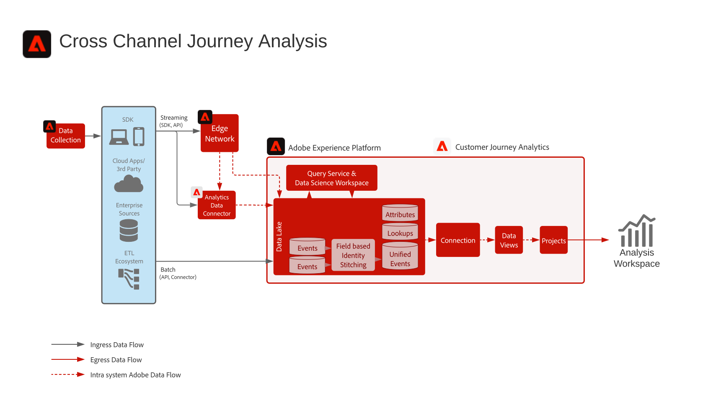

# Digital Experience-utkast

Planer för digitala upplevelser är repeterbara implementeringar som gör att ni kan hantera strategier och snabbt lösa etablerade affärsproblem. Varje utkast innehåller en serie artefakter som förklarar de mest värdefulla problemen, arkitekturer, implementeringssteg, tekniska överväganden och länkar till relevant dokumentation.

## Nyheter

* **[Målgrupps- och profilaktivering i företagsdestinationsplanering](/help/blueprints/audience-activation/enterprise-destinations.md)**
  *Håll kundprofilerna uppdaterade i alla system för att ge era sälj- och supportteam bättre förutsättningar. &#x200B;*
* **[Kundaktivitetshubben - översikt](/help/blueprints/audience-activation/customer-activity.md)**
  *Ange kontext för support och försäljning för agenter.*
* **[Planen för dataanalys och dataanalys](/help/blueprints/data-insights/analysis.md)**
  *Utför en undersökande fråga och analys av data i sjön.*

## Utvalda utkast

<table style="table-layout:fixed">
<tr>
  <td>
    
    
<a href="https://experienceleague.adobe.com/docs/blueprints-learn/architecture/customer-journeys/journey-optimizer.html"><strong>Samlad flerkanalsmarknadsföring</strong></a>

    
<em>Skicka meddelanden och påverka kundupplevelserna i realtid med [!UICONTROL Platform] som ett centralt nav.</em>

  </td>
  <td>
    
    
<a href="/help/blueprints/audience-activation/known.md"><strong>Känd kundaktivering</strong></a>

    
<em>Leverera målgruppsaktiverad flerkanalsreklam.</em>

  </td>
  <td>
    
    
<a href="https://experienceleague.adobe.com/docs/analytics-platform/using/cja-usecases/cross-channel.html?lang=en"><strong>Reseanalys över flera kanaler</strong></a>

    
<em>Få en samlad bild av kundernas beteende i olika kanaler.</em>

  </td>
</tr>
</table>

## Blogginlägg

* [[!DNL Introducing Adobe Experience Platform's New Digital Experience Blueprints]](https://medium.com/adobetech/introducing-adobe-experience-platforms-new-digital-experience-blueprints-93a6b5f5da7c)
* [[!DNL Blueprint for Audience Activation in Adobe Experience Platform]](https://medium.com/adobetech/a-blueprint-for-audience-activation-in-adobe-experience-platform-b2b30fae90fd)
* [[!DNL Blueprint for Web/Mobile Personalization using Adobe Experience Platform Real-Time Customer Profile]](https://medium.com/adobetech/blueprint-for-web-personalization-using-adobe-experience-platform-real-time-customer-profile-fef2ce7a4b2f)
* [[!DNL Blueprint for Cross-Channel Orchestration in Adobe Experience Platform]](https://medium.com/adobetech/blueprint-for-multi-channel-orchestration-in-adobe-experience-platform-c68317e94184)
