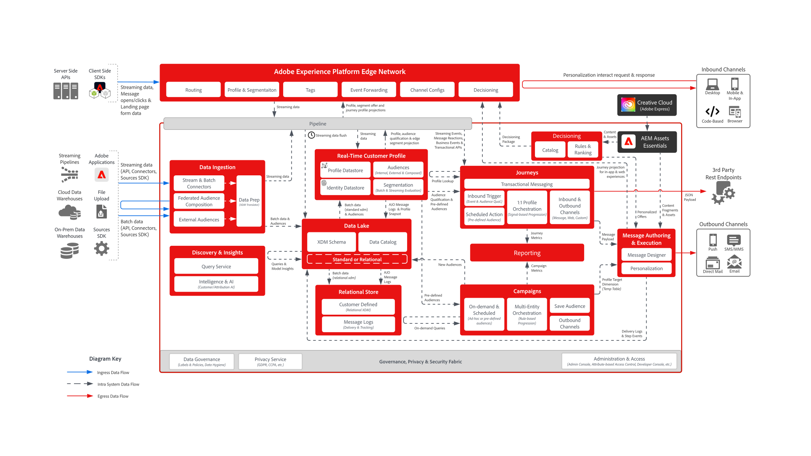

# Digital Experience-utkast

Med digitala upplevelseutkast får du diagram över system- och dataflödesarkitektur som hjälper dig att bättre förstå hur Adobe Experience Platform och program integreras och implementeras. Planerna ger en visuell representation av data- och innehållsflöden mellan system och komponenter, sekvenser av operationer och beroenden som kan vara till hjälp vid utformningen av användningsfall och arkitekturen för Adobe Experience Platform och tillämpningar.

## Populära utkast

<table>
<tr>
  <td>
    
    

      <a href="experience-platform/guardrails.md">
    <strong> Experience Platform Hub och Edge Architecture and Guardrails Diagram </strong>
    </a>
    

  </td>
   <td>
    
    

      <a href="experience-platform/deployment/websdk.md">
    <strong> SDK och Edge Network Sequence Diagram </strong>
    </a>
    

  </td>
  <td>
    
    

      <a href="customer-journeys/journey-optimizer/journey-optimizer-overview.md">
    <strong> Adobe Journey Optimizer Overview Diagram </strong>
    </a>
    

  </td>
</tr>
</table>

