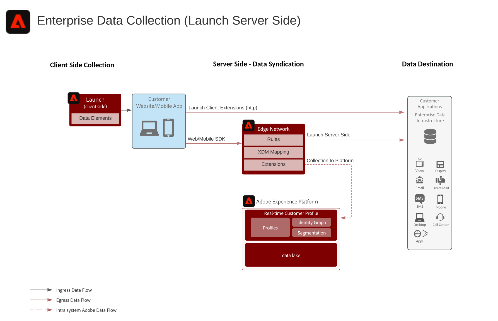

# Design för serversidan Enterprise Data Collection

I skissen Enterprise Data Collection (på serversidan) visas hur data som samlats in med Adobe Experience Platform Web och Mobile SDK kan vidarebefordras från Experience Platform Edge Network till önskat mål. Du kan vidarebefordra alla rådata som samlats in från SDK:n eller specifika data baserade på händelser och regler enligt konfigurationen i Experience Platform Launch.

## Användningsexempel

* Samla in data från webben eller mobiler med en enda samlingstagg, vilket gör kodvikten lättad i webbläsare och appar. Sprid insamlade data till olika slutpunkter för en enda datakälla för datainsamling.
* Vidarebefordra insamlade data till partnerapplikationer eller lagringsplatser för data för att skapa insikter och applikationer mot insamlade data.

## Program

* Adobe Experience Platform Collection

## Arkitektur

## Relaterad dokumentation

[Experience Platform Launch Server Side Documentation](https://experienceleague.adobe.com/docs/launch/using/server-side-info/server-side-overview.html?lang=en#server-side-info)

## Relaterade blogginlägg

* [Förbättra webbplatsprestanda med Adobe Experience Platform Web SDK och Edge Network](https://medium.com/adobetech/boosting-website-performance-with-adobe-experience-platform-web-sdk-and-edge-network-329fcf70fdf9)
* [Lösning av problem med implementering med Adobe Experience Platform Web SDK och Edge Network](https://medium.com/adobetech/solving-implementation-pain-points-with-adobe-experience-platform-web-sdk-and-edge-network-880b635e6819)
* [Adobe Experience Platform Web SDK for Audience Management](https://medium.com/adobetech/adobe-experience-platform-web-sdk-for-audience-management-751fa6d063bc)
* [Adobe Experience Platform Web SDK - Adobe Target](https://medium.com/adobetech/adobe-experience-platform-web-sdk-adobe-target-9b9f621d271)
* [Adobe Experience Platform Web SDK-migreringsscenarier för Adobe Analytics](https://medium.com/adobetech/adobe-experience-platform-web-sdk-migration-scenarios-for-adobe-analytics-91c255ec82b0)
* [Enhetliggör dina Adobe Experience Platform-tjänster med Adobe Experience Platform Web SDK](https://medium.com/adobetech/unify-your-adobe-experience-platform-services-with-adobe-experience-platform-web-sdk-75cf6851a9fc)
* [Snabba upp utvecklingen av mobilappar med Adobe Experience Platform Mobile SDK och Launch](https://medium.com/adobetech/accelerate-your-mobile-application-development-with-adobe-experience-platform-mobile-sdk-and-launch-ed023536d611)
* [Förenkla kundarbetsflödena med Adobe Experience Platform Web SDK](https://medium.com/adobetech/simplifying-customer-workflows-with-adobe-experience-platform-web-sdk-4e54fe134f4a)
