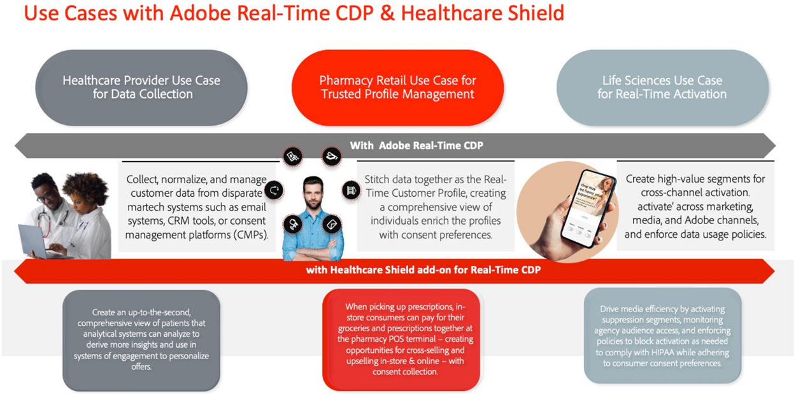
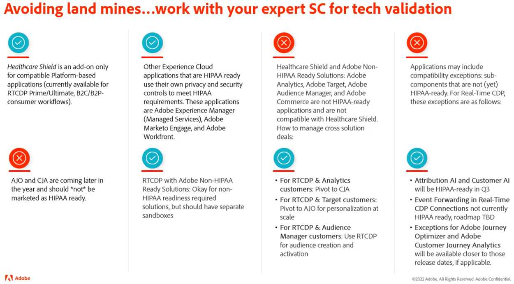
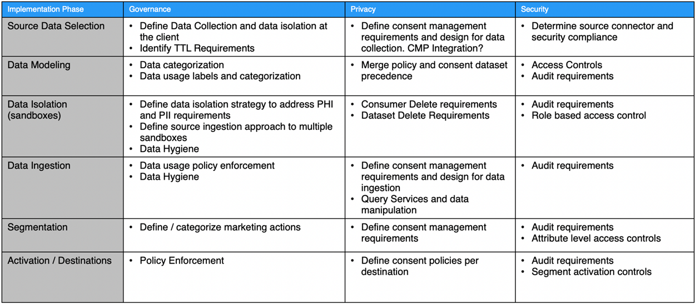

# Hälsovårdssköld

Vårdskölden är ett Adobe Experience Platform-tillägg till Adobe Experience Platform-baserade program som Real-Time CDP, Customer Journey Analytics och Adobe Journey Optimizer. Det är utformat för att göra dessa program HIPAA-klara och uppfyller kraven för bearbetning och användning av PHI (Protected Health Information).

## Frågor och svar om vårdsköld

Följande vanliga frågor och svar ger svar på vanliga frågor om hälso- och sjukvårdsskölden.

### Vad är HIPAA?

HIPAA är lagen om sjukförsäkringsansvar. Det är en amerikansk förordning som ger viktiga skydd för verksamheten. Dessa skydd begränsar användningen och utlämnandet av skyddad hälsoinformation när den skapas, tas emot, underhålls eller överförs av en enhet eller affärsintresseorganisation som omfattas av HIPAA (t.ex. Adobe-kunder) till ett affärsföretag (t.ex. Adobe).

Adobe är HIPAA-redo som affärspartner när det gäller specifika HIPAA-klara Adobe-lösningar och efterlevnad av HIPAA:s regler för säkerhet, sekretess och anmälan om brott.

### Vad är ett Business Associate-avtal (BAA) och varför är det viktigt?

När en enhet som omfattas eller en affärsassociation (en Adobe-kund) använder en Business Associate-tjänst (t.ex. Adobe) för att skapa, ta emot, underhålla eller överföra vissa typer av konsumentdata som är Skyddade hälsodata (PHI) eller ePHI (elektronisk version av PHI), måste den enhet som omfattas och Business Associate ingå ett affärsassocierat avtal (BAA).

Enligt BAA-avtalet ska Adobe, som Business Associate, på lämpligt sätt skydda PHI genom att uppfylla kraven i HIPAA:s regler för sekretess, säkerhet och anmälan om överträdelser.

Med tillägget Healthcare Shield för Real-Time CDP kan Adobe nu genomföra en BAA med kunder som licensierar den här funktionen tillsammans med Adobe Real-Time CDP B2C och konsumentflödena för Adobe Real-Time CDP B2P Edition.

### Varför finns Healthcare Shield för Real-Time CDP (och framtida plattformsbaserade tillämpningar) endast i USA?

Eftersom HIPAA är en amerikansk lag begränsar vi hälso- och sjukvårdssköldens tillgänglighet till USA och till företag som omfattas av HIPAA. Adobe avser att utvidga räckvidden till andra jurisdiktioner i takt med att vi omfattar lokala krav och är säkra på att vi kan uppfylla dem.

### Vad är hälso- och sjukvårdsskölden för Real-Time CDP?

Sjukvården för Real-Time CDP är avsedd för kunder som är en enhet som omfattas eller ett affärsassocierat företag och som avser att använda PHI i Real-Time CDP för datainmatning, målgruppsskapande och flerkanalsaktivering, samt kräver att Adobe genomför en BAA. Sjukvård krävs för enheter som omfattas av HIPAA och som måste användas för CDP i realtid.

### Varför ska hälso- och sjukvårdspersonal köpa hälsovård från Real-Time CDP?

Som tillägg till Real-Time CDP uppgraderar Healthcare Shield programmet till statusen&quot;HIPAA-ready&quot;. Detta innebär att programmet har de skyddsåtgärder som krävs för att använda PHI i enlighet med HIPAA-kraven. Dessutom kan Adobe med vårdskölden ge kunden tillstånd att föra in vissa typer av tillåtna känsliga personuppgifter till den HIPAA-klara tillämpningen. Adobe signerar Business Associate Agreements (BAA) med kunder som licensierar Healthcare Shield för en kompatibel plattformsbaserad applikation.

### Vilka typer av data är godkända för Real-Time CDP med vårdsköld (och vilka är inte det)?

Med vårdsköld kan varumärken föra in följande PHI i plattformsbaserade tillämpningar som Real-Time CDP (Permission Sensitive Personal Data):

* En persons finansiella information
* Medicin
* Hälsoinformation

Men vi utesluter specifikt data som identifierar missbruk, psykisk hälsa, genetiska hälsoregister eller hälsoregister för ett mindre, fullständigt kontonummer, fullständiga kreditkortsnummer, myndighetsidentifierare (t.ex. SSN) och personuppgifter för barn. Barn skyddas av alla barnskyddslagar (t.ex. de personuppgifter som definieras i U.S. Children&#39;s Online Privacy Act (COPPA)).

### Kan Real-Time CDP-kunder med vårdsköld använda vilken typ av PHI som helst för att bygga målgrupper och aktivera dem?

Även när en kund kan föra in Tillåtna känsliga personuppgifter i plattformsspecifika tillämpningar måste kunderna förstå att de är helt ansvariga för att följa alla tillämpliga bestämmelser och få lämpliga tillstånd, samtycke, klargöranden och tillstånd från konsumenterna att använda data på det avsedda sättet.

### Vad är det för nyanser när det gäller att inhämta och aktivera kunddata med Adobe-program som inte är HIPAA-klara?

En kundlicenssköld för hälso- och sjukvård får inte använda, importera, samla in, dela eller integrera tillåtna känsliga personuppgifter med program och tjänster som inte är HIPAA-förberedda för Adobe.

En kund bör till exempel inte aktivera segment som innehåller PHI i program som Audience Manager, Adobe Target och Adobe Analytics. Kunder som licensierar hälso- och sjukvårdsskölden får importera känsliga personuppgifter eller auktoriserad PHI till HIPAA-klara Adobe-applikationer, oavsett om datakällan anses vara HIPAA-klar eller inte.

### Vad är det för nyanser när det gäller inmatning och aktivering av kunddata med icke-HIPAA-klara program som inte är Adobe?

En kundlicenssköld för hälso- och sjukvård bör använda ett bra omdöme för att avgöra var de aktiverar segment som innehåller PHI utanför Adobe-programmen. Adobe kontrollerar inte (och ansvarar inte för) tredjepartsleverantörer och data som en kund skickar till en tredjepartsleverantör som kanske inte stöder databearbetning i enlighet med Adobe dataanvändningsetiketter i kundschemat. Dessutom kan Adobe inte ge våra kunder juridisk rådgivning.

## Viktiga användningsfall inom hälso- och sjukvården

| Användningsexempel för RTCDP B2C Edition Standard | Beskrivning |
|-----|-----|
| Insamling av strömmande data | <ul><li>Normaliserade, flexibla datamodeller som kan användas över Adobe och icke-Adobe<li>Persondata och kontobaserade datascheman utformade för B2C-marknadsföring<li>Tagghantering och vidarebefordran av händelser samlar in och distribuerar data på händelsenivå i realtid.<li> Optimerade profiler som kortar leveranstiden</li></ul> |
| Betrodd profilhantering | <ul><li>Enhetliga profiler som innehåller konsumentattribut, beteenden och inställningsdata<li> Datastyrningsramverket är flexibelt, transparent och tillämpat på enhetliga profiler med skapande av policyer och automatisk tillämpning för att förhindra missbruk av data. </li></ul> |
| Aktivering i realtid | <ul><li>Dra-och-släpp-segmentering för B2C-marknadsförare<li>Identitetsupplösning på person- och kontonivå samt profilberikning för flerkanalsaktivering<li> Enhetliga kundupplevelser genom målgruppssamordning och realtidsaktivering i alla kanaler och miljöer (Adobe och icke-Adobe) </li></ul> |
| Kundvärvning | <ul><li>Insikter i konvertering av oautentiserade till identifierade/autentiserade användare<li>Uppmuntra oregistrerade användare att registrera sig för medlemskap.<li> Öka och/eller få tillbaka prenumerationer<li> Analysera kundprofiler för att förstå benägenheten (t.ex. . jämföra högvärdessegment med underpresterande segment och optimera för förvärv)</li></ul> |
| Kundengagemang | <ul><li>Målerbjudanden baserade på kundernas beteendemönster, senaste händelser och frekvensåtgärder för erbjudanden (online och offline)<li>Sammanställ digitala egenskaper för en uppkopplad upplevelse (uppmuntra till nedladdning av mobilappar och använd segmentaktivering i alla kanaler för att koppla samman upplevelser)</li></ul> |
| Anpassning i stor skala | <ul><li> Utvärdera segment i realtid för personalisering av samma sida och nästa sida<li>Öka engagemanget genom att leverera unika och målinriktade upplevelser till besökare som överger en session över resorna (t.ex. överge kundvagnen, upprepa besökare som inte lyckas konvertera).<li> Sammanställ och koppla offline- och onlinebeteenden för att optimera och engagera användarna</li></ul> |
| Korsförsäljning/merförsäljning | <ul><li>Bevara kunderna samtidigt som ni utvecklar och upprätthåller befintliga relationer med användarna<li>Skapa nya intäktsströmmar med affärsenhet/varumärke/erbjudande till kundens livstidsvärde<li>Få insikter om AOV för olika produkter och SKU:er (t.ex. frekventa paket, priskänslighet)</li></ul> |
| Kundlagring/lojalitet | <ul><li> Återaktivera kunder för att öka lojaliteten och undvika att kunderna faller<li>Kuratera personaliserade produktrekommendationer för värdefulla kunder baserat på preferenser och benägenhet<li>Skapa en standardkonferens för engagemang och specialerbjudanden för lojala kunder<li> Länka inställningar online och offline för att optimera erbjudanden i alla kanaler</li></ul> |
| Datasamarbete | <ul><li> Skapa handskakningar i ett användargränssnitt för att bygga upp arbetsflöden för datasamarbete.<li>(Utnyttja dataöverlappningar mellan olika branscher för att fatta välgrundade strategiska affärsbeslut och -kampanjer.<li>Minska mängden data och förstå en holistisk kundresa<li> Uppfyll önskemål och godkänn efter användningsfall</li></ul> |
| Media/marknadsföringseffektivitet och optimering | <ul><li> Öka effektiviteten i organisationen genom att centralisera och underhålla kunddata och aktiveringskanaler i ett och samma registersystem<li>Stödja undertryckningskampanjer för effektiv medieanvändning<li> Anpassa till IT-policyer via styrning och policystyrning<li>Ge åtkomst till data efter behov, i realtid för att ge stöd åt kampanjer i rätt tid</li></ul> |

## Relevanta tekniska funktioner

### Skillnader

| Typ | Ut ur lådan | Hälsovårdssköld |
|-----|-----|-----|
| Kryptering | [Datakryptering i AEP](https://experienceleague.adobe.com/docs/experience-platform/landing/governance-privacy-security/encryption.html?lang=en) | [Datakryptering i AEP](https://experienceleague.adobe.com/docs/experience-platform/landing/governance-privacy-security/encryption.html?lang=en) + Kundhanterade nycklar |
| Datahygien | **Foundation:** Självbetjäningsverktyg som gör det möjligt för kunderna att hantera datas livscykel. Detta inkluderar borttagning av kunddata, uppdatering på fältnivå och inställning av datamängdernas förfallotid för att ta bort data när de har gått ut.<ul><li>Gräns för **10 000 borttagningsbegäranden** per månad<li>Gräns för 2 TTL-värden för datauppsättning</li></ul> | **Premium**: Utöka den dagliga kapaciteten/tröskeln för datahygienfunktionen för att strukturera större datamängder på kortare tid.<ul><li>Gräns för **2 000 000 borttagningsbegäranden** per månad som en del av hälsovårdsskölden<li>Gräns för 20 TTL-värden för datauppsättning</li></ul> |
| Godkännande | **Foundation**: Detaljerat samtycke och preferenser genom att manuellt lägga till medgivande och preferensrelaterade attribut till målgruppssegmenteringen. | **Premium**: Skapa och tillämpa automatiskt regler för hur kunddata ska användas baserat på samtycke och önskemål. |

### Styrning

**Datahygien**

* [Översikt över datahygien](https://experienceleague.adobe.com/docs/platform-learn/tutorials/data-hygiene/overview.html?lang=en)
* [Datahygien i Adobe Experience Platform](https://experienceleague.adobe.com/docs/experience-platform/hygiene/home.html?lang=en)

**Politiska åtgärder**

* [Datastyrning - översikt](https://experienceleague.adobe.com/docs/experience-platform/data-governance/home.html?lang=en)
* [Översikt över policyer för dataanvändning](https://experienceleague.adobe.com/docs/experience-platform/data-governance/policies/overview.html?lang=en)
* [Styrning, integritet och säkerhet i Adobe Experience Platform](https://experienceleague.adobe.com/docs/experience-platform/landing/governance-privacy-security/overview.html?lang=en#consent)

### Integritet

**Godkännande**

* [Automatisk policytillämpning](https://experienceleague.adobe.com/docs/experience-platform/data-governance/enforcement/auto-enforcement.html?lang=en#consent-policy-evaluation)

### Säkerhet

**Förbättrad kryptering**

Länkar:

* [AEP Security Whitepaper](https://www.adobe.com/content/dam/cc/en/security/pdfs/AEP_SecurityOverview.pdf)

* [Datakryptering i Adobe Experience Platform](https://experienceleague.adobe.com/docs/experience-platform/landing/governance-privacy-security/encryption.html)

* [Hash-funktioner i Data Prep](https://experienceleague.adobe.com/docs/experience-platform/data-prep/functions.html?lang=en#hashing)

* [Taggar för datakryptering](https://experienceleague.adobe.com/docs/experience-platform/tags/api/guides/encrypting-values.html?lang=en)

**Åtkomstkontroller**

* [Attributbaserad åtkomstkontroll - översikt](https://experienceleague.adobe.com/docs/experience-platform/access-control/abac/overview.html)

**Granskningar av användaraktiviteter**

* [Granskningsloggar](https://experienceleague.adobe.com/docs/experience-platform/landing/governance-privacy-security/audit-logs/overview.html)

**Förbättrad kryptering**

* [Adobe Experience Platform - säkerhetsöversikt](https://www.adobe.com/content/dam/cc/en/security/pdfs/AEP_SecurityOverview.pdf)
* [Krypteringsvärden](https://experienceleague.adobe.com/docs/experience-platform/tags/api/guides/encrypting-values.html?lang=en)
* [Datakryptering i Adobe Experience Platform](https://experienceleague.adobe.com/docs/experience-platform/catalog/data-protection.html)
* [Funktioner för datPrep-mappning - Hash](https://experienceleague.adobe.com/docs/experience-platform/data-prep/functions.html?lang=en#hashing)

**Experience Cloud**

* [Adobe Real-time Customer Data Platform och hälso- och sjukvård](https://experienceleague.adobe.com/docs/customer-data-management-voices-events/events/governance/healthcare-shield.html?lang=en)

   Leverera på löftet om upplevelsen, med tillgång till färre data. I den här videon får du lära dig mer om Adobe Real-Time CDP and Healthcare Shield, ett Adobe Experience Platform-tillägg till Adobe Experience Platform-baserade tillämpningar som är utformat för att göra dessa program redo för HIPAA och för att uppfylla HIPAA-kraven för bearbetning och användning av skyddade hälsodata (PHI).

**Experience Platform**

* [Översikt över granskningsloggar](https://experienceleague.adobe.com/docs/experience-platform/landing/governance-privacy-security/audit-logs/overview.html)

   Läs om hur granskningsloggar gör det möjligt för dig att se vilka åtgärder som har utförts i Adobe Experience Platform.

* [Datahygien - översikt](https://experienceleague.adobe.com/docs/experience-platform/hygiene/home.html?lang=en)

   Med Adobe Experience Platform Data Hygiene kan du hantera livscykeln för dina data genom att uppdatera eller rensa inaktuella eller felaktiga poster.

* [Automatisk policytillämpning](https://experienceleague.adobe.com/docs/experience-platform/data-governance/enforcement/auto-enforcement.html?lang=en)

   Det här dokumentet beskriver hur dataanvändningspolicyer tillämpas automatiskt när segment aktiveras för destinationer i Experience Platform.

* [Attributbaserad åtkomstkontroll - översikt](https://experienceleague.adobe.com/docs/experience-platform/access-control/abac/overview.html)

   Läs om attributbaserad åtkomstkontroll i Adobe Experience Platform.

## HIPAA och Adobe, produkter och tjänster

Adobe fortsätter att förnya och anpassa sig efter våra kunders behov inom hälso- och sjukvården för att tillgodose deras specifika behov av sekretess och säkerhet.

Se [HIPAA och Adobe Products and Services](https://www.adobe.com/trust/compliance/hipaa-ready.html).

## Marknadsföringsdiagram på hög nivå

Produkter som är HIPAA-klara (och inte):

**Marketecture-diagram**

[Lucidchart-källa](https://lucid.app/lucidchart/8a795213-3bfa-43f3-a542-f0de56123afd/edit?invitationId=inv_d3183739-8c07-4ca2-bfd1-16d819b911a6&amp;page=0_0)

## Metod

I det här avsnittet beskrivs implementeringssteg och intervjufasen.

### Genomförandefaser

De aspekter som ska beaktas i varje steg:

I det här avsnittet beskrivs några bästa metoder att följa och det är uppdelat i tre faser:

### Intervjufas

Intervjusprocessen med intressenter är avgörande för att förstå följande aspekter:

* Mål: Typ av användning - konvertering, framtidsutsikter, engagemang osv.
* Prestanda: Alla förväntningar på servicenivåmål
* Datakällor: Web/Analytics, Offline/Online, CRM, Loyalty etc.
* Datavolym
* SLT/SLA-krav
* Identiteter - antal identiteter, autentiserad eller anonym datahantering
* Dataformat: JSON, CSV osv.
* Datakvalitet, behov av dataomvandlingar
* Alla planer för segmentmatchning (delning) med partners
* Alla externa målgrupper som ska importeras
* Kryptering: Standard kontra kundhanterad nyckel
* Samsortering av data: betraktas som e-PHI
* Samling av data för samtycke - OneTrust, SDK för samtycke
* Målbehov: Krav för frekvens och fördröjning och åtkomstkontroll
* Åtkomstkontroll
* Krav för datarensning
* Krav för datauppdatering
* Varningsbehov
* API-åtkomst

### Designfas

Utifrån intervjuprocessen kommer designfasen att behandla följande: Det behöver inte sägas att designdokumentationen måste granskas och undertecknas av. Designdokumentet kan omfatta följande aspekter:

* Datavärde:
   * Volym - mängden insamlade data
   * Tidsintervall - Den tid som inmatade data ska ligga kvar
   * Följsamhet - profilrikedom
* Fundera på AEP-skydd tillsammans med SLT/SLA-krav
* Licensanvändning
* Dataisoleringsbehov - flera sandlådor i en eller flera organ
* Datafiltrering
* Krav på datahygien (datamängd och frekvens)
* Process och metod för att uppfylla kraven på radering/uppdatering av data
* Datatransformeringsbehov - Uppströms, Datapreposition, Frågetjänst
* Förstå och fastställa primära och andra identiteter
* [XDM Schema Design](https://experienceleague.adobe.com/docs/experience-platform/xdm/schema/composition.html?lang=en)
* Bestäm antalet datauppsättningar, profilerade respektive oprofilerade
* Koppla principdesign
* Samtyckesdatahantering
* Styrning: Roller, etiketter, profiler, marknadsföringsåtgärder och åtkomstkontroll
* [Profilberikning](https://experienceleague.adobe.com/docs/experience-platform/profile/guardrails.html?lang=en)
* Krav för segmenteringsdesign för Edge/Streaming/Batch
* Förväntade destinationer och aktiveringsplaner. Överväg att använda enbart HIPAA-klart mål
* Planer för Analytics
* Varningar
* Lägg till API-åtkomstkrav

### Implementeringsfas

När designdokumentet har granskats och signerats kan implementeringsfasen börja med följande områden:

* Antal sandlådor som krävs: Dev/Test/Prod
* Åtkomstkontroll till sandlådor
* Distributionsmetod
* TTL-behov och frekvens (datahygien)
* XDM-schema och åtkomstkontroll
* Bekräftelsekontroll
* Styrning: Roller, etiketter, policyer och marknadsföringsåtgärder
* Segmentering
* Datauppsättningar och åtkomstkontroll
* Inställningar för datahygien
* Destinationsinställningar och åtkomstkontroll
* Konfigurera aviseringar
* Implementera API-åtkomstkrav
* Testa från början till slut med modelldata
