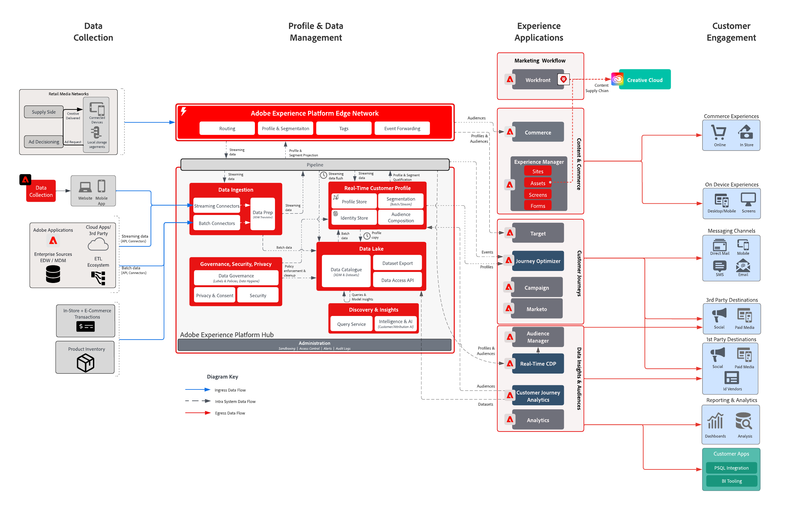

# Affärsproblem inom detaljhandeln

Det här integrerade upplevelseföretaget ville personalisera hela kundresan för att öka lojaliteten, öka försäljningen till befintliga kunder och förbättra marknadsföringsbudgeten för alla sina kampanjer. Strategin för att uppnå målet är att utöka deras digitala kapacitet till att omfatta kunddata och transaktionsdata offline för att öka tillväxten.

## Adobe

* Generera en enhetlig kundprofil som innehåller alla relevanta online-/offlinedata som kan aktiveras i realtid
* Samordna kundinteraktioner på webben, i media och i push-kanaler för att driva inköpsbeteendet första gången, eller andra gången.

## Affärsvärde levererat

| Mål | Taktik | Värdet är upplåst |
|---|---|---|
| **Samordna kundresor i realtid **  **Kör upprepade köp från nya kunder **  **Effektivare marknadsföring och lägre mediekostnader**</ul> | <ul><li>Robusta data- och identitetsstrategier som ger en heltäckande realtidsprofil.</li><li>Kund- och transaktionsdataströmning i realtid inklusive 90 dagars historisk belastning</li><li>Direktuppspelningssegmentering till Advertising Networks och Adobe Target för att underlätta mediernas utgifter och personalisering.</li><li>Kundresor i realtid via Adobe Campaign som innehåller en strategi för att mäta prestanda</li></ul> | <ul><li><strong>Real-time Customer Data Platform:</strong> Leverera kundupplevelser i realtid i medier, e-post, push och på webben</li><li><strong>Datakällor</strong> Strömmande data som täcker detaljhandlarens profilbutiker, ordersystem, produktkatalog och butiker.</li><li><strong>Medieaktivering i realtid:</strong>Strömma segment till annonsnätverk för attribuering och reklamdämpning</li><li><strong>Webbpersonalisering i realtid:</strong>Direktuppspelningssegment som aktiveras för Adobe Target för att kunna aktiveras på återförsäljarens webbupplevelse.</li><li><strong>Journey Orchestration vid skalförändring:</strong>Utlösta meddelanden i realtid som har berikats med tillgängliga kunddata och aktiverats i realtid för e-post- och push-kanaler</li></ul> |

## Användningsexempel

| Kategori | Mål | Använd skiftläge | Beskrivning |
|:----|:----|:----|:----|
| Kundresor | Förvärv | Välkomstserie | Välkommen nya prenumeranter med introduktion till företag, produkter och tjänster |
| | | Första inköpsprogrammet | |
| | Förbättra försäljningen | Övergiven kundvagn/bläddring | Återvinn potentiella köpare och öka försäljningen |
| | | Produktgranskning/korsförsäljning | Korssälja fler artiklar med produktrecensioner. |
| | | Produktkampanjer |  |
| | | Tid att ändra ordning | Återkommande påminnelse för cykliska produkter/tjänster |
| | Varumärkeslojalitet | Vinn bakåt | Återvinn kunder som har varit inaktiva. |
| | | Födelsedag påminnelser | Få en mer personlig relation till era kunder genom att vara en del av deras födelsedagseftermiddag! |
| Merchandising | Hantera lager | Tillbaka i Stock | Förbättra lagret genom att visa kunderna att produkterna de vill ha finns i lager igen |
| | | Nästa bästa kategori | Identifiera de bästa kategorierna/försäljningen för användarna |
| | | Best Sellers | |
| | | Påminnelser om prisfall | Visa användare att artiklar de gillar har reducerat pris |
| | | Liknande produkter |  |
| Anpassa | Öka konverteringen | Kuponger | Visa bästa erbjudanden/kuponger för kunder |
| | | Personlig produktsökning | Förbättra sökupplevelsen |
| | | Recommendations | Bättre surfning |
| | | Upplevelser över flera kanaler | Nå ut till kunder i alla kanaler |
| Mät | Förstå kundresor | Flerkanalskampanj | Mät kampanjer i flera kanaler |
| | | Segmentprestanda | Förstå segmentens prestanda och bidrag |
| | | Utfallsrapporter | Visualisera konverteringar i varje steg |
| | | Kohortanalys | Mät interaktion mellan segmentgrupper |
| | | Klicka-för-streck-rapporter | Se hur kundkonverteringar leder till butiksupplevelser |
| | | Tillskrivning | Se vilken kontaktyta/upplevelse som har störst påverkan på köpkonverteringen |
| | | Prediktiva insikter | Läs mer om kundernas egenskaper |

## Arkitektur

## Relaterade ritningar

| Användningsfall/integrering  | Länk |
|:----|:----|
| CJA + AEP | [Översikt över Customer Journey Analytics-utkast](https://experienceleague.adobe.com/docs/blueprints-learn/architecture/customer-journey-analytics/overview.html?lang=en) |
| | [Customer Journey Analytics - Användningsexempel](https://experienceleague.adobe.com/docs/analytics-platform/using/cja-usecases/cja-usecases.html?lang=en) |
| AJO + AEP | [Adobe Journey Optimizer - användningsexempel](https://experienceleague.adobe.com/docs/blueprints-learn/architecture/customer-journeys/journey-optimizer/journey-optimizer.html?lang=en) |
| | [Beslutshantering](https://experienceleague.adobe.com/docs/blueprints-learn/architecture/customer-journeys/journey-optimizer/decision-management/decision-management-overview.html?lang=en) |
| RTCDP + AEP | [Online/offline Audience Activation](https://experienceleague.adobe.com/docs/blueprints-learn/architecture/audience-activation/known-customer-audience-activation/known.html?lang=en) |
| | [Experience Platform + programaktivering](https://experienceleague.adobe.com/docs/blueprints-learn/architecture/audience-activation/platform-and-applications.html?lang=en) |
| Marketo + AEP | [B2B-aktivering och marknadsföring](https://experienceleague.adobe.com/docs/blueprints-learn/architecture/b2b-activation/overview.html?lang=en) | |
| Mål + AEP | [Adobe Target Use case - Behavioral Web/Mobile Personalization](https://experienceleague.adobe.com/docs/blueprints-learn/architecture/audience-activation/web-personalization/behavioral.html?lang=en) | [Webb-/mobilpersonalisering med kända kunddata](https://experienceleague.adobe.com/docs/blueprints-learn/architecture/audience-activation/web-personalization/known-personalization.html?lang=en) | |
