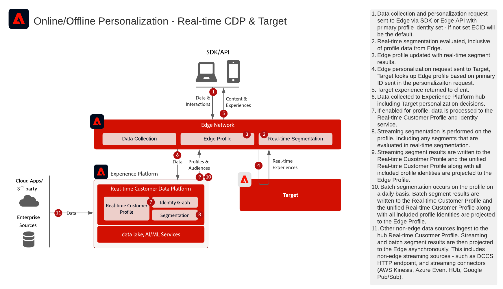

# Webb-/mobilpersonalisering med online- och offlinedata

Synkronisera webbpersonalisering med e-post och annan känd och anonym kanalpersonalisering.

## Användningsexempel

* Optimering av landningssidor
* Riktad beteendeprofil och offlineprofil
* Personalisering baserad på tidigare produkt-/innehållsvyer, produkt-/innehållstillhörighet, miljöattribut, målgruppsdata från tredje part och demografiska data utöver offlineinsikter som transaktioner, lojalitet och CRM-data samt modellerade insikter
* Dela och inrikta er på målgrupper som definieras i Real-time Customer Data Platform på webbplatser och mobilappar med Adobe Target.

## Program

* [!UICONTROL Real-time Customer Data Platform]
* Adobe Target
* Adobe Audience Manager (valfritt): Lägger till målgruppsdata från tredje part, samverkansbaserad enhetsgraf, möjlighet att visa Real-time Customer Data Platform-målgrupper i Adobe Analytics samt möjlighet att visa Adobe Analytics målgrupper i Real-time Customer Data Platform
* Adobe Analytics (valfritt): Lägger till möjligheten att skapa segment baserat på historiska beteendedata och finindelad segmentering från Adobe Analytics-data

## Integrationsmönster

<table class="tg" style="undefined;table-layout: fixed; width: 790px">
<colgroup>
<col style="width: 20px">
<col style="width: 276px">
<col style="width: 229px">
<col style="width: 265px">
</colgroup>
<thead>
  <tr>
    <th class="tg-y6fn">#</th>
    <th class="tg-f7v4">Integreringsmönster</th>
    <th class="tg-y6fn">Funktion</th>
    <th class="tg-f7v4">Krav</th>
  </tr>
</thead>
<tbody>
  <tr>
    <td class="tg-0lax">1</td>
<td class="tg-73oq">Utvärdering av segment i realtid på den kant som delas från Real-time Customer Data Platform till Target</td>
    <td class="tg-0lax">- Utvärdera målgrupper i realtid för samma eller nästa sidpersonalisering på Edge. - Dessutom kommer alla segment som utvärderas i strömningen eller batchen också att projiceras till Edge Network för att inkluderas i edge segment-utvärderingen och personaliseringen.</td>
    <td class="tg-73oq">- Datastream måste konfigureras i Experience Edge när tillägget Mål och Experience Platform är aktiverat. DataStream-ID anges i målkonfigurationen. - Målmålet måste konfigureras i Real-time Customer Data Platform Destinations. - Integrering med Target kräver samma IMS-organisation som Experience Platform-instansen. - WebSDK måste implementeras. - Mobile SDK och API-baserad implementering är för närvarande inte tillgängliga</td> 
  </tr>
  <tr>
    <td class="tg-0lax">2</td>
    <td class="tg-73oq">Direktuppspelning och batchvis målgruppsdelning från Real-time Customer Data Platform till Target via Edge-metoden</td>
    <td class="tg-0lax">- Dela strömnings- och gruppmålgrupper från Real-time Customer Data Platform till Target via Edge Network. Publiker som utvärderas i realtid kräver WebSDK och målgruppsutvärdering i realtid som beskrivs i integreringsmönster 1.</td>
    <td class="tg-73oq">- Datastream måste konfigureras i Experience Edge, DataStream ID tillhandahålls i målkonfigurationen - även om det inte krävs för att implementera detta datastream för personalisering eller delning av strömnings- och batchmålgrupper för närvarande, om implementeringsmetoden AT.js används, måste det dock konfigureras i Edge Network. - Målmålet måste konfigureras i Real-time Customer Data Platform Destinations. - Integrering med Target kräver samma IMS-organisation som Experience Platform-instansen. - WebSDK krävs inte för att dela direktuppspelnings- och gruppmålgrupper med Target, men det krävs för att aktivera edge segment-utvärdering i realtid enligt riktlinjerna i integreringsmönster 1.  - Om AT.js används stöds bara profilintegrering mot ECID-identitetsnamnutrymmet.  - För anpassade namnområdessökningar för identiteter på Edge krävs WebSDK-distributionen och varje identitet måste anges som en identitet på identitetskartan.</td>
  </tr>
  <tr>
    <td class="tg-0lax">3</td>
    <td class="tg-73oq">Direktuppspelning och batchvis målgruppsdelning från Real-time Customer Data Platform till Target och Audience Manager via Audience Sharing Service</td>
    <td class="tg-0lax">- Dela strömnings- och gruppmålgrupper från Real-time Customer Data Platform till Target och Audience Manager via tjänsten Audience Sharing. Det här integreringsmönstret kan utnyttjas när ytterligare berikning från data från tredje part och målgrupper i Audience Manager önskas. I annat fall är integreringsmönstret 1 och 2 att föredra. Publiker som utvärderas i realtid kräver WebSDK och målgruppsutvärdering i realtid som beskrivs i integreringsmönster 1.</td>
    <td class="tg-73oq">- Målgruppsprojektion via målgruppsdelningstjänsten måste tillhandahållas. - Integrering med Target kräver samma IMS-organisation som Experience Platform-instansen. - Identiteten måste matchas med ECID för att kunna dela till kanten för att Target ska kunna agera på den. - WebSDK-distribution krävs inte för den här integreringen.</td>
  </tr>
</tbody>
</table>

## Arkitektur för integreringsmönster 1

Detaljerad arkitektur för integreringsmönster 1

Sekvensdiagram för integreringsmönster 1

 

Översikt Arkitektur för integreringsmönster 1

## Implementering av integreringsmönster 1

För segmentering i realtid på Edge [!UICONTROL Platform Web SDK] och [!UICONTROL Edge Network] måste implementeras. [Se Experience Platform Web and Mobile SDK Blueprint](../data-ingestion/websdk.md)

### Implementeringssteg för integreringsmönster 1

1. [Implementera Adobe Target](https://experienceleague.adobe.com/docs/target/using/implement-target/implementing-target.html) för webb- och mobilapplikationer
1. [Implementera Experience Platform och [!UICONTROL Kundprofil i realtid]](https://experienceleague.adobe.com/docs/platform-learn/getting-started-for-data-architects-and-data-engineers/overview.html)
1. Implementera [Experience Platform Web SDK](https://experienceleague.adobe.com/docs/experience-platform/edge/home.html). Experience Platform Web SDK krävs för edge-segmentering i realtid, men krävs inte för delning av strömnings- och batchmålgrupper från Real-time Customer Data Platform till Target. Observera att stöd för segmentering i realtid via Mobile SDK och API inte är tillgängligt för närvarande.
1. [Konfigurera Edge Network med Edge DataStream](https://experienceleague.adobe.com/docs/experience-platform/edge/fundamentals/datastreams.html)
1. [Aktivera Adobe Target som mål i Real-time Customer Data Platform](https://experienceleague.adobe.com/docs/experience-platform/destinations/catalog/personalization/adobe-target-connection.html?lang=en)

## Implementering av integreringsmönster 2 och 3

Använda traditionella programspecifika SDK:er (till exempel AT.js och AppMeasurement.js)

### Implementeringssteg för integreringsmönstret 2 och 3

1. [Implementera Adobe Target](https://experienceleague.adobe.com/docs/target/using/implement-target/implementing-target.html) för webb- och mobilapplikationer
1. [Implementera Adobe Audience Manager](https://experienceleague.adobe.com/docs/audience-manager/user-guide/implementation-integration-guides/implement-audience-manager.html) (valfritt)
1. [Implementera Adobe Analytics](https://experienceleague.adobe.com/docs/analytics/implementation/home.html)  (valfritt)
1. [Implementera Experience Platform och [!UICONTROL Kundprofil i realtid]](https://experienceleague.adobe.com/docs/platform-learn/getting-started-for-data-architects-and-data-engineers/overview.html)
1. Implementera [Experience Cloud Identity Service](https://experienceleague.adobe.com/docs/id-service/using/implementation/implementation-guides.html)
1. [Begär etablering för målgruppsdelning mellan Experience Platform och Adobe Target (delade målgrupper)](https://www.adobe.com/go/audiences) för att dela målgrupper från Experience Platform till Target.
1. (Valfritt) [Konfigurera Edge Network med Edge DataStream](https://experienceleague.adobe.com/docs/experience-platform/edge/fundamentals/datastreams.html) (Detta krävs endast för integreringsmönster 2, där målgrupperna inte behöver delas med Audience Manager eller berikas av Audience Manager målgrupper eller data).
1. (Valfritt) [Aktivera Adobe Target som mål i Real-time Customer Data Platform](https://experienceleague.adobe.com/docs/experience-platform/destinations/catalog/personalization/adobe-target-connection.html?lang=en) för att dela direktuppspelnings- och gruppmålgrupper från Real-time Customer Data Platform direkt till Edge jämfört med genom målgruppsdelningstjänsten och Audience Manager.

## Guardrails

[Läs mer i skyddsutkastet på sidan Översikt över skräddarsydda webb- och mobilskisser.](overview.md)

## Överväganden gällande implementering

Identitetskrav

* Alla primära identiteter kan utnyttjas när man använder integreringsmönster 1 som beskrivs ovan med Edge-nätverket och WebSDK. Personalisering vid första inloggning kräver att personaliseringsbegäran anger en primär identitet som matchar den primära identiteten för profilen från Real-time Customer Data Platform. Identitetssammanfogning mellan anonyma enheter och kända kunder behandlas på navet och sedan projiceras till utkanten. Om den primära identiteten anges som enhetsidentifierare kommer kända kunddata därför inte att gälla förrän efterföljande sessioner där de anonyma och kända profilerna har förenats.
* Att dela målgrupper från Adobe Experience Platform till Adobe Target kräver att ECID används som identitet när målgruppsdelningstjänsten används, vilket beskrivs i integreringsmönster 3 ovan.
* Alternativa identiteter kan även användas för att dela Experience Platform-målgrupper med Adobe Target via Audience Manager. Experience Platform aktiverar målgrupper till Audience Manager via följande namnutrymmen som stöds: IDFA, GAID, AdCloud, Google, ECID, EMAIL_LC_SHA256. Observera att Audience Manager och Target löser medlemskap för målgrupper via ECID-identiteten, så ECID krävs fortfarande för den slutliga målgruppsdelningen i Adobe Target.

## Relaterad dokumentation

### Dokumentation

* [Adobe Target Connection för Real-time Customer Data Platform](https://experienceleague.adobe.com/docs/experience-platform/destinations/catalog/personalization/adobe-target-connection.html?lang=en)
* [Experience Platform segmentdelning med Audience Manager och andra Experience Cloud-lösningar](https://experienceleague.adobe.com/docs/audience-manager/user-guide/implementation-integration-guides/integration-experience-platform/aam-aep-audience-sharing.html)
* [Experience Platform Web SDK-dokumentation](https://experienceleague.adobe.com/docs/experience-platform/edge/home.html)
* [Experience Cloud ID-tjänstdokumentation](https://experienceleague.adobe.com/docs/id-service/using/home.html)
* [Översikt över segmentering i Experience Platform](https://experienceleague.adobe.com/docs/experience-platform/segmentation/home.html)
* [Segmentering i realtid](https://experienceleague.adobe.com/docs/experience-platform/segmentation/ui/edge-segmentation.html)
* [Strömmande segmentering](https://experienceleague.adobe.com/docs/experience-platform/segmentation/api/streaming-segmentation.html)
* [Översikt över Experience Platform Segment Builder](https://experienceleague.adobe.com/docs/experience-platform/segmentation/ui/overview.html)
* [Audience Manager Source Connector](https://experienceleague.adobe.com/docs/experience-platform/sources/connectors/adobe-applications/audience-manager.html)
* [Adobe Analytics segmentdelning via Adobe Audience Manager](https://experienceleague.adobe.com/docs/analytics/components/segmentation/segmentation-workflow/seg-publish.html)
* [Dokumentation för Experience Platform-taggar](https://experienceleague.adobe.com/docs/experience-platform/tags/home.html)

### Tutorials

* [Nästa steg i personaliseringen med CDP och Adobe Target i realtid](https://experienceleague.adobe.com/docs/platform-learn/tutorials/experience-cloud/next-hit-personalization.html?lang=en)

## Relaterade blogginlägg

* [[!DNL Blueprint for Web Personalization using Adobe Experience Platform Real-Time Customer Profile]](https://medium.com/adobetech/blueprint-for-web-personalization-using-adobe-experience-platform-real-time-customer-profile-fef2ce7a4b2f)
* [[!DNL Build an Optimal Online Experience: Enrich Unified Profile with Query Service]](https://medium.com/adobetech/build-an-optimal-online-experience-enrich-unified-profile-with-query-service-8027c196ab33)
* [[!DNL Integrating Adobe Experience Platform Decisioning Engine with AEM Websites]](https://jaeness.medium.com/integrating-adobe-experience-platform-decisioning-engine-with-aem-websites-9c222acd12e2)
* [[!DNL Adobe Experience Platform’s Identity Service — How to Solve the Customer Identity Conundrum]](https://medium.com/adobetech/adobe-experience-platforms-identity-service-how-to-solve-the-customer-identity-conundrum-f95e22d16ea9)
* [[!DNL How Adobe Experience Platform Predictive Audiences improves Personalized Experiences]](https://medium.com/adobetech/how-adobe-experience-platform-predictive-audiences-improves-personalized-experiences-1f75a60cb7a3)
* [[!DNL Adobe Experience Platform Web SDK for Audience Management]](https://medium.com/adobetech/adobe-experience-platform-web-sdk-for-audience-management-751fa6d063bc)
* [[!DNL Implementing Adobe Experience Platform Real-Time Customer Profile through our “Customer Zero” Program]](https://medium.com/adobetech/implementing-adobe-experience-platform-real-time-customer-profile-through-our-customer-zero-32e7cd952896)
* [[!DNL How Adobe Experience Platform Can Help Customers Personalize Their Mobile Messaging in Real-Time with Journey Orchestration Service and a Mobile Messaging Vendor]](https://medium.com/adobetech/how-adobe-experience-platform-helped-a-client-personalize-their-mobile-messaging-in-real-time-with-7d634aefa098)
* [[!DNL Segmentation in Seconds: How Adobe Experience Platform Made Real-time Customer Profiles a Reality]](https://medium.com/adobetech/segmentation-in-seconds-how-adobe-experience-platform-made-real-time-customer-profiles-a-reality-a7a8552b0847)
* [[!DNL Build an Optimal Online Experience: Enrich Unified Profile with Query Service]](https://medium.com/adobetech/build-an-optimal-online-experience-enrich-unified-profile-with-query-service-8027c196ab33)
