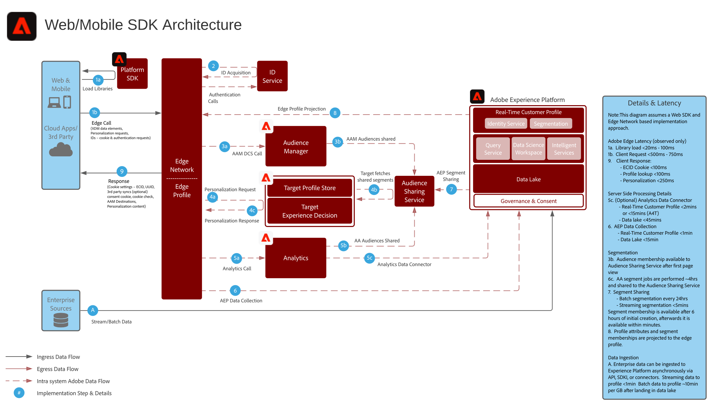

# Online/Offline Web Personalization Blueprint

Synkronisera webbpersonalisering med e-post och annan känd och anonym kanalpersonalisering.

## Användningsexempel

* Optimering av landningssidor
* Riktad beteendeprofil och offlineprofil
* Personalisering baserad på tidigare produkt-/innehållsvyer, produkt-/innehållstillhörighet, miljöattribut, målgruppsdata från tredje part och demografiska data utöver offlineinsikter som transaktioner, lojalitet och CRM-data samt modellerade insikter

## Program

* [!UICONTROL Kunddataplattform i realtid]
* Adobe Target
* Adobe Audience Manager (valfritt): Lägger till målgruppsdata från tredje part, samverkansbaserad enhetsgraf, möjlighet att visa upp plattformssegment i Adobe Analytics samt möjlighet att visa upp Adobe Analytics-segment i Platform
* Adobe Analytics (valfritt): Lägger till möjligheten att skapa segment baserat på historiska beteendedata och finindelad segmentering från Adobe Analytics-data

## Arkitektur

## Guardrails

* Segment som delas från Experience Platform till Audience Manager delas inom minuter efter segmentimplementering, oavsett om det sker via direktuppspelning eller satsutvärderingsmetod. Det finns en inledande segmentkonfigurationssynkronisering mellan Experience Platform och Audience Manager på ungefär 4 timmar så att Experience Platform-segmentmedlemskapen kan börja realiseras i Audience Manager-profiler. När du väl är med i Audience Manager-profilerna är Experience Platform-segmentmedlemskapen tillgängliga för samma sidanpassning via Adobe Target.
* Observera att för segmentimplementeringar som sker inom segmentkonfigurationssynkroniseringen på 4 timmar mellan Experience Platform och Audience Manager kommer dessa segmentimplementeringar att realiseras i Audience Manager i det efterföljande batchsegmentjobbet som&quot;befintliga&quot; segment.
* Gruppsegmentdelning från Experience Platform - en gång per dag eller manuellt initierad via API. När dessa segmentmedlemskap är klara delas de med Audience Manager inom några minuter och är tillgängliga för samma/nästa sidanpassning i Target.
* Direktuppspelningssegmentering genomförs inom ungefär fem minuter. När dessa segmentimplementeringar inträffar delas de med Audience Manager inom några minuter och är tillgängliga för samma/nästa sidanpassning i Target.
* Som standard tillåter segmentdelningstjänsten att högst 75 målgrupper delas för varje Adobe Analytics-rapportserie. Om kunden har en Audience Manager-licens finns det ingen gräns för hur många målgrupper som kan delas mellan Adobe Analytics och Adobe Target eller Audience Manager och Adobe Target.

## Implementeringsmönster

Anpassningsplanen för webb/mobiler kan implementeras med följande metoder som beskrivs nedan.

1. Använda Platform Web SDK/Mobile SDK och Edge Network.
1. Använda traditionella programspecifika SDK:er (till exempel AppMeasurement.js)

### 1. SDK och Edge-strategi för plattformar för webb/mobiler

### 2. Programspecifik SDK-metod

## Krav för implementering

| Program/tjänst | Nödvändigt bibliotek | Anteckningar |
|---|---|---|
| Adobe Target | Platform Web SDK*, at.js 0.9.1+, eller mbox.js 61+ | at.js är att föredra eftersom mbox.js inte längre utvecklas. |
| Adobe Audience Manager (tillval) | Platform Web SDK* eller dil.js 5.0+ |  |
| Adobe Analytics (tillval) | Platform Web SDK* eller AppMeasurement.js 1.6.4+ | Adobe Analytics tracking måste använda regional datainsamling (RDC). |
| Experience Cloud ID-tjänst | Platform Web SDK* eller VisitorAPI.js 2.0+ | (Rekommenderas) Använd Experience Platform Launch för att distribuera ID-tjänsten för att säkerställa att ID:t anges före eventuella programanrop |
| Experience Platform Mobile SDK (tillval) | 4.11 eller senare för iOS och Android™ |  |
| Experience Platform Web SDK | 1.0, den aktuella Experience Platform SDK-versionen har [olika användningsfall som ännu inte stöds för Experience Cloud-programmen](https://github.com/adobe/alloy/projects/5) |  |

## Implementeringssteg

1. [Implementera Adobe ](https://experienceleague.adobe.com/docs/target/using/implement-target/implementing-target.html) Targeting för webb- och mobilapplikationer
1. [Implementera Adobe Audience Manager](https://experienceleague.adobe.com/docs/audience-manager/user-guide/implementation-integration-guides/implement-audience-manager.html)  (valfritt)
1. [Implementera Adobe Analytics](https://experienceleague.adobe.com/docs/analytics/implementation/home.html)   (valfritt)
1. [Implementera kundprofil för Experience Platform och  [!UICONTROL realtid]](https://experienceleague.adobe.com/docs/platform-learn/getting-started-for-data-architects-and-data-engineers/overview.html)
1. Implementera [Experience Cloud Identity Service](https://experienceleague.adobe.com/docs/id-service/using/implementation/implementation-guides.html) eller [Experience Platform Web SDK](https://experienceleague.adobe.com/docs/experience-platform/edge/home.html)
   >[!NOTE]
   >
   >Varje program måste använda Experience Cloud-ID och vara en del av samma Experience Cloud-organisation för att ge möjlighet till målgruppsdelning mellan program.
1. [Begär etablering för målgruppsdelning mellan Experience Platform och Adobe Target (delade målgrupper)](https://www.adobe.com/go/audiences)

## Relaterad dokumentation

* [Experience Platform segmentdelning med Audience Manager och andra Experience Cloud-lösningar](https://experienceleague.adobe.com/docs/audience-manager/user-guide/implementation-integration-guides/integration-experience-platform/aam-aep-audience-sharing.html)
* [Översikt över segmentering i Experience Platform](https://experienceleague.adobe.com/docs/experience-platform/segmentation/home.html)
* [Strömmande segmentering](https://experienceleague.adobe.com/docs/experience-platform/segmentation/api/streaming-segmentation.html)
* [Översikt över Experience Platform Segment Builder](https://experienceleague.adobe.com/docs/experience-platform/segmentation/ui/overview.html)
* [Audience Manager Source Connector](https://experienceleague.adobe.com/docs/experience-platform/sources/connectors/adobe-applications/audience-manager.html)
* [Adobe Analytics segmentdelning via Adobe Audience Manager](https://experienceleague.adobe.com/docs/analytics/components/segmentation/segmentation-workflow/seg-publish.html)
* [Experience Platform Web SDK-dokumentation](https://experienceleague.adobe.com/docs/experience-platform/edge/home.html)
* [Experience Cloud ID-tjänstdokumentation](https://experienceleague.adobe.com/docs/id-service/using/home.html)
* [Experience Platform Launch dokumentation](https://experienceleague.adobe.com/docs/launch/using/home.html)

## Relaterade blogginlägg

* [[!DNL Blueprint for Web Personalization using Adobe Experience Platform Real-Time Customer Profile]](https://medium.com/adobetech/blueprint-for-web-personalization-using-adobe-experience-platform-real-time-customer-profile-fef2ce7a4b2f)
* [[!DNL Build an Optimal Online Experience: Enrich Unified Profile with Query Service]](https://medium.com/adobetech/build-an-optimal-online-experience-enrich-unified-profile-with-query-service-8027c196ab33)
* [[!DNL Integrating Adobe Experience Platform Decisioning Engine with AEM Websites]](https://jaeness.medium.com/integrating-adobe-experience-platform-decisioning-engine-with-aem-websites-9c222acd12e2)
* [[!DNL Adobe Experience Platform’s Identity Service — How to Solve the Customer Identity Conundrum]](https://medium.com/adobetech/adobe-experience-platforms-identity-service-how-to-solve-the-customer-identity-conundrum-f95e22d16ea9)
* [[!DNL How Adobe Experience Platform Predictive Audiences improves Personalized Experiences]](https://medium.com/adobetech/how-adobe-experience-platform-predictive-audiences-improves-personalized-experiences-1f75a60cb7a3)
* [[!DNL Adobe Experience Platform Web SDK for Audience Management]](https://medium.com/adobetech/adobe-experience-platform-web-sdk-for-audience-management-751fa6d063bc)
* [[!DNL Implementing Adobe Experience Platform Real-Time Customer Profile through our “Customer Zero” Program]](https://medium.com/adobetech/implementing-adobe-experience-platform-real-time-customer-profile-through-our-customer-zero-32e7cd952896)
* [[!DNL How Adobe Experience Platform Can Help Customers Personalize Their Mobile Messaging in Real-Time with Journey Orchestration Service and a Mobile Messaging Vendor]](https://medium.com/adobetech/how-adobe-experience-platform-helped-a-client-personalize-their-mobile-messaging-in-real-time-with-7d634aefa098)
* [[!DNL Segmentation in Seconds: How Adobe Experience Platform Made Real-time Customer Profiles a Reality]](https://medium.com/adobetech/segmentation-in-seconds-how-adobe-experience-platform-made-real-time-customer-profiles-a-reality-a7a8552b0847)
* [[!DNL Build an Optimal Online Experience: Enrich Unified Profile with Query Service]](https://medium.com/adobetech/build-an-optimal-online-experience-enrich-unified-profile-with-query-service-8027c196ab33)
